这套方法的精髓上篇文章中做过介绍，大家可以翻看：[构建属于自己的第二大脑 — obsidian](https://zhuanlan.zhihu.com/p/360572203)。简单的讲就是四个步骤：第一，随时随地记下自己的想法或者灵感。第二，对有价值的内容，比如文章、视频、教程、研讨等，把产生共鸣的内容快速记在ZK卡片上，正面记名称和出处，背面用自己理解的话，简明扼要复述你理解的内容，记住！一定要用自己的话。第三，每天或者遇到了合适的时机就把上述两类内容稍微整理下，与内容前后关联的卡片或内容，用前后关联的方式连接起来，形成思维链，并且确保用到的时候随时能检索到。第四，遇到具体事情的时候，不要从零开始，而是把思维链调取出来，继续在此基础上迭代。这是一个大杀器，我可以保证当你一旦用上之后便会迷上它。来吧，我们开始这个精彩之旅吧!

上干货：以下分六个步骤讲解，并附上各个步骤对应的关键配置文件。

**Step1：先上手obsidian，找找感觉**

如果你已经下载好obsidian，现在点击打开它。映入眼帘的是它的默认界面风格，我们马上就要改掉它，因为它不够快捷、直接。如果你曾有过开发经验，在一些开发IDE编辑器里写过代码，那obsidian的使用体验会让你如鱼得水，如果你没有开发经验也无妨，因为obsidian脱胎于markdown文本编辑器，你只要写过markdown文件，obsidian对你就是零门槛。即便你也从未用过markdown文件，也没关系，obsidian的操作及其简单，你只需要对着范例稍微熟悉最多半小时就可以轻松上手。点开范例随时开启obsidian之旅：点击help，在how to下面点击Format your note，看懂这一篇，在你自己的笔记里把内容练习一遍obsidian就可以上手了。

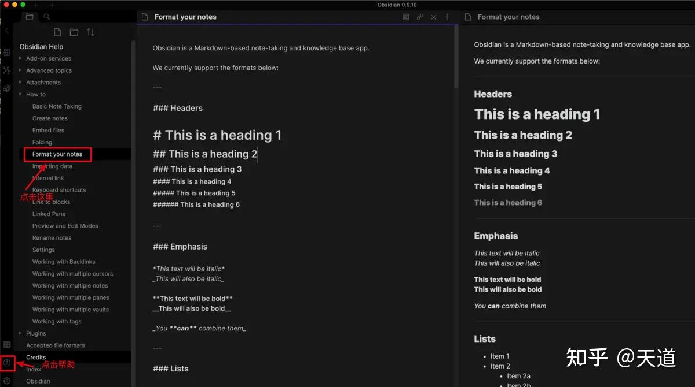

obsidian的帮助系统

**Step2：修改配置文件obsidian.css**

obsidian好不好用很大程度上取决于它的界面风格和交互体验，所以我们首先就来需改它的界面风格，在obsidian的安装目录下，把obsidian.css文件替换掉，需要三个步骤：第一，打开配置css的开关选项，如下图所示：

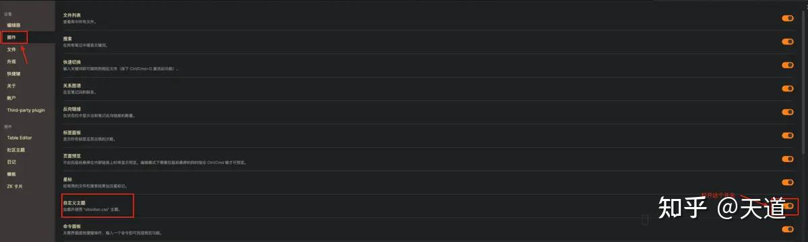

打开css配置开关

第二，下载obsidian.css文件，链接：[https://pan.baidu.com/s/1e9g4rjU_NRxa-VkRADt-hg](https://pan.baidu.com/s/1e9g4rjU_NRxa-VkRADt-hg) 密码: pdht

第三，把下载的文件复制到如下目录中，替换掉原有文件：

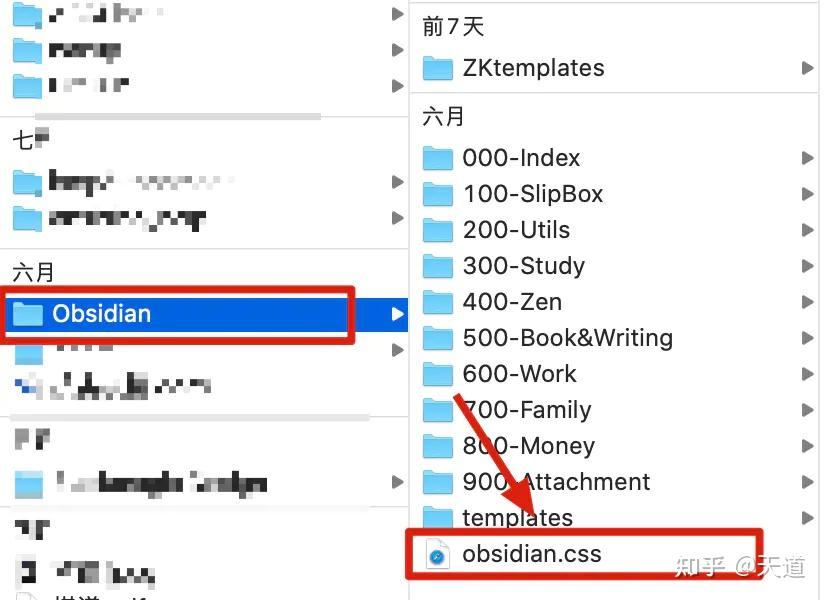

obsidian的目录

替换之后的效果如下图：

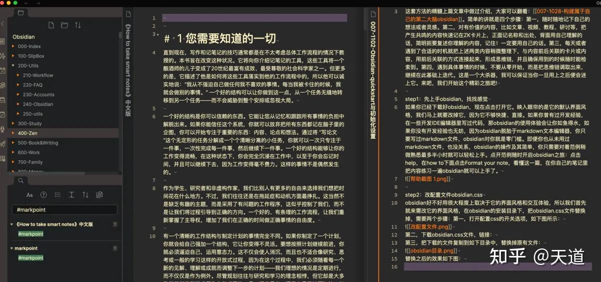

css文件更新后的obsidian风格效果

**Step3：创建目录树**

这个每个人理解不同，习惯也不同，不做要求，但目录结构尽可能清晰一些，好的分类结构可以提升后续直接点击目录树查找文件的速度。不过这对obsidian来说不太重要，obsidian的关联方式更多依赖前后向链接来做更精细的思维链接。所以这里不多强调，这是目录结构是大多数人做传统笔记的一个要点而已。我把自己的目录树放到这里，仅做参考吧：

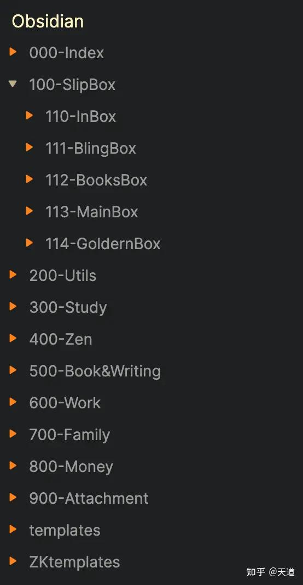

我的obsidian目录树结构

**Step4：效率倍增的模板设置**

到了比较重要的地方了——模板设置。平时要做的事情都可以通过模板设置来加速，比如每日笔记、每天的任务速记、每天的灵感卡片等，还有一些微操作，比如插入时间戳、块引用命名、文章内锚点设置等高频操作。配置好了，可以起到事半功倍的效果，用起来特别爽。我把我最近最常用的模板附上，大家可以参考，别忘了需要先指定好模板文件所在的文件夹位置，我的叫template文件夹，然后把模板***.md复制到template文件夹下面。

比如，任务模板效果如下：

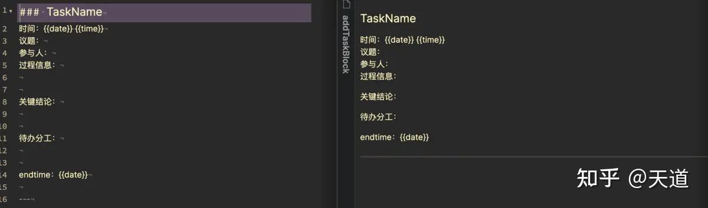

任务模板效果

配合上每日笔记模板，就可以实现每日日程安排和时间要点记录的效果，而且可以通过搜索快速定位到到你想要的任何一个每日笔记里，效果非常赞，可以瞬间秒杀几乎所有时间日程管理软件。

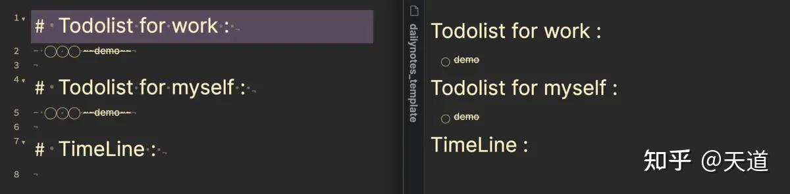

每日日程模板效果

把上面两者结合的效果如下：

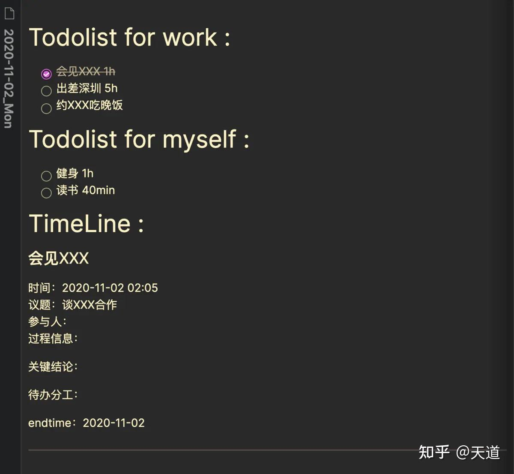

每日日程和事件跟踪记录

类似的模板可以制作很多，根据自己的需要来制作，效率会提升很多。

**Step5：Zettelkasten模板即ZK模板**

这个要结合ZK方法论来设计，我们另外写一篇专门介绍，它最重要的就是滑箱系统的设计，这也是obsidian的精髓所在。

**Step6：快捷键设置**

所有重要操作最好都要设置好快捷键，这样操作的效率又会有成倍的提升。常见的快捷键设置如下：

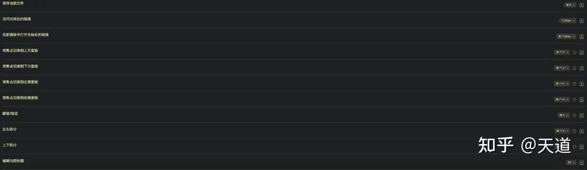

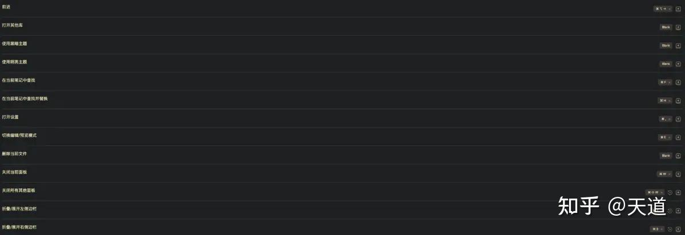

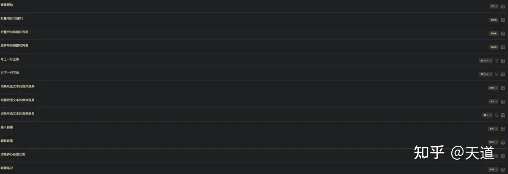

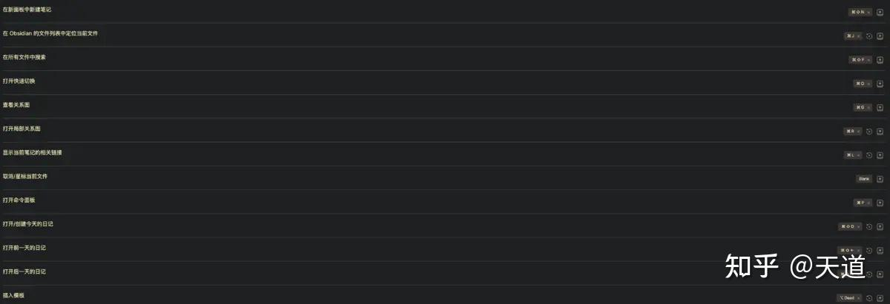

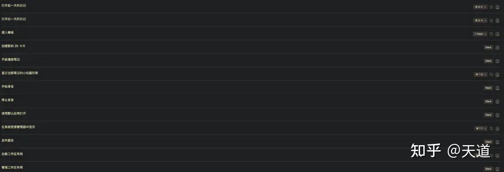

obsidian快捷键一览

**Step7：帮助与参考资料**

掌握上面的操作，obsidian就可以快速帮助到你的工作和生活，但要想发挥这个大杀器的威力，还需要自己持续摸索和学习实践，以下资料是目前网络上比较好的学习素材，分享给大家：

（1）obsidian中文帮助网站：[obsidian中文帮助网站](https://links.jianshu.com/go?to=https%3A%2F%2Fpublish.obsidian.md%2Fchinesehelp%2F00%2B%25E6%2596%25B0%25E6%2589%258B%25E5%2585%25A5%25E9%2597%25A8%2F00%2B%25E6%2596%25B0%25E6%2589%258B%25E5%2585%25A5%25E9%2597%25A8)

（2）ZK方法论书籍：《how to take smart note中文版》[学习骇客的翻译版](https://links.jianshu.com/go?to=https%3A%2F%2Fwww.ershicimi.com%2Fp%2F0c79b26c2717b3dd55b4ed8f30607625)

（3）youtube学习obsidian的优秀视频：[youtube上的obsidan资源](https://links.jianshu.com/go?to=https%3A%2F%2Fwww.youtube.com%2Fwatch%3Fv%3Dr7WbgQeZnk4)

[https://www.youtube.com/watch?v=r7WbgQeZnk4](https://www.youtube.com/watch?v=r7WbgQeZnk4)

obsidian应该说是一个跨时代的笔记产品，我还会写几篇文章继续介绍obsidian的最佳实践，希望大家支持喜欢，大家的支持也是我写作的动力