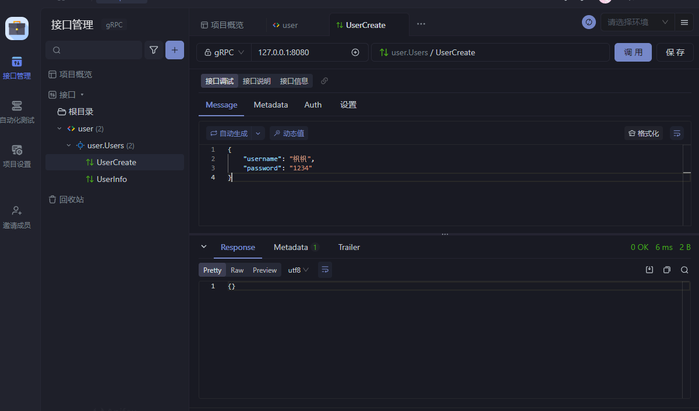

# 1、介绍


# 2、安装环境

[golang 安装 | go-zero Documentation](https://go-zero.dev/docs/tasks)


# 3、Etcd

Etcd是一个高可用的分布式键值存储系统，主要用于共享配置信息和服务发现。它采用Raft一致性算法来保证数据的强一致性，并且支持对数据进行监视和更新

## 3.1、为什么要用etcd

主要是用于微服务的配置中心，服务发现0


在对外api这个应用里面，怎么知道order服务的rpc地址呢？

写在配置文件里面？

如果服务的ip地址变化了怎么办？在传统的配置文件模式，修改配置文件，应用程序是需要重启才能解决的

所以etcd就是来做这个事情的


至于为什么不用redis，大家只需要记住，**etcd的数据可靠性更强**

## 3.2、安装

**windows安装**

https://github.com/etcd-io/etcd/releases

**linux安装**

源码安装

https://blog.csdn.net/Mr_XiMu/article/details/127923827

yum安装

版本一般比较老

**docker安装**

```Go
docker run --name etcd -d -p 2379:2379 -p 2380:2380 -e ALLOW_NONE_AUTHENTICATION=yes bitnami/etcd:latest
```

这里需要注意的是，windows安装的不是本体，而是执行命令的程序。本体是docker安装的。windows安装完相应的压缩包之后需要将本体安装

具体相关安装可以看官方文档，windows里面有两步。

## 3.3、基本命令

```Go
// 设置或更新值
etcdctl put name 张三
// 获取值
etcdctl get name
// 只要value
etcdctl get name --print-value-only
// 获取name前缀的键值对
etcdctl get --prefix name
// 删除键值对
etcdctl del name
// 监听键的变化
etcdctl watch name

```

## 参考文档

etcd windows安装 https://www.cnblogs.com/wujuntian/p/12837926.html

etcdctl指令 https://www.jianshu.com/p/67cbef492812

为什么用etcd https://www.elecfans.com/d/1890103.html


# 4、微服务demo

这个demo是一个用户微服务，一个视频微服务

视频微服务需要提供一个http接口，用户查询一个视频的信息，并且把关联用户id的用户名也查出来

那么用户微服务就要提供一个方法，根据用户id返回用户信息

## 4.1、编写rpc的proto文件

> 注意路径问题，都是在最外层目录下执行的
>
> 

user/rpc/user.proto

```protobuf
syntax = "proto3";

package user;

option go_package = "./user";

message IdRequest {
  string id = 1;
}


message UserResponse {
  // 用户id
  string id = 1;
  // 用户名
  string name = 2;
  // 用户性别
  string gender = 3;
}


service User {
  rpc getUser(IdRequest) returns(UserResponse);
}
```

执行命令：`goctl rpc protoc ./user/rpc/user.proto --go_out=./user/rpc/ --go-grpc_out=./user/rpc/ --zrpc_out=./user/rpc/ `进行编译

> 命令出处：[goctl rpc | go-zero Documentation](https://go-zero.dev/docs/tutorials/cli/rpc#goctl-rpc-protoc)

执行命令：`go mod tidy`安装全部依赖

执行命令：`go run user.go`运行脚本，注意路径，这里应该使用`go run user/rpc/user.go`

```shell
go run user\rpc\user.go -f user\rpc\etc\user.yaml
```

> 这里面有可能遇见配置文件找不到，这里可以使用-f进行指定配置文件，或者进入go文件目录下进行启动。


## 4.2、编写api文件

video/api/video.api

```go
type (
	VideoReq {
		Id string `path:"id"`
	}
	VideoRes {
		Id   string `json:"id"`
		Name string `json:"name"`
	}
)

service video {
	@handler getVideo
	get /api/videos/:id (VideoReq) returns (VideoRes)
}


```

> 相关文档请看：[api 语法 | go-zero Documentation](https://go-zero.dev/docs/tasks/dsl/api)

**运行**

```shell
goctl api go -api video/api/video.api -dir video/api/
```

> 相关文档请看：[goctl api | go-zero Documentation](https://go-zero.dev/docs/tutorials/cli/api)


1. **添加user rpc配置**

因为要在video里面调用user的rpc服务

video/api/internal/config/config.go

```go
package config

import (
  "github.com/zeromicro/go-zero/rest"
  "github.com/zeromicro/go-zero/zrpc"
)

type Config struct {
  rest.RestConf
  UserRpc zrpc.RpcClientConf
}

```

- **完善服务依赖**

video/api/internal/svc/servicecontext.go

```go
package svc

import (
  "github.com/zeromicro/go-zero/zrpc"
  "go_test/user/rpc/userclient"
  "go_test/video/api/internal/config"
)

type ServiceContext struct {
  Config  config.Config
  UserRpc userclient.User
}

func NewServiceContext(c config.Config) *ServiceContext {
  return &ServiceContext{
    Config:  c,
    UserRpc: userclient.NewUser(zrpc.MustNewClient(c.UserRpc)),
  }
}

```

> 这里添加的为11行：`  UserRpc userclient.User`和17，添加的目的是通过配置文件找到etcd的ip，其中这个类型是编译器自动生成的。然后之后进行配置，如yaml，和服务依赖，都需要添加。

- **添加yaml配置**

video/api/etc/video.yaml

```YAML
Name: video
Host: 0.0.0.0
Port: 8888
UserRpc:
  Etcd:
    Hosts:
      - 127.0.0.1:2379
    Key: user.rpc
```

- **完善服务依赖**

video/api/internal/logic/getvideologic.go

```go
func (l *GetVideoLogic) GetVideo(req *types.VideoReq) (resp *types.VideoRes, err error) {
  // todo: add your logic here and delete this line
  user1, err := l.svcCtx.UserRpc.GetUser(l.ctx, &user.IdRequest{
    Id: "1",
  })
  if err != nil {
    return nil, err
  }
  return &types.VideoRes{
    Id:   req.Id,
    Name: user1.Name,
  }, nil
}

```


**运行**

`go mod tidy`

`go run video.go`


## 知识回顾

回顾一下，我们做了哪些操作

1. 编写用户微服务的rpc服务的proto文件
2. 生成代码
3. 添加自己的逻辑
4. 编写视频微服务的api服务的api文件
5. 生成代码
6. 完善依赖，配置
7. 添加自己的逻辑

> 这就是使用go-zero的好处，让我们专注于业务的开发

生成并修改之后的目录


# 5、响应封装

不把code，data，msg写在api里面，我们通过封装统一响应

在统一响应里面去加上code data msg

```go
type LoginRequest {
  UserName string `json:"userName"`
  Password string `json:"password"`
}

type UserInfoResponse {
  UserName string `json:"userName"`
  Addr     string `json:"addr"`
  Id       uint   `json:"id"`
}

service users {
  @handler login
  post /login (LoginRequest) returns (string)
  
  @handler userInfo
  get /info returns (UserInfoResponse)
}

// goctl api go -api v1.api -dir .

```

在common/response/enter.go中

```go
package response

import (
  "github.com/zeromicro/go-zero/rest/httpx"
  "net/http"
)

type Body struct {
  Code uint32      `json:"code"`
  Msg  string      `json:"msg"`
  Data interface{} `json:"data"`
}

// Response http返回
func Response(r *http.Request, w http.ResponseWriter, resp interface{}, err error) {
  if err == nil {
    //成功返回
    r := &Body{
      Code: 0,
      Msg:  "成功",
      Data: resp,
    }
    httpx.WriteJson(w, http.StatusOK, r)
    return
  }
  //错误返回
  errCode := uint32(10086)
  // 可以根据错误码，返回具体错误信息
  errMsg := "服务器错误"

  httpx.WriteJson(w, http.StatusBadRequest, &Body{
    Code: errCode,
    Msg:  errMsg,
    Data: nil,
  })

}

```


修改一下handler的响应逻辑

```go
l := logic.NewLoginLogic(r.Context(), svcCtx)
resp, err := l.Login(&req)
response.Response(r, w, resp, err)
```

然后完善逻辑即可

```go
func (l *LoginLogic) Login(req *types.LoginRequest) (resp string, err error) {
  // todo: add your logic here and delete this line
  fmt.Println(req.UserName, req.Password)
  return "xxxx.xxxx.xxx", nil
}

```

## 5.1、板定制化

当然官方提供了修改模板的方式，避免每次生成都要去改

https://go-zero.dev/docs/tutorials/customization/template

先全局搜一下 `handler.tpl`这个文件

如果没有就先用这个命令生成

```go
goctl template init
```

修改为：

```go
package handler

import (
    "net/http"
    "github.com/zeromicro/go-zero/rest/httpx"
    "go_test/common/response"
    {{.ImportPackages}}
)

func {{.HandlerName}}(svcCtx *svc.ServiceContext) http.HandlerFunc {
    return func(w http.ResponseWriter, r *http.Request) {
        {{if .HasRequest}}var req types.{{.RequestType}}
        if err := httpx.Parse(r, &req); err != nil {
            httpx.Error(w, err)
            return
        }{{end}}

        l := logic.New{{.LogicType}}(r.Context(), svcCtx)
        {{if .HasResp}}resp, {{end}}err := l.{{.Call}}({{if .HasRequest}}&req{{end}})
        {{if .HasResp}}response.Response(r, w, resp, err){{else}}response.Response(r, w, nil, err){{end}}

    }
}
```

# 6、api前缀

对于用户服务而言，api的前缀都是 /api/users

```go
@server (
    prefix: /api/users
)
service users {
    @handler login
    post /login (LoginRequest) returns (string)

    @handler userInfo
    get /info returns (UserInfoResponse)
}

```

# 7、jwt及验证

```go
type LoginRequest {
  UserName string `json:"userName"`
  Password string `json:"password"`
}

type UserInfoResponse {
  UserName string `json:"userName"`
  Addr     string `json:"addr"`
  Id       uint   `json:"id"`
}

@server(
  prefix: /api/users
)
service users {
  @handler login
  post /login (LoginRequest) returns (string)
}


@server(
  jwt: Auth
  prefix: /api/users
)
service users {
  @handler userInfo
  get /info returns (UserInfoResponse)
}
```

转换之后，修改配置文件

AccessExpire的单位是秒

```go
Name: users
Host: 0.0.0.0
Port: 8888
Auth:
  AccessSecret: duerueudfnd235sdh
  AccessExpire: 3600
```

jwt公共代码

```go
package jwts

import (
  "errors"
  "github.com/golang-jwt/jwt/v4"
  "time"
)

// JwtPayLoad jwt中payload数据
type JwtPayLoad struct {
  UserID   uint   `json:"user_id"`
  Username string `json:"username"` // 用户名
  Role     int    `json:"role"`     // 权限  1 普通用户  2 管理员
}

type CustomClaims struct {
  JwtPayLoad
  jwt.RegisteredClaims
}

// GenToken 创建 Token
func GenToken(user JwtPayLoad, accessSecret string, expires int64) (string, error) {
  claim := CustomClaims{
    JwtPayLoad: user,
    RegisteredClaims: jwt.RegisteredClaims{
      ExpiresAt: jwt.NewNumericDate(time.Now().Add(time.Hour * time.Duration(expires))),
    },
  }

  token := jwt.NewWithClaims(jwt.SigningMethodHS256, claim)
  return token.SignedString([]byte(accessSecret))
}

// ParseToken 解析 token
func ParseToken(tokenStr string, accessSecret string, expires int64) (*CustomClaims, error) {

  token, err := jwt.ParseWithClaims(tokenStr, &CustomClaims{}, func(token *jwt.Token) (interface{}, error) {
    return []byte(accessSecret), nil
  })
  if err != nil {
    return nil, err
  }
  if claims, ok := token.Claims.(*CustomClaims); ok && token.Valid {
    return claims, nil
  }
  return nil, errors.New("invalid token")
}


```

在登录成功之后签发jwt

loginlogic.go

```go
func (l *LoginLogic) Login(req *types.LoginRequest) (resp string, err error) {
  // todo: add your logic here and delete this line
  auth := l.svcCtx.Config.Auth
  token, err := jwts.GenToken(jwts.JwtPayLoad{
    UserID:   1,
    Username: "枫枫",
    Role:     1,
  }, auth.AccessSecret, auth.AccessExpire)
  if err != nil {
    return "", err
  }
  return token, err
}


```

然后在userinfologic里面加上必要的逻辑

```go
func (l *UserInfoLogic) UserInfo() (resp *types.UserInfoResponse, err error) {
  // todo: add your logic here and delete this line

  userId := l.ctx.Value("user_id").(json.Number)
  fmt.Printf("%v, %T, \n", userId, userId)
  username := l.ctx.Value("username").(string)
  uid, _ := userId.Int64()

  return &types.UserInfoResponse{
    UserId:   uint(uid),
    Username: username,
  }, nil
}


```

userinfo这个接口就已经自动加上jwt的验证了

不过这个token是需要这样加

```go
headers:{
  Authorization: "Bearer token"
}
```

没有通过jwt的响应是401，这个需要留意一下

当然，也能修改jwt验证的响应

在main中，加上jwt验证的回调函数即可

```go
func main() {
  flag.Parse()

  var c config.Config
  conf.MustLoad(*configFile, &c)

  server := rest.MustNewServer(c.RestConf, rest.WithUnauthorizedCallback(JwtUnauthorizedResult))
  defer server.Stop()

  ctx := svc.NewServiceContext(c)
  handler.RegisterHandlers(server, ctx)

  fmt.Printf("Starting server at %s:%d...\n", c.Host, c.Port)
  server.Start()
}

// JwtUnauthorizedResult jwt验证失败的回调
func JwtUnauthorizedResult(w http.ResponseWriter, r *http.Request, err error) {
  fmt.Println(err) // 具体的错误，没带token，token过期？伪造token？
  httpx.WriteJson(w, http.StatusOK, response.Body{10087, "鉴权失败", nil})
}

```

> 这里就是添加了一个回调函数，其中添加的为18-21，回调函数放在第7行


# 8、生成api文档

后端对外的api，肯定要和前端进行对接

那么在go-zero里面怎么生成api接口文档呢

1. 安装goctl-swagger

```go
go install github.com/zeromicro/goctl-swagger@latest
```

1. 生成app.json

如果没有doc目录，需要创建

```go
goctl api plugin -plugin goctl-swagger="swagger -filename app.json -host localhost:8888 -basepath /" -api v1.api -dir ./doc
```

1. 使用docker，查看这个swagger页面

```go
docker run -d --name swag -p 8087:8080 -e SWAGGER_JSON=/opt/app.json -v D:\IT\go_project3\go_test\v1\api\doc\:/opt swaggerapi/swagger-ui

```

可以再完善下api信息

```go
@server(
  prefix: /api/users
)
service users {
  @doc(
    summary: "用户登录"
  )
  @handler login
  post /login (LoginRequest) returns (string)
}

@server(
  jwt: Auth
  prefix: /api/users
)
service users {
  @doc(
    summary: "获取用户信息"
  )
  @handler userInfo
  get /info returns (UserInfoResponse)
}
```

改为再重新生成一下 json


> 但是，我发现这个swagger体验不怎么好，使用了自定义响应之后，swag这里改不了

公司项目的话，都是有自己的api平台

团队项目的话，也可以用apifox

所以，个人用swagger的话，凑活着用也不是不行

# 9、连接数据库

## 9.1、go-zero原生操作mysql

v1/model/user.sql

```sql
CREATE TABLE user
(
    id        bigint AUTO_INCREMENT,
    username  varchar(36) NOT NULL,
    password  varchar(64) default '',
    UNIQUE name_index (username),
    PRIMARY KEY (id)
) ENGINE = InnoDB COLLATE utf8mb4_general_ci;
```

生成go代码

```go
goctl model mysql ddl --src user.sql --dir .
```

生成的go代码，自动为我们生成了增删改查的代码

我们如何使用呢？

### 9.1.1、代码使用

在config里面写上mysql配置

```go
package config

import "github.com/zeromicro/go-zero/rest"

type Config struct {
  rest.RestConf
  Mysql struct {
    DataSource string
  }
  Auth struct {
    AccessSecret string
    AccessExpire int64
  }
}

```

配置文件

```go
Name: users
Host: 0.0.0.0
Port: 8888
Mysql:
  DataSource: root:root@tcp(127.0.0.1:3306)/zero_db?charset=utf8mb4&parseTime=True&loc=Local
Auth:
  AccessSecret: dfff1234
  AccessExpire: 3600
```

先在依赖注入的地方创建连接

v1/api/internal/svc/servicecontext.go

```go
package svc

import (
  "github.com/zeromicro/go-zero/core/stores/sqlx"
  "go_test/v1/api/internal/config"
  "go_test/v1/model"
)

type ServiceContext struct {
  Config     config.Config
  UsersModel model.UserModel
}

func NewServiceContext(c config.Config) *ServiceContext {
  mysqlConn := sqlx.NewMysql(c.Mysql.DataSource)
  return &ServiceContext{
    Config:     c,
    UsersModel: model.NewUserModel(mysqlConn),
  }
}

```

> 为了简单，我就直接在登录逻辑里面，写逻辑了

```go
func (l *LoginLogic) Login(req *types.LoginRequest) (resp string, err error) {
  // 增
  l.svcCtx.UsersModel.Insert(context.Background(), &model.User{
    Username: "枫枫",
    Password: "123456",
  })

  // 查
  user, err := l.svcCtx.UsersModel.FindOne(context.Background(), 1)
  fmt.Println(user, err)
  // 查
  user, err = l.svcCtx.UsersModel.FindOneByUsername(context.Background(), "枫枫")
  fmt.Println(user, err)

  // 改
  l.svcCtx.UsersModel.Update(context.Background(), &model.User{
    Username: "枫枫1",
    Password: "1234567",
    Id:       1,
  })
  user, err = l.svcCtx.UsersModel.FindOne(context.Background(), 1)
  fmt.Println(user, err)
  // 删
  l.svcCtx.UsersModel.Delete(context.Background(), 1)
  user, err = l.svcCtx.UsersModel.FindOne(context.Background(), 1)
  fmt.Println(user, err)
  return
}
```

## 9.2、结合gorm

以上情况，差不多是直接使用原生sql进行查询的

其实大部分场景，结合gorm会更加高效

当然也可以使用其他的orm

直接编写model文件

因为直接编写sql文件再转换，会有些地方有问题

```go
package model

import "gorm.io/gorm"

type UserModel struct {
  gorm.Model
  Username string `gorm:"size:32" json:"username"`
  Password string `gorm:"size:64" json:"password"`
}

```

在common里面写上gorm的连接语句

common/init_db/init_gorm.go

```go
package init_db

import (
  "fmt"
  "gorm.io/driver/mysql"
  "gorm.io/gorm"
)

// InitGorm gorm初始化
func InitGorm(MysqlDataSource string) *gorm.DB {
  db, err := gorm.Open(mysql.Open(MysqlDataSource), &gorm.Config{})
  if err != nil {
    panic("连接mysql数据库失败, error=" + err.Error())
  } else {
    fmt.Println("连接mysql数据库成功")
  }
  return db
}

```

然后在context里面进行注入

```go
package svc

import (
  "go_test/common/init_db"
  "go_test/v1/api/internal/config"
  "go_test/v1/model"
  "gorm.io/gorm"
)

type ServiceContext struct {
  Config config.Config
  DB     *gorm.DB
}

func NewServiceContext(c config.Config) *ServiceContext {
  mysqlDb := init_db.InitGorm(c.Mysql.DataSource)
  mysqlDb.AutoMigrate(&model.User{})
  return &ServiceContext{
    Config: c,
    DB:     mysqlDb,
  }
}

```

使用就很简单了，和gorm是一模一样的

```go
func (l *LoginLogic) Login(req *types.LoginRequest) (resp string, err error) {
  var user models.UserModel
  err = l.svcCtx.DB.Take(&user, "username = ? and password = ?", req.Username, req.Password).Error
  if err != nil {
    return "", errors.New("登录失败")
  }
  return user.Username, nil
}
```

sqlx使用 https://blog.csdn.net/Mr_XiMu/article/details/131658247


# 10、RPC

## 10.1、单rpc服务模式

我们编写一个proto文件

提供两个服务，一个是获取用户信息方法，一个是用户添加的方法

user.proto

```Protocol
syntax = "proto3";

package user;
option go_package = "./user";

message UserInfoRequest {
  uint32 user_id = 1;
}

message UserInfoResponse {
  uint32 user_id = 1;
  string username = 2;
}


message UserCreateRequest {
  string username = 1;
  string password = 2;
}

message UserCreateResponse {

}

service Users {
  rpc UserInfo(UserInfoRequest) returns(UserInfoResponse);
  rpc UserCreate(UserCreateRequest) returns(UserCreateResponse);
}


// goctl rpc protoc user.proto --go_out=./types --go-grpc_out=./types --zrpc_out=.

```

> 和传统grpc不一样的是，go-zero里面的proto文件不能外部引入message

在logic种完善对应的逻辑

```go
func (l *UserInfoLogic) UserInfo(in *user.UserInfoRequest) (*user.UserInfoResponse, error) {
  fmt.Println(in.UserId)
  return &user.UserInfoResponse{
    UserId:   in.UserId,
    Username: "枫枫",
  }, nil
}

func (l *UserCreateLogic) UserCreate(in *user.UserCreateRequest) (*user.UserCreateResponse, error) {
  fmt.Println(in.Username, in.Password)

  return &user.UserCreateResponse{}, nil
}

```

使用apifox调用grpc




## 10.2、服务分组

默认情况下，一个proto文件里面只能有一个service

有多个的话，转换会报错

如果一个rpc服务，有很多方法，转换之后的目录就很不直观了

我们可以在转换的时候，使用-m参数指定服务分组

```Protocol
syntax = "proto3";

package user;
option go_package = "./user";

message UserInfoRequest {
  uint32 user_id = 1;
}

message UserInfoResponse {
  uint32 user_id = 1;
  string username = 2;
}


message UserCreateRequest {
  string username = 1;
  string password = 2;
}

message UserCreateResponse {

}

service UserCreate {
  rpc UserCreate(UserCreateRequest) returns(UserCreateResponse);
}


service UserInfo {
  rpc UserInfo(UserInfoRequest) returns(UserInfoResponse);
}


// goctl rpc protoc user.proto --go_out=./types --go-grpc_out=./types --zrpc_out=. -m
```


## 10.3、结合gorm

```Protocol
syntax = "proto3";

package user;

option go_package = "./user";


message UserInfoRequest {
  uint32 user_id = 1;
}
message UserInfoResponse {
  uint32 user_id = 1;
  string username = 2;
}


message UserCreateRequest {
  string username = 1;
  string password = 2;
}
message UserCreateResponse {
  uint32 user_id = 1;
  string err = 2;
}


service user{
  rpc UserInfo(UserInfoRequest)returns(UserInfoResponse);
  rpc UserCreate(UserCreateRequest)returns(UserCreateResponse);
}


// goctl rpc protoc user.proto --go_out=./types --go-grpc_out=./types --zrpc_out=.

```

models定义

rpc_study/user_gorm/models/user_model.go

```go
package models

import "gorm.io/gorm"

type UserModel struct {
  gorm.Model
  Username string `gorm:"size:32" json:"username"`
  Password string `gorm:"size:64" json:"password"`
}

```

配置文件，添加mysql的相关配置

rpc_study/user_gorm/rpc/etc/user.yaml

```YAML
Name: user.rpc
ListenOn: 0.0.0.0:8080
Etcd:
  Hosts:
  - 127.0.0.1:2379
  Key: user.rpc
Mysql:
  DataSource: root:root@tcp(127.0.0.1:3307)/zero_db?charset=utf8mb4&parseTime=True&loc=
```

填写对应的配置映射

rpc_study/user_gorm/rpc/internal/config/config.go

```go
package config

import "github.com/zeromicro/go-zero/zrpc"

type Config struct {
  zrpc.RpcServerConf
  Mysql struct {
    DataSource string
  }
}

```

在服务依赖的地方，进入注入

rpc_study/user_gorm/rpc/internal/svc/servicecontext.go

```go
package svc

import (
  "gorm.io/gorm"
  "zero_study/common/init_gorm"
  "zero_study/rpc_study/user_gorm/models"
  "zero_study/rpc_study/user_gorm/rpc/internal/config"
)

type ServiceContext struct {
  Config config.Config
  DB     *gorm.DB
}

func NewServiceContext(c config.Config) *ServiceContext {
  db := init_gorm.InitGorm(c.Mysql.DataSource)
  db.AutoMigrate(&models.UserModel{})
  return &ServiceContext{
    Config: c,
    DB:     db,
  }
}

```

创建逻辑

```go
func (l *UserCreateLogic) UserCreate(in *user.UserCreateRequest) (pd *user.UserCreateResponse, err error) {

  pd = new(user.UserCreateResponse)
  var model models.UserModel
  err = l.svcCtx.DB.Take(&model, "username = ?", in.Username).Error
  if err == nil {
    pd.Err = "该用户名已存在"
    return
  }
  model = models.UserModel{
    Username: in.Username,
    Password: in.Password,
  }
  err = l.svcCtx.DB.Create(&model).Error
  if err != nil {
    logx.Error(err)
    pd.Err = err.Error()
    err = nil
    return
  }
  pd.UserId = uint32(model.ID)
  return
}
```

查询逻辑

```go
func (l *UserInfoLogic) UserInfo(in *user.UserInfoRequest) (*user.UserInfoResponse, error) {
  var model models.UserModel
  err := l.svcCtx.DB.Take(&model, in.UserId).Error
  if err != nil {
    return nil, errors.New("用户不存在")
  }
  return &user.UserInfoResponse{
    UserId:   uint32(model.ID),
    Username: model.Username,
  }, nil
}

```

## 10.4、结合api

api

```go
type UserCreateRequest {
  Username string `json:"username"`
  Password string `json:"password"`
}

type UserInfoRequest {
  ID uint `path:"id"`
}

type UserInfoResponse {
  UserId   uint   `json:"user_id"`
  Username string `json:"username"`
}

@server(
  prefix: /api/users
)
service users {
  @handler userInfo
  get /:id (UserInfoRequest) returns (UserInfoResponse)
  @handler userCreate
  post / (UserCreateRequest) returns (string )
}

// goctl api go -api user.api -dir .
```

在配置文件里面填写rpc服务的key

```YAML
Name: users
Host: 0.0.0.0
Port: 8888
UserRpc:
  Etcd:
    Hosts:
      - 127.0.0.1:2379
    Key: user.rpc
```

填写配置文件

```go
package config

import (
  "github.com/zeromicro/go-zero/rest"
  "github.com/zeromicro/go-zero/zrpc"
)

type Config struct {
  rest.RestConf
  UserRpc zrpc.RpcClientConf
}

```

依赖注入，初始化rpc的客户端

```go
package svc

import (
  "github.com/zeromicro/go-zero/zrpc"
  "zero_study/rpc_study/user_api_rpc/api/internal/config"
  "zero_study/rpc_study/user_api_rpc/rpc/userclient"
)

type ServiceContext struct {
  Config  config.Config
  UserRpc userclient.User
}

func NewServiceContext(c config.Config) *ServiceContext {
  return &ServiceContext{
    Config:  c,
    UserRpc: userclient.NewUser(zrpc.MustNewClient(c.UserRpc)),
  }
}

```

创建用户

```go
func (l *UserCreateLogic) UserCreate(req *types.UserCreateRequest) (resp string, err error) {

  response, err := l.svcCtx.UserRpc.UserCreate(l.ctx, &user.UserCreateRequest{
    Username: req.Username,
    Password: req.Password,
  })
  if err != nil {
    return "", err
  }
  if response.Err != "" {
    return "", errors.New(response.Err)
  }
  return
}

```

用户信息

```go
func (l *UserInfoLogic) UserInfo(req *types.UserInfoRequest) (resp *types.UserInfoResponse, err error) {

  response, err := l.svcCtx.UserRpc.UserInfo(l.ctx, &user.UserInfoRequest{
    UserId: uint32(req.ID),
  })

  if err != nil {
    return nil, err
  }

  return &types.UserInfoResponse{UserId: uint(response.UserId), Username: response.Username}, nil
}

```


服务分组 https://go-zero.dev/docs/tutorials/proto/services/group