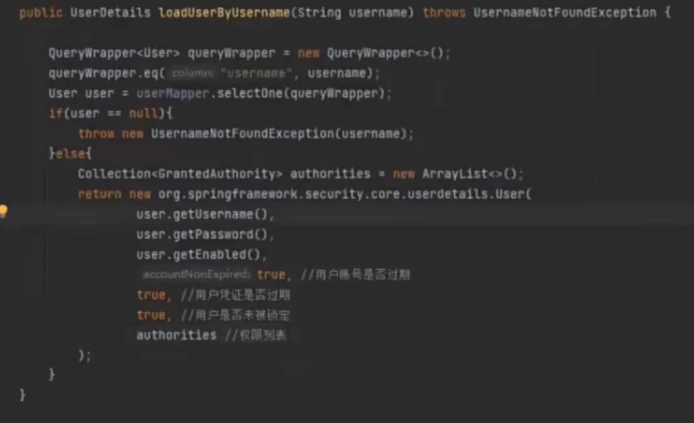

# 功能

**身份认证**：·身份认证是验证谁正在访问系统资源，判断用户是否为合法用户。认证用户的常见方式是要求用户输入用户名和密码

**授权**：用户进行身份认证后，系统会控制谁能访问哪些资源，这个过程叫做授权。用户无法访问没有权限的资源。

**防御常见攻击**：

- CSRF

- HTTP Headers
- HTTP Requests


# 介绍

SpringSecurity的原理其实就是一个过滤器链，内部包含了提供各种功能的过滤器。这里我们可以看看入门案例中的过滤器。

- **UsernamePasswordAuthenticationFilter**：负责处理我们在登陆页面填写了用户名密码后的登陆请求。入门案例的认证工作主要有它负责。

- **ExceptionTranslationFilter**:处理过滤器链中抛出的任何AccessDeniedException和AuthenticationException

- **FilterSecuritylnterceptor**：负责权限校验的过滤器。


**Authentication**接口: 它的实现类，表示当前访问系统的用户，封装了用户相关信息。

**AuthenticationManager**接口：定义了认证Authentication的方法

**UserDetailsService**接口：加载用户特定数据的核心接口。里面定义了一个根据用户名查询用户信息的方法。

**UserDetails**接口：提供核心用户信息。通过UserDetailsService根据用户名获取处理的用户信息要封装成UserDetails对象返回。然后将这些信息封装到Authentication对象中。


# 具体使用

## 流程

1. 添加依赖

2. 需要添加一个配置类，具体去[spring官网](https://docs.spring.io/spring-security/reference/servlet/configuration/java.html)上进行配置类配置。

3. 基于数据库的用户认证流程实现。即实现UserDetailsService

4. 添加用户功能。


1. **添加依赖**

   ```xml
           <dependency>
               <groupId>org.springframework.boot</groupId>
               <artifactId>spring-boot-starter-oauth2-client</artifactId>
           </dependency>
           <dependency>
               <groupId>org.springframework.boot</groupId>
               <artifactId>spring-boot-starter-security</artifactId>
           </dependency>
   ```

2. **需要添加一个配置类,具体去[spring官网](https://docs.spring.io/spring-security/reference/servlet/configuration/java.html)上进行配置类配置。**

   ```java
   @Configuration
   @EnableWebSecurity
   public class WebSecurityConfig {
   
   	@Bean
   	public UserDetailsService userDetailsService() {
   		InMemoryUserDetailsManager manager = new InMemoryUserDetailsManager();
   		manager.createUser(User.withDefaultPasswordEncoder().username("user").password("password").roles("USER").build());
   		return manager;
   	}
   }
   ```

3. **基于数据库的用户认证流程实现，即实现UserDetailsService**

   [14-自定义配置-基于数据库的用户认证流程实现_哔哩哔哩_bilibili](https://www.bilibili.com/video/BV14b4y1A7Wz?p=14)

   - 程序启动时：
     - 创建DBUserDetailsManager类(其实就是UserDetailsService)，实现接口UserDetailsManager,UserDetailsPasswordService。
     - 在应用程序中初始化这个类的对象

   > 第一步主要是将内存中的配置放入到表中。这里是需要修改一下具体使用的配置，具体可以参照`InMemoryUserDetailsManager`这个方法中返回值等东西
   >
   > 这里面之所以不同是因为一个是根据源码进行修改的，一个是直接给出最终的值。
   >
   > 其中主要是loadUserByUsername重写方式需要参考

   重写详情

   

   重写后的配置类

   

   这个DBUserByUsername就是实现继承的方法

   **关于初始化类**：这里面可以不在配置类中添加，直接再DBUserByUsername类中添加Component注解然后删除这个配置类都行，因为security实行的是创建一个类。

4. **添加用户功能**

   添加功能其实没什么说的，增删改查和正常的一样，存入数据库，一般来说是将DBUserByUsername作为一个service，就实现一个UserDetailsService即可


## 其他一些需要明白的

### **关于实现数据库的数据用户认证**：

实现loadUserByUsername这个接口即可：

上面的重写详情，不过一般来说是重新重写一个类来进行实现，和上面的差不多都。

```java
package com.sangeng.domain;

import com.alibaba.fastjson.annotation.JSONField;
import lombok.AllArgsConstructor;
import lombok.Data;
import lombok.NoArgsConstructor;
import org.springframework.security.core.GrantedAuthority;
import org.springframework.security.core.authority.SimpleGrantedAuthority;
import org.springframework.security.core.userdetails.UserDetails;

import java.util.Collection;
import java.util.List;
import java.util.stream.Collectors;

@Data
@NoArgsConstructor
public class LoginUser implements UserDetails {

    private User user;
        
    //存储权限信息
    private List<String> permissions;
    
    
    public LoginUser(User user,List<String> permissions) {
        this.user = user;
        this.permissions = permissions;
    }


    //存储SpringSecurity所需要的权限信息的集合
    @JSONField(serialize = false)
    private List<GrantedAuthority> authorities;

    @Override
    public  Collection<? extends GrantedAuthority> getAuthorities() {
        if(authorities!=null){
            return authorities;
        }
        //把permissions中字符串类型的权限信息转换成GrantedAuthority对象存入authorities中
        authorities = permissions.stream().
                map(SimpleGrantedAuthority::new)
                .collect(Collectors.toList());
        return authorities;
    }

    @Override
    public String getPassword() {
        return user.getPassword();
    }

    @Override
    public String getUsername() {
        return user.getUserName();
    }

    @Override
    public boolean isAccountNonExpired() {
        return true;
    }

    @Override
    public boolean isAccountNonLocked() {
        return true;
    }

    @Override
    public boolean isCredentialsNonExpired() {
        return true;
    }

    @Override
    public boolean isEnabled() {
        return true;
    }
}
```

使用：

```java
    public UserDetails loadUserByUsername(String username) throws UsernameNotFoundException {
        LambdaQueryWrapper<User> wrapper = new LambdaQueryWrapper<>();
        wrapper.eq(User::getUserName,username);
        User user = userMapper.selectOne(wrapper);
        if(Objects.isNull(user)){
            throw new RuntimeException("用户名或密码错误");
        }
        List<String> permissionKeyList =  menuMapper.selectPermsByUserId(user.getId());
//        //测试写法
//        List<String> list = new ArrayList<>(Arrays.asList("test"));
        return new LoginUser(user,permissionKeyList);
    }
}
```

> 这个都是实现了一个新的，其实就是仿照着写


### **关于登录页面的修改：**

http添加即可

```java
    protected void configure(HttpSecurity http) throws Exception {
        http
                //关闭csrf
                .csrf().disable()
                //不通过Session获取SecurityContext
                .sessionManagement().sessionCreationPolicy(SessionCreationPolicy.STATELESS)
                .and()
                .authorizeRequests()
                // 对于登录接口 允许匿名访问
                .antMatchers("/user/login").anonymous()
                // 除上面外的所有请求全部需要鉴权认证
                .anyRequest().authenticated();

        //把token校验过滤器添加到过滤器链中
        http.addFilterBefore(jwtAuthenticationTokenFilter, UsernamePasswordAuthenticationFilter.class);
    }
```

> 对于登录页面，允许匿名访问


### **登录失败、权限不足（返回json）：**

实现AccessDeniedHandler即可，这部分配置了当用户已经认证但没有足够的权限访问某个资源时

```java
@Component
public class AccessDeniedHandlerImpl implements AccessDeniedHandler {
    @Override
    public void handle(HttpServletRequest request, HttpServletResponse response, AccessDeniedException accessDeniedException) throws IOException, ServletException {
        ResponseResult result = new ResponseResult(HttpStatus.FORBIDDEN.value(), "权限不足");
        String json = JSON.toJSONString(result);
        WebUtils.renderString(response,json);

    }
}
```


实现AuthenticationEntryPoint即可（这是没有登录访问页面）

```java
@Component
public class AuthenticationEntryPointImpl implements AuthenticationEntryPoint {
    @Override
    public void commence(HttpServletRequest request, HttpServletResponse response, AuthenticationException authException) throws IOException, ServletException {
        ResponseResult result = new ResponseResult(HttpStatus.UNAUTHORIZED.value(), "认证失败请重新登录");
        String json = JSON.toJSONString(result);
        WebUtils.renderString(response,json);
    }
}
```


然后我们可以使用HttpSecurity对象的方法去配置。

        http.exceptionHandling().authenticationEntryPoint(authenticationEntryPoint).
                accessDeniedHandler(accessDeniedHandler);


参考：

[SpringSecurity-从入门到精通_spring security 引入-CSDN博客](https://blog.csdn.net/weixin_43847283/article/details/124075302)

[27-前后端分离-请求未认证处理_哔哩哔哩_bilibili](https://www.bilibili.com/video/BV14b4y1A7Wz?p=27)