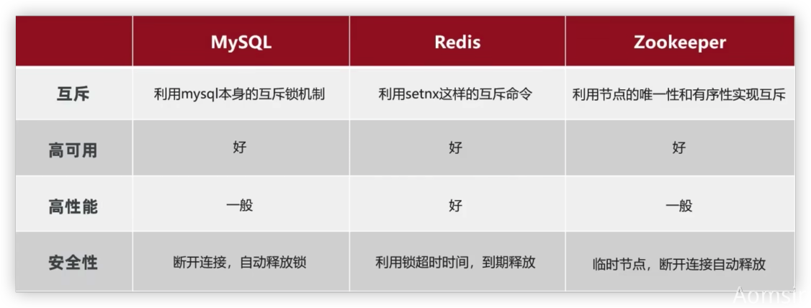

## Redis的三大删除策略：

### 1 定时删除

> 创建一个定时器，当key设置有过期时间，且过期时间到达时，由定时器任务立即执行对键的删除操作 

### 2 情性删除

> 数据到达过期时间，不做处理。等**下次访问该数据**时，如果未过期，返回数据 ；发现已过期，删除，返回不存在。 

### 3 内存淘汰

> 周期性轮询redis库中的时效性数据，采用随机抽取的策略(8种)，利用过期数据占比的方式控制删除频度 

**策略**：

> 1）检测易失数据（可能会过期的数据集server.db[i].expires ） 
> ① volatile-lru：挑选最近最少使用的数据淘汰 
> ② volatile-lfu：挑选最近使用次数最少的数据淘汰 
> ③ volatile-ttl：挑选将要过期的数据淘汰 
> ④ volatile-random：任意选择数据淘汰 
>
>
> 2）检测全库数据（所有数据集server.db[i].dict ） 
> ⑤ allkeys-lru：挑选最近最少使用的数据淘汰 
> ⑥ allkeys-lfu：挑选最近使用次数最少的数据淘汰 
> ⑦ allkeys-random：任意选择数据淘汰 
>
>
> 3）放弃数据驱逐 
> ⑧ no-enviction（驱逐）：禁止驱逐数据（redis4.0中默认策略），会引发错误OOM（Out Of Memory） 


## 缓存问题

### 1 缓存穿透

> **缓存和数据库都没有的数据**，被大量请求，由于数据不存在，缓存就也不会存在该数据，所有的请求都会直接穿透到数据库。
>
> 如果被恶意用户利用，疯狂请求不存在的数据，就会导致数据库压力过大，甚至垮掉。
>
> 注意：穿透的意思是，都没有，直接一路打到数据库。

**解决**

> 1. 接口增加业务层级的`Filter`，进行合法校验，这可以有效拦截大部分不合法的请求。
> 2. 作为第一点的补充，最常见的是使用过滤器，针对一个或者多个维度，把可能存在的数据值hash到bitmap中，bitmap证明该数据不存在则该数据一定不存在，但是bitmap证明该数据存在也只能是可能存在，因为不同的数值hash到的bit位很有可能是一样的，hash冲突会导致误判，多个hash方法也只能是降低冲突的概率，无法做到避免。
> 3. 另外一个常见的方法，则是针对数据库与缓存都没有的数据，对空的结果进行缓存，但是过期时间设置得较短，一般五分钟内。而这种数据，如果数据库有写入，或者更新，必须同时刷新缓存，否则会导致不一致的问题存在。

### 2 缓存击穿

> **数据库原本有得数据，但是缓存中没有**，一般是缓存突然失效了，这时候如果有大量用户请求该数据，缓存没有则会去数据库请求，会引发数据库压力增大，可能会瞬间打垮。

**解决**

> 1. 如果是热点数据，那么可以考虑设置**永不过期**。
> 2. 如果数据一定会过期，那么就需要在数据为空的时候，设置一个**互斥锁**，只让一个请求通过，只有一个请求去数据库拉取数据，取完数据，不管如何都需要释放锁，异常的时候也需要释放锁，要不其他线程会一直拿不到锁。


### 3 缓存雪崩

> 缓存雪崩是指缓存中有大量的数据，在同一个时间点，或者较短的时间段内，全部过期了，这个时候请求过来，缓存没有数据，都会请求数据库，则数据库的压力就会突增，扛不住就会宕机。

**解决**

> 1. 如果是热点数据，那么可以考虑设置**永不过期**。
> 2. 缓存的过期时间除非比较严格，要不考虑设置一个波动随机值，比如理论十分钟，那这类key的缓存时间都加上一个1-3分钟，过期时间在7-13分钟内波动，有效防止都在同一个时间点上大量过期。
> 3. 方法1避免了有效过期的情况，但是要是所有的热点数据在一台redis服务器上，也是极其危险的，如果网络有问题，或者redis服务器挂了，那么所有的热点数据也会雪崩（查询不到），因此将热点数据打散分不到不同的机房中，也可以有效减少这种情况。
> 4. 也可以考虑双缓存的方式，数据库数据同步到缓存A和B，A设置过期时间，B不设置过期时间，如果A为空的时候去读B，同时异步去更新缓存，但是更新的时候需要同时更新两个缓存。


## 事务和锁机制 

> - Redis的事务是一个单独的隔离操作:事务中所有的命令都会序列化、按顺序执行，执行过程中不会被其他客户端发来的请求所打断
>
> - Redis事务的主要作用就是串联多个命令防止别的命令插队
>
> - Redis事务中有三个命令：Multi，Exec，discard
>
> - Multi命令用于组队，将命令都送入队列，但不会执行
>
> - Exec命令用于执行已送入的命令
>
> - discard用于在组队过程中放弃组队
>
>   - 组队的时候报错会直接放弃组队
>   -  执行的时候报错只会影响报错命令
>
> - Redis不保证原子性！一条命令失败，别的照常执行，不会回滚

### 事务冲突 

> - 结合淘宝购物机制，解决方案就是上锁
> - 锁有两种
>   - 悲观锁
>   - 乐观锁

### 悲观锁 

> 就是每次操作之前先上锁，别人都无法操作，解锁后才可以

### 乐观锁 

> - 乐观锁是在数据上加一个版本号，操作以后就更新这个版本号(v1.0->v1.1)
> - 谁都可以得到这个版本的数据，谁先操作完就会更新这个版本号，每次操作都会校验版本是否是最新的
> - 如果版本号不一致，则需重新获取版本号进行数据操作
> - 乐观锁适用于多读的应用类型，这样可以提高吞吐量
>   - 比如1000个人去抢1张票，但支付的时候只有一个人
> - 演示如下
>   - 交替执行
>   - 最后一个exec输出为nil


### 分布式锁 

> - 下面案例中的一人一单在分布式的情况下就会失效，所以需要分布式锁
>
> - 分布式锁：满足分布式系统或集群模式下多进程可见并且互斥的锁
> - 实现
>   - MySQL
>   - Redis
>   - Zookeeper



- 基于Redis
  - 结合一人一单问题看

 ### Redisson 

> - 使用setnx有些许问题
>   - 同一线程对于同一把锁，不可重入
>   - 不可重试(获取锁只获取一次就返回false)
>   - 超时释放(如果业务没执行完毕？)
>   - Redis主从一致满足不了
> - Redisson是一个在Redis的基础上实现的Java驻内存数据网格。不仅提供一系列分布式的Java常用对象，还提供需要分布式服务(比如分布式锁)
> - 使用
>   - 导依赖
>   - 写配置
>   - 使用
> - 详情：TODO

- pom

```xml
<dependency>
    <groupId>org.redisson</groupId>
    <artifactId>redisson</artifactId>
    <version>3.13.6</version>
</dependency>
```

- java配置文件

```java
@Configuration
public class RedisConfig {

    @Bean
    public RedissonClient redissonClient() {
        Config config = new Config();
        config.useSingleServer().setAddress("redis://192.168.212.166:6379").setPassword("123456");

        return Redisson.create(config);
    }
}
```

- 测试案例

```java
ong userId = UserHolder.getUser().getId();
// SimpleRedisLock lock = new SimpleRedisLock("order:"+userId, stringRedisTemplate);  // 自定义实现
RLock lock = this.redissonClient.getLock("lock:order:" + userId);
boolean isLock = lock.tryLock();

lock.unlock();
```


### 消息队列 

> - Redis是一个缓存中间件，但是也可以变相的当消息队列使用
>   - 使用List模拟
>   - PubSub(发布订阅)实现
>   - Stream模式
> - PubSub
>   - 订阅频道 - SUBSCRIBE channelName
>   - 发布消息 - PUBLISH channelName message
>   - 缺点：
>     - 不支持数据持久化
>     - 无法避免消息丢失
>     - 消息堆积有上限，超出时数据丢失
> - Stream - 5.0以后引入的全新的数据类型
>   - TODO
