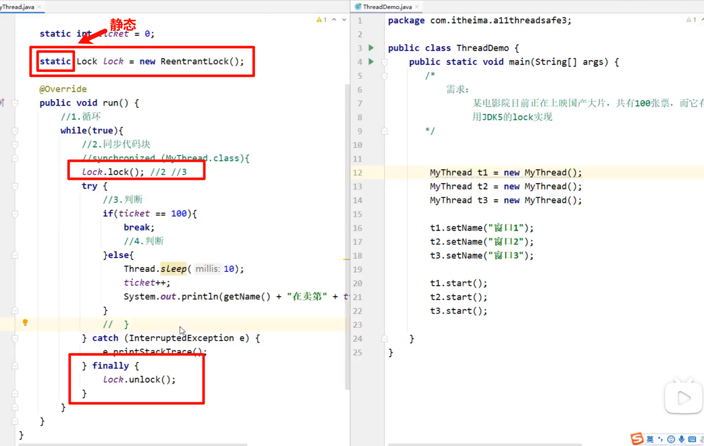
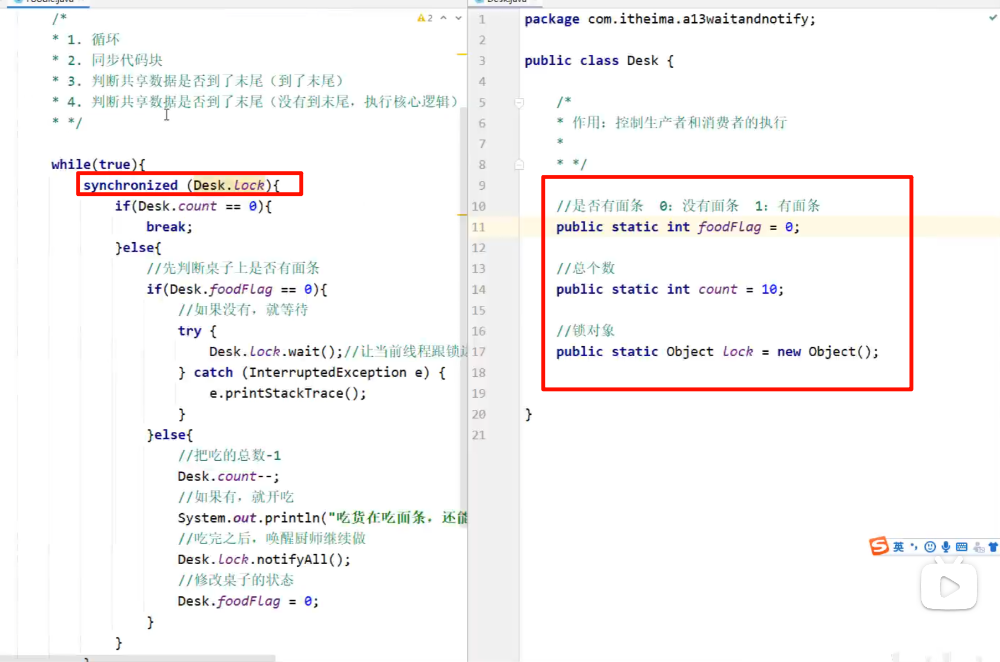
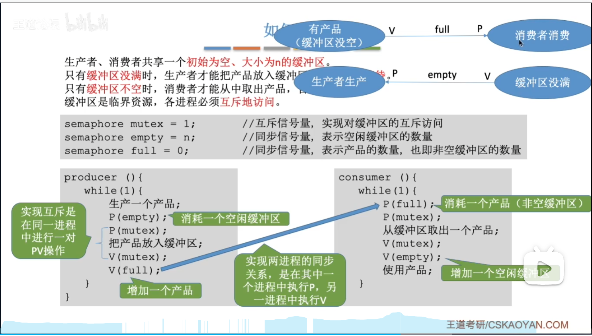

## 进程和线程

进程： 一个软件exe

线程： 一个qq聊天窗口，一个浏览器窗口；线程是由进程创建的， 是进程的一个实体。


### 多线程的实现方式

> 1 继承Thread类的方式进行实现
>
> 2 实现Runnable接口的方式进行实现
>
> 3 利用Callable接口和Future接口方式实现
>
> 需要重写run方法


**1 继承Thread类的方式进行实现**


```
     class PrimeThread extends Thread {
         long minPrime;
         PrimeThread(long minPrime) {
             this.minPrime = minPrime;
         }

         public void run() {
             // compute primes larger than minPrime
              . . .
         }
     }
```


**2 实现Runnable接口的方式进行实现**


**3 利用Callable接口和Future接口方式实现**

> 多线程的第三种实现方式：特点：**可以获取到多线程运行的结果**
>
> 1.创建一个类MyCallable实现callable接口
>
> 2.重写call（是有返回值的，表示多线程运行的结果）
>
> 3.创建MyCallable的对象（表示多线程要执行的任务）
>
> 4创建FutureTask的对象（作用管理多线程运行的结果）
>
> 5.创建Thread类的对象，并启动（表示线程）


线程类：

```
public class MyCallable implements Callable<Integer>{
@Override
public Integer call()throws Exception {
	//求1~100之间的和
	int sum=0:
	for（inti=1;i<=100;i++）{
		sum=sum+1;
	}
	return sum;
	}
}
```


```
//创建MyCallable的对象（表示多线程要执行的任务）
MyCallable mc = new MyCallable();
//创建FutureTask的对象（作用管理多线程运行的结果）
FutureTask<Integer> ft = new FutureTask<>(mc);
//创建线程的对象
Thread t1 = new Thread(ft);
//启动线程
t1.start();

//获取多线程运行的结果
Integer result = ft.get();
System.out.println(result);
```


三者**对比**

|                  | 优点                                         | 缺点                                       |
| ---------------- | -------------------------------------------- | ------------------------------------------ |
| 继承Thread类     | 编程比较简单，可以直接使用Thread类中的方法   | 可以扩展性较差，不能再继承其他的类         |
| 实现Runnable接口 | 扩展性强，实现该接口的同时还可以继承其他的类 | 编程相对复杂，不能直接使用Thread类中的方法 |
| Thread类中的方法 | 同上，并可以获得线程的结果                   | 同上                                       |


### 常见的成员方法

| 方法名称                             | 说明                                                         |
| ------------------------------------ | ------------------------------------------------------------ |
| String **getName**()                 | 返回此线程的名称                                             |
| void **setName**(String name)        | 设置线程的名字（构造方法也可以设置名字）                     |
| static Thread **currentThread**()    | 获取当前线程的对象                                           |
| static void **sleep**(long time)     | 让线程休眠指定的时间，单位为毫秒                             |
| **setPriority**(int newPriority)     | 设置线程的优先级                                             |
| final int **getPriority**()          | 获取线程的优先级                                             |
| final void **setDaemon**(boolean on) | 设置为守护线程，                                             |
| public static void **yield**()       | 出让线程/礼让线程**但礼让的时间不确定，所以也不一定礼让成功** |
| public static void **join**()        | 插入线程/插队线程，**插队的线程一 旦插队成功，则肯定先执行完插入的线程所有的任务** |
| run                                  | 调用线程对象run方法                                          |
| interrupt                            | 中断线程                                                     |

> 守护进程： 当其他非守护线程执行完毕，守护线程会**陆续**结束，即最后结束（聊天界面和传输文件，是一定结束）
>
> 常见例子的是垃圾回收机制


### 线程生命周期


### 买票案例

#### 同步代码块


- 运行

```
// 实现接口方式，使用synchronized实现线程同步
class SellTicket03 implements Runnable {
    private int ticketNum = 1000;// 让多个线程共享 ticketNum
    private boolean loop = true;


    public /*synchronized*/  void sell() { // 同步方法， 在同一时刻， 只能有一个线程来执行run方法
        synchronized (this) {
            if (ticketNum <= 0) {
                System.out.println("售票结束");
                loop = false;
                return;
            }
            System.out.println("窗口： " + Thread.currentThread().getName() + "售出一张票" + "剩余票数：" + (--ticketNum));
        }
    }

    public void run() {
        while (loop) {
            sell();
            try {
                Thread.sleep(10);
            } catch (InterruptedException e) {
                throw new RuntimeException(e);
            }
        }
    }
}
```

> 这个使用了synchronized (this)是锁住了当前的对象。
>
> 这里由于synchronized （）里面的参数必须**唯一**，this按理来说是不唯一的，但是因为我运行的时候shi用的是同一个线程
>
> ```
> // 使用同步方法进行测试
> SellTicket03 sellTicket03 = new SellTicket03();
> new Thread(sellTicket03).start(); // 第一个线程窗口
> new Thread(sellTicket03).start(); // 第二个线程窗口
> new Thread(sellTicket03).start(); // 第三个线程窗口
> ```
>
> 此时this指向的都是sellTicket03，一般来说应该用线程这个类名做参数即synchronized (SellTicket03.class)
>
> 原理：
>
> 给买票的时候加个锁，卖完解锁


#### 同步方法

> 就是将synchronized 加入到方法中即可。

```
    public synchronized  void sell() { // 同步方法， 在同一时刻， 只能有一个线程来执行run方法
            if (ticketNum <= 0) {
                System.out.println("售票结束");
                loop = false;
                return;
            }
            System.out.println("窗口： " + Thread.currentThread().getName() + "售出一张票" + "剩余票数：" + (--ticketNum));
    }
```

> 加到方法上，其实一般就是同步代码块，这个是像StringBuffer这种需要用的，了解即可


#### Lock锁

定义：

```
static Lock lock = new ReentrantLock();
```

加锁：lock.lock() ----- 解锁： lock.unlock()




这里需要注意的一个是静态变量，另一个是加锁，解锁。


#### 死锁

> 例：就是两个线程同时互相请求对方占有的资源


### 生产者消费者

#### 消费者代码实现




#### 生产者代码实现


#### 阻塞队列


> 这里是通过阻塞队列，就和操作系统的管道差不多，这是一个封装过后的方法。
>
> 这里使用了有参构造，在测试的时候将阻塞队列进行了构造序号1， 序号2是使用阻塞队列

#### 生产者消费者总结

> 这里直接看就行了，这个是单生产者单消费者的情况。
>
> 


### 线程的6种状态

| 状态                      | 方法           |
| ------------------------- | -------------- |
| 新建状态（NEW）           | 创建线程对象   |
| 就绪状态（RUNNABLE）      | start方法      |
| 阻塞状态（BLOCKED）       | 无法获得锁对象 |
| 等待状态（WAITING）       | wait方法       |
| 计时等待（TIMED_WAITING） | sleep方法      |
| 结束状态（TERMINATED）    | 部代码运行完毕 |

#### 几种练习

1. 抢红包（不用循环，因为只能抢一次）
2. 抽奖箱----这里面讲了一个线程栈的概念


### 线程池

| 方法名称                                                     | 说明                     |
| ------------------------------------------------------------ | ------------------------ |
| public static ExecutorService newCachedThreadPool()          | 创建一个没有上限的线程池 |
| public static ExecutorService newFixedThreadPool(int nThreads) | 创建有上限的线程池       |


#### 自定义线程

