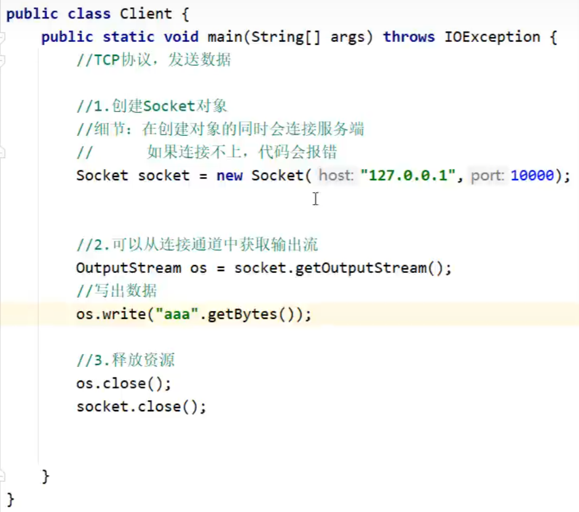
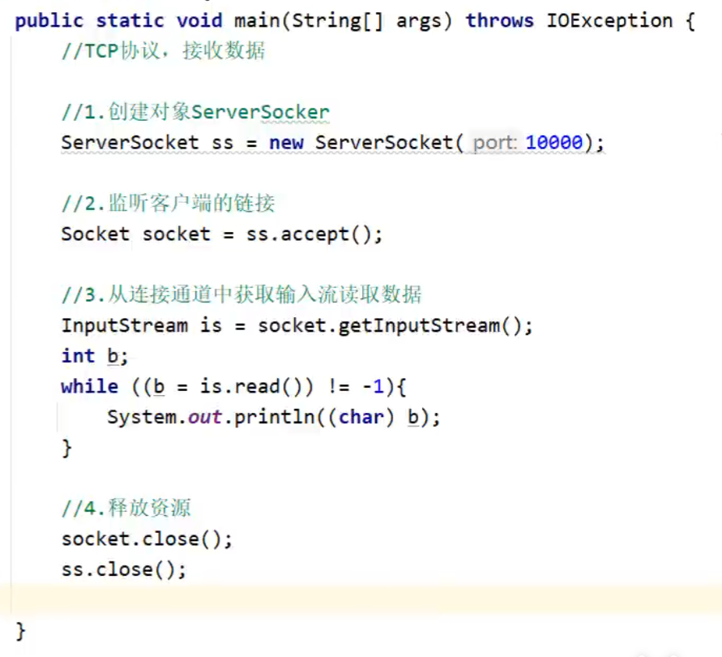

# java网络编程

## 前置知识

- BS/CS架构
- ip端口号这种

前置基础知识可以看[全栈（Python版本）](../../../全栈（Python）/全栈（Python版本）.md)


## UDP

### 发送端

```
// 发送数据
//1.创建DatagramSocket对象(快递公司)
// 细节：
// 绑定端口，以后我们就是通过这个端口往外发送
// 空参：所有可用的端口中随机一个进行使用
// 有参：指定端口号进行绑定
DatagramSocket ds = new DatagramSocket();

// 2. 打包数据
String str = "你好啊！";
byte[] bytes =  str.getBytes();

InetAddress address = InetAddress.getByName("127.0.0.1");
int port = 10086;

DatagramPacket dp =  new DatagramPacket(bytes, bytes.length, address, port);

//3. 发送数据
ds.send(dp);

// 释放资源
ds.close();
```


### 接收端

```
//接收数据

//1.创建DatagramSocket对象（快递公司）
//细节：
//在接收的时候，一定要绑定端口
//而且绑定的端口一定要跟发送的端口保持一致
DatagramSocket ds =new DatagramSocket(10086);

//2.接收数据包
byte[] bytes =new byte[1024];
DatagramPacket dp =new DatagramPacket(bytes,bytes.length);
ds.receive(dp);

//3.解析数据包
byte[] data =dp.getData();
int len = dp.getLength();
InetAddress address =dp.getAddress();
int port = dp.getPort();

System.out.println("接收到数据"+new String(data,0,len));
System.out.println("该数据是从"+address+"这台电脑中的"+port+"这个端口发出的");

//4.释放资源
ds.close();
```

> ds.receive(dp); 这段代码是阻塞的，即一直等待发送端的消息


   这个是单个的发送，如果想循环的话将发送端的代码做一个循环，当然，消息就变成控制台输入了，然后就是空消息发送问题，这个在发送端做一个判断就行了（可以看看python讲的，讲了原理是在向操作系统发送请求的。），如果服务端想服务多个用户，可以将服务端（接收端）从连接开始循环，此时会服务多个用户。


## TCP

### 客户端



### 服务端



> 这里有个问题是输出是字节，中文会报错，所以可以将is输出改为字符型在读取数据流下增加以下代码
>
> ```
> InputStream is = socket.getInputStream();
> InputStreamReader isr = new InputStreamReader(is);
> BufferedReader br = new BufferedReader(isr);
> ```


## 练习

### 练习1： 传输数据多发多收


### 练习5： 传输文件（多线程版）

- 用户端

  ```
          //客户端：将本地文件上传到服务器。接收服务器的反馈。
          //服务器：接收客户端上传的文件，上传完毕之后给出反馈。
  
  
          //1. 创建Socket对象，并连接服务器
          Socket socket = new Socket("127.0.0.1",10000);
  
          //2.读取本地文件中的数据，并写到服务器当中
          BufferedInputStream bis = new BufferedInputStream(new FileInputStream("mysocketnet\\clientdir\\a.jpg"));
          BufferedOutputStream bos = new BufferedOutputStream(socket.getOutputStream());
          byte[] bytes = new byte[1024];
          int len;
          while ((len = bis.read(bytes)) != -1){
              bos.write(bytes,0,len);
          }
  
          //往服务器写出结束标记
          socket.shutdownOutput();
  
          //3.接收服务器的回写数据
          BufferedReader br = new BufferedReader(new InputStreamReader(socket.getInputStream()));
          String line = br.readLine();
          System.out.println(line);
  
          //4.释放资源
          socket.close();
  ```

- 线程端

  ```
  Socket socket;
  
  public MyRunnable(Socket socket){
      this.socket = socket;
  }
  
  @Override
  public void run() {
      try {
          //3.读取数据并保存到本地文件中
          BufferedInputStream bis = new BufferedInputStream(socket.getInputStream());
          String name = UUID.randomUUID().toString().replace("-", "");
          BufferedOutputStream bos = new BufferedOutputStream(new FileOutputStream("mysocketnet\\serverdir\\" + name + ".jpg"));
          int len;
          byte[] bytes = new byte[1024];
          while ((len = bis.read(bytes)) != -1) {
              bos.write(bytes, 0, len);
          }
          bos.close();
          //4.回写数据
          BufferedWriter bw = new BufferedWriter(new OutputStreamWriter(socket.getOutputStream()));
          bw.write("上传成功");
          bw.newLine();
          bw.flush();
      } catch (IOException e) {
          e.printStackTrace();
      } finally {
          //5.释放资源
         if(socket != null){
             try {
                 socket.close();
             } catch (IOException e) {
                 e.printStackTrace();
             }
         }
      }
  }
  ```

- 服务端

  ```
          //客户端：将本地文件上传到服务器。接收服务器的反馈。
          //服务器：接收客户端上传的文件，上传完毕之后给出反馈。
  
  
          //1.创建对象并绑定端口
          ServerSocket ss = new ServerSocket(10000);
  
          while (true) {
              //2.等待客户端来连接
              Socket socket = ss.accept();
  
              //开启一条线程
              //一个用户就对应服务端的一条线程
              new Thread(new MyRunnable(socket)).start();
          }
  
  ```


> 其实就是正常文件接收，然后将文件接收设置成一个线程


### 传输文件（线程池）

- 服务端

```
    //客户端：将本地文件上传到服务器。接收服务器的反馈。
    //服务器：接收客户端上传的文件，上传完毕之后给出反馈。


    //创建线程池对象
    ThreadPoolExecutor pool = new ThreadPoolExecutor(
            3,//核心线程数量
            16,//线程池总大小
            60,//空闲时间
            TimeUnit.SECONDS,//空闲时间（单位）
            new ArrayBlockingQueue<>(2),//队列
            Executors.defaultThreadFactory(),//线程工厂，让线程池如何创建线程对象
            new ThreadPoolExecutor.AbortPolicy()//阻塞队列
    );


    //1.创建对象并绑定端口
    ServerSocket ss = new ServerSocket(10000);

    while (true) {
        //2.等待客户端来连接
        Socket socket = ss.accept();

        //开启一条线程
        //一个用户就对应服务端的一条线程
        //new Thread(new MyRunnable(socket)).start();
        pool.submit(new MyRunnable(socket));
    }

}
```

> 这里使用了自定义线程池
