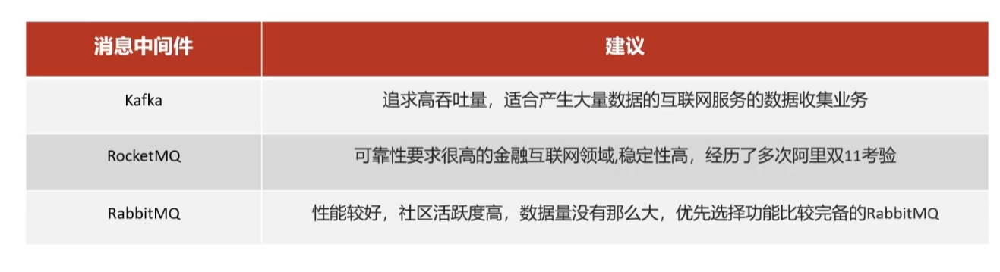

# 2

## 2.1 闻讯头条

- **运用ES搜索技术，对冷数据、文章数据建立索引，以保证冷数据、文章查询性能。**

> 1、看看es
>
> 2、搜索内容
>
> - 标题
> - 内容
> - 高亮
> - 分页查询
> - 倒排
>
> 3、这里是将搜索内容传

- **运用Kafka完成内部系统消息通知；与客户端系统消息通知；以及实时数据计算。**

> 
>
> 1、**基础知识：**
>
> 主题（Topic）与分区（Partition）
>
> Broker 和集群（Cluster）
> 2、**面试**
>
> 1. **如何解决Kafka数据丢失问题**
>
>    > 该问题已经成为了Kafka面试的惯例，如同Java的**HashMap**，属于高频出现的面试问题。那么，我们该怎么理解这个问题呢？问题是**Kafka如何保障数据不丢失**，即**Kafka的Broker提供了什么机制保证数据不丢失的。**
>    >
>    > 其实对于Kafka的Broker而言，Kafka 的**复制机制**和**分区的多副本**架构是Kafka 可靠性保证的核心。把消息写入多个副本可以使Kafka 在发生崩溃时仍能保证消息的持久性。
>    >
>    > 针对消息丢失：同步模式下，确认机制设置为-1，即让消息写入Leader和Follower之后再确认消息发送成功；异步模式下，为防止缓冲区满，可以在配置文件设置不限制阻塞超时时间，当缓冲区满时让生产者一直处于阻塞状态；
>    >
>    > 针对消息重复：将消息的唯一标识保存到外部介质中，每次消费时判断是否处理过即可。
>
> 2. **kafka体现消息的顺序性**
>
>    > 如果你想要顺序的处理Topic的所有消息，那就只提供一个分区。
>
> 3. **Kafka 与传统 MQ 消息系统之间有三个关键区别**
>
>    > (1).Kafka 持久化日志，这些日志可以被重复读取和无限期保留
>    > (2).Kafka 是一个分布式系统：它以集群的方式运行，可以灵活伸缩，在内部通过复制数据提升容错能力和高可用性
>    > (3).Kafka 支持实时的流式处理

- **运用Redis缓存技术，实现热数据的计算，并实现延时任务**

> 看看Redis相关文档，
>
> 1、这里热数据是：用户存储到minio上的文章，以及用户的点赞，评论，阅读，收藏取出来使用kafka流进行聚合计算
>
> 2、Kafka流和聚合计算是什么：
>
> kafka流数据结构是key  value结构
>
> 它是提供了对存储于Kafka内的数据进行流式处理和分析的功能。
>
> 生产者->流式处理->消费者
>
> 3、延时任务的步骤怎么搞：
>
> [2.1.2.2 延时任务](# 2.1.2.2 延时任务)

- **运用Spring Cloud Alibaba Nacos作为项目中的注册中心和配置中心。**

> 看看nacos的相关知识把

- **使用Mongo存储用户热数据，以保证用户热数据高扩展和高性能指标**

> 在搜索记录使用mongodb来存，使用mongodb的原因是因为需要给每个用户都存一份数据量比较大，而且redis是key value结构，不适合。
>
> 常见的提问方式：
>
> 1、**常见的数据类型：**
>
> Mongo-DB是一个文档数据库，可提供高性能，高可用性和易扩展性。
>
> 2、 **什么是mongodb：**
>
> 常用于处理json
>
> 3、**如何执行事务/加锁**
>
> 因为mongodb设计就是轻量高性能，所以**没有**传统的锁和复杂的事务的回滚
>
> 4、**解释一下MongoDB中的索引是什么**
>
> 索引是MongoDB中的特殊结构，它以易于遍历的形式存储一小部分数据集。索引按索引中指定的字段的值排序，存储特定字段或一组字段的值。

- **使用分布式任务框架xxl-job定时计算文章热度**

> 使用xxl-job的原因是因为分布式任务框架可以解决统一业务的多个服务进行的任务，防止出现重复等概率
>
> 计算文章热度是将点赞，评论，阅读，收藏。
>
> - 路由策略，轮询 和 分片（按照模来分配任务给实例）

### 2.1.2 项目介绍：

> 项目业务主要是，管理端admin、文章端article、用户行为端behavior、延迟任务端schedule、搜索端search、用户端user、自媒体端wemedia。
>
> **用户端**，**管理端**不必多讲，可以讲讲密码加密，salt和md5加密，jwt，网关。
>
> **文章端**：主要是文章详情，这里使用了freemarker作为一个静态页面。然后放入到minio中进行对象存储，后面加入了计算文章热点。
>
> 文章审核之后使用kafka发送消息，文章微服务是消息的生产者，搜索微服务接收消息，添加数据库到索引库，搜索微服务是消息的消费者。
>
> **延迟任务端**：看后面延迟任务和锁
>
> **用户行为端**：
>
> 解决点赞，评论，阅读，收藏。主要是如何实现。
>
> **搜索端**：
>
> 使用es进行搜索，当用户将文章    
>
> - 标题
> - 内容
>
> 进行搜索
>
> **自媒体端**：
>
> 上传素材什么得，收藏，还有频道条件查询什么得，上传文章列表，需要审核，这里要做得是用的阿里云得审核
>
> 

#### 2.1.2.1 Redis

项目中：发布文章添加延迟任务

#### 2.1.2.2 延时任务 & 锁

1. DelayQueue
2. RabbitMQ
3. Redis

1. **DelayQueue**

   > JDK自带DelayQueue 是一个支持延时获取元素的阻塞队列， 内部采用优先队列 PriorityQueue 存储元素，同时元素必须实现 
   >
   > 一般不使用

2. **RabbitMQ**

   > - TTL：Time To Live (消息存活时间)
   >
   > - 死信队列：Dead Letter Exchange(死信交换机)，当消息成为Dead message后，可以重新发送另一个交换机（死信交换机）

3. **Redis**

   > zset数据类型的去重有序（分数排序）特点进行延迟。例如：时间戳作为score进行排序

> 延时任务使用的是redis，这里原理是zset[^1]，zset数据类型的去重有序（分数排序）特点进行延迟，时间戳作为score进行排序，缺点没有消息的可靠性。重试机制
>
> 
>
> **1.为什么任务需要存储在数据库中？**
>
> 延迟任务是一个通用的服务，任何需要延迟得任务都可以调用该服务，需要考虑数据持久化的问题，存储数据库中是一种数据安全的考虑。
>
> **2.为什么redis中使用两种数据类型，list和zset？**
>
> 原因一：list存储立即执行的任务，zset存储未来的数据
>
> 原因二：任务量过大以后，zset的性能会下降
>
> 效率问题，算法的时间复杂度
>
> 操作redis中的list命令LPUSH：时间复杂度： O(1)
>
> 操作redis中的zset命令zadd：时间复杂度：O(M*log(n))
>
> **3.在添加zset数据的时候，为什么不需要预加载？**
>
> 如果数据量特别大，为了防止阻塞，只需要把未来几分钟要执行的数据存入缓存即可。
>
> 1. > **关于查询zest**：
>    >
>    > 方案一： keys模糊匹配
>    >
>    > > keys的模糊匹配功能很方便也很强大，但是在生产环境需要慎用！开发中使用keys的模糊匹配却发现redis的CPU使用率极高，所以公司的redis生产环境将keys命令禁用了！redis是单线程，会被堵塞
>    >
>    > 方案二：scan(类似分页查询，**推荐**)
>    >
>    > > SCAN 命令是一个基于游标的迭代器，SCAN命令每次被调用之后， 都会向用户返回一个新的游标， 用户在下次迭代时需要使用这个新游标作为SCAN命令的游标参数， 以此来延续之前的迭代过程。
>    >
>    > **关于如何同步问题**：
>    >
>    > > 两件事：
>    > >
>    > > 第一：从zset中查出数据，并删除
>    > >
>    > > 第二：把数据存入到list中
>    >
>    > 使用**redis管道**(原理和缓存池相似)来进行同步
>
> 2. **分布式锁解决集群下的方法抢占执行**
>
>    sexnx （SET if Not eXists） 命令在指定的 key 不存在时，为 key 设置指定的值。   
>
>    
>
>    这种加锁的思路是，如果 key 不存在则为 key 设置 value，如果 key 已存在则 SETNX 命令不做任何操作
>
>    - 客户端A请求服务器设置key的值，如果设置成功就表示加锁成功
>    - 客户端B也去请求服务器设置key的值，如果返回失败，那么就代表加锁失败
>    - 客户端A执行代码完成，删除锁
>    - 客户端B在等待一段时间后再去请求设置key的值，设置成功
>    - 客户端B执行代码完成，删除锁

[^1]: 有序集合(sorted set /zset): 集合中每个元素关联一个分数(score)，根据分数升序排序，没有重复元素

#### 2.1.2.3 kafka

项目中：

文章的上下架

**定时计算**

> 频道存储到redis是频道id，30条分数较高得。

**实时计算**

用户点赞和用户行为会发送给kafka消息，kafka进行流式处理，也就是给权重加1，流式处理完会发送消息，此时kafka重新计算文章分值，此时通过监听发送来的点赞和用户行为加上去，当日权重*3，然后再查询redis比较分值替换一下。

