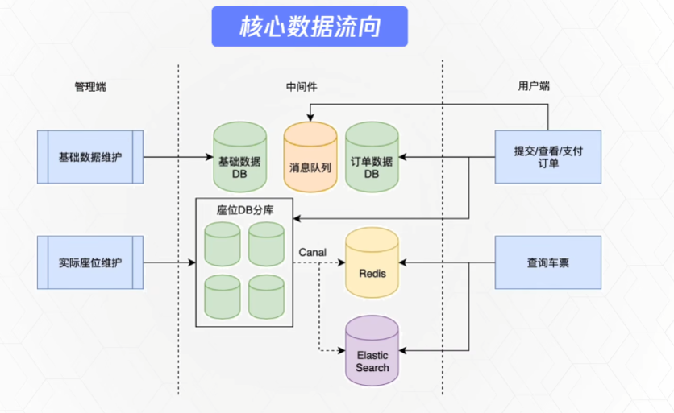

# 1 介绍

## 1.1 架构介绍

> 城市、车站、车次写入基础数据DB

## 1.2 技术栈

总体架构： Springboot2.x + maven + JDK8 + Mysql

基础组件：Mybatis + Guava + Jackson + lombok

中间件：Redis + elasticsearch + canal + sharding-jdbc + rabbitmq

## 1.3 整体介绍

> 最简化可视性版本
>
> 不是仿照12306网站做出来一个，而是基于这个实际的复杂业务场景，进行分析，拆解，开发，并结合它的高并发特性做一些高可用架构设计和讲解。

**功能**：

train相关实体管理，生成座位，放票，查询余票，抢票，生成订单。

**不做功能**：

登录， 个人信息管理，实际支付和退款，不影响整体流程的功能，候补等一些特殊逻辑。

**内容**：

需求设计，数据库设计，项目搭建，流行的设计思想，后台管理实现，前台查余票及购买，组件使用及实践。

## 1.4 需求分析分解

### 1.4.1 购票分解：

1. 城市、车站、出发日期、座位、查询余票
2. 车次、车次详情、时间、时长、座位等级
3. 车次、车站、时间、座位、乘客

