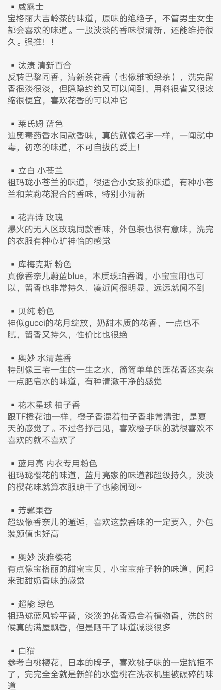

# 店铺

## 1688

### 袜子：

> **诸暨市阅物袜厂**

绵竹屋的代工厂
### 纯棉长袖、短袖、T恤：

> **肃宁县黄雀针织制衣厂**

### 纯棉长袖、短袖、T恤： 

> **肃宁县恒暖翔服装有限公司**

他们家的长袖也可以，但是最绝的就是那个镇店之宝的短袖，260g克重的纯棉短袖真的不需要二十元就能入手了。

### 毛巾：

> **高阳市的都可以**

高阳是中国最大的毛巾生产基地，所以1688上纯棉毛巾的价格都很便宜，对比小米的最生活毛巾也不错。

参考：[1688店铺个人向记录](https://www.coolapk.com/feed/49766391?shareKey=MTllZjVkZmY0NWNjNjU4ZTU1N2U~&shareUid=21985332&shareFrom=com.coolapk.market_13.4.1)

## 淘宝

[淘宝1](https://www.coolapk.com/feed/49901931?shareKey=NDFhMjJhNTlhNDdiNjU4ZTVjZGY~&shareUid=21985332&shareFrom=com.coolapk.market_13.4.1)

# 物品

## 文化衫和保暖内衣

> 肃宁县

**肃宁县**在这个领域的占比非常大，文化衫份额占比全国百分之七十，保暖内衣占比全国百分之四十。如果你问他们为啥能做到这么高的占比，就一个原因，便宜以及相对不错的质量。
**义乌市恒绒服饰**：内衣87.8%腈纶12.2%氨纶

## 袜子产业

> 一个是**绍兴诸暨市**，一个是**辽源市**。

袜子产业比较集中的地方有两个，一个是**绍兴诸暨市**，一个是**辽源市**，这两个地方的袜子工厂是非常的多。袜子这玩意儿没多少利润，除非是有牌子的袜子，就像我之前买的绵竹屋、全棉时代、松山棉店之类的。
你如果不是汗脚，是可以买那种一块钱一双的袜子的，我是个汗脚我图便宜买了一次一块钱一双的棉袜，结果就是脚臭。
棉袜中的纯棉袜子，实际上只有袜底棉含量在百分之六十以上，特别好的棉袜在百分之九十，当然价格也更贵，基本上最低都是十块钱以上一双。像袜口都得加入聚酯钎维来维持弹性，不然穿两次袜子就没办法穿了。女生喜欢穿的什么堆堆袜，实际上就是减少袜口的聚酯纤维成分。

## 家纺产业

> **南通**

说到家纺，大家第一时间想到的是哪里？中国最出名的家纺城市，那就是**南通**。
这个还是大家比较关注的，毕竟床上四件套之类的，这些都得认真挑选，毕竟是裸身接触的。如果在1688上买家纺类的，选择南通地区的工厂就可以了，不要去店铺里买，那些大部分是二道贩子和少量的工厂店。
家纺的水是很深的一个，但是南通做了这么多年还没翻车，没有像茅台镇一样被玩坏，也没有出现像莆田鞋那样被标记成假冒伪劣，也没华强北让人一听就认为自己被宰了，那就还可以。
至于是什么材质的，这个得看个人了吧。我个人比较喜欢纯棉的四件套，也有人喜欢天丝那种顺滑感，所以大家根据自己的选择来。还有就是需要提醒大家，不要多买来试试，1688退货经常使用的大家也知道是什么样子。我见过一个哥们同时买了**纯棉，天丝，莫代尔材质**的床单，结果退货的时候麻烦的要死。

## 毛巾产业

> **保定市高阳**

选择**保定市高阳**的就行了。这个没什么可讲的。

## 箱包

> **白沟**

上学的时候大家都买过行李箱，但是很多人竟然不知道"**白沟**"……讲真的，你买的很多大牌箱包，看起来很高级是吧，很大部分都是白沟产的。白沟的箱包产业也很发达，想买箱包的各位在1688上可以看一下白沟的工厂店。
对了，白沟在保定市，不要选错了哦。

## 皮具

> **浙江温州**

**浙江温州**，浙江温州，江南皮革厂倒闭了，江南皮革厂倒闭了，老板黄鹤带着小姨子跑路了……

参考：[1688店铺个人向](https://www.coolapk.com/feed/49766391?shareKey=MTgyMDE0MTNiYjJmNjU4ZTVlMWE~&shareUid=21985332&shareFrom=com.coolapk.market_13.4.1)

### 洗衣液

