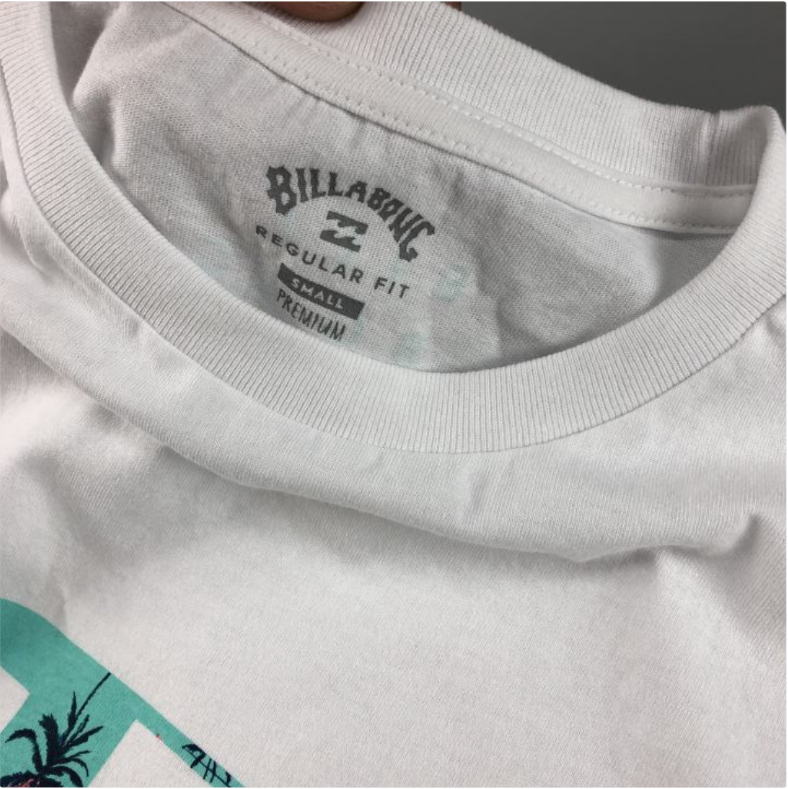
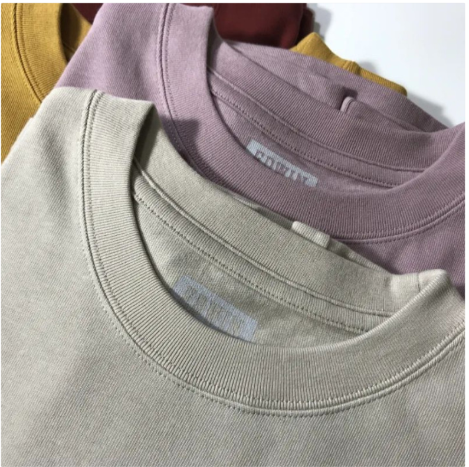
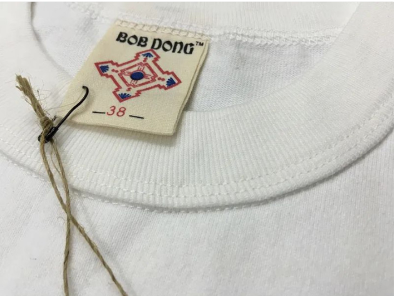
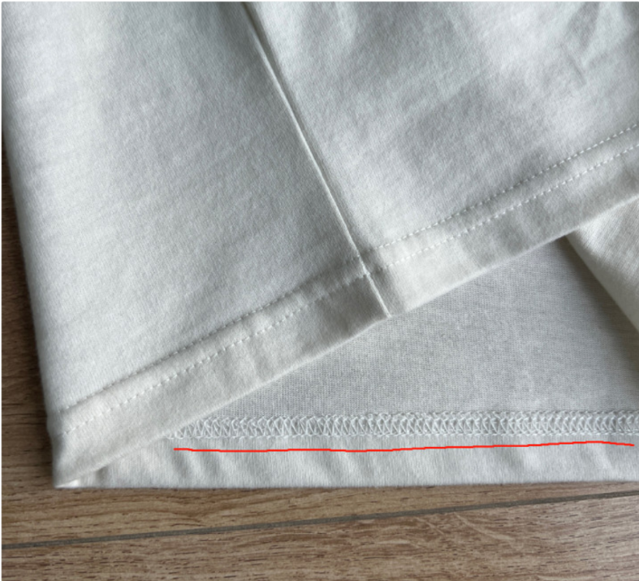
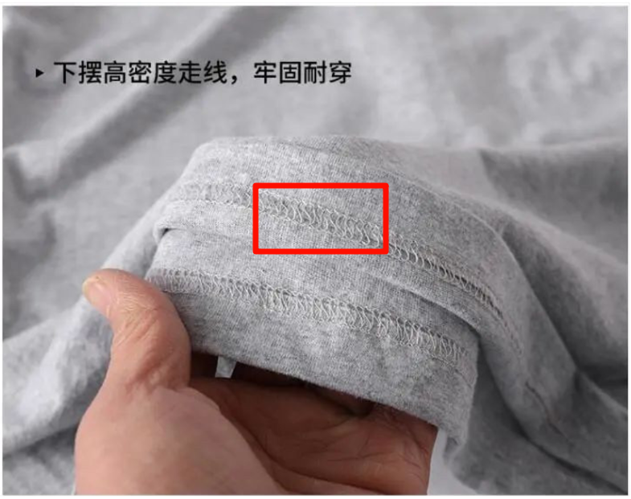

# 总结 

1. 有聚酯纤维直接pass

2. **晴纶**占40%以上，保暖就靠它

3. **氨纶**5%-10%，有效提供衣服的延展性弹性

4. **再生纤维素纤维（粘纤）**20%以上，减少静电，改善吸湿性（睛纶不透气）

5. 剩余成分：**棉**、**蚕丝**、**莫代尔**、**羊绒**均可。还有就是这玩意用的材料越多反而越考究制作商的水平

参考：[冬季保暖内衣选购指南](https://www.coolapk.com/feed/52173795?shareKey=NWY0OThlYTI5Y2ZiNjU4ZTUzZjE~&shareUid=21985332&shareFrom=com.coolapk.market_13.4.1)

日常穿着的T恤，纯棉含量至少在70%以上，才是合适的

若含有少量**聚酯纤维、涤纶**（这俩是同一个东西），就代表带点机能性，譬如防水吸汗速干

若含有少量**氨纶、弹力纤维**（这俩是同一个东西），就代表带点弹性，抗拉伸，不易变形。

若含有少量麻，就代表有点麻料那种麻麻赖赖的质感，同时也透气有凉感，但会爱出褶。

1、涤纶——薄且透，耐用

2、棉纶——不亲水，不易清洗

3、100%纯棉——耐穿易清洗基本不起球，容易皱

4、80%聚酯纤维+20%聚酰胺纤维——摸上感不错，但是不好穿，不推荐

5、35%+65%聚酯纤维——穿着还行较易清洗

6、70%棉+20%涤棉十8%人造棉十2%氨纶——易清洗耐穿

7、60%棉+35%涤纶——还可以买

8、60%棉+40%聚酯纤维——买

9、卫衣67.8%聚酯纤维+32.2%棉——起球别买

10、涤棉——不亲水，不好洗

11、羊毛——好！舒适保暖掉毛缩水

12、羊驼毛——买得起就买柔软，轻，保暖防潮不易积尘

13、羊混纺（即羊线、涤纶、纶、兔毛等其他红维与羊毛混合纺织）——保暖、毛质柔软、弹性好、易起球缩水

# 材质详情：

## 支数

不用懂太多，说白了就是**支数越高，面料约细腻**，但不是越高就越舒服。

## 做工

### 领口

> 一二三本针,不用追求太多，二本针即可

一本针：

二本针：

三本针：

### 下摆

> 看下摆的内侧走线整不整齐

好的：

差的：

> 松松散散 
>
> 七扭八歪 

参考：[两招叫你买T恤](https://www.coolapk.com/feed/35618586?shareKey=MzI1MzhiYmI2Yjc2NjU4ZTU3NDQ~&shareUid=21985332&shareFrom=com.coolapk.market_13.4.1)

