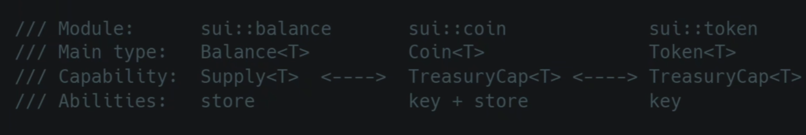

# 1 介绍

[Sui Faucet testnet水龙头](https://www.faucet.mov/?code=085dd076f2bbf3ce6a92)

## 1.1 介绍

Move起源于Facebook（现在Meta）的一个非常明星的项目[Diem](https://github.com/diem/diem)（前身为 Libra ）,可能早期的Rust爱好者和区块链爱好者会看到这个项目，就算没看到过，现在diem代码库的Star数量依然能证明曾经的辉煌。Move就是诞生在Diem（Libra）这样一个明星项目里面哪为什么Diem需要创造一个新的Move编程语言，而不是用以前已经有的东西，而是选择新造了一个轮子，那就要从Diem想做什么开始开始说起了

## 1.2 特点

Move诞生的里面我们总结几个关键点:

- 面向资产
- 安全
- 用于大规模系统
- 借鉴Rust语法和特性
- rust语言开发
- 内核完全从0设计，不是基于rust


1. 定义资产

2. 读，写，删除，转移资产
3. 权限检查，访问权限控制


## 1.3 和其他编程语言有什么不同

- 每一次运行程序都是一个**完整的事务**，要么全部成功要么全部失败
- 不用考虑并发执行资源的处理，底层会自动处理并发资源的排序
- 和链的结合屏蔽了数据层的概念，语言本身的操作就是数据的操作，极大的简化了需要学习数据层的处理


## 1.4 安装

- 安装Move编译器(Sui Cli)
- 安装Sui钱包
- 获取测试SUI
- 使用Sui区块链浏览器查看
- 学习Move编译器的使用(Sui Cli)
- 安装IDE开发环境

[安装 Sui |Sui 文档 --- Install Sui | Sui Documentation](https://docs.sui.io/guides/developer/getting-started/sui-install)

安装Chocolatey  [Chocolatey 安装指南](https://docs.chocolatey.org/en-us/choco/setup#installing-chocolatey-cli)

**注意：** Chocolatey 的默认安装路径通常是 `C:\ProgramData\chocolatey`

测试Chocolatey  ：

```sh
choco upgrade chocolatey
```

安装sui

```sh
choco install sui
```

> 路径为：`Deployed to 'C:\ProgramData\chocolatey\lib\sui'`


获取su


**docker 方式的安装**

pull 镜像 `devnet` 可以换成 `testnet` `mainnet`

```
  docker pull mysten/sui-tools:devnet
```

运行镜像

```
  docker run --name suidevcontainer -itd mysten/sui-tools:devnet

  docker exec -it suidevcontainer bash
```

**如何验证自己是否安装好**

```
sui --version
```

输出

```
sui 1.22.0-0362997459
```


## 1.5 sui常用命令

所有都是一个对象，一般只有对象有所有权

1. **创建一个新的基于move的工程**

   ```sh
   sui move new <project_name>
   ```

2. 将move文件与sui网络互联

   ```sh
   sui client publish --gas-budget 1000000
   ```

3. 获取自己的地址

   ```sh
   sui client addresses
   ```

   


# 2 基础

## 2.1 Modules(模块)

模块 是定义类型及操作这些类型的函数的核心程序单元。结构类型定义了 Move 存储的模式，而模块函数定义了与这些类型的值交互的规则。虽然模块本身也存储在存储中，但在 Move 程序内部是不可访问的。在区块链环境中，模块存储在链上，通常称为 "发布" 过程。在发布后，可以根据特定 Move 实例的规则调用 [`entry`](https://reference.sui-book.com/functions.html#entry-modifier) 和 [`public`](https://reference.sui-book.com/functions.html#visibility) 函数。

模块具有以下语法：

```text
module <address>::<identifier> {
    (<use> | <type> | <function> | <constant>)*
}
```

其中 `<address>` 是指定模块所属包的有效 [地址](https://reference.sui-book.com/primitive-types/address.html)。

```sh
module test_addr::test {
    public struct Example has copy, drop { a: address }

    friend test_addr::another_test;

    public fun print() {
        let example = Example { a: @test_addr };
        debug::print(&example)
    }
}

```

> `module test_addr::test` 部分指定了模块 `test` 将在名称为 `test_addr` 的包设置中分配的数字地址值下进行发布。

通常应使用命名地址来声明模块（而不是直接使用数字值）。

这些命名地址通常与包的名称匹配。

因为命名地址仅存在于源语言级别和编译过程中，在字节码级别上，命名地址将完全替换为其值。例如，如果我们有以下代码：

```move
fun example() {
    my_addr::m::foo(@my_addr);
}
```

并且将其编译时设置 `my_addr` 设置为 `0xC0FFEE`，则其操作上等效于：

```move
fun example() {
    0xC0FFEE::m::foo(@0xC0FFEE);
}
```

尽管在源级别上这两种访问方式是等效的，但最佳实践是始终使用命名地址而不是分配给该地址的数字值。

通常，模块名以小写字母开头。名为 `my_module` 的模块应存储在名为 `my_module.move` 的源文件中。


## 2.2 基本数据类型

### 2.2.1 整型

Move 语言支持六种无符号整数类型：`u8`、`u16`、`u32`、`u64`、`u128` 和 `u256`。这些类型的值范围从 0 到根据类型大小决定的最大值。


| 类型                      | 值范围        |
| ------------------------- | ------------- |
| 无符号 8 位整数，`u8`     | 0 到 28 - 1   |
| 无符号 16 位整数，`u16`   | 0 到 216 - 1  |
| 无符号 32 位整数，`u32`   | 0 到 232 - 1  |
| 无符号 64 位整数，`u64`   | 0 到 264 - 1  |
| 无符号 128 位整数，`u128` | 0 到 2128 - 1 |
| 无符号 256 位整数，`u256` | 0 到 2256 - 1 |

这些类型的字面值可以用数字序列表示（例如 `112`）或十六进制表示（例如 `0xFF`）。可以选择性地在字面值后加上类型后缀（例如 `112u8`）。如果未指定类型，编译器会尝试从字面值所在的上下文推断类型。如果无法推断，则默认假设为 `u64`。

数字字面值可以用下划线分隔以增强可读性（例如 `1_234_5678`、`1_000u128`、`0xAB_CD_12_35`）。

如果字面值超出了指定（或推断）类型的范围，会报告错误。

Move不支持类型的隐式转换


**Move没有负数和小数**

**如何在Move中表示小数和负数**：

**小数**的定义 是a／b，所以只要我选择放大整数的倍数可以用来表示小数

标准库中：https://github.com/MystenLabs/sui/blob/main/crates/sui-framework/packages/move-stdlib/sources/fixed_point32.move

**负数**我们可以用前端展现和约定的方式来表示

比如U8 类型的1-127表示负数、128-255表示正数


### 2.2.2 布尔类型

`bool` 是 Sui Move 语言中用于表示布尔值 `true` 和 `false` 的原始类型。


### 2.2.3 地址类型

`address`是Move语言中的一个内置类型

一个`address`值是一个256位（32字节）的标识符、Move使用地址来区分[模块](https://reference.sui-book.com/modules.html)的包，每个包都有自己的地址和模块。特定的Move部署也可能使用`address`值进行[存储](https://reference.sui-book.com/abilities.html#key)操作。

> 对于Sui来说，`address`用于表示"账户"，也通过强类型包装器（使用`sui::object::UID`和`sui::object::ID`）表示对象。

虽然`address`在底层是一个256位整数，但Move地址是有意不透明的——它们不能从整数创建，不支持算术运算，也不能被修改。特定的Move部署可能有`native`函数来启用其中一些操作（例如，从字节`vector<u8>`创建一个`address`），但这些不是Move语言本身的一部分。

虽然存在运行时地址值（`address`类型的值），但它们在运行时_不能_用于访问模块。

**地址及其语法**

地址有两种形式，命名的或数字的。命名地址的语法遵循Move中任何命名标识符的相同规则。数字地址的语法不限于十六进制编码的值，任何有效的`u256`数值都可以用作地址值，例如，`42`、`0xCAFE`和`10_000`都是有效的数字地址字面量。

为了区分地址是否在表达式上下文中使用，使用地址的语法根据使用的上下文而有所不同：

- 当地址作为表达式使用时，地址必须以`@`字符为前缀，即`@<数值>`或`@<命名地址标识符>`。
- 在表达式上下文之外，地址可以不带前导`@`字符书写，即`<数值>`或`<命名地址标识符>`。

一般来说，你可以把`@`看作是一个操作符，它将地址从命名空间项转换为表达式项。

**命名地址**

命名地址是一个特性，允许在使用地址的任何地方使用标识符来代替数值，而不仅仅是在值级别。命名地址在Move包中被声明和绑定为顶层元素（在模块和脚本之外），或作为参数传递给Move编译器。

命名地址只存在于源语言级别，在字节码级别将完全被其值替代。因此，应该通过模块的命名地址而不是编译期间分配给命名地址的数值来访问模块和模块成员。所以虽然`use my_addr::foo`等同于`use 0x2::foo`（如果`my_addr`被分配为`0x2`），但最佳实践是始终使用`my_addr`名称。

```move
// 0x0000000000000000000000000000000000000000000000000000000000000001的简写
let a1: address = @0x1;
// 0x0000000000000000000000000000000000000000000000000000000000000042的简写
let a2: address = @0x42;
// 0x00000000000000000000000000000000000000000000000000000000DEADBEEF的简写
let a3: address = @0xDEADBEEF;
// 0x000000000000000000000000000000000000000000000000000000000000000A的简写
let a4: address = @0x0000000000000000000000000000000A;
// 将命名地址`std`的值赋给`a5`
let a5: address = @std;
// 任何有效的数值都可以用作地址
let a6: address = @66;
let a7: address = @42_000;

module 66::some_module {   // 不在表达式上下文中，所以不需要@
    use 0x1::other_module; // 不在表达式上下文中，所以不需要@
    use std::vector;       // 可以使用命名地址作为命名空间项
    ...
}

module std::other_module {  // 声明模块时可以使用命名地址
    ...
}

```


### 2.2.4 数组

`vector<T>`是Move提供的唯一原始集合类型。`vector<T>`是`T`类型元素的同类集合,可以通过在"末端"推入/弹出值来增长或缩小。

`vector<T>`可以用任何类型`T`实例化。例如,`vector<u64>`,`vector<address>`,`vector<0x42::my_module::MyData>`,和`vector<vector<u8>>`都是有效的向量类型。


任何类型的向量都可以用`vector`字面量创建。

| 语法                  | 类型                                                         | 描述                         |
| --------------------- | ------------------------------------------------------------ | ---------------------------- |
| `vector[]`            | `vector[]: vector<T>`,其中`T`是任何单一的非引用类型          | 空向量                       |
| `vector[e1, ..., en]` | `vector[e1, ..., en]: vector<T>`,其中`e_i: T`且`0 < i <= n`且`n > 0` | 有`n`个元素的向量(长度为`n`) |

在这些情况下,`vector`的类型是从元素类型或向量的使用中推断出来的。如果无法推断类型,或者为了更清晰,可以显式指定类型:

```move
vector<T>[]: vector<T>
vector<T>[e1, ..., en]: vector<T>
```

```move
(vector[]: vector<bool>);
(vector[0u8, 1u8, 2u8]: vector<u8>);
(vector<u128>[]: vector<u128>);
(vector<address>[@0x42, @0x100]: vector<address>);
```

| 函数                                                       | 描述                                                         | 是否中止?            |
| ---------------------------------------------------------- | ------------------------------------------------------------ | -------------------- |
| `vector::empty<T>(): vector<T>`                            | 创建一个可以存储`T`类型值的空向量                            | 从不                 |
| `vector::singleton<T>(t: T): vector<T>`                    | 创建一个包含`t`的大小为1的向量                               | 从不                 |
| `vector::push_back<T>(v: &mut vector<T>, t: T)`            | 将`t`添加到`v`的末尾                                         | 从不                 |
| `vector::pop_back<T>(v: &mut vector<T>): T`                | 移除并返回`v`中的最后一个元素                                | 如果`v`为空          |
| `vector::borrow<T>(v: &vector<T>, i: u64): &T`             | 返回索引`i`处的`T`的不可变引用                               | 如果`i`不在范围内    |
| `vector::borrow_mut<T>(v: &mut vector<T>, i: u64): &mut T` | 返回索引`i`处的`T`的可变引用                                 | 如果`i`不在范围内    |
| `vector::destroy_empty<T>(v: vector<T>)`                   | 删除`v`                                                      | 如果`v`不为空        |
| `vector::append<T>(v1: &mut vector<T>, v2: vector<T>)`     | 将`v2`中的元素添加到`v1`的末尾                               | 从不                 |
| `vector::contains<T>(v: &vector<T>, e: &T): bool`          | 如果`e`在向量`v`中返回true。否则,返回false                   | 从不                 |
| `vector::swap<T>(v: &mut vector<T>, i: u64, j: u64)`       | 交换向量`v`中第`i`和第`j`个索引处的元素                      | 如果`i`或`j`超出范围 |
| `vector::reverse<T>(v: &mut vector<T>)`                    | 原地反转向量`v`中元素的顺序                                  | 从不                 |
| `vector::index_of<T>(v: &vector<T>, e: &T): (bool, u64)`   | 如果`e`在索引`i`处的向量`v`中,返回`(true, i)`。否则,返回`(false, 0)` | 从不                 |
| `vector::remove<T>(v: &mut vector<T>, i: u64): T`          | 移除向量`v`的第`i`个元素,移动所有后续元素。这是O(n)操作,并保持向量中元素的顺序 | 如果`i`超出范围      |
| `vector::swap_remove<T>(v: &mut vector<T>, i: u64): T`     | 将向量`v`的第`i`个元素与最后一个元素交换,然后弹出该元素。这是O(1)操作,但不保持向量中元素的顺序 | 如果`i`超出范围      |

```move
use std::vector;

let mut v = vector::empty<u64>();
vector::push_back(&mut v, 5);
vector::push_back(&mut v, 6);

assert!(*vector::borrow(&v, 0) == 5, 42);
assert!(*vector::borrow(&v, 1) == 6, 42);
assert!(vector::pop_back(&mut v) == 6, 42);
assert!(vector::pop_back(&mut v) == 5, 42);
```

**销毁和复制`vector`**

`vector<T>`的某些行为取决于元素类型`T`的能力。例如,包含没有`drop`能力的元素的向量不能像上面示例中的`v`那样被隐式丢弃--它们必须使用`vector::destroy_empty`显式销毁。

注意,除非`vec`包含零个元素,否则`vector::destroy_empty`将在运行时中止:

```move
fun destroy_any_vector<T>(vec: vector<T>) {
    vector::destroy_empty(vec) // 删除这行将导致编译器错误
}
```

但对于丢弃包含具有`drop`能力的元素的向量不会发生错误:

```move
fun destroy_droppable_vector<T: drop>(vec: vector<T>) {
    // 有效!
    // 不需要显式做任何事来销毁向量
}
```

同样,除非元素类型具有`copy`能力,否则向量不能被复制。换句话说,当且仅当`T`具有`copy`能力时,`vector<T>`才具有`copy`能力。请注意,如果需要,它将被隐式复制:

```move
let x = vector[10];
let y = x; // 隐式复制
let z = x;
(y, z)
```

请记住,复制大向量可能很昂贵。如果这是一个问题,注释`intended`用法可以防止意外复制。例如,

```move
let x = vector[10];
let y = move x;
let z = x; // 错误! x已被移动
(y, z)
```

有关更多详细信息,请参阅[类型能力](https://reference.sui-book.com/abilities.html)和[泛型](https://reference.sui-book.com/generics.html)部分。

**所有权**

如上文所述,只有当元素可以被复制时,`vector`值才能被复制。在这种情况下,可以通过[`copy`](https://reference.sui-book.com/variables.html#move-and-copy)或[解引用`*`](https://reference.sui-book.com/primitive-types/references.html#reading-and-writing-through-references)进行复制。


### 2.2.5 引用

Move有两种类型的引用:不可变引用`&`和可变引用`&mut`。不可变引用是只读的,不能修改底层值(或其任何字段)。可变引用允许通过该引用进行修改。Move的类型系统强制执行所有权规则,以防止引用错误。

Move提供了创建和扩展引用以及将可变引用转换为不可变引用的操作符。这里我们用`e: T`表示"表达式`e`的类型为`T`"。

| 语法        | 类型                                 | 描述                               |
| ----------- | ------------------------------------ | ---------------------------------- |
| `&e`        | `&T`,其中`e: T`且`T`不是引用类型     | 创建`e`的不可变引用                |
| `&mut e`    | `&mut T`,其中`e: T`且`T`不是引用类型 | 创建`e`的可变引用                  |
| `&e.f`      | `&T`,其中`e.f: T`                    | 创建结构体`e`的字段`f`的不可变引用 |
| `&mut e.f`  | `&mut T`,其中`e.f: T`                | 创建结构体`e`的字段`f`的可变引用   |
| `freeze(e)` | `&T`,其中`e: &mut T`                 | 将可变引用`e`转换为不可变引用      |

`&e.f`和`&mut e.f`操作符既可以用于创建新的引用到结构体中,也可以用于扩展现有引用:

```move
let s = S { f: 10 };
let f_ref1: &u64 = &s.f; // 可以
let s_ref: &S = &s;
let f_ref2: &u64 = &s_ref.f // 也可以
```

多字段的引用表达式只要两个结构体在同一模块中就可以工作:

```move
public struct A { b: B }
public struct B { c : u64 }
fun f(a: &A): &u64 {
    &a.b.c
}
```

最后,请注意不允许引用的引用:

```move
let x = 7;
let y: &u64 = &x;
let z: &&u64 = &y; // 错误! 无法编译
```

**通过引用读写**

可变和不可变引用都可以被读取以产生被引用值的副本。

只有可变引用可以被写入。写入`*x = v`会丢弃之前存储在`x`中的值,并用`v`更新它。

这两种操作都使用类似C的`*`语法。但请注意,读取是一个表达式,而写入是必须发生在等号左侧的变更。

| 语法       | 类型                           | 描述                 |
| ---------- | ------------------------------ | -------------------- |
| `*e`       | `T`,其中`e`是`&T`或`&mut T`    | 读取`e`指向的值      |
| `*e1 = e2` | `()`,其中`e1: &mut T`且`e2: T` | 用`e2`更新`e1`中的值 |

为了能读取引用,底层类型必须具有`copy`能力,因为读取引用会创建值的新副本。这条规则防止了资产被复制:

```move
fun copy_coin_via_ref_bad(c: Coin) {
    let c_ref = &c;
    let counterfeit: Coin = *c_ref; // 不允许!
    pay(c);
    pay(counterfeit);
}
```

相对地:为了能写入引用,底层类型必须具有`drop`能力,因为写入引用会丢弃(或"删除")旧值。这条规则防止了资源值被销毁:

```move
fun destroy_coin_via_ref_bad(mut ten_coins: Coin, c: Coin) {
    let ref = &mut ten_coins;
    *ref = c; // 错误! 不允许--会销毁10个硬币!
}
```


**`freeze`推断**

可变引用可以在期望不可变引用的上下文中使用:

```move
let mut x = 7;
let y: &u64 = &mut x;
```

这是因为在底层,编译器会在需要的地方插入`freeze`指令。这里有更多`freeze`推断的示例:

```move
fun takes_immut_returns_immut(x: &u64): &u64 { x }

// 在返回值上进行freeze推断
fun takes_mut_returns_immut(x: &mut u64): &u64 { x }

fun expression_examples() {
    let mut x = 0;
    let mut y = 0;
    takes_immut_returns_immut(&x); // 无推断
    takes_immut_returns_immut(&mut x); // 推断为freeze(&mut x)
    takes_mut_returns_immut(&mut x); // 无推断

    assert!(&x == &mut y, 42); // 推断为freeze(&mut y)
}

fun assignment_examples() {
    let x = 0;
    let y = 0;
    let imm_ref: &u64 = &x;

    imm_ref = &x; // 无推断
    imm_ref = &mut y; // 推断为freeze(&mut y)
}
```


**子类型**

通过这种`freeze`推断,Move类型检查器可以将`&mut T`视为`&T`的子类型。如上所示,这意味着在任何使用`&T`值的表达式中,也可以使用`&mut T`值。这个术语在错误消息中用于简洁地表示在需要`&T`的地方提供了`&mut T`。例如:

```move
module a::example {
    fun read_and_assign(store: &mut u64, new_value: &u64) {
        *store = *new_value
    }

    fun subtype_examples() {
        let mut x: &u64 = &0;
        let mut y: &mut u64 = &mut 1;

        x = &mut 1; // 有效
        y = &2; // 错误! 无效!

        read_and_assign(y, x); // 有效
        read_and_assign(x, y); // 错误! 无效!
    }
}
```


可变和不可变引用都可以随时被复制和扩展,*即使存在同一引用的现有副本或扩展*:

```move
fun reference_copies(s: &mut S) {
  let s_copy1 = s; // 可以
  let s_extension = &mut s.f; // 也可以
  let s_copy2 = s; // 仍然可以
  ...
}
```

这可能会让熟悉Rust所有权系统的程序员感到惊讶,Rust会拒绝上面的代码。Move的类型系统在处理复制)时更加宽松,但在写入前确保可变引用的唯一所有权方面同样严格。

**引用不能被存储**

引用和元组是_唯一_不能作为结构体字段值存储的类型,这也意味着它们不能存在于存储或对象)中。在程序执行期间创建的所有引用都会在Move程序终止时被销毁;它们完全是短暂的。这也适用于所有没有`store`能力的类型:任何非`store`类型的值必须在程序终止前被销毁。但请注意引用和元组更进一步,从一开始就不允许存在于结构体中。

这是Move和Rust的另一个区别,Rust允许在结构体中存储引用。

我们可以想象一个更复杂、更具表现力的类型系统,允许在结构体中存储引用。我们可以允许在没有`store`的结构体中使用引用,但核心困难在于Move有一个相当复杂的系统来跟踪静态引用安全性。类型系统的这个方面也需要扩展以支持在结构体中存储引用。简而言之,Move的引用安全系统需要扩展以支持存储引用,这是我们在语言演化过程中一直在关注的问题。


### 2.2.6元组与单元

Move 并未完全支持元组，这与其他将元组作为[一等公民](https://en.wikipedia.org/wiki/First-class_citizen)的语言有所不同。然而，为了支持多返回值，Move 提供了类似元组的表达式。这些表达式在运行时不会生成具体的值（字节码中不存在元组），因此它们有很大的局限性：

- 只能出现在表达式中（通常在函数的返回位置）。
- 不能绑定到局部变量。
- 不能存储在结构体中。
- 元组类型不能用于实例化泛型。

类似地，[unit `()`](https://en.wikipedia.org/wiki/Unit_type) 类型是 Move 源语言为了基于表达式的设计而创建的。单位值 `()` 在运行时不会产生任何值。可以将单位 `()` 视为一个空元组，适用于所有对元组的限制。

考虑到这些限制，在语言中使用元组可能会感到奇怪。但在其他语言中，元组最常见的用例之一是允许函数返回多个值。一些语言通过强迫用户编写包含多个返回值的结构体来解决这个问题。然而，在 Move 中，你不能在[结构体](https://reference.sui-book.com/structs.html)中放置引用。这要求 Move 支持多返回值。在字节码层面，这些多返回值全部压入堆栈。在源代码层面，这些多返回值使用元组表示。


**字面量**

元组通过在括号内使用逗号分隔的表达式列表创建。

| 语法            | 类型                                                         | 描述                                      |
| --------------- | ------------------------------------------------------------ | ----------------------------------------- |
| `()`            | `(): ()`                                                     | 单位类型，空元组，或 0 元素的元组         |
| `(e1, ..., en)` | `(e1, ..., en): (T1, ..., Tn)` 其中 `e_i: Ti` 满足 `0 < i <= n` 且 `n > 0` | `n` 元组，`n` 元素的元组，包含 `n` 个元素 |

注意 `(e)` 并没有类型 `(e): (t)`，换句话说，不存在单元素元组。如果括号内只有一个元素，则括号仅用于消除歧义，没有其他特殊含义。

有时，包含两个元素的元组称为"对"，包含三个元素的元组称为"三元组"。

```move
module 0x42::example {
    // 以下三个函数是等价的

    // 当没有提供返回类型时，假定为 `()`
    fun returns_unit_1() { }

    // 空表达式块中有一个隐式的 () 值
    fun returns_unit_2(): () { }

    // 显式版本的 `returns_unit_1` 和 `returns_unit_2`
    fun returns_unit_3(): () { () }

    fun returns_3_values(): (u64, bool, address) {
        (0, false, @0x42)
    }
    fun returns_4_values(x: &u64): (&u64, u8, u128, vector<u8>) {
        (x, 0, 1, b"foobar")
    }
}
```


**操作**

目前，对元组唯一可以执行的操作是解构。

对于任何大小的元组，都可以在 `let` 绑定或赋值中解构。

例如：

```move
module 0x42::example {
    // 以下三个函数是等价的
    fun returns_unit() {}
    fun returns_2_values(): (bool, bool) { (true, false) }
    fun returns_4_values(x: &u64): (&u64, u8, u128, vector<u8>) { (x, 0, 1, b"foobar") }

    fun examples(cond: bool) {
        let () = ();
        let (mut x, mut y): (u8, u64) = (0, 1);
        let (mut a, mut b, mut c, mut d) = (@0x0, 0, false, b"");

        () = ();
        (x, y) = if (cond) (1, 2) else (3, 4);
        (a, b, c, d) = (@0x1, 1, true, b"1");
    }

    fun examples_with_function_calls() {
        let () = returns_unit();
        let (mut x, mut y): (bool, bool) = returns_2_values();
        let (mut a, mut b, mut c, mut d) = returns_4_values(&0);

        () = returns_unit();
        (x, y) = returns_2_values();
        (a, b, c, d) = returns_4_values(&1);
    }
}
```


**子类型**

与引用一样，元组是 Move 中唯一具有[子类型](https://en.wikipedia.org/wiki/Subtyping)的类型。元组的子类型仅在引用中的协变方式存在。

例如：

```move
let x: &u64 = &0;
let y: &mut u64 = &mut 1;

// (&u64, &mut u64) 是 (&u64, &u64) 的子类型
// 因为 &mut u64 是 &u64 的子类型
let (a, b): (&u64, &u64) = (x, y);

// (&mut u64, &mut u64) 是 (&u64, &u64) 的子类型
// 因为 &mut u64 是 &u64 的子类型
let (c, d): (&u64, &u64) = (y, y);

// 错误! (&u64, &mut u64) 不是 (&mut u64, &mut u64) 的子类型
// 因为 &u64 不是 &mut u64 的子类型
let (e, f): (&mut u64, &mut u64) = (x, y);
```


**所有权**

如前所述，元组值在运行时并不真正存在。目前它们不能存储到局部变量中（但未来可能会添加此功能）。因此，元组只能移动，不能复制，因为复制它们需要首先将其放入局部变量中。


## 2.3 局部变量和作用域

**声明局部变量：**

**`let` 绑定**

Move 程序使用 `let` 将变量名称绑定到值：

```move
let x = 1;
let y = x + x;
```

`let` 也可以在不将值绑定到局部变量的情况下使用。

```move
let x;
```

然后可以在稍后为局部变量赋值。

```move
let x;
if (cond) {
  x = 1;
} else {
  x = 0;
}
```

在无法提供默认值时，这在从循环中提取值时非常有用。

```move
let x;
let cond = true;
let i = 0;
loop {
    let (res, cond) = foo(i);
    if (!cond) {
        x = res;
        break;
    };
    i = i + 1;
}
```

要在赋值后修改局部变量，或者借用它的可变引用 `&mut`，必须将其声明为 `mut`。

```move
let mut x = 0;
if (cond) x = x + 1;
foo(&mut x);
```

一些显式类型注解的例子：

```move
module 0x42::example {

    public struct S { f: u64, g: u64 }

    fun annotated() {
        let u: u8 = 0;
        let b: vector<u8> = b"hello";
        let a: address = @0x0;
        let (x, y): (&u64, &mut u64) = (&0, &mut 1);
        let S { f, g: f2 }: S = S { f: 0, g: 1 };
    }
}
```


## 2.4 输出

```move
module std::debug {
	native public fun print<T>(x: &T);
	
	native public fun print_stack_trace();
}
```


# 进阶


## 函数

| 方法签名                   | 调用范围                  | 返回值 |
| -------------------------- | ------------------------- | ------ |
| fun call()                 | 只能模块内调用            | 可以有 |
| public fun call()          | 全部合约能调用            | 可以有 |
| public entry fun call()    | 全部合约和Dapp(RPC)能调用 | 无     |
| entry fun call()           | 只能Dapp(RPC)调用         | 无     |
| public(package) fun call() | 只能指定的模块能调用      | 可以有 |


**init方法**

1. 只能是私有的

2. 会在发布合约的是自动调用一次

3. 只有两种形式

   ```move
   fun init(ctx: &mut TxContext){}
   
   fun init(witness: Struct, ctx: &mut TxContext){}
   ```


### 函数的传值

```move
fn f(consume: T, write: &mut T, read: &T)
```

> - T: 可以进行增删改查，转移
> - &mut T：只能写和读
> - &T：只能读


```move
public fun del(dog: Dog) {
	let Dog{id, age} = dog;
	object::delete(id);
	
	let _age = age;
}
```

> 这里是删除对象，对象是含有id，可以看一下函数中，函数的传值，需要第一个层级，才能删除，为什么能删除可以看[结构体解构-删除变量]


### 所有权方法

| 方法                | 生成的方法      | 属性        |
| ------------------- | --------------- | ----------- |
| transfer            | 独享对象        | key         |
| public_transfer     | 独享对象        | key + store |
| freeze_object       | 共享对象 - 常量 | key         |
| public_freeze_objec | 共享对象 - 常量 | key + store |
| share_object        | 共享对象        | key         |
| public_share_object | 共享对象        | key + store |


生成一个独享层次的狗

```move
let dog = Dog{
	id:Object::new(ctx),
	age:10,
}

transfer(dog, sender(ctx));
```

生成一个共享层次的狗

```move
let dog2 = Dog{
	id:Object::new(ctx),
	age:10,
}

share_object(dog2);
```


## 结构体

### 基础

结构体必须在模块内定义，结构体的字段可以是命名的或位置的：

```move
module a::m {
    public struct Foo { x: u64, y: bool }
    public struct Bar {}
    public struct Baz { foo: Foo, }
    //                          ^ 注意：在结尾处加逗号是允许的

    public struct PosFoo(u64, bool)
    public struct PosBar()
    public struct PosBaz(Foo)
}

```

> 说明这个结构体是在a包下的m文件夹中


**可见性**

正如你可能注意到的，所有结构体都声明为 `public`。这意味着结构体的类型可以从任何其他模块引用。然而，结构体的字段，以及创建或销毁结构体的能力，仍然是在定义结构体的模块内部。

在未来，我们计划添加将结构体声明为 `public(package)` 或作为内部的功能，类似于 函数。

#### 能力

如上所述，默认情况下，结构体声明为线性和短暂的。因此，为了允许值在这些方式下使用（例如，复制、丢弃、存储在对象 中，或用于定义可存储的 [对象](https://reference.sui-book.com/abilities/object.html)），可以通过注释使用 `has <ability>` 来赋予结构体 [能力](https://reference.sui-book.com/abilities.html)：

```move
module a::m {
    public struct Foo has copy, drop { x: u64, y: bool }
}
```

能力声明可以出现在结构体字段之前或之后。然而，只能使用其中一个，不能同时使用两者。如果在结构体字段之后声明能力，则能力声明必须以分号结尾；

**四种能力**：

- copy-被修饰的值可以被复制
- drop-被修饰的值在作用域结束时可以被丢弃。
- key－被修饰的值可以作为键值对全局状态进行访问。
- store-被修饰的值可以被存储到其他结构体


event :copy + dorp

> 标准的线上日志输出，用于记录日志


### 对象

**UTxO**

UTxO的概念账户模本模型，这个模型下，我有一个自己对应的账户，上面记录我有13块钱，那么13这个数字是明明白白记录到系统中的。

UTXO非常适合并行运算，这个特点在分布式的计算机网络中显得非常的巧妙，UTXO模型和生活中一样你有一张张100100面值的人民币，每一张都独立，可以**单独使用**,

Sui是基于UTXO模型的

> 与此不同，UTXO模型并不直接记录账户的总余额，而是通过未花费的交易输出来管理资金。例如：
>
> - 如果你有3张5元和1张2元的人民币，UTXO模型将每张纸币视为一个独立的“未花费交易输出”。这些输出是你可以用来进行交易的“可用资金”。
>
> 
>
> - 在账户模型中，你会看到这样的记录：
>   - 账户地址：你的地址
>   - 余额：13元
> - 在UTXO模型中，你的资金会分为多个独立的UTXO，比如：
>   - UTXO1: 5元
>   - UTXO2: 5元
>   - UTXO3: 3元
>
> 所以，UTXO模型的“13块钱”并不是直接记录为一个数字，而是由多个独立的UTXO组成。每个UTXO都是一个单独的交易输出，可以独立使用。


**对象**

对象的定义：

- 必须有key能力
- 第一个字段必须是 id，而且类型为`sui::object::UID`

```move
module book::obj {
	use sui::object::UID;
	public struct ColorObj has key {
		id: UID,
		red: u8,
	}
}
```


定义资产

常见资产：银行余额，支付宝微信余额，房产等常见资产的是大家生活中常见的能直观理解的资产

资产的扩充：一条朋友圈，一篇文章资产扩充一条微博，朋友圈的点赞，微信步数，这些其实都是实实在在的资产

给资产下定义：你所看定义到的一切东西，都可以用程序的方式定义成资产的一一对应


### 结构体解构-删除变量

```move
public fun delete_dog(dog: Dog) {
    let Dog { age: u8, gender: u8 } = dog;
    let _age = age;
    let _gender = gender;
}
```

> 在 Rust 或 Move 这样的语言中，当一个函数参数的所有权被转移（如在解构操作中），并且没有显式地返回或转移给其他变量时，这个参数就会被销毁或删除。这是因为 Rust 和 Move 的所有权模型会在函数结束时自动清理不再使用的资源。因此，即使函数中没有显式地“删除”操作，只要所有权被转移并且不再使用，资源就会被释放。


## 错误处理

`abort10`


```move
const ErrMustGet10: u64 = 0xa;

assert!(num>10, ErrMustGet10)
```


## 日志处理

```move
use std::event::emit;

emit(value);
```

> 可以将日志打印出来


## 单元测试

```move
#[test]

#[test_only]
```


# 设计模式


## Capability

- 简单的理解就是一种权限的设计模式，当你需要做什么的时候，必须传入这个结构体的实例来验证你是不是有这个权限
- 这个权限一般来说是一个object有key的能力，可以适当加store能力

```move
    fun init(ctx: &mut TxContext) {
        transfer::transfer(AdminCap {
            id: object::new(ctx)
        }, tx_context::sender(ctx))
    }

    /// The entry function can not be called if `AdminCap` is not passed as
    /// the first argument. Hence only owner of the `AdminCap` can perform
    /// this action.
    public fun create_and_send(
        _: &AdminCap, name: vector<u8>, to: address, ctx: &mut TxContext
    ) {
        transfer::transfer(Item {
            id: object::new(ctx),
            name: string::utf8(name)
        }, to)
    }
```

> 先初始化发送者结构体
>
> 这里面主要是`_: &AdminCap`这个形参，如果不是这个类型调用就会报错


## Witness

- 简单理解就是这个结构体创建出来的实例是为了创建另一个资源需要的一种权限，创建的同一个实例只能使用一次，这个结构体创建出来需要可以销毁，可以简单理解成权限的特殊模式
- 要点结构体没有字段，只有drop能力，实实例是能使用一次

```move
    public fun create_guardian<T: drop>(
        _witness: T, ctx: &mut TxContext
    ): Guardian<T> {
        Guardian { id: object::new(ctx) }
    }
    
    
     public  struct PEACE has drop {}

    /// Module initializer is the best way to ensure that the
    /// code is called only once. With `Witness` pattern it is
    /// often the best practice.
    fun init(ctx: &mut TxContext) {
        let peace1 = PEACE{};
        let peace2 = PEACE{};
        transfer::public_transfer(
            witness::create_guardian(peace1, ctx),
            tx_context::sender(ctx)
        );

        transfer::public_transfer(
            witness::create_guardian(peace2, ctx),
            @0x1,
        )
    }
```

> 这个是创建一个空的drop能力的PEACE结构体，然后被当作形参传给函数，但是实际上这个结构体仅仅是伴随着传进来，没有在函数中用到`_witness`，也就是见证者


**子模式**：同一个模块下面只能有一个drop见证者结构体的实例必须唯一

见证者结构体是**全部大写**而且跟模块名一样，而且需要在init函数中初始化，保证唯一性。

```move
module pat::dain {
	public struct DAIN has drop {}
}
```


**可以转移型的见证者模式**

```move
public struct WITNEss has store, drop{}

public struct WitnessBox has key{ id: UID,witnesS: WITNESS }
```

- 也就是这见证者结构体可以创建了放在一个容器里面，随着容器转移所有权，需要用到的时候在取出来做见证
- 要点结构体没有字段，只有drop能力和store，需要一个object的容器来包装

```move

    public struct WITNESS has store, drop {}

  
    public struct WitnessCarrier has key { id: UID, witness: WITNESS }

 
    fun init(ctx: &mut TxContext) {
        transfer::transfer(
            WitnessCarrier { id: object::new(ctx), witness: WITNESS {} },
            tx_context::sender(ctx)
        )
    }

    /// Unwrap a carrier and get the inner WITNESS type.
    public fun get_witness(carrier: WitnessCarrier): WITNESS {
        let WitnessCarrier { id, witness } = carrier;
        object::delete(id);
        witness
    }
```

> 这里面进行了转移，就是WitnessCarrier之中创建了一个新的，然后可以见证，其实就是可以一个大人（WitnessCarrier）带着不能转移的小孩（WITNESS）跑到其他地方了


## hot-potato

```move
public struct Receipt { price: u64}

public fun create(xx:XX,...):(Receipt{},Coin<x>)

public fun burn(rece:Receipt,...)
```


- 简单理解就是烫手的山芋，你拿到手里肯定处理不了，所以你只能还回去

关键的点

- 结构体没有任何能力
- 提供对外方法创建结构体
- 提供对外的方法销毁这个结构体


```move
module examples::trade_in {
    use sui::transfer;
    use sui::sui::SUI;
    use sui::coin::{Self, Coin};
    use sui::object::{Self, UID};
    use sui::tx_context::{TxContext};

    /// 第一种手机的价格
    /// Price for the first phone model in series
    const MODEL_ONE_PRICE: u64 = 10000;

    /// 第二种手机的价格
    /// Price for the second phone model
    const MODEL_TWO_PRICE: u64 = 20000;

    /// 错误码 1：购买的手机类型不存在
    /// For when someone tries to purchase non-existing model
    const EWrongModel: u64 = 1;

    /// 错误码 2：支付金额不足
    /// For when paid amount does not match the price
    const EIncorrectAmount: u64 = 2;

    /// Phone: 可以被购买或者以旧换新
    /// A phone; can be purchased or traded in for a newer model
    struct Phone has key, store { id: UID, model: u8 }

    /// Receipt: 可以直接支付或者接受以旧换新，不可以被储存，拥有或者丢弃， 
    /// 必须在`trade_in` 或者 `pay_full` 方法中被消耗
    /// Payable receipt. Has to be paid directly or paid with a trade-in option.
    /// Cannot be stored, owned or dropped - has to be used to select one of the
    /// options for payment: `trade_in` or `pay_full`.
    struct Receipt { price: u64 }

    /// 购买手机，返回的`Receipt`必须在`trade_in` 或者 `pay_full`中被消耗。
    /// Get a phone, pay later.
    /// Receipt has to be passed into one of the functions that accept it:
    ///  in this case it's `pay_full` or `trade_in`.
    public fun buy_phone(model: u8, ctx: &mut TxContext): (Phone, Receipt) {
        assert!(model == 1 || model == 2, EWrongModel);

        let price = if (model == 1) MODEL_ONE_PRICE else MODEL_TWO_PRICE;

        (
            Phone { id: object::new(ctx), model },
            Receipt { price }
        )
    }

    /// 全款支付，获得`Phone`对象，同时`Receipt`被消耗
    /// Pay the full price for the phone and consume the `Receipt`.
    public fun pay_full(receipt: Receipt, payment: Coin<SUI>) {
        let Receipt { price } = receipt;
        assert!(coin::value(&payment) == price, EIncorrectAmount);

        // for simplicity's sake transfer directly to @examples account
        transfer::public_transfer(payment, @examples);
    }

    /// 以旧换新，传入一个已有的`Phone`对象，获得新的`Phone`对象，同时`Receipt`被消耗
    /// Give back an old phone and get 50% of its price as a discount for the new one.
    public fun trade_in(receipt: Receipt, old_phone: Phone, payment: Coin<SUI>) {
        let Receipt { price } = receipt;
        let tradein_price = if (old_phone.model == 1) MODEL_ONE_PRICE else MODEL_TWO_PRICE;
        let to_pay = price - (tradein_price / 2);

        assert!(coin::value(&payment) == to_pay, EIncorrectAmount);

        transfer::public_transfer(old_phone, @examples);
        transfer::public_transfer(payment, @examples);
    }
}

```

> 这是一个买手机的例子 ，使用 `Receipt` 来控制操作的顺序和权限，其中`buy_phone`会返回一个`Receipt`收据，然后我们拿着收据才可以使用`pay_full`函数，`Receipt` 不能存储、拥有或丢弃，必须传递给特定的函数（`pay_full` 或 `trade_in`）才能完成交易。


## 闪电贷

- 在一个交易里面必须完成借和还
- 无需抵押
- 不还一定会报错
- 主要用于套利


```move
// Copyright (c) Mysten Labs, Inc.
// SPDX-License-Identifier: Apache-2.0

/// A flash loan that works for any Coin type
module design_pattern::flash_lender {
    use sui::balance::{Self, Balance};
    use sui::coin::{Self, Coin};
    use sui::object;
    use sui::object::{UID, ID};

    /// A shared object offering flash loans to any buyer willing to pay `fee`.
    public
    struct FlashLender<phantom T> has key {
        id: UID,
        /// Coins available to be lent to prospective borrowers
        to_lend: Balance<T>,
        /// Number of `Coin<T>`'s that will be charged for the loan.
        /// In practice, this would probably be a percentage, but
        /// we use a flat fee here for simplicity.
        fee: u64,
    }

    /// A "hot potato" struct recording the number of `Coin<T>`'s that
    /// were borrowed. Because this struct does not have the `key` or
    /// `store` ability, it cannot be transferred or otherwise placed in
    /// persistent storage. Because it does not have the `drop` ability,
    /// it cannot be discarded. Thus, the only way to get rid of this
    /// struct is to call `repay` sometime during the transaction that created it,
    /// which is exactly what we want from a flash loan.
    public

    struct Receipt<phantom T> {
        /// ID of the flash lender object the debt holder borrowed from
        flash_lender_id: ID,
        /// Total amount of funds the borrower must repay: amount borrowed + the fee
        repay_amount: u64
    }

    /// An object conveying the privilege to withdraw funds from and deposit funds to the
    /// `FlashLender` instance with ID `flash_lender_id`. Initially granted to the creator
    /// of the `FlashLender`, and only one `AdminCap` per lender exists.
    public

    struct AdminCap has key, store {
        id: UID,
        flash_lender_id: ID,
    }

    /// Attempted to borrow more than the `FlashLender` has.
    /// Try borrowing a smaller amount.
    const ELoanTooLarge: u64 = 0;

    /// Tried to repay an amount other than `repay_amount` (i.e., the amount borrowed + the fee).
    /// Try repaying the proper amount.
    const EInvalidRepaymentAmount: u64 = 1;

    /// Attempted to repay a `FlashLender` that was not the source of this particular debt.
    /// Try repaying the correct lender.
    const ERepayToWrongLender: u64 = 2;

    /// Attempted to perform an admin-only operation without valid permissions
    /// Try using the correct `AdminCap`
    const EAdminOnly: u64 = 3;

    /// Attempted to withdraw more than the `FlashLender` has.
    /// Try withdrawing a smaller amount.
    const EWithdrawTooLarge: u64 = 4;

    // === Creating a flash lender ===

    /// Create a shared `FlashLender` object that makes `to_lend` available for borrowing.
    /// Any borrower will need to repay the borrowed amount and `fee` by the end of the
    /// current transaction.
    public fun new<T>(to_lend: Balance<T>, fee: u64, ctx: &mut TxContext): AdminCap {
        let id = object::new(ctx);
        let flash_lender_id = object::uid_to_inner(&id);
        let flash_lender = FlashLender { id, to_lend, fee };
        // make the `FlashLender` a shared object so anyone can request loans
        transfer::share_object(flash_lender);

        // give the creator admin permissions
        AdminCap { id: object::new(ctx), flash_lender_id }
    }

    /// Same as `new`, but transfer `AdminCap` to the transaction sender
    public entry fun create<T>(to_lend: Coin<T>, fee: u64, ctx: &mut TxContext) {
        let balance = coin::into_balance(to_lend);
        let admin_cap = new(balance, fee, ctx);

        transfer::public_transfer(admin_cap, tx_context::sender(ctx))
    }

    // === Core functionality: requesting a loan and repaying it ===

    /// Request a loan of `amount` from `lender`. The returned `Receipt<T>` "hot potato" ensures
    /// that the borrower will call `repay(lender, ...)` later on in this tx.
    /// Aborts if `amount` is greater that the amount that `lender` has available for lending.
    public fun loan<T>(
        self: &mut FlashLender<T>, amount: u64, ctx: &mut TxContext
    ): (Coin<T>, Receipt<T>) {
        let to_lend = &mut self.to_lend;
        assert!(balance::value(to_lend) >= amount, ELoanTooLarge);
        let loan = coin::take(to_lend, amount, ctx);
        let repay_amount = amount + self.fee;
        let receipt = Receipt { flash_lender_id: object::id(self), repay_amount };

        (loan, receipt)
    }

    /// Repay the loan recorded by `receipt` to `lender` with `payment`.
    /// Aborts if the repayment amount is incorrect or `lender` is not the `FlashLender`
    /// that issued the original loan.
    public fun repay<T>(self: &mut FlashLender<T>, payment: Coin<T>, receipt: Receipt<T>) {
        let Receipt { flash_lender_id, repay_amount } = receipt;
        assert!(object::id(self) == flash_lender_id, ERepayToWrongLender);
        assert!(coin::value(&payment) == repay_amount, EInvalidRepaymentAmount);

        coin::put(&mut self.to_lend, payment)
    }

    // === Admin-only functionality ===

    /// Allow admin for `self` to withdraw funds.
    public fun withdraw<T>(
        self: &mut FlashLender<T>,
        admin_cap: &AdminCap,
        amount: u64,
        ctx: &mut TxContext
    ): Coin<T> {
        // only the holder of the `AdminCap` for `self` can withdraw funds
        check_admin(self, admin_cap);

        let to_lend = &mut self.to_lend;
        assert!(balance::value(to_lend) >= amount, EWithdrawTooLarge);
        coin::take(to_lend, amount, ctx)
    }

    /// Allow admin to add more funds to `self`
    public entry fun deposit<T>(
        self: &mut FlashLender<T>, admin_cap: &AdminCap, coin: Coin<T>
    ) {
        // only the holder of the `AdminCap` for `self` can deposit funds
        check_admin(self, admin_cap);
        coin::put(&mut self.to_lend, coin);
    }

    /// Allow admin to update the fee for `self`
    public entry fun update_fee<T>(
        self: &mut FlashLender<T>, admin_cap: &AdminCap, new_fee: u64
    ) {
        // only the holder of the `AdminCap` for `self` can update the fee
        check_admin(self, admin_cap);

        self.fee = new_fee
    }

    fun check_admin<T>(self: &FlashLender<T>, admin_cap: &AdminCap) {
        assert!(object::borrow_id(self) == &admin_cap.flash_lender_id, EAdminOnly);
    }

    // === Reads ===

    /// Return the current fee for `self`
    public fun fee<T>(self: &FlashLender<T>): u64 {
        self.fee
    }

    /// Return the maximum amount available for borrowing
    public fun max_loan<T>(self: &FlashLender<T>): u64 {
        balance::value(&self.to_lend)
    }

    /// Return the amount that the holder of `self` must repay
    public fun repay_amount<T>(self: &Receipt<T>): u64 {
        self.repay_amount
    }

    /// Return the amount that the holder of `self` must repay
    public fun flash_lender_id<T>(self: &Receipt<T>): ID {
        self.flash_lender_id
    }
}
```

[设计模式_](https://www.bilibili.com/video/BV1iz421k7NA/?p=8)


# 高阶

## framework


## stdlib

- address.move
- hash.move
- ascii.move
- option.move
- bcs.move
- string.move
- bit_vector.move
- type_name.move
- debug.move
- unit_test.move
- vector.move
- fixed_point32.move


## Balance/Coin/Token

- Balance:一个通用的余额可存储处理程序。在Coin模块中用于允许余额操作，并可用于实现具有Supply 和 Balance 的自定义货币。这可以是任何类型的资产，而不仅仅是货币。
- Coin:定义了 Coin 类型－表示可互换的令牌和货币的平台范围内的表示。Coin 可以被描述为围绕Balance类型的安全包装器。`Coin` 通常表示一种特定的加密货币或代币。
- Token:Token 模块实现了一个可配置的闭环令牌系统。该策略由一组规则定义，必须满足这些规则才能对令牌执行操作。`Token` 和 `Coin` 类似，但通常用来表示更广泛的资产类型，包括非同质化代币（NFT）。




```move
module design_pattern::hot_potato {
    use sui::transfer;
    use sui::sui::SUI;
    use sui::coin::{Self, Coin};
    use sui::object::{Self, UID};
    use sui::tx_context::{TxContext};

    struct MyTokenRule has store, drop {}
    struct MY_COIN has store, drop {}
    struct MyTokenConfig has store, drop {
        amount_rule: u64,
    }

    fun test_token() {
        let mut ctx = tx_context::dummy();
        let (mut treasury_cap, coin_metadata) = coin::create_currency<MY_COIN>(
            MY_COIN {}, 9, b"MC", b"My Coins", b"description", std::option::none(), &mut ctx
        );

        let (mut policy, policy_cap) = token::new_policy(&treasury_cap, &mut ctx);
        token::allow(
            &mut policy,
            &policy_cap,
            token::to_coin_action(),
            &mut ctx
        );

        token::add_rule_config(
            MyTokenRule {},
            &mut policy,
            &policy_cap,
            MyTokenConfig { amount_rule: 1_000_000_000 },
            &mut ctx
        );

        let token = token::mint(
            &mut treasury_cap,
            1_000_000_000,
            &mut ctx
        );

        let (coin, mut action_request) = token::to_coin(
            token,
            &mut ctx
        );

        token::add_approval(
            MyTokenRule {},
            &mut action_request,
        );

        token::confirm_request(
            &policy,
            action_request,
            &mut ctx
        );

        token::share_policy(&policy);
        transfer::public_transfer(coin, @0x1234);
        transfer::public_transfer(policy_cap, @0x1234);
        transfer::public_share_object(treasury_cap);
        transfer::public_freeze_object(coin_metadata);
    }
}
```


- display

Sui Object Display 是一种模板引l擎，可以实现对类型的链上管理与链下表示(显示)的模板化。通过它，你可以将对象的数据替换为模板字符串。该标准不限制你可以设置的字段。你可以使用{property}语法访问所有对象属性，然后将它们作为模板字符串的一部分插入其中


## USDC

USDC（USD Coin）是代表与美元（USD）挂钩的稳定币。在区块链上使用 USDC 可以提供价格稳定的数字资产，这对于支付、交易和借贷等金融应用非常重要。

### USDC 的概念

- **稳定币**：USDC 是一种与美元 1:1 挂钩的稳定币，旨在减少加密货币市场的波动性。
- **透明和合规**：USDC 由受监管的金融机构发行，确保每个 USDC 都有等值的美元储备支持。

```move
module usdc::USDC {
    use sui::transfer;
    use sui::coin::{Self, Coin};
    use sui::object::{Self, UID};
    use sui::tx_context::{Self, TxContext};

    // USDC 代币结构体
    public struct USDC has store, key {
        id: UID,
        balance: u64,
    }

    // 初始化 USDC 代币
    public fun init(ctx: &mut TxContext) {
        let usdc = USDC { id: object::new(ctx), balance: 1_000_000_000 };
        transfer::public_share_object(&usdc, ctx);
    }

    // 铸造新的 USDC 代币
    public fun mint(ctx: &mut TxContext, amount: u64) {
        let usdc = borrow_global_mut<USDC>(tx_context::sender(ctx));
        usdc.balance = usdc.balance + amount;
    }

    // 转移 USDC 代币
    public fun transfer(ctx: &mut TxContext, to: address, amount: u64) {
        let sender_usdc = borrow_global_mut<USDC>(tx_context::sender(ctx));
        assert!(sender_usdc.balance >= amount, 1);
        sender_usdc.balance = sender_usdc.balance - amount;

        let recipient_usdc = borrow_global_mut<USDC>(to);
        recipient_usdc.balance = recipient_usdc.balance + amount;
    }
}
```


# 实战

## 构造一个自己的coin

```move
module task2::my_coin {
    use sui::tx_context::{Self, TxContext, sender};
    use sui::coin;
    use sui::transfer::{public_transfer, public_freeze_object};
    use sui::url::Url;

    public struct MY_COIN has drop {}

    fun init(witness: MY_COIN, ctx: &mut TxContext) {

        let icon_url = option::none<Url>();

        let  (treasury_cap,coin_meta_data) =  coin::create_currency(witness, 6,b"EAS",b"EAS币",b"this is a EAS coin",icon_url, ctx);

        // 所有权共享  不可变共享
        public_freeze_object(coin_meta_data);

        // 独享 控制管理权限
        public_transfer(treasury_cap, sender(ctx));
        
        // 共享 控制管理权限
        public_share_object(treasury_cap);
    }

}
```


> `sui client publish --skip-dependency-verification`发布到测试网，
>
> ```sh
> sui client call --package 0x2 --module coin --function mint_and_transfer --args 0xfd92912b3b7fd159afb39329c1ccdd8719c7a6042fce9ce1106f688dcca2045d 10000000000 0x309a17166da7efe3e0f1053f735d1c1504f7badf974046b25ea382ecf694a685 --type-args "0x0a85af72122aa89d98ff4720f7ef7faf370397719270635602beeac7748dc78c::my_coin::MY_COIN"
> ```
>
> > 这个命令使用gpt看一下都懂了

> 其中需要解释一下：
>
> - public_freeze_object 使对象变为只读状态，允许多人共享但禁止修改。
> - public_transfer 则是将对象的独占权限转移给另一个账户，使该账户能够独享对对象的控制和修改权限。
>
> 这两个函数相结合之后才可以进行修改，就是使用了call然后将自己的币用命令调用sui官方提供的mint_and_transfer这个函数将数据转移到指定账户


## 构造一个时间锁的coin

https://www.bilibili.com/video/BV1NDauekEau/

```move

```


## defi

