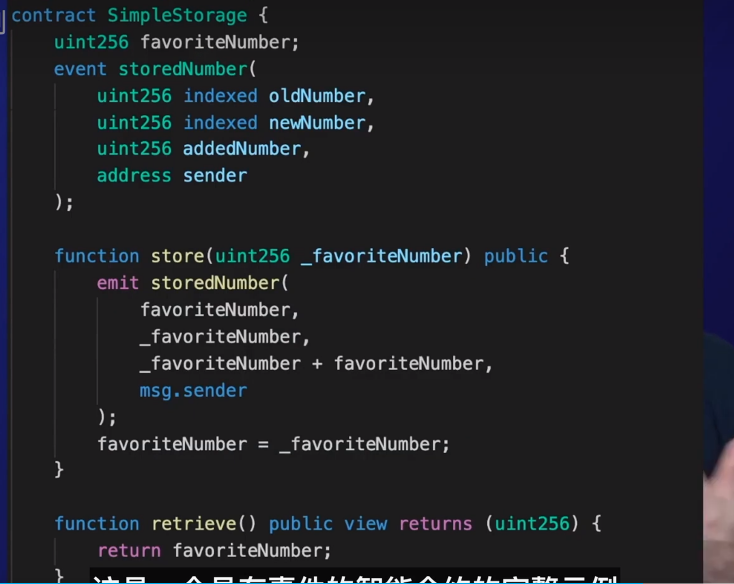
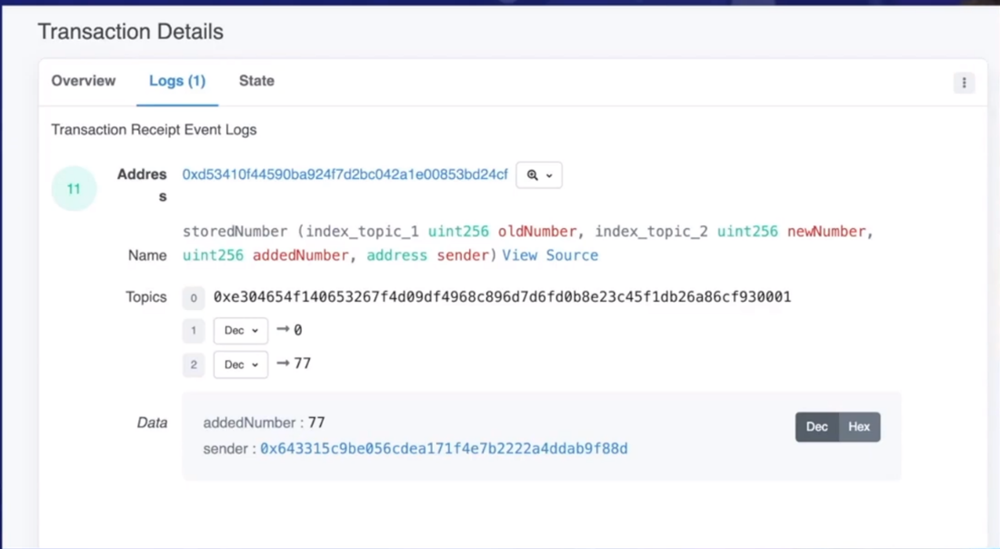
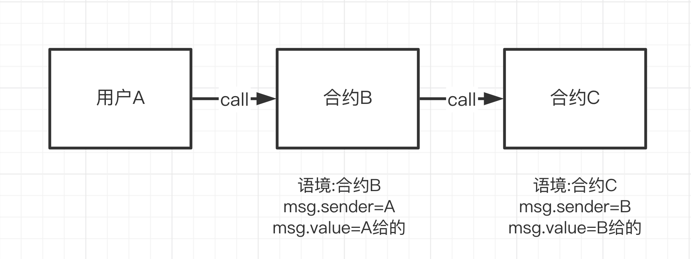
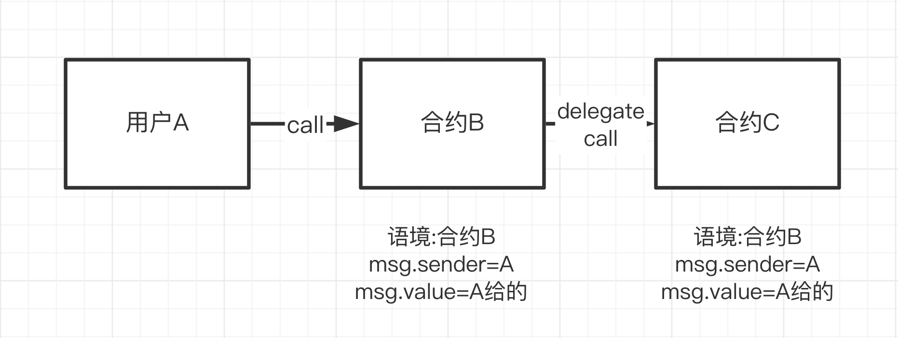
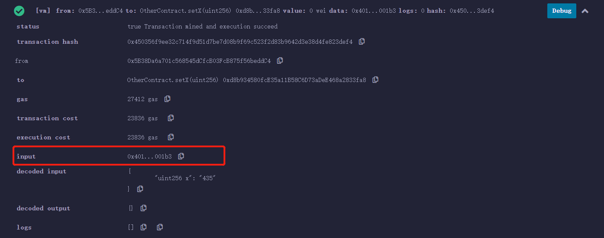

[solidity学习-一些基础攻击_哔哩哔哩_bilibili](https://www.bilibili.com/video/BV1th4y1V7iG/)

# 0 介绍

[中文版 Solidity develop 文档 (solidity-cn.readthedocs.io)](https://solidity-cn.readthedocs.io/zh/develop/introduction-to-smart-contracts.html)


**面试**：
### 合约发送to的类型
| 类型                | 描述                |
| ----------------- | ----------------- |
| `address`         | 普通地址，不可调用合约方法     |
| `address payable` | 可接收 ETH 的地址（推荐使用） |

| 方法         | 是否自动回退 | 限制Gas  | 报错方式            | 推荐程度          |
| ---------- | ------ | ------ | --------------- | ------------- |
| `transfer` | ✅ 是    | 固定2300 | 自动revert        | ⚠️ 不推荐（gas限制） |
| `send`     | ✅ 是    | 固定2300 | 返回bool          | 🚫 不推荐（不安全）   |
| `call`     | ❌ 否    | 可自定义   | 推荐用法需检查 success | ✅ 推荐          |
### 发送交易中的执行字段

| 字段名                    | 作用描述                                         |
| ---------------------- | -------------------------------------------- |
| `from`                 | 发起交易的地址（发送方）                                 |
| `to`                   | 接收地址（合约或用户地址，合约部署时为 `null`）                  |
| `value`                | 发送的 ETH 数量（以 wei 为单位）                        |
| `data`                 | 要调用的合约函数的编码（或部署合约时的合约字节码）                    |
| `gas`                  | 最大 gas 限额（限制此交易最多消耗多少 gas）                   |
| `gasPrice`             | 每单位 gas 的价格（在 EIP-1559 前是固定价格）               |
| `nonce`                | 交易计数器（防止重放攻击，每个地址唯一递增）                       |
| `chainId`              | 所在链的 ID（用于防重放攻击，EIP-155 签名机制）                |
| `accessList`           | （可选）EIP-2930 提出的字段，预声明需要访问的 storage（优化 gas）  |
| `maxPriorityFeePerGas` | 用户愿意支付给矿工的“小费”，EIP-1559 引入                   |
| `maxFeePerGas`         | 用户愿意支付的最多 gas 费用（包含 baseFee 和小费），EIP-1559 引入 |
| `signature`            | 签名（由私钥签出的，包含 `v`, `r`, `s` 三个部分）             |

## EIP协议

^77d770

### EIP-721
（也叫 ERC-721）是 **以太坊上第一个被广泛使用的“非同质化代币标准”**，通常用于表示 NFT（非同质化代币，Non-Fungible Token）。

### EIP1155

EIP-1155 是一种**多代币标准**，全称是 **"Multi Token Standard"**，由 Enjin 提出，主要目标是统一管理**同一个合约中多个类型的代币**（包括 FT、NFT）——比 EIP-20（ERC20）或 EIP-721（ERC721）更高效。

---

**🧱 简单理解**
- **一个合约，多个代币 ID**。
- 每个 `tokenId` 可代表不同代币：
    - `tokenId=1`: 某种 Fungible Token（可分）
    - `tokenId=2`: 某个 NFT（不可分）
- 支持 **批量转账、查询、授权**，节省 Gas 成本。


**🧪 对比 ERC20 和 ERC721**

| 特性     | ERC20  | ERC721   | ERC1155       |
| ------ | ------ | -------- | ------------- |
| 多资产管理  | ❌ 一种代币 | ❌ 一种 NFT | ✅ 多个 ID 多种资产  |
| 是否可分   | ✅ 可分   | ❌ 不可分    | ✅ 或 ❌ 取决于代币设计 |
| 批量操作   | ❌ 不支持  | ❌ 不支持    | ✅ 批量转账、授权等    |
| Gas 成本 | 💸 偏高  | 💸 偏高    | 💰 更省 Gas     |


### EIP-4337
EIP-4337 是以太坊提出的一项关键扩展提案，正式名称是：

> **"Account Abstraction via Entry Point Contract specification"**  
> （通过入口合约实现账户抽象）

它的目标是：**不改动以太坊核心协议（共识层），在合约层实现“账户抽象”（Account Abstraction）**。


 **🧠 什么是账户抽象（Account Abstraction）？**

以太坊中账户分为两类：

- **EOA（Externally Owned Account）：外部账户**，如普通钱包（MetaMask、硬件钱包等）
    
- **合约账户**，智能合约控制的钱包
    

目前，EOA 必须使用私钥签名交易，流程和功能固定、不可扩展。而账户抽象的目标是：

> **打破“EOA必须靠私钥签名”的限制，让用户账户也像合约一样灵活。**

---

 **✅ EIP-4337 的核心机制**

EIP-4337 的核心是通过一个称为 **EntryPoint 合约** 的“中枢控制器”来接管交易处理流程：

1. **UserOperation 对象**

传统交易叫 `Transaction`，EIP-4337 定义了一个新结构叫 **`UserOperation`**，本质上是一种扩展版交易结构，包含：
- 用户意图（from、to、data、value）
- 签名
- 验证逻辑
- 支付逻辑（支持代付）

2. **Bundler（打包者）**
类似矿工，但专门处理 `UserOperation`，打包一堆操作发送到 EntryPoint 合约。

3. **EntryPoint 合约**
统一接收 UserOperation，调用钱包的验证与执行逻辑。

 4. **智能合约钱包（Smart Contract Wallet）**
账户由合约控制，每个钱包合约需实现 `validateUserOp` 和 `executeUserOp` 接口，用于验证签名和执行交易。

**🔐 它带来了哪些好处？**

| 功能      | EIP-4337 能力说明                      |
| ------- | ---------------------------------- |
| 自定义签名机制 | 不再强依赖 ECDSA，可支持 Passkey、社交恢复、MPC 等 |
| Gas 代付  | 可用第三方（Paymaster）代为支付 gas，降低用户门槛    |
| 批量操作    | 多笔交易一次性提交，例如批准 + 转账                |
| 限制权限    | 限定每天最多转多少 ETH、限制转账地址等              |
| 社交恢复    | 钱包可以内置“朋友投票恢复”机制                   |
| 无需助记词   | 钱包可绑定生物识别/硬件/MPC 等方式，真正用户友好        |


# 1 基础

## 1.1 数据类型

### 1.1.1 数据类型


| 类型   | 示例                                              | 存储方式（默认）                | 传值/传引用 | 特殊说明                         |
| ---- | ----------------------------------------------- | ----------------------- | ------ | ---------------------------- |
| 值类型  | `uint`, `bool`                                  | stack                   | ✅ 传值   | 存在函数内部快速访问                   |
| 引用类型 | `string`, `bytes`, `array`, `mapping`, `struct` | storage/memory/calldata | ✅ 传引用  | 需要显式声明 `memory` 或 `calldata` |
> 在 Solidity 中，**值类型变量默认分配在 EVM 的栈上**，支持快速读写，但最多只能容纳 1024 个；引用类型则需要显式声明 memory 或 calldata，**而状态变量都保存在 storage 中**，对应链上永久存储。合约执行期间 memory 是可变临时存储，calldata 是外部只读输入，理解这些位置不仅有助于性能优化，也能规避如 stack too deep、storage collision 等常见问题。


1、**boolean**

2、**unit**

> 正数，跟c++的类似。这个比较特殊，当定义变量的时候可以使用`unit8`-`unit256`其中的数，单位是8（一个字节8比特），默认是256.
>
> `uint256 favoriteNumber = 5;`

3、**int**

> 跟unit的特殊相同，可以使用`int256`定义变量。
>
> `int256 favoriteNumber = -5;`

4、**address**

> 地址
>
> 地址类型有两种基本相同的类型：
>
> - `address`: 保存一个20字节的值（一个以太坊地址的大小）。
> - `address payable`: 与 `address` 类型相同，但有额外的方法 `transfer` 和 `send`。
>
> 这种区别背后的想法是， `address payable` 是一个您可以发送以太币的地址， 而您不应该发送以太币给一个普通的 `address`，例如，因为它可能是一个智能合约， 而这个合约不是为接受以太币而建立的。
>
> 类型转换：
>
> 允许从 `address payable` 到 `address` 的隐式转换， 而从 `address` 到 `address payable` 的转换必须通过 `payable(<address>)` 来明确。
>
> `address myAddress = 0x1066618d189731Fe13897cC1;`

5、**bytes**

> 字节数组`bytes`分两种，一种定长（`byte`, `bytes8`, `bytes32`），另一种不定长。定长的属于数值类型，不定长的是引用类型。 定长`bytes`可以存一些数据，消耗`gas`比较少。
>
> 同uint特殊。
>
> `bytes32 public _byte32 = "MiniSolidity"; `
>
> `bytes1 public _byte = _byte32[0]; `
>
> `MiniSolidity`变量以字节的方式存储进变量`_byte32`，转换成16进制为：`0x4d696e69536f6c69646974790000000000000000000000000000000000000000`
> `_byte`变量存储`_byte32`的第一个字节，为`0x4d`

6、**stirng**

>`string favoriteNumberIntext = "five";`

7、**struct**

> 结构体
>
> ```solidity
>  People public people = People({favoriteNumber: 2, name: "congmu"});
> 
>  struct People {
>      uint256 favoriteNumber;
>      string name;
>  }
> ```
>
> 结构体属性的定义与状态变量的定义相同，只是没有作用域这个概念。

8、**数组类型**

> ```solidity
> People[] public people;
>  //添加数组元素
>  function addPeople(string memory _name, uint256 _favoriteNumber) public {
>      People memory newPeople = People({favoriteNumber: _favoriteNumber, name: _name});
>      people.push(newPeople);
>  }
> ```
>
> 这里如果想要定义，有两种定义：
>
> 1、固定长度`uint[10]`：在声明时指定数组的长度
>
> 2、动态数组`address[]`：在声明时不指定数组的长度
>
> `bytes`比较特殊，是数组，但是不用加`[]`。另外，不能用`byte[]`声明单字节数组，可以使用`bytes`或`bytes1[]`。在gas上，`bytes`比`bytes1[]`便宜。因为`bytes1[]`在`memory`中要增加31个字节进行填充，会产生额外的gas。但是在`storage`中，由于内存紧密打包，不存在字节填充。

9、**映射mapping**

> ```solidity
>  mapping(string => uint256) public nameToFavoriteNumber;
>      //添加数组元素
>  function addPeople(string memory _name, uint256 _favoriteNumber) public {
>      nameToFavoriteNumber[_name ] = _favoriteNumber;
>  }
> ```
>
> - **规则1**：映射的`_Key`只能选择`solidity`默认的类型，比如`uint`，`address`等，不能用自定义的结构体。而`_Value`可以使用自定义的类型。下面这个例子会报错，因为`_Key使用了我们自定义的结构体：
> - **规则2**：映射通常用于存储大量的键值对数据，映射的存储位置必须是`storage`，因此可以用于合约的状态变量，函数中的`storage`变量，和library函数的参数。不能用于`public`函数的参数或返回结果中，因为`mapping`记录的是一种关系 (key - value pair)。
> - **规则3**：如果映射声明为`public`，那么`solidity`会自动给你创建一个`getter`函数，可以通过`Key`来查询对应的`Value`。
> - **规则4**：给映射新增的键值对的语法为`_Var[_Key] = _Value`，其中`_Var`是映射变量名，`_Key`和`_Value`对应新增的键值对。例子

**10、枚举 enum**

> 枚举（`enum`）是`solidity`中用户定义的数据类型。它主要用于为`uint`分配名称，使程序易于阅读和维护。它与`C语言`中的`enum`类似，使用名称来代替从`0`开始的`uint`：
>
> ```solidity
>     // 用enum将uint 0， 1， 2表示为Buy, Hold, Sell
>     enum ActionSet { Buy, Hold, Sell }
>     // 创建enum变量 action
>     ActionSet action = ActionSet.Buy;
> ```
>
> 
>
> 它可以显式的和`uint`相互转换，并会检查转换的正整数是否在枚举的长度内，不然会报错：
>
> ```solidity
>     // enum可以和uint显式的转换
>     function enumToUint() external view returns(uint){
>         return uint(action);
>     }
> ```
>
> 
>
> `enum`是一个比较冷门的变量，几乎没什么人用。

### 1.1.2 Solidity中的引用类型

**引用类型(Reference Type)**：包括数组（`array`），结构体（`struct`）和映射（`mapping`），这类变量占空间大，赋值时候直接传递地址（类似指针）。由于这类变量比较复杂，占用存储空间大，我们在使用时必须要声明数据存储的位置。

### 1.1.3 变量的初始值

- `boolean`: `false`

- `string`: `""`

- `int`: `0`

- `uint`: `0`

- `enum`: 枚举中的第一个元素

- `address`: `0x0000000000000000000000000000000000000000` (或 `address(0)`)

- ```
  function
  ```

  - `internal`: 空白方程
  - `external`: 空白方程

**`delete`操作符：**

`delete a`会让变量`a`的值变为初始值。


### 1.1.4 常量

`constant`（常量）和`immutable`（不变量）

> 状态变量声明这个两个关键字之后，不能在合约后更改数值；并且还可以节省`gas`。另外，只有数值变量可以声明`constant`和`immutable`；`string`和`bytes`可以声明为`constant`，但不能为`immutable`。

`constant`变量必须在声明的时候初始化，之后再也不能改变。尝试改变的话，编译不通过。

`immutable`变量可以在声明时或构造函数中初始化，因此更加灵活。


## 1.2 数据存储的位置

### 1.2.1 存储位置

1、**Stack**

> 不能被修改的临时变量

2、**Memory**

> 可以被修改的临时变量，数据在函数调用结束后会被清除。
>
> 大概是3

3、**Storage**

> 可以被修改的永久变量，数据在合约的整个生命周期内保持不变，除非显式修改。状态变量默认存储在 `storage` 中。
>
> 存储在`storage`中的数据是永久性的，只要智能合约存在，这些数据就会一直保存在区块链上。即使智能合约的函数执行完毕，甚至是合约暂停或销毁（如果有自我销毁机制的话），存储在`storage`中的数据也不会丢失，除非通过合约代码明确地修改或删除
>
> **合约内的读写都需要消耗gas大概是100**详情请看[EVM Codes](https://www.evm.codes/)
>
> 如`uint public value;`

4、**Calldata**

> 不能被修改的临时数据。
>
> **作用**: 函数参数的只读存储位置，特别是对于 `external` 函数。
>
> **用途**: 传递函数调用中的参数数据，特别适用于传递较大的数组或字符串。

7、**Logs**

> **结构体**、**映射**和**数组**在作为参数被添加到不同函数时需要给定一个`memory`或`calldata`关键字


solidity数据存储位置有三类：`storage`，`memory`和`calldata`。不同存储位置的`gas`成本不同。`storage`类型的数据存在链上，类似计算机的硬盘，消耗`gas`多；`memory`和`calldata`类型的临时存在内存里，消耗`gas`少。大致用法：

1. `storage`：合约里的**状态变量默认都是**`storage`，存储在链上。
2. `memory`：函数里的参数和临时变量一般用`memory`，存储在内存中，不上链。
3. `calldata`：和`memory`类似，存储在内存中，不上链。与`memory`的不同点在于`calldata`变量不能修改（`immutable`），一般用于函数的参数。例子：

```solidity
    function fCalldata(uint[] calldata _x) public pure returns(uint[] calldata){
        //参数为calldata数组，不能被修改
        // _x[0] = 0 //这样修改会报错
        return(_x);
    }
```


### 1.2.2 赋值规则(赋值是否引用)

1. `storage`（合约的状态变量）赋值给本地`storage`（函数里的）时候，会创建引用，改变新变量会影响原变量。例子：

   ```solidity
       uint[] x = [1,2,3]; // 状态变量：数组 x
   
       function fStorage() public{
           //声明一个storage的变量 xStorage，指向x。修改xStorage也会影响x
           uint[] storage xStorage = x;
           xStorage[0] = 100;
       }
   ```

2. `storage`赋值给`memory`，会创建独立的副本，修改其中一个不会影响另一个；反之亦然。例子：

   ```solidity
       uint[] x = [1,2,3]; // 状态变量：数组 x
       
       function fMemory() public view{
           //声明一个Memory的变量xMemory，复制x。修改xMemory不会影响x
           uint[] memory xMemory = x;
           xMemory[0] = 100;
           xMemory[1] = 200;
           uint[] memory xMemory2 = x;
           xMemory2[0] = 300;
       }
   ```

3. `memory`赋值给`memory`，会创建引用，改变新变量会影响原变量。
4. 其他情况，变量赋值给`storage`，会创建独立的副本，修改其中一个不会影响另一个。


## 1.3 默认类型和存储位置

### 1.3.1 变量的默认类型和存储位置

#### 1.3.1.1 状态变量

- **默认存储位置**: 状态变量默认存储在 `storage` 中。
- **默认可见性**: 如果没有显式指定可见性修饰符（如 `public`、`internal`、`private`），状态变量的默认可见性是 `internal`。

#### 1.3.1.2 局部变量

- **默认存储位置**: 局部变量默认存储在 `memory` 中。局部变量是函数内部声明的变量。
- **默认可见性**: 局部变量不涉及可见性修饰符，因为它们只能在声明它们的函数内部访问。

### 1.3.2 函数的默认可见性和修饰符

- **默认可见性**: 如果没有显式指定可见性修饰符（如 `public`、`internal`、`private`、`external`），函数的默认可见性是 `internal`。
- **默认状态修饰符**: 如果没有显式指定状态修饰符（如 `view`、`pure`、`payable`），函数默认既不是 `view` 也不是 `pure` 或 `payable`。它可以读取和修改状态变量，也不能接收以太币。


## 1.4 执行上下文的生命周期


### 1.4.1 合约被调用或交易被发送

当一个合约被外部调用（例如通过交易或消息调用）时，或者一个交易被发送到区块链网络，开始执行该交易中的合约代码时，执行上下文开始初始化。

### 1.4.2 初始化阶段

在初始化阶段，Solidity 运行时会设置执行环境，包括：

- **gas 和 gasprice**: 指定交易可使用的 gas 数量和 gas 的价格。
- **msg 对象**: 提供关于当前交易或消息的信息，如发送者地址 `msg.sender`、发送的 ETH 数量 `msg.value` 等。
- **block 对象**: 提供关于当前区块的信息，如区块的哈希值 `blockhash(block.number)`、区块的时间戳 `block.timestamp` 等。

### 1.4.3 函数调用

当执行到合约中的函数调用时，会创建一个新的执行上下文（Execution Context），并且在调用堆栈中推入一个新的帧（frame）。这个帧包含了函数调用的参数、局部变量、返回地址等信息。

### 1.4.4 执行函数体

在函数执行期间，Solidity 引擎会按照函数的逻辑执行代码。在函数内部可以访问到：

- **状态变量**：存储在合约存储中的数据。
- **局部变量**：在函数调用期间可用的临时变量，通常存储在内存中。
- **函数参数**：调用函数时传入的参数值。

### 1.4.5 gas 和 gas 消耗

在执行函数体的过程中，会消耗 gas。每个操作（如算术运算、存储读写、事件触发等）都有对应的 gas 成本。如果 gas 用尽或者遇到异常，执行会中断，并且已消耗的 gas 不会退还。

### 1.4.6 完成函数调用

当函数执行完毕时，会从调用堆栈中弹出当前的执行帧，返回到上一个调用帧中继续执行。如果函数有返回值，它将被存储在调用帧中，并且可以被上层调用函数访问。

### 1.4.7 事件记录

如果在函数执行期间触发了事件（使用 `emit` 关键字触发），事件数据将被记录在交易日志中，可以被区块链浏览器或其他工具查看。

### 1.4.8 完成交易或调用

当交易或消息调用完成所有的函数调用并执行完所有的操作后，执行上下文会被销毁。这包括对 gas 的最终结算、状态变更的最终确认（如果有）等操作。

### 1.4.9 总结

执行上下文的生命周期涵盖了从合约被调用到执行完毕的整个过程，包括初始化、函数调用、gas 消耗、事件记录和最终结算等阶段。理解这些阶段对于编写和理解 Solidity 合约非常重要，尤其是在优化 gas 使用和确保合约行为正确性方面。


## 1.5 命名 style guide

[Style Guide — Solidity 0.8.28 documentation (soliditylang.org)](https://docs.soliditylang.org/en/latest/style-guide.html)

[Make a doc that has the solidity style guide + the Chainlink style guide · Issue #13 · smartcontractkit/full-blockchain-solidity-course-js (github.com)](https://github.com/smartcontractkit/full-blockchain-solidity-course-js/issues/13)


[9.2 Solidit 的布局i](https://www.bilibili.com/video/BV13a4y1F7V3/?p=109)

### Order of Layout


- **Contract elements should be laid out in the following order:**
  Pragma statements
  Import statements
  Events
  Errors
  Interfaces
  Libraries
  Contracts
- **Inside each contract, library or interface, use the following order:**
  - Type declarations
  - State variables
  - Events
  - Errors
  - Modifiers
  - Functions
- **Functions should be grouped according to their visibility and ordered:**
  constructor
  receive function (if exists)
  fallback function (if exists)
  external
  public
  internal
  private


# 2 提升

## 2.1 函数基础

基于这个例子进行讲解：

```solidity
function <function name>(<parameter types>) {internal|external|public|private} [pure|view|payable] [returns (<return types>)]
```

```solidity
function test() public pure returns (unint256) {

}
```


1. `function`：声明函数时的固定用法，想写函数，就要以function关键字开头。
2. `<function name>`：函数名。
3. `(<parameter types>)`：圆括号里写函数的参数，也就是要输入到函数的变量类型和名字。
4. `[returns ()]`：函数返回的变量类型和名称。

### 2.1.1 可见性（权限）

`{internal|external|public|private}`：函数可见性说明符，一共4种。没标明函数类型的，默认`public`。合约之外的函数，即"自由函数"，始终具有隐含`internal`可见性。

- **public**：只有 public 类型的函数才可以供外部访问，当一个状态变量的权限为 public 类型时，它就会自动生成一个可供外部调用的 get 函数。
- **private**：只能在当前类中进行访问，子类无法继承，也无法调用或访问。
- **internal**：子类继承父类，子类可以访问父类的 internal 函数，同时，使用 using for 关键字后，本类可以使用被调用类的 internal 函数。内部调用时需要通过 `this`。
- **external**：被声明的函数只能在合约外部调用。

**Note 1**: 当函数声明时，它默认为是 public 类型，而状态变量声明时，默认为 internal 类型。

**Note 2**: `public|private|internal` 也可用于修饰状态变量。 `public`变量会自动生成同名的`getter`函数，用于查询数值。


### 2.1.2 修饰符（关键字）

- `pure` for functions：不允许修改或访问链上状态。
- `view` for functions：能看但不允许修改状态。
- `payable` for functioins： 是一个关键字和修饰符，用于指示函数或合约可以接收以太币（Ether）或发送以太币。


- **constant**：被声明为 constant 的状态变量只能使用那些在编译时有确定值的表达式来给它们赋值。任何通过访问内存、区块链数据（例如 now，this.balance 或 block.number）或执行数据（msg.gas）或对外部合约的调用来给它们赋值都是不允许的。不是所有类型的状态变量都支持用 constant 来修饰，当前支持的仅有值类型和字符串。
- **Storage** 变量是指永久存储在区块链中的变量。
- **Memory** 变量则是临时的，当外部函数对某合约调用完成时，内存型变量即被移除。


> 1、**代码示例**
>
> 我们在合约里定义一个状态变量 `number = 5`。
>
> ```solidity
>     // SPDX-License-Identifier: MIT
>     pragma solidity ^0.8.4;
>     contract FunctionTypes{
>         uint256 public number = 5;
> ```
>
> 定义一个`add()`函数，每次调用，每次给`number + 1`。
>
> ```solidity
>     // 默认
>     function add() external{
>         number = number + 1;
>     }
> ```
>
> 如果`add()`包含了`pure`关键字，例如 `function add() external pure`，就会报错。因为`pure`（纯纯牛马）是不配读取合约里的状态变量的，更不配改写。那`pure`函数能做些什么？举个例子，你可以给函数传递一个参数 `_number`，然后让他返回 `_number+1`。
>
> ```solidity
>     // pure: 纯纯牛马
>     function addPure(uint256 _number) external pure returns(uint256 new_number){
>         new_number = _number + 1;
>     }
> ```
>
> 这里面可以在项目中使用pure进行运算，这样是不花费gas的。
>
> 2、**注意**
>
> 比较难理解的是`pure`和`view`，在其他语言中没出现过。`solidity`引入`pure`和`view`关键字主要是为了节省`gas`和控制函数权限：如果用户直接调用`pure`/`view`方程是不消耗`gas`的（合约中非`pure`/`view`函数调用它们则会改写链上状态，需要付gas）。

完整的修改器：

- `pure` 修饰函数时：不允许修改或访问状态。
- `view` 修饰函数时：不允许修改状态。
- `payable` 修饰函数时：允许从调用中接收以太币。
- `constant` 修饰状态变量时：不允许赋值（除初始化以外），不会占据 存储插槽（storage slot）。
- `immutable` 修饰状态变量时：在构造时允许有一个确切的赋值，之后是恒定的。被存储在代码中。
- `anonymous` 修饰事件时：不把事件签名作为 topic 存储。
- `indexed` 修饰事件参数时：将参数作为 topic 存储。
- `virtual` 修饰函数和修改时：允许在派生合约中改变函数或修改器的行为。
- `override` 表示该函数、修改器或公共状态变量改变了基类合约中的函数或修改器的行为。


### 2.1.3 返回值

`Solidity`有两个关键字与函数输出相关：`return`和`returns`，他们的区别在于：

- `returns`加在函数名后面，用于声明返回的变量类型及变量名；
- `return`用于函数主体中，返回指定的变量。


#### 2.1.3.1 命名式返回

我们可以在`returns`中标明返回变量的名称，这样`solidity`会自动给这些变量初始化，并且自动返回这些函数的值，不需要加`return`。

```solidity
    // 命名式返回
    function returnNamed() public pure returns(uint256 _number, bool _bool, uint256[3] memory _array){
        _number = 2;
        _bool = false; 
        _array = [uint256(3),2,1];
    }
```

#### 2.1.3.2 解构式赋值

`solidity`使用解构式赋值的规则，支持读取函数的全部或部分返回值。

- 读取所有返回值：声明变量，并且将要赋值的变量用`,`隔开，按顺序排列。

```solidity
        uint256 _number;
        bool _bool;
        uint256[3] memory _array;
        (_number, _bool, _array) = returnNamed();
```

> 这里，`returnNamed()`这里是上面的函数，就是获取函数返回值。

- 读取部分返回值：声明要读取的返回值对应的变量，不读取的留空。下面这段代码中，我们只读取`_bool`，而不读取返回的`_number`和`_array`：

```solidity
        (, _bool2, ) = returnNamed();
```


### 2.1.4 作用域

`Solidity`中变量按作用域划分有三种，分别是状态变量（state variable），局部变量（local variable）和全局变量(global variable)

#### 2.1.4.1. 状态变量

状态变量是数据存储在链上的变量，所有合约内函数都可以访问 ，**`gas`消耗高**。状态变量在**合约内、函数外声明**：

```solidity
contract Variables {
    uint public x = 1;
    uint public y;
    string public z;
}
```


我们可以在函数里更改状态变量的值：

```solidity
    function foo() external{
        // 可以在函数里更改状态变量的值
        x = 5;
        y = 2;
        z = "0xAA";
    }
```


#### 2.1.4.2. 局部变量

局部变量是仅在函数执行过程中有效的变量，函数退出后，变量无效。局部变量的数据存储在内存里，不上链，`gas`低。局部变量在函数内声明：

```solidity
    function bar() external pure returns(uint){
        uint xx = 1;
        uint yy = 3;
        uint zz = xx + yy;
        return(zz);
    }
```


#### 2.1.4.3 全局变量

全局变量是全局范围工作的变量，都是`solidity`预留关键字。他们可以在函数内不声明直接使用：

```solidity
    function global() external view returns(address, uint, bytes memory){
        address sender = msg.sender;
        uint blockNum = block.number;
        bytes memory data = msg.data;
        return(sender, blockNum, data);
    }
```


在上面例子里，我们使用了3个常用的全局变量：`msg.sender`, `block.number`和`msg.data`，他们分别代表请求发起地址，当前区块高度，和请求数据。下面是一些常用的全局变量，更完整的列表请看这个[链接](https://learnblockchain.cn/docs/solidity/units-and-global-variables.html#special-variables-and-functions)：

- `blockhash(uint blockNumber)`: (`bytes32`)给定区块的哈希值 – 只适用于256最近区块, 不包含当前区块。
- `block.coinbase`: (`address payable`) 当前区块矿工的地址
- `block.gaslimit`: (`uint`) 当前区块的gaslimit
- `block.number`: (`uint`) 当前区块的number
- `block.timestamp`: (`uint`) 当前区块的时间戳，为unix纪元以来的秒
- `gasleft()`: (`uint256`) 剩余 gas
- `msg.data`: (`bytes calldata`) 完整call data
- `msg.sender`: (`address payable`) 消息发送者 (当前 caller)
- `msg.sig`: (`bytes4`) calldata的前四个字节 (function identifier)
- `msg.value`: (`uint`) 当前交易发送的`wei`值

### 2.1.4 调用函数并发送eth

调用 **convert** 函数，并附加*10* wei 的 ETH 

```solidity
convert{value: 10}();
```


## 2.2 构造函数和修饰器

### 2.2.1 构造函数

构造函数（`constructor`）是一种特殊的函数，每个合约可以定义一个，并在部署合约的时候自动运行一次。它可以用来初始化合约的一些参数，例如初始化合约的`owner`地址：

```solidity
   address owner; // 定义owner变量

   // 构造函数
   constructor() {
      owner = msg.sender; // 在部署合约的时候，将owner设置为部署者的地址
   }
```


### 2.2.2 修饰器(合约权限)`modifier`

修饰器（`modifier`）是`solidity`特有的语法，类似于面向对象编程中的`decorator`，声明函数拥有的特性，并减少代码冗余。`modifier`的主要使用场景是运行函数前的检查，例如地址，变量，余额等。

*modifier* 的执行是在函数执行之前的。**_;** 表示继续执行被修饰的函数

定义一个叫做onlyOwner的modifier：

```solidity
   // 定义modifier
   modifier onlyOwner {
      require(msg.sender == owner); // 检查调用者是否为owner地址
      _; // 如果是的话，继续运行函数主体；否则报错并revert交易
   }
```


带有`onlyOwner`修饰符的函数只能被`owner`地址调用，比如下面这个例子：

```solidity
   function changeOwner(address _newOwner) external onlyOwner{
      owner = _newOwner; // 只有owner地址运行这个函数，并改变owner
   }
```

我们定义了一个`changeOwner`函数，运行他可以改变合约的`owner`，但是由于`onlyOwner`修饰符的存在，只有原先的`owner`可以调用，别人调用就会报错。这也是最常用的控制智能合约权限的方法。


## 2.3 事件

`Solidity`中的事件（`event`）是`EVM`上日志的抽象，它具有两个特点：

- 响应：应用程序（[`ethers.js`](https://learnblockchain.cn/docs/ethers.js/api-contract.html#id18)）可以通过`RPC`接口订阅和监听这些事件，并在前端做响应。
- 经济：事件是`EVM`上比较经济的存储数据的方式，每个大概消耗2,000 `gas`；相比之下，链上存储一个新变量至少需要20,000 `gas`。

事件可以通知链外的监听者合约中发生的特定操作。例如，用户成功完成某个交易或者操作可以通过事件通知前端。

### 2.3.1 声明事件

事件的声明由`event`关键字开头，接着是事件名称，括号里面写好事件需要记录的变量类型和变量名。以`ERC20`代币合约的`Transfer`事件为例：

```solidity
event Transfer(address indexed from, address indexed to, uint256 value);
```


我们可以看到，`Transfer`事件共记录了3个变量`from`，`to`和`value`，分别对应代币的转账地址，接收地址和转账数量，其中`from`和`to`前面带有`indexed`关键字，他们会保存在以太坊虚拟机日志的`topics`中，方便之后检索。

### 2.3.2 释放事件

我们可以在函数里释放事件。在下面的例子中，每次用`_transfer()`函数进行转账操作的时候，都会释放`Transfer`事件，并记录相应的变量。

```solidity
    // 定义_transfer函数，执行转账逻辑
    function _transfer(
        address from,
        address to,
        uint256 amount
    ) external {

        _balances[from] = 10000000; // 给转账地址一些初始代币

        _balances[from] -=  amount; // from地址减去转账数量
        _balances[to] += amount; // to地址加上转账数量

        // 释放事件
        emit Transfer(from, to, amount);
    }
```






## 2.4 日志

```solidity
event Transfer(address indexed from, address indexed to, uint256 value);
```

我们可以看到，`Transfer`事件共记录了3个变量`from`，`to`和`value`，分别对应代币的转账地址，接收地址和转账数量，其中`from`和`to`前面带有`indexed`关键字，他们会保存在以太坊虚拟机日志的`topics`中，方便之后检索。


以太坊虚拟机（EVM）用日志`Log`来存储`Solidity`事件，每条日志记录都包含主题`topics`和数据`data`两部分。

### 2.4.1 主题 `Topics`

日志的第一部分是主题数组，用于描述事件，长度不能超过`4`。它的第一个元素是事件的签名（哈希）。对于上面的`Transfer`事件，它的签名就是：

```solidity
keccak256("Transfer(addrses,address,uint256)")

//0xddf252ad1be2c89b69c2b068fc378daa952ba7f163c4a11628f55a4df523b3ef
```

除了事件签名，主题还可以包含至多`3`个`indexed`参数，也就是`Transfer`事件中的`from`和`to`。

`indexed`标记的参数可以理解为检索事件的索引“键”，方便之后搜索。每个 `indexed` 参数的大小为固定的256比特，如果参数太大了（比如字符串），就会自动计算哈希存储在主题中。

没有`indexed`关键词的会被编码，不方便检索。


### 2.4.2 数据 `Data`

事件中不带 `indexed`的参数会被存储在 `data` 部分中，可以理解为事件的“值”。`data` 部分的变量不能被直接检索，但可以存储任意大小的数据。因此一般 `data` 部分可以用来存储复杂的数据结构，例如数组和字符串等等，因为这些数据超过了256比特，即使存储在事件的 `topic` 部分中，也是以哈希的方式存储。另外，`data` 部分的变量在存储上消耗的gas相比于 `topic` 更少。

### 2.4.3 在etherscan上查询事件

我们尝试用`_transfer()`函数在`Rinkeby`测试网络上转账100代币，可以在`etherscan`上查询到相应的`tx`：[网址](https://rinkeby.etherscan.io/tx/0x8cf87215b23055896d93004112bbd8ab754f081b4491cb48c37592ca8f8a36c7)。

点击`Logs`按钮，就能看到事件明细：


## 2.5 异常

三种抛出异常的方法：`error`，`require`和`assert`

写智能合约经常会出`bug`，`solidity`中的异常命令帮助我们`debug`。

### 2.5.1 Error

`error`是`solidity 0.8.4版本`新加的内容，方便且高效（省`gas`）地向用户解释操作失败的原因，同时还可以在抛出异常的同时携带参数，帮助开发者更好地调试。人们可以在`contract`之外定义异常。下面，我们定义一个`TransferNotOwner`异常，当用户不是代币`owner`的时候尝试转账，会抛出错误：

```solidity
error TransferNotOwner(); // 自定义error
```

我们也可以定义一个携带参数的异常，来提示尝试转账的账户地址

```solidity
error TransferNotOwner(address sender); // 自定义的带参数的error
```


在执行当中，`error`必须搭配`revert`（回退）命令使用。

```solidity
    function transferOwner1(uint256 tokenId, address newOwner) public {
        if(_owners[tokenId] != msg.sender){
            revert TransferNotOwner();
            // revert TransferNotOwner(msg.sender);
        }
        _owners[tokenId] = newOwner;
    }
```


我们定义了一个`transferOwner1()`函数，它会检查代币的`owner`是不是发起人，如果不是，就会抛出`TransferNotOwner`异常；如果是的话，就会转账。

### 2.5.2 Require

`require`命令是`solidity 0.8版本`之前抛出异常的常用方法，目前很多主流合约仍然还在使用它。它很好用，唯一的缺点就是`gas`随着描述异常的字符串长度增加，比`error`命令要高。使用方法：`require(检查条件，"异常的描述")`，当检查条件不成立的时候，就会抛出异常。

我们用`require`命令重写一下上面的`transferOwner`函数：

```solidity
    function transferOwner2(uint256 tokenId, address newOwner) public {
        require(_owners[tokenId] == msg.sender, "Transfer Not Owner");
        _owners[tokenId] = newOwner;
    }
```


### 2.5.3 Assert

`assert`命令一般用于程序员写程序`debug`，因为它不能解释抛出异常的原因（比`require`少个字符串）。它的用法很简单，`assert(检查条件）`，当检查条件不成立的时候，就会抛出异常。

我们用`assert`命令重写一下上面的`transferOwner`函数：

```solidity
    function transferOwner3(uint256 tokenId, address newOwner) public {
        assert(_owners[tokenId] == msg.sender);
        _owners[tokenId] = newOwner;
    }
```


### 2.5.4 三种方法的gas比较

我们比较一下三种抛出异常的`gas`消耗，通过remix控制台的Debug按钮，能查到每次函数调用的`gas`消耗分别如下： （使用0.8.17版本编译）

1. **`error`方法`gas`消耗**：24457 (**加入参数后`gas`消耗**：24660)
2. **`require`方法`gas`消耗**：24755
3. **`assert`方法`gas`消耗**：24473

我们可以看到，`error`方法`gas`最少，其次是`assert`，`require`方法消耗`gas`最多！因此，`error`既可以告知用户抛出异常的原因，又能省`gas`，大家要多用！（注意，由于部署测试时间的不同，每个函数的`gas`消耗会有所不同，但是比较结果会是一致的。）


### 2.5.5 Try Catch

在`solidity`中，`try-catch`只能被用于`external`函数或创建合约时`constructor`（被视为`external`函数）的调用。基本语法如下：

```solidity
        try externalContract.f() {
            // call成功的情况下 运行一些代码
        } catch {
            // call失败的情况下 运行一些代码
        }
```


其中`externalContract.f()`是某个外部合约的函数调用，`try`模块在调用成功的情况下运行，而`catch`模块则在调用失败时运行。

同样可以使用`this.f()`来替代`externalContract.f()`，`this.f()`也被视作为外部调用，但不可在构造函数中使用，因为此时合约还未创建。

如果调用的函数有返回值，那么必须在`try`之后声明`returns(returnType val)`，并且在`try`模块中可以使用返回的变量；如果是创建合约，那么返回值是新创建的合约变量。

```solidity
        try externalContract.f() returns(returnType val){
            // call成功的情况下 运行一些代码
        } catch {
            // call失败的情况下 运行一些代码
        }
```


另外，`catch`模块支持捕获特殊的异常原因：

```solidity
        try externalContract.f() returns(returnType){
            // call成功的情况下 运行一些代码
        } catch Error(string memory reason) {
            // 捕获失败的 revert() 和 require()
        } catch (bytes memory reason) {
            // 捕获失败的 assert()
        }
```


**实战**：

我们创建一个外部合约`OnlyEven`，并使用`try-catch`来处理异常：

```solidity
contract OnlyEven{
    constructor(uint a){
        require(a != 0, "invalid number");
        assert(a != 1);
    }

    function onlyEven(uint256 b) external pure returns(bool success){
        // 输入奇数时revert
        require(b % 2 == 0, "Ups! Reverting");
        success = true;
    }
}
```


`OnlyEven`合约包含一个构造函数和一个`onlyEven`函数。

- 构造函数有一个参数`a`，当`a=0`时，`require`会抛出异常；当`a=1`时，`assert`会抛出异常；其他情况均正常。
- `onlyEven`函数有一个参数`b`，当`b`为奇数时，`require`会抛出异常。

#### 2.5.5.1 处理外部函数调用异常

首先，在`TryCatch`合约中定义一些事件和状态变量：

```solidity
    // 成功event
    event SuccessEvent();

    // 失败event
    event CatchEvent(string message);
    event CatchByte(bytes data);

    // 声明OnlyEven合约变量
    OnlyEven even;

    constructor() {
        even = new OnlyEven(2);
    }
```

`SuccessEvent`是调用成功会释放的事件，而`CatchEvent`和`CatchByte`是抛出异常时会释放的事件，分别对应`require/revert`和`assert`异常的情况。`even`是个`OnlyEven`合约类型的状态变量。

然后我们在`execute`函数中使用`try-catch`处理调用外部函数`onlyEven`中的异常：

```solidity
    // 在external call中使用try-catch
    function execute(uint amount) external returns (bool success) {
        try even.onlyEven(amount) returns(bool _success){
            // call成功的情况下
            emit SuccessEvent();
            return _success;
        } catch Error(string memory reason){
            // call不成功的情况下
            emit CatchEvent(reason);
        }
```


#### 2.5.5.2 处理合约创建异常

这里，我们利用`try-catch`来处理合约创建时的异常。只需要把`try`模块改写为`OnlyEven`合约的创建就行：

```solidity
    // 在创建新合约中使用try-catch （合约创建被视为external call）
    // executeNew(0)会失败并释放`CatchEvent`
    // executeNew(1)会失败并释放`CatchByte`
    // executeNew(2)会成功并释放`SuccessEvent`
    function executeNew(uint a) external returns (bool success) {
        try new OnlyEven(a) returns(OnlyEven _even){
            // call成功的情况下
            emit SuccessEvent();
            success = _even.onlyEven(a);
        } catch Error(string memory reason) {
            // catch失败的 revert() 和 require()
            emit CatchEvent(reason);
        } catch (bytes memory reason) {
            // catch失败的 assert()
            emit CatchByte(reason);
        }
    }
```


# 3 面向对象

> 合约的关键字是`contract`， 类似java的`calss`

## 3.1 封装

```solidity
// I'm a comment!
// SPDX-License-Identifier: MIT

pragma solidity ^0.8.8;
// pragma solidity ^0.8.0;
// pragma solidity >=0.8.0 <0.9.0;

contract SimpleStorage {

    uint256 favoriteNumber;

    struct People {
        uint256 favoriteNumber;
        string name;
    }
    // uint256[] public anArray;
    People[] public people;

    mapping(string => uint256) public nameToFavoriteNumber;

    function store(uint256 _favoriteNumber) public {
        favoriteNumber = _favoriteNumber;
    }
    
    function retrieve() public view returns (uint256){
        return favoriteNumber;
    }

    function addPerson(string memory _name, uint256 _favoriteNumber) public {
        people.push(People(_favoriteNumber, _name));
        nameToFavoriteNumber[_name] = _favoriteNumber;
    }
}

```

> 就是正常的写函数


## 3.2 继承

### 3.2.1 基本

- `virtual`: 父合约中的函数，如果希望子合约重写，需要加上`virtual`关键字。
- `override`：子合约重写了父合约中的函数，需要加上`override`关键字。

**注意**：用`override`修饰`public`变量，会重写与变量同名的`getter`函数，例如：

```solidity
mapping(address => uint256) public override balanceOf;
```


```solidity
import "./SimpleStorage.sol";

contract ExtraStorage is SimpleStorage{

}
```

> 关键词是`is`，使用前需要导入

### 3.2.2 简单继承

我们先写一个简单的爷爷合约`Yeye`，里面包含1个`Log`事件和3个`function`: `hip()`, `pop()`, `yeye()`，输出都是”Yeye”。

```solidity
contract Yeye {
    event Log(string msg);

    // 定义3个function: hip(), pop(), man()，Log值为Yeye。
    function hip() public virtual{
        emit Log("Yeye");
    }

    function pop() public virtual{
        emit Log("Yeye");
    }

    function yeye() public virtual {
        emit Log("Yeye");
    }
}
```


我们再定义一个爸爸合约`Baba`，让他继承`Yeye`合约，语法就是`contract Baba is Yeye`，非常直观。在`Baba`合约里，我们重写一下`hip()`和`pop()`这两个函数，加上`override`关键字，并将他们的输出改为`”Baba”`；并且加一个新的函数`baba`，输出也是`”Baba”`。

```solidity
contract Baba is Yeye{
    // 继承两个function: hip()和pop()，输出改为Baba。
    function hip() public virtual override{
        emit Log("Baba");
    }

    function pop() public virtual override{
        emit Log("Baba");
    }

    function baba() public virtual{
        emit Log("Baba");
    }
}
```


我们部署合约，可以看到`Baba`合约里有4个函数，其中`hip()`和`pop()`的输出被成功改写成`”Baba”`，而继承来的`yeye()`的输出仍然是`”Yeye”`。

### 3.2.3 多重继承

`solidity`的合约可以继承多个合约。规则：

1. 继承时要按辈分最高到最低的顺序排。比如我们写一个`Erzi`合约，继承`Yeye`合约和`Baba`合约，那么就要写成`contract Erzi is Yeye, Baba`，而不能写成`contract Erzi is Baba, Yeye`，不然就会报错。
2. 如果某一个函数在多个继承的合约里都存在，比如例子中的`hip()`和`pop()`，在子合约里必须重写，不然会报错。
3. 重写在多个父合约中都重名的函数时，`override`关键字后面要加上所有父合约名字，例如`override(Yeye, Baba)`。

例子：

```solidity
contract Erzi is Yeye, Baba{
    // 继承两个function: hip()和pop()，输出值为Erzi。
    function hip() public virtual override(Yeye, Baba){
        emit Log("Erzi");
    }

    function pop() public virtual override(Yeye, Baba) {
        emit Log("Erzi");
    }
```


我们可以看到，`Erzi`合约里面重写了`hip()`和`pop()`两个函数，将输出改为`”Erzi”`，并且还分别从`Yeye`和`Baba`合约继承了`yeye()`和`baba()`两个函数。

### 3.2.4 修饰器的继承

`Solidity`中的修饰器（`Modifier`）同样可以继承，用法与函数继承类似，在相应的地方加`virtual`和`override`关键字即可。

```solidity
contract Base1 {
    modifier exactDividedBy2And3(uint _a) virtual {
        require(_a % 2 == 0 && _a % 3 == 0);
        _;
    }
}

contract Identifier is Base1 {

    //计算一个数分别被2除和被3除的值，但是传入的参数必须是2和3的倍数
    function getExactDividedBy2And3(uint _dividend) public exactDividedBy2And3(_dividend) pure returns(uint, uint) {
        return getExactDividedBy2And3WithoutModifier(_dividend);
    }

    //计算一个数分别被2除和被3除的值
    function getExactDividedBy2And3WithoutModifier(uint _dividend) public pure returns(uint, uint){
        uint div2 = _dividend / 2;
        uint div3 = _dividend / 3;
        return (div2, div3);
    }
}
```


`Identifier`合约可以直接在代码中使用父合约中的`exactDividedBy2And3`修饰器，也可以利用`override`关键字重写修饰器：

```solidity
    modifier exactDividedBy2And3(uint _a) override {
        _;
        require(_a % 2 == 0 && _a % 3 == 0);
    }
```


### 3.2.5 构造函数的继承

子合约有两种方法继承父合约的构造函数。举个简单的例子，父合约`A`里面有一个状态变量`a`，并由构造函数的参数来确定：

```solidity
// 构造函数的继承
abstract contract A {
    uint public a;

    constructor(uint _a) {
        a = _a;
    }
}
```


1. 在继承时声明父构造函数的参数，例如：`contract B is A(1)`
2. 在子合约的构造函数中声明构造函数的参数，例如：

```solidity
contract C is A {
    constructor(uint _c) A(_c * _c) {}
}
```


### 3.2.6 调用父合约的函数

子合约有两种方式调用父合约的函数，直接调用和利用`super`关键字。

1. 直接调用：子合约可以直接用`父合约名.函数名()`的方式来调用父合约函数，例如`Yeye.pop()`。

```solidity
    function callParent() public{
        Yeye.pop();
    }
```


1. `super`关键字：子合约可以利用`super.函数名()`来调用最近的父合约函数。`solidity`继承关系按声明时从右到左的顺序是：`contract Erzi is Yeye, Baba`，那么`Baba`是最近的父合约，`super.pop()`将调用`Baba.pop()`而不是`Yeye.pop()`：

```solidity
    function callParentSuper() public{
        // 将调用最近的父合约函数，Baba.pop()
        super.pop();
    }
```


### 3.2.7 钻石继承

在面向对象编程中，钻石继承（菱形继承）指一个派生类同时有两个或两个以上的基类。

在多重+菱形继承链条上使用`super`关键字时，需要注意的是使用`super`会调用继承链条上的每一个合约的相关函数，而不是只调用最近的父合约。

我们先写一个合约`God`，再写`Adam`和`Eve`两个合约继承`God`合约，最后让创建合约`people`继承自`Adam`和`Eve`，每个合约都有`foo`和`bar`两个函数。

```solidity
// SPDX-License-Identifier: MIT
pragma solidity ^0.8.13;

/* 继承树：
  God
 /  \
Adam Eve
 \  /
people
*/

contract God {
    event Log(string message);

    function foo() public virtual {
        emit Log("God.foo called");
    }

    function bar() public virtual {
        emit Log("God.bar called");
    }
}

contract Adam is God {
    function foo() public virtual override {
        emit Log("Adam.foo called");
    }

    function bar() public virtual override {
        emit Log("Adam.bar called");
        super.bar();
    }
}

contract Eve is God {
    function foo() public virtual override {
        emit Log("Eve.foo called");
        super.foo();
    }

    function bar() public virtual override {
        emit Log("Eve.bar called");
        super.bar();
    }
}

contract people is Adam, Eve {
    function foo() public override(Adam, Eve) {
        super.foo();
    }

    function bar() public override(Adam, Eve) {
        super.bar();
    }
}
```


在这个例子中，调用合约`people`中的`super.bar()`会依次调用`Eve`、`Adam`，最后是`God`合约。

虽然`Eve`、`Adam`都是`God`的子合约，但整个过程中`God`合约只会被调用一次。原因是Solidity借鉴了Python的方式，强制一个由基类构成的DAG（有向无环图）使其保证一个特定的顺序。更多细节你可以查阅[Solidity的官方文档](https://solidity-cn.readthedocs.io/zh/develop/contracts.html?highlight=继承#index-16)。


## 3.3 抽象合约

抽象合约（`abstract`）

如果一个智能合约里至少有一个未实现的函数，即某个函数缺少主体`{}`中的内容，则必须将该合约标为`abstract`，不然编译会报错；另外，未实现的函数需要加`virtual`，以便子合约重写。拿我们之前的[插入排序合约](https://github.com/AmazingAng/WTFSolidity/tree/main/07_InsertionSort)为例，如果我们还没想好具体怎么实现插入排序函数，那么可以把合约标为`abstract`，之后让别人补写上。

```solidity
abstract contract InsertionSort{
    function insertionSort(uint[] memory a) public pure virtual returns(uint[] memory);
}
```


## 3.4 接口

接口`interface`类似于抽象合约，但它不实现任何功能。接口的规则：

1. 不能包含状态变量
2. 不能包含构造函数
3. 不能继承除接口外的其他合约
4. 所有函数都必须是external且不能有函数体
5. 继承接口的合约必须实现接口定义的所有功能

虽然接口不实现任何功能，但它非常重要。接口是智能合约的骨架，定义了合约的功能以及如何触发它们：如果智能合约实现了某种接口（比如`ERC20`或`ERC721`），其他Dapps和智能合约就知道如何与它交互。因为接口提供了两个重要的信息：

1. 合约里每个函数的`bytes4`选择器，以及函数签名`函数名(每个参数类型）`。
2. 接口id（更多信息见[EIP165](https://eips.ethereum.org/EIPS/eip-165)）

另外，接口与合约`ABI`（Application Binary Interface）等价，可以相互转换：编译接口可以得到合约的`ABI`，利用[abi-to-sol工具](https://gnidan.github.io/abi-to-sol/)也可以将`ABI json`文件转换为`接口sol`文件。

我们以`ERC721`接口合约`IERC721`为例，它定义了3个`event`和9个`function`，所有`ERC721`标准的NFT都实现了这些函数。我们可以看到，接口和常规合约的区别在于每个函数都以`;`代替函数体`{ }`结尾。

```solidity
interface IERC721 is IERC165 {
    event Transfer(address indexed from, address indexed to, uint256 indexed tokenId);
    event Approval(address indexed owner, address indexed approved, uint256 indexed tokenId);
    event ApprovalForAll(address indexed owner, address indexed operator, bool approved);
    
    function balanceOf(address owner) external view returns (uint256 balance);

    function ownerOf(uint256 tokenId) external view returns (address owner);

    function safeTransferFrom(address from, address to, uint256 tokenId) external;

    function transferFrom(address from, address to, uint256 tokenId) external;

    function approve(address to, uint256 tokenId) external;

    function getApproved(uint256 tokenId) external view returns (address operator);

    function setApprovalForAll(address operator, bool _approved) external;

    function isApprovedForAll(address owner, address operator) external view returns (bool);

    function safeTransferFrom( address from, address to, uint256 tokenId, bytes calldata data) external;
}
```


### 3.4.1 IERC721事件

`IERC721`包含3个事件，其中`Transfer`和`Approval`事件在`ERC20`中也有。

- `Transfer`事件：在转账时被释放，记录代币的发出地址`from`，接收地址`to`和`tokenid`。
- `Approval`事件：在授权时释放，记录授权地址`owner`，被授权地址`approved`和`tokenid`。
- `ApprovalForAll`事件：在批量授权时释放，记录批量授权的发出地址`owner`，被授权地址`operator`和授权与否的`approved`。

### 3.4.2 IERC721函数

- `balanceOf`：返回某地址的NFT持有量`balance`。
- `ownerOf`：返回某`tokenId`的主人`owner`。
- `transferFrom`：普通转账，参数为转出地址`from`，接收地址`to`和`tokenId`。
- `safeTransferFrom`：安全转账（如果接收方是合约地址，会要求实现`ERC721Receiver`接口）。参数为转出地址`from`，接收地址`to`和`tokenId`。
- `approve`：授权另一个地址使用你的NFT。参数为被授权地址`approve`和`tokenId`。
- `getApproved`：查询`tokenId`被批准给了哪个地址。
- `setApprovalForAll`：将自己持有的该系列NFT批量授权给某个地址`operator`。
- `isApprovedForAll`：查询某地址的NFT是否批量授权给了另一个`operator`地址。
- `safeTransferFrom`：安全转账的重载函数，参数里面包含了`data`。

### 3.4.3 什么时候使用接口？

如果我们知道一个合约实现了`IERC721`接口，我们不需要知道它具体代码实现，就可以与它交互。

无聊猿`BAYC`属于`ERC721`代币，实现了`IERC721`接口的功能。我们不需要知道它的源代码，只需知道它的合约地址，用`IERC721`接口就可以与它交互，比如用`balanceOf()`来查询某个地址的`BAYC`余额，用`safeTransferFrom()`来转账`BAYC`。

```solidity
contract interactBAYC {
    // 利用BAYC地址创建接口合约变量（ETH主网）
    IERC721 BAYC = IERC721(0xBC4CA0EdA7647A8aB7C2061c2E118A18a936f13D);

    // 通过接口调用BAYC的balanceOf()查询持仓量
    function balanceOfBAYC(address owner) external view returns (uint256 balance){
        return BAYC.balanceOf(owner);
    }

    // 通过接口调用BAYC的safeTransferFrom()安全转账
    function safeTransferFromBAYC(address from, address to, uint256 tokenId) external{
        BAYC.safeTransferFrom(from, to, tokenId);
    }
}
```


# 4 高阶

## 4.1 函数重载

`solidity`中允许函数进行重载（`overloading`），即名字相同但输入参数类型不同的函数可以同时存在，他们被视为不同的函数。注意，`solidity`不允许修饰器（`modifier`）重载。

### 4.1.1 函数重载

举个例子，我们可以定义两个都叫`saySomething()`的函数，一个没有任何参数，输出`"Nothing"`；另一个接收一个`string`参数，输出这个`string`。

```solidity
function saySomething() public pure returns(string memory){
    return("Nothing");
}

function saySomething(string memory something) public pure returns(string memory){
    return(something);
}
```

最终重载函数在经过编译器编译后，由于不同的参数类型，都变成了不同的函数选择器（selector）。关于函数选择器的具体内容可参考[Solidity极简入门: 29. 函数选择器Selector](https://github.com/AmazingAng/WTFSolidity/tree/main/29_Selector)。

### 4.1.2 实参匹配

在调用重载函数时，会把输入的实际参数和函数参数的变量类型做匹配。 如果出现多个匹配的重载函数，则会报错。下面这个例子有两个叫`f()`的函数，一个参数为`uint8`，另一个为`uint256`：

```solidity
    function f(uint8 _in) public pure returns (uint8 out) {
        out = _in;
    }

    function f(uint256 _in) public pure returns (uint256 out) {
        out = _in;
    }
```


我们调用`f(50)`，因为`50`既可以被转换为`uint8`，也可以被转换为`uint256`，因此会报错。


## 4.2 库合约（library）

### 4.2.1 库函数

库函数是一种特殊的合约，为了提升`solidity`代码的复用性和减少`gas`而存在。库合约一般都是一些好用的函数合集（`库函数`），由大神或者项目方创作，咱们站在巨人的肩膀上，会用就行了。

他和普通合约主要有以下几点不同：

1. 不能存在状态变量
2. 不能够继承或被继承
3. 不能接收以太币
4. 不可以被销毁

### 4.2.2 String库合约

`String库合约`是将`uint256`类型转换为相应的`string`类型的代码库

他主要包含两个函数，`toString()`将`uint256`转为`string`，`toHexString()`将`uint256`转换为`16进制`，再转换为`string`。

### 4.2.3 如何使用库合约

我们用String库函数的toHexString()来演示两种使用库合约中函数的办法。

**1. 利用using for指令**

指令`using A for B;`可用于附加库函数（从库 A）到任何类型（B）。添加完指令后，库`A`中的函数会自动添加为`B`类型变量的成员，可以直接调用。注意：在调用的时候，这个变量会被当作第一个参数传递给函数：

```solidity
    // 利用using for指令
    using Strings for uint256;
    function getString1(uint256 _number) public pure returns(string memory){
        // 库函数会自动添加为uint256型变量的成员
        return _number.toHexString();
    }
```


**2. 通过库合约名称调用库函数**

```solidity
    // 直接通过库合约名调用
    function getString2(uint256 _number) public pure returns(string memory){
        return Strings.toHexString(_number);
    }
```

### 4.2.4 常用的库合约

这一讲，我们用`ERC721`的引用的库函数`String`为例介绍`solidity`中的库函数（`Library`）。99%的开发者都不需要自己去写库合约，会用大神写的就可以了。我们只需要知道什么情况该用什么库合约。常用的有：

1. [String](https://github.com/OpenZeppelin/openzeppelin-contracts/blob/4a9cc8b4918ef3736229a5cc5a310bdc17bf759f/contracts/utils/Strings.sol)：将`uint256`转换为`String`
2. [Address](https://github.com/OpenZeppelin/openzeppelin-contracts/blob/4a9cc8b4918ef3736229a5cc5a310bdc17bf759f/contracts/utils/Address.sol)：判断某个地址是否为合约地址
3. [Create2](https://github.com/OpenZeppelin/openzeppelin-contracts/blob/4a9cc8b4918ef3736229a5cc5a310bdc17bf759f/contracts/utils/Create2.sol)：更安全的使用`Create2 EVM opcode`
4. [Arrays](https://github.com/OpenZeppelin/openzeppelin-contracts/blob/4a9cc8b4918ef3736229a5cc5a310bdc17bf759f/contracts/utils/Arrays.sol)：跟数组相关的库函数


## 4.3 接收ETH receive & fallback

`Solidity`支持两种特殊的回调函数，`receive()`和`fallback()`，他们主要在两种情况下被使用：

1. 接收ETH
2. 处理合约中不存在的函数调用（代理合约proxy contract）

注意⚠️：在solidity 0.6.x版本之前，语法上只有 `fallback()` 函数，用来接收用户发送的ETH时调用以及在被调用函数签名没有匹配到时，来调用。 0.6版本之后，solidity才将 `fallback()` 函数拆分成 `receive()` 和 `fallback()` 两个函数。

我们这一讲主要讲接收ETH的情况。

### 4.3.1 接收ETH函数 receive

`receive()`只用于处理接收`ETH`。一个合约最多有一个`receive()`函数，声明方式与一般函数不一样，不需要`function`关键字：`receive() external payable { ... }`。`receive()`函数不能有任何的参数，不能返回任何值，必须包含`external`和`payable`。

当合约接收ETH的时候，`receive()`会被触发。`receive()`最好不要执行太多的逻辑因为如果别人用`send`和`transfer`方法发送`ETH`的话，`gas`会限制在`2300`，`receive()`太复杂可能会触发`Out of Gas`报错；如果用`call`就可以自定义`gas`执行更复杂的逻辑。

我们可以在`receive()`里发送一个`event`，例如：

```solidity
    // 定义事件
    event Received(address Sender, uint Value);
    // 接收ETH时释放Received事件
    receive() external payable {
        emit Received(msg.sender, msg.value);
    }
```


有些恶意合约，会在`receive()` 函数（老版本的话，就是 `fallback()` 函数）嵌入恶意消耗`gas`的内容或者使得执行故意失败的代码，导致一些包含退款和转账逻辑的合约不能正常工作，因此写包含退款等逻辑的合约时候，一定要注意这种情况。

### 4.3.1 回退函数 fallback

`fallback()`函数会在调用合约不存在的函数时被触发。可用于接收ETH，也可以用于代理合约`proxy contract`。`fallback()`声明时不需要`function`关键字，**必须由`external`修饰**，一般也会用`payable`修饰，用于接收ETH:`fallback() external payable { ... }`。

我们定义一个`fallback()`函数，被触发时候会释放`fallbackCalled`事件，并输出`msg.sender`，`msg.value`和`msg.data`:

```solidity
    // fallback
    fallback() external payable{
        emit fallbackCalled(msg.sender, msg.value, msg.data);
    }
```


### 4.3.3 总结

1、**receive**

> 发送交易的时候只要没有与该交易相关的数据，将被触发
>
> 当向合约发送以太币时，或者调用合约不存在的函数时，就会调用 `receive` 函数来处理这些以太币。

2、**fallback**

> 用于处理向合约发送以太币时没有匹配到任何其他函数调用的情况。
>
> 从 Solidity 0.6.0 版本开始，`fallback` 函数被标记为已弃用，不建议继续使用。

```solidity
    fallback() external payable {
        fund();
    }

    receive() external payable {
        fund();
    }
    
    // Explainer from: https://solidity-by-example.org/fallback/
    // Ether is sent to contract
    //      is msg.data empty?
    //          /   \ 
    //         yes  no
    //         /     \
    //    receive()?  fallback() 
    //     /   \ 
    //   yes   no
    //  /        \
    //receive()  fallback()

```

## 4.4 发送ETH

`Solidity`有三种方法向其他合约发送`ETH`，他们是：`transfer()`，`send()`和`call()`，其中`call()`是被鼓励的用法。

**接收ETH合约**

我们先部署一个接收`ETH`合约`ReceiveETH`。`ReceiveETH`合约里有一个事件`Log`，记录收到的`ETH`数量和`gas`剩余。还有两个函数，一个是`receive()`函数，收到`ETH`被触发，并发送`Log`事件；另一个是查询合约`ETH`余额的`getBalance()`函数。

```solidity
contract ReceiveETH {
    // 收到eth事件，记录amount和gas
    event Log(uint amount, uint gas);
    
    // receive方法，接收eth时被触发
    receive() external payable{
        emit Log(msg.value, gasleft());
    }
    
    // 返回合约ETH余额
    function getBalance() view public returns(uint) {
        return address(this).balance;
    }
}
```

部署`ReceiveETH`合约后，运行`getBalance()`函数，可以看到当前合约的`ETH`余额为`0`。

**发送ETH合约**

我们将实现三种方法向`ReceiveETH`合约发送`ETH`。首先，先在发送ETH合约`SendETH`中实现`payable`的`构造函数`和`receive()`，让我们能够在部署时和部署后向合约转账。

```solidity
contract SendETH {
    // 构造函数，payable使得部署的时候可以转eth进去
    constructor() payable{}
    // receive方法，接收eth时被触发
    receive() external payable{}
}
```


### 4.4.1 transfer

- 用法是`接收方地址.transfer(发送ETH数额)`。
- `transfer()`的`gas`限制是`2300`，足够用于转账，但对方合约的`fallback()`或`receive()`函数不能实现太复杂的逻辑。
- `transfer()`如果转账失败，会自动`revert`（回滚交易）。

代码样例，注意里面的`_to`填`ReceiveETH`合约的地址，`amount`是`ETH`转账金额：

```solidity
// 用transfer()发送ETH
function transferETH(address payable _to, uint256 amount) external payable{
    _to.transfer(amount);
}
```

部署`SendETH`合约后，对`ReceiveETH`合约发送ETH，此时`amount`为10，`value`为0，`amount`>`value`，转账失败，发生`revert`。


### 4.4.2 send

- 用法是`接收方地址.send(发送ETH数额)`。
- `send()`的`gas`限制是`2300`，足够用于转账，但对方合约的`fallback()`或`receive()`函数不能实现太复杂的逻辑。
- `send()`如果转账失败，不会`revert`。
- `send()`的返回值是`bool`，代表着转账成功或失败，需要额外代码处理一下。

代码样例：

```solidity
// send()发送ETH
function sendETH(address payable _to, uint256 amount) external payable{
    // 处理下send的返回值，如果失败，revert交易并发送error
    bool success = _to.send(amount);
    if(!success){
        revert SendFailed();
    }
}
```

对`ReceiveETH`合约发送ETH，此时`amount`为10，`value`为0，`amount`>`value`，转账失败，因为经过处理，所以发生`revert`。


### 4.4.3 call

- 用法是`接收方地址.call{value: 发送ETH数额}("")`。
- `call()`没有`gas`限制，可以支持对方合约`fallback()`或`receive()`函数实现复杂逻辑。
- `call()`如果转账失败，不会`revert`。
- `call()`的返回值是`(bool, data)`，其中`bool`代表着转账成功或失败，需要额外代码处理一下。

代码样例：

```solidity
// call()发送ETH
function callETH(address payable _to, uint256 amount) external payable{
    // 处理下call的返回值，如果失败，revert交易并发送error
    (bool success,) = _to.call{value: amount}("");
    if(!success){
        revert CallFailed();
    }
}
```

对`ReceiveETH`合约发送ETH，此时`amount`为10，`value`为0，`amount`>`value`，转账失败，因为经过处理，所以发生`revert`。


### 4.4.4 总结

这一讲，我们介绍`solidity`三种发送`ETH`的方法：`transfer`，`send`和`call`。

- `call`没有`gas`限制，最为灵活，是最提倡的方法；
- `transfer`有`2300 gas`限制，但是发送失败会自动`revert`交易，是次优选择；
- `send`有`2300 gas`限制，而且发送失败不会自动`revert`交易，几乎没有人用它。


## 4.5 调用其他合约

### 4.5.1 调用已部署合约

开发者写智能合约来调用其他合约，这让以太坊网络上的程序可以复用，从而建立繁荣的生态。很多`web3`项目依赖于调用其他合约，比如收益农场（`yield farming`）。这一讲，我们介绍如何在已知合约代码（或接口）和地址情况下调用目标合约的函数。

### 4.5.2 目标合约

我们先写一个简单的合约`OtherContract`来调用。

```solidity
contract OtherContract {
    uint256 private _x = 0; // 状态变量_x
    // 收到eth的事件，记录amount和gas
    event Log(uint amount, uint gas);
    
    // 返回合约ETH余额
    function getBalance() view public returns(uint) {
        return address(this).balance;
    }

    // 可以调整状态变量_x的函数，并且可以往合约转ETH (payable)
    function setX(uint256 x) external payable{
        _x = x;
        // 如果转入ETH，则释放Log事件
        if(msg.value > 0){
            emit Log(msg.value, gasleft());
        }
    }

    // 读取_x
    function getX() external view returns(uint x){
        x = _x;
    }
}
```


这个合约包含一个状态变量`_x`，一个事件`Log`在收到`ETH`时触发，三个函数：

- `getBalance()`: 返回合约`ETH`余额。
- `setX()`: `external payable`函数，可以设置`_x`的值，并向合约发送`ETH`。
- `getX()`: 读取`_x`的值。

### 4.5.3 调用合约

我们可以利用合约的地址和合约代码（或接口）来创建合约的引用：`_Name(_Address)`，其中`_Name`是合约名，`_Address`是合约地址。然后用合约的引用来调用它的函数：`_Name(_Address).f()`，其中`f()`是要调用的函数。

调用`OtherContract`合约步骤如下：


下面我们介绍4个调用合约的例子，在remix中编译合约后，分别部署`OtherContract`和`CallContract`：


#### 4.5.3.1 传入合约地址

我们可以在函数里传入目标合约地址，生成目标合约的引用，然后调用目标函数。以调用`OtherContract`合约的`setX`函数为例，我们在新合约中写一个`callSetX`函数，传入已部署好的`OtherContract`合约地址`_Address`和`setX`的参数`x`：

```solidity
    function callSetX(address _Address, uint256 x) external{
        OtherContract(_Address).setX(x);
    }
```

复制`OtherContract`合约的地址，填入`callSetX`函数的参数中，成功调用后，调用`OtherContract`合约中的`getX`验证`x`变为123

#### 4.5.3.2 传入合约变量

我们可以直接在函数里传入合约的引用，只需要把上面参数的`address`类型改为目标合约名，比如`OtherContract`。下面例子实现了调用目标合约的`getX()`函数。

**注意**该函数参数`OtherContract _Address`底层类型仍然是`address`，生成的`ABI`中、调用`callGetX`时传入的参数都是`address`类型

```solidity
    function callGetX(OtherContract _Address) external view returns(uint x){
        x = _Address.getX();
    }
```

复制`OtherContract`合约的地址，填入`callGetX`函数的参数中，调用后成功获取`x`的值


#### 4.5.3.3 创建合约变量

我们可以创建合约变量，然后通过它来调用目标函数。下面例子，我们给变量`oc`存储了`OtherContract`合约的引用：

```solidity
    function callGetX2(address _Address) external view returns(uint x){
        OtherContract oc = OtherContract(_Address);
        x = oc.getX();
    }
```

复制`OtherContract`合约的地址，填入`callGetX2`函数的参数中，调用后成功获取`x`的值


#### 4.5.3.4 调用合约并发送`ETH`

如果目标合约的函数是`payable`的，那么我们可以通过调用它来给合约转账：`_Name(_Address).f{value: _Value}()`，其中`_Name`是合约名，`_Address`是合约地址，`f`是目标函数名，`_Value`是要转的`ETH`数额（以`wei`为单位）。

`OtherContract`合约的`setX`函数是`payable`的，在下面这个例子中我们通过调用`setX`来往目标合约转账。

```solidity
    function setXTransferETH(address otherContract, uint256 x) payable external{
        OtherContract(otherContract).setX{value: msg.value}(x);
    }
```

复制`OtherContract`合约的地址，填入`setXTransferETH`函数的参数中，并转入10ETH

> 这里发送合约的原因是：
>
> 尽管没有显式使用 `address.transfer` 或 `address.send`，但是 Solidity 的函数调用机制中，当调用一个 `payable` 函数并指定 `{value: msg.value}` 时，实质上是执行了低级别的 `CALL` 操作，将 ETH 转发到了目标合约的函数。
>
> `OtherContract(otherContract).setX{value: msg.value}(x);`:
>
> - `OtherContract` 是目标合约的类型（假设 `OtherContract` 是一个定义好的合约接口）。
> - `otherContract` 是目标合约的地址。
> - `setX` 是目标合约中的函数。
> - `{value: msg.value}`：将当前合约接收到的 ETH（`msg.value`）传递给目标合约的 `setX` 函数。
> - `(x)`：传递参数 `x` 给目标合约的 `setX` 函数。
>
> ```solidity
> (bool success, ) = otherContract.call{value: msg.value}(abi.encodeWithSignature("setX(uint256)", x));
> require(success, "Call failed");
> ```
>
> 这两个是相等的


## 4.6 Call

`call` 是`address`类型的低级成员函数，它用来与其他合约交互。它的返回值为`(bool, data)`，分别对应`call`是否成功以及目标函数的返回值。

- `call`是`solidity`官方推荐的通过触发`fallback`或`receive`函数发送`ETH`的方法。
- 不推荐用`call`来调用另一个合约，因为当你调用不安全合约的函数时，你就把主动权交给了它。推荐的方法仍是声明合约变量后调用函数，见[第21讲：调用其他合约](https://github.com/AmazingAng/WTFSolidity/tree/main/21_CallContract)
- 当我们不知道对方合约的源代码或`ABI`，就没法生成合约变量；这时，我们仍可以通过`call`调用对方合约的函数。

### 4.6.1 `call`的使用规则

`call`的使用规则如下：

```text
目标合约地址.call(二进制编码);
```

其中`二进制编码`利用结构化编码函数`abi.encodeWithSignature`获得：

```text
abi.encodeWithSignature("函数签名", 逗号分隔的具体参数)
```

`函数签名`为`"函数名（逗号分隔的参数类型)"`。例如`abi.encodeWithSignature("f(uint256,address)", _x, _addr)`。

另外`call`在调用合约时可以指定交易发送的`ETH`数额和`gas`：

```text
目标合约地址.call{value:发送数额, gas:gas数额}(二进制编码);
```

看起来有点复杂，下面我们举个`call`应用的例子。

### 4.6.2 目标合约

我们先写一个简单的目标合约`OtherContract`并部署，多了`fallback`

```solidity
contract OtherContract {
    uint256 private _x = 0; // 状态变量x
    // 收到eth的事件，记录amount和gas
    event Log(uint amount, uint gas);
    
    fallback() external payable{}

    // 返回合约ETH余额
    function getBalance() view public returns(uint) {
        return address(this).balance;
    }

    // 可以调整状态变量_x的函数，并且可以往合约转ETH (payable)
    function setX(uint256 x) external payable{
        _x = x;
        // 如果转入ETH，则释放Log事件
        if(msg.value > 0){
            emit Log(msg.value, gasleft());
        }
    }

    // 读取x
    function getX() external view returns(uint x){
        x = _x;
    }
}
```

这个合约包含一个状态变量`x`，一个在收到`ETH`时触发的事件`Log`，三个函数：

- `getBalance()`: 返回合约`ETH`余额。
- `setX()`: `external payable`函数，可以设置`x`的值，并向合约发送`ETH`。
- `getX()`: 读取`x`的值。

### 4.6.3 利用`call`调用目标合约

**1. Response事件**

我们写一个`Call`合约来调用目标合约函数。首先定义一个`Response`事件，输出`call`返回的`success`和`data`，方便我们观察返回值。

```solidity
// 定义Response事件，输出call返回的结果success和data
event Response(bool success, bytes data);
```


**2. 调用setX函数**

我们定义`callSetX`函数来调用目标合约的`setX()`，转入`msg.value`数额的`ETH`，并释放`Response`事件输出`success`和`data`：

```solidity
function callSetX(address payable _addr, uint256 x) public payable {
    // call setX()，同时可以发送ETH
    (bool success, bytes memory data) = _addr.call{value: msg.value}(
        abi.encodeWithSignature("setX(uint256)", x)
    );

    emit Response(success, data); //释放事件
}
```


接下来我们调用`callSetX`把状态变量`_x`改为5，参数为`OtherContract`地址和`5`，由于目标函数`setX()`没有返回值，因此`Response`事件输出的`data`为`0x`，也就是空。

**3. 调用getX函数**

下面我们调用`getX()`函数，它将返回目标合约`_x`的值，类型为`uint256`。我们可以利用`abi.decode`来解码`call`的返回值`data`，并读出数值。

```solidity
function callGetX(address _addr) external returns(uint256){
    // call getX()
    (bool success, bytes memory data) = _addr.call(
        abi.encodeWithSignature("getX()")
    );

    emit Response(success, data); //释放事件
    return abi.decode(data, (uint256));
}
```


从`Response`事件的输出，我们可以看到`data`为`0x0000000000000000000000000000000000000000000000000000000000000005`。而经过`abi.decode`，最终返回值为`5`。

**4. 调用不存在的函数**

如果我们给`call`输入的函数不存在于目标合约，那么目标合约的`fallback`函数会被触发。

```solidity
function callNonExist(address _addr) external{
    // call getX()
    (bool success, bytes memory data) = _addr.call(
        abi.encodeWithSignature("foo(uint256)")
    );

    emit Response(success, data); //释放事件
}
```


上面例子中，我们`call`了不存在的`foo`函数。`call`仍能执行成功，并返回`success`，但其实调用的目标合约`fallback`函数。

### 4.6.4 总结

这一讲，我们介绍了如何用`call`这一低级函数来调用其他合约。`call`**不是调用合约的推荐方法**，因为不安全。但他能让我们在不知道源代码和`ABI`的情况下调用目标合约，很有用。

推荐4.5 声明合约变量后调用函数


## 4.7 Delegatecall

`delegatecall`与`call`类似，是`solidity`中地址类型的低级成员函数。`delegate`中是委托/代表的意思，那么`delegatecall`委托了什么？

当用户`A`通过合约`B`来`call`合约`C`的时候，执行的是合约`C`的函数，`语境`(`Context`，可以理解为包含变量和状态的环境)也是合约`C`的：`msg.sender`是`B`的地址，并且如果函数改变一些状态变量，产生的效果会作用于合约`C`的变量上。





而当用户`A`通过合约`B`来`delegatecall`合约`C`的时候，执行的是合约`C`的函数，但是`语境`仍是合约`B`的：`msg.sender`是`A`的地址，并且如果函数改变一些状态变量，产生的效果会作用于合约`B`的变量上。




`delegatecall`语法和`call`类似，也是：

```solidity
目标合约地址.delegatecall(二进制编码);
```

其中`二进制编码`利用结构化编码函数`abi.encodeWithSignature`获得：

```solidity
abi.encodeWithSignature("函数签名", 逗号分隔的具体参数)
```

`函数签名`为`"函数名（逗号分隔的参数类型)"`。例如`abi.encodeWithSignature("f(uint256,address)", _x, _addr)`。

和`call`不一样，`delegatecall`在调用合约时可以指定交易发送的`gas`，但不能指定发送的`ETH`数额

> **注意**：`delegatecall`有安全隐患，使用时要保证当前合约和目标合约的状态变量存储结构相同，并且目标合约安全，不然会造成资产损失。

### 4.7.1 什么情况下会用到`delegatecall`?

目前`delegatecall`主要有两个应用场景：

1. 代理合约（`Proxy Contract`）：将智能合约的存储合约和逻辑合约分开：代理合约（`Proxy Contract`）存储所有相关的变量，并且保存逻辑合约的地址；所有函数存在逻辑合约（`Logic Contract`）里，通过`delegatecall`执行。当升级时，只需要将代理合约指向新的逻辑合约即可。
2. EIP-2535 Diamonds（钻石）：钻石是一个支持构建可在生产中扩展的模块化智能合约系统的标准。钻石是具有多个实施合同的代理合同。 更多信息请查看：[钻石标准简介](https://eip2535diamonds.substack.com/p/introduction-to-the-diamond-standard)。

### 4.7.2 `delegatecall`例子

调用结构：你（`A`）通过合约`B`调用目标合约`C`。

#### 4.7.2.1 被调用的合约C

我们先写一个简单的目标合约`C`：有两个`public`变量：`num`和`sender`，分别是`uint256`和`address`类型；有一个函数，可以将`num`设定为传入的`_num`，并且将`sender`设为`msg.sender`。

```solidity
// 被调用的合约C
contract C {
    uint public num;
    address public sender;

    function setVars(uint _num) public payable {
        num = _num;
        sender = msg.sender;
    }
}
```

#### 4.7.2.2 发起调用的合约B

首先，合约`B`必须和目标合约`C`的变量存储布局必须相同，两个变量，并且顺序为`num`和`sender`

```solidity
contract B {
    uint public num;
    address public sender;
```

接下来，我们分别用`call`和`delegatecall`来调用合约`C`的`setVars`函数，更好的理解它们的区别。

`callSetVars`函数通过`call`来调用`setVars`。它有两个参数`_addr`和`_num`，分别对应合约`C`的地址和`setVars`的参数。

```solidity
    // 通过call来调用C的setVars()函数，将改变合约C里的状态变量
    function callSetVars(address _addr, uint _num) external payable{
        // call setVars()
        (bool success, bytes memory data) = _addr.call(
            abi.encodeWithSignature("setVars(uint256)", _num)
        );
    }
```

而`delegatecallSetVars`函数通过`delegatecall`来调用`setVars`。与上面的`callSetVars`函数相同，有两个参数`_addr`和`_num`，分别对应合约`C`的地址和`setVars`的参数。


```solidity
    // 通过delegatecall来调用C的setVars()函数，将改变合约B里的状态变量
    function delegatecallSetVars(address _addr, uint _num) external payable{
        // delegatecall setVars()
        (bool success, bytes memory data) = _addr.delegatecall(
            abi.encodeWithSignature("setVars(uint256)", _num)
        );
    }
}
```


## 4.8 在合约中创建新合约

在以太坊链上，用户（外部账户，`EOA`）可以创建智能合约，智能合约同样也可以创建新的智能合约。去中心化交易所`uniswap`就是利用工厂合约（`Factory`）创建了无数个币对合约（`Pair`）。这一讲，我会用简化版的`uniswap`讲如何通过合约创建合约。

### 4.8.1 `create`如何使用

有两种方法可以在合约中创建新合约，`create`和`create2`，这里我们讲`create`，下一讲会介绍`create2`。

`create`的用法很简单，就是`new`一个合约，并传入新合约构造函数所需的参数：

```solidity
Contract x = new Contract{value: _value}(params)
```

其中`Contract`是要创建的合约名，`x`是合约对象（地址），如果构造函数是`payable`，可以创建时转入`_value`数量的`ETH`，`params`是新合约构造函数的参数。


### 4.8.2 极简Uniswap

`Uniswap V2`[核心合约](https://github.com/Uniswap/v2-core/tree/master/contracts)中包含两个合约：

1. UniswapV2Pair: 币对合约，用于管理币对地址、流动性、买卖。
2. UniswapV2Factory: 工厂合约，用于创建新的币对，并管理币对地址。

下面我们用`create`方法实现一个极简版的`Uniswap`：`Pair`币对合约负责管理币对地址，`PairFactory`工厂合约用于创建新的币对，并管理币对地址。

#### 4.8.2.1 `Pair`合约

```solidity
contract Pair{
    address public factory; // 工厂合约地址
    address public token0; // 代币1
    address public token1; // 代币2

    constructor() payable {
        factory = msg.sender;
    }

    // called once by the factory at time of deployment
    function initialize(address _token0, address _token1) external {
        require(msg.sender == factory, 'UniswapV2: FORBIDDEN'); // sufficient check
        token0 = _token0;
        token1 = _token1;
    }
}
```

`Pair`合约很简单，包含3个状态变量：`factory`，`token0`和`token1`。

构造函数`constructor`在部署时将`factory`赋值为工厂合约地址。`initialize`函数会在`Pair`合约创建的时候被工厂合约调用一次，将`token0`和`token1`更新为币对中两种代币的地址。

> **提问**：为什么`uniswap`不在`constructor`中将`token0`和`token1`地址更新好？
>
> **答**：因为`uniswap`使用的是`create2`创建合约，限制构造函数不能有参数。当使用`create`时，`Pair`合约允许构造函数有参数，可以在`constructor`中将`token0`和`token1`地址更新好。

#### 4.8.2.2 `PairFactory`

```solidity
contract PairFactory{
    mapping(address => mapping(address => address)) public getPair; // 通过两个代币地址查Pair地址
    address[] public allPairs; // 保存所有Pair地址

    function createPair(address tokenA, address tokenB) external returns (address pairAddr) {
        // 创建新合约
        Pair pair = new Pair(); 
        // 调用新合约的initialize方法
        pair.initialize(tokenA, tokenB);
        // 更新地址map
        pairAddr = address(pair);
        allPairs.push(pairAddr);
        getPair[tokenA][tokenB] = pairAddr;
        getPair[tokenB][tokenA] = pairAddr;
    }
}
```

> 需要先导入pair这个合约

工厂合约（`PairFactory`）有两个状态变量`getPair`是两个代币地址到币对地址的`map`，方便根据代币找到币对地址；`allPairs`是币对地址的数组，存储了所有代币地址。

`PairFactory`合约只有一个`createPair`函数，根据输入的两个代币地址`tokenA`和`tokenB`来创建新的`Pair`合约。其中

```solidity
    Pair pair = new Pair(); 
```


就是创建合约的代码，非常简单。大家可以部署好`PairFactory`合约，然后用下面两个地址作为参数调用`createPair`，看看创建的币对地址是什么：

```text
WBNB地址: 0x2c44b726ADF1963cA47Af88B284C06f30380fC78
BSC链上的PEOPLE地址:
0xbb4CdB9CBd36B01bD1cBaEBF2De08d9173bc095c
```


## 4.9 Create2

`CREATE2` 操作码使我们在智能合约部署在以太坊网络之前就能预测合约的地址。`Uniswap`创建`Pair`合约用的就是`CREATE2`而不是`CREATE`。这一讲，我将介绍`CREATE2`的用法

### 4.9.1 CREATE如何计算地址

智能合约可以由其他合约和普通账户利用`CREATE`操作码创建。 在这两种情况下，新合约的地址都以相同的方式计算：创建者的地址(通常为部署的钱包地址或者合约地址)和`nonce`(该地址发送交易的总数,对于合约账户是创建的合约总数,每创建一个合约nonce+1))的哈希。

```text
新地址 = hash(创建者地址, nonce)
```

创建者地址不会变，但`nonce`可能会随时间而改变，因此用`CREATE`创建的合约地址不好预测。

```solidity
Contract x = new Contract{value: _value}(params)
```

### 4.9.2 CREATE2如何计算地址

`CREATE2`的目的是为了让合约地址独立于未来的事件。不管未来区块链上发生了什么，你都可以把合约部署在事先计算好的地址上。用`CREATE2`创建的合约地址由4个部分决定：

- `0xFF`：一个常数，避免和`CREATE`冲突
- 创建者地址
- `salt`（盐）：一个创建者给定的数值
- 待部署合约的字节码（`bytecode`）

```text
新地址 = hash("0xFF",创建者地址, salt, bytecode)
```

`CREATE2` 确保，如果创建者使用 `CREATE2` 和提供的 `salt` 部署给定的合约`bytecode`，它将存储在 `新地址` 中。

### 4.9.3 如何使用`CREATE2`

`CREATE2`的用法和之前讲的`Create`类似，同样是`new`一个合约，并传入新合约构造函数所需的参数，只不过要多传一个`salt`参数：

```text
Contract x = new Contract{salt: _salt, value: _value}(params)
```

其中`Contract`是要创建的合约名，`x`是合约对象（地址），`_salt`是指定的盐；如果构造函数是`payable`，可以创建时转入`_value`数量的`ETH`，`params`是新合约构造函数的参数。

### 4.9.4 极简Uniswap2

我们用`Create2`来实现极简`Uniswap`。

#### 4.9.4.1 `Pair`

```solidity
contract Pair{
    address public factory; // 工厂合约地址
    address public token0; // 代币1
    address public token1; // 代币2

    constructor() payable {
        factory = msg.sender;
    }

    // called once by the factory at time of deployment
    function initialize(address _token0, address _token1) external {
        require(msg.sender == factory, 'UniswapV2: FORBIDDEN'); // sufficient check
        token0 = _token0;
        token1 = _token1;
    }
}
```

`Pair`合约很简单，包含3个状态变量：`factory`，`token0`和`token1`。

构造函数`constructor`在部署时将`factory`赋值为工厂合约地址。`initialize`函数会在`Pair`合约创建的时候被工厂合约调用一次，将`token0`和`token1`更新为币对中两种代币的地址。

#### 4.9.4.2 `PairFactory2`

```solidity
contract PairFactory2{
        mapping(address => mapping(address => address)) public getPair; // 通过两个代币地址查Pair地址
        address[] public allPairs; // 保存所有Pair地址

        function createPair2(address tokenA, address tokenB) external returns (address pairAddr) {
            require(tokenA != tokenB, 'IDENTICAL_ADDRESSES'); //避免tokenA和tokenB相同产生的冲突
            // 计算用tokenA和tokenB地址计算salt
            (address token0, address token1) = tokenA < tokenB ? (tokenA, tokenB) : (tokenB, tokenA); //将tokenA和tokenB按大小排序
            bytes32 salt = keccak256(abi.encodePacked(token0, token1));
            // 用create2部署新合约
            Pair pair = new Pair{salt: salt}(); 
            // 调用新合约的initialize方法
            pair.initialize(tokenA, tokenB);
            // 更新地址map
            pairAddr = address(pair);
            allPairs.push(pairAddr);
            getPair[tokenA][tokenB] = pairAddr;
            getPair[tokenB][tokenA] = pairAddr;
        }
```


工厂合约（`PairFactory2`）有两个状态变量`getPair`是两个代币地址到币对地址的`map`，方便根据代币找到币对地址；`allPairs`是币对地址的数组，存储了所有币对地址。

`PairFactory2`合约只有一个`createPair2`函数，使用`CREATE2`根据输入的两个代币地址`tokenA`和`tokenB`来创建新的`Pair`合约。其中

```solidity
    Pair pair = new Pair{salt: salt}(); 
```


就是利用`CREATE2`创建合约的代码，非常简单，而`salt`为`token1`和`token2`的`hash`：

```solidity
            bytes32 salt = keccak256(abi.encodePacked(token0, token1));
```


#### 4.9.4.3 事先计算`Pair`地址

```solidity
        // 提前计算pair合约地址
        function calculateAddr(address tokenA, address tokenB) public view returns(address predictedAddress){
            require(tokenA != tokenB, 'IDENTICAL_ADDRESSES'); //避免tokenA和tokenB相同产生的冲突
            // 计算用tokenA和tokenB地址计算salt
            (address token0, address token1) = tokenA < tokenB ? (tokenA, tokenB) : (tokenB, tokenA); //将tokenA和tokenB按大小排序
            bytes32 salt = keccak256(abi.encodePacked(token0, token1));
            // 计算合约地址方法 hash()
            predictedAddress = address(uint160(uint(keccak256(abi.encodePacked(
                bytes1(0xff),
                address(this),
                salt,
                keccak256(type(Pair).creationCode)
            )))));
        
```

```text
WBNB地址: 0x2c44b726ADF1963cA47Af88B284C06f30380fC78
BSC链上的PEOPLE地址:
0xbb4CdB9CBd36B01bD1cBaEBF2De08d9173bc095c
```


### 4.9.5 create2的实际应用场景

1. 交易所为新用户预留创建钱包合约地址。
2. 由 `CREATE2` 驱动的 `factory` 合约，在`uniswapV2`中交易对的创建是在 `Factory`中调用`create2`完成。这样做的好处是: 它可以得到一个确定的`pair`地址, 使得 `Router`中就可以通过 `(tokenA, tokenB)` 计算出`pair`地址, 不再需要执行一次 `Factory.getPair(tokenA, tokenB)` 的跨合约调用。


## 4.10 删除合约`selfdestruct`

`selfdestruct`命令可以用来删除智能合约，并将该合约剩余`ETH`转到指定地址。`selfdestruct`是为了应对合约出错的极端情况而设计的。它最早被命名为`suicide`（自杀），但是这个词太敏感。为了保护抑郁的程序员，改名为`selfdestruct`。

### 4.10.1 如何使用`selfdestruct`

`selfdestruct`使用起来非常简单：

```solidity
selfdestruct(_addr)；
```

其中`_addr`是接收合约中剩余`ETH`的地址。


### 4.10.2 例子

```solidity
contract DeleteContract {

    uint public value = 10;

    constructor() payable {}

    receive() external payable {}

    function deleteContract() external {
        // 调用selfdestruct销毁合约，并把剩余的ETH转给msg.sender
        selfdestruct(payable(msg.sender));
    }

    function getBalance() external view returns(uint balance){
        balance = address(this).balance;
    }
}
```

在`DeleteContract`合约中，我们写了一个`public`状态变量`value`，两个函数：`getBalance()`用于获取合约`ETH`余额，`deleteContract()`用于自毁合约，并把`ETH`转入给发起人。

部署好合约后，我们向`DeleteContract`合约转入1 `ETH`。这时，`getBalance()`会返回1 `ETH`，`value`变量是10。

当我们调用`deleteContract()`函数，合约将自毁，所有变量都清空，此时`value`变为默认值`0`，`getBalance()`也返回空值。

### 4.10.3 注意事项

1. 对外提供合约销毁接口时，最好设置为只有合约所有者可以调用，可以使用函数修饰符`onlyOwner`进行函数声明。
2. 当合约被销毁后与智能合约的交互也能成功，并且返回0。
3. 当合约中有`selfdestruct`功能时常常会带来安全问题和信任问题，合约中的Selfdestruct功能会为攻击者打开攻击向量(例如使用`selfdestruct`向一个合约频繁转入token进行攻击，这将大大节省了GAS的费用，虽然很少人这么做)，此外，此功能还会降低用户对合约的信心。


### 4.10.4 总结

`selfdestruct`是智能合约的紧急按钮，销毁合约并将剩余`ETH`转移到指定账户。当著名的`The DAO`攻击发生时，以太坊的创始人们一定后悔过没有在合约里加入`selfdestruct`来停止黑客的攻击吧。


## 4.11 ABI编码解码

`ABI` (Application Binary Interface，应用二进制接口)是与以太坊智能合约交互的标准。数据基于他们的类型编码；并且由于编码后不包含类型信息，解码时需要注明它们的类型。

`Solidity`中，`ABI编码`有4个函数：`abi.encode`, `abi.encodePacked`, `abi.encodeWithSignature`, `abi.encodeWithSelector`。而`ABI解码`有1个函数：`abi.decode`，用于解码`abi.encode`的数据。


我们将用编码4个变量，他们的类型分别是`uint256`, `address`, `string`, `uint256[2]`：

```solidity
    uint x = 10;
    address addr = 0x7A58c0Be72BE218B41C608b7Fe7C5bB630736C71;
    string name = "0xAA";
    uint[2] array = [5, 6]; 
```


### 4.11.1 `abi.encode`

将给定参数利用[ABI规则](https://learnblockchain.cn/docs/solidity/abi-spec.html)编码。`ABI`被设计出来跟智能合约交互，他将每个参数填充为32字节的数据，并拼接在一起。如果你要和合约交互，你要用的就是`abi.encode`。

```solidity
    function encode() public view returns(bytes memory result) {
        result = abi.encode(x, addr, name, array);
    }
```


编码的结果为`0x000000000000000000000000000000000000000000000000000000000000000a0000000000000000000000007a58c0be72be218b41c608b7fe7c5bb630736c7100000000000000000000000000000000000000000000000000000000000000a00000000000000000000000000000000000000000000000000000000000000005000000000000000000000000000000000000000000000000000000000000000600000000000000000000000000000000000000000000000000000000000000043078414100000000000000000000000000000000000000000000000000000000`，由于`abi.encode`将每个数据都填充为32字节，中间有很多`0`。

### 4.11.2 `abi.encodePacked`

将给定参数根据其所需最低空间编码。它类似 `abi.encode`，但是会把其中填充的很多`0`省略。比如，只用1字节来编码`uint`类型。当你想省空间，并且不与合约交互的时候，可以使用`abi.encodePacked`，例如算一些数据的`hash`时。

```solidity
    function encodePacked() public view returns(bytes memory result) {
        result = abi.encodePacked(x, addr, name, array);
    }
```


编码的结果为`0x000000000000000000000000000000000000000000000000000000000000000a7a58c0be72be218b41c608b7fe7c5bb630736c713078414100000000000000000000000000000000000000000000000000000000000000050000000000000000000000000000000000000000000000000000000000000006`，由于`abi.encodePacked`对编码进行了压缩，长度比`abi.encode`短很多。

### 4.11.3 `abi.encodeWithSignature`

与`abi.encode`功能类似，只不过第一个参数为`函数签名`，比如`"foo(uint256,address)"`。当调用其他合约的时候可以使用。

```solidity
    function encodeWithSignature() public view returns(bytes memory result) {
        result = abi.encodeWithSignature("foo(uint256,address,string,uint256[2])", x, addr, name, array);
    }
```


编码的结果为`0xe87082f1000000000000000000000000000000000000000000000000000000000000000a0000000000000000000000007a58c0be72be218b41c608b7fe7c5bb630736c7100000000000000000000000000000000000000000000000000000000000000a00000000000000000000000000000000000000000000000000000000000000005000000000000000000000000000000000000000000000000000000000000000600000000000000000000000000000000000000000000000000000000000000043078414100000000000000000000000000000000000000000000000000000000`，等同于在`abi.encode`编码结果前加上了4字节的`函数选择器`[说明](https://www.wtf.academy/docs/solidity-102/ABIEncode/#fn-说明)。 [说明](https://www.wtf.academy/docs/solidity-102/ABIEncode/#fn-说明): 函数选择器就是通过函数名和参数进行签名处理(Keccak–Sha3)来标识函数，可以用于不同合约之间的函数调用

### 4.11.4 `abi.encodeWithSelector`

与`abi.encodeWithSignature`功能类似，只不过第一个参数为`函数选择器`，为`函数签名`Keccak哈希的前4个字节。

```solidity
    function encodeWithSelector() public view returns(bytes memory result) {
        result = abi.encodeWithSelector(bytes4(keccak256("foo(uint256,address,string,uint256[2])")), x, addr, name, array);
    }
```


编码的结果为`0xe87082f1000000000000000000000000000000000000000000000000000000000000000a0000000000000000000000007a58c0be72be218b41c608b7fe7c5bb630736c7100000000000000000000000000000000000000000000000000000000000000a00000000000000000000000000000000000000000000000000000000000000005000000000000000000000000000000000000000000000000000000000000000600000000000000000000000000000000000000000000000000000000000000043078414100000000000000000000000000000000000000000000000000000000`，与`abi.encodeWithSignature`结果一样。

### 4.11.5 ABI解码

`abi.decode`用于解码`abi.encode`生成的二进制编码，将它还原成原本的参数。

```solidity
    function decode(bytes memory data) public pure returns(uint dx, address daddr, string memory dname, uint[2] memory darray) {
        (dx, daddr, dname, darray) = abi.decode(data, (uint, address, string, uint[2]));
    }
```


### 4.11.6 ABI的使用场景

1. 在合约开发中，ABI常配合call来实现对合约的底层调用。

```solidity
    bytes4 selector = contract.getValue.selector;

    bytes memory data = abi.encodeWithSelector(selector, _x);
    (bool success, bytes memory returnedData) = address(contract).staticcall(data);
    require(success);

    return abi.decode(returnedData, (uint256));
```

1. ethers.js中常用ABI实现合约的导入和函数调用。

```solidity
    const wavePortalContract = new ethers.Contract(contractAddress, contractABI, signer);
    /*
        * Call the getAllWaves method from your Smart Contract
        */
    const waves = await wavePortalContract.getAllWaves();
```


1. 对不开源合约进行反编译后，某些函数无法查到函数签名，可通过ABI进行调用。

- 0x533ba33a() 是一个反编译后显示的函数，只有函数编码后的结果，并且无法查到函数签名

这种情况下，就可以通过ABI函数选择器来调用

```solidity
    bytes memory data = abi.encodeWithSelector(bytes4(0x533ba33a));

    (bool success, bytes memory returnedData) = address(contract).staticcall(data);
    require(success);

    return abi.decode(returnedData, (uint256));
```


### 4.11.7 总结

在以太坊中，数据必须编码成字节码才能和智能合约交互。这一讲，我们介绍了4种`abi编码`方法和1种`abi解码`方法。


## 4.12 Hash

```solidity
bytes32 hash = keccak256(abi.encodePacked(_account, _tokenId));
```

> 使用 `keccak256(abi.encodePacked(_account, _tokenId))` 的主要原因是为了生成唯一标识符，确保数据完整性，并防止哈希碰撞。这种方法广泛应用于以太坊智能合约中，特别是在涉及多个变量组合的情况下，如 NFT 和代币合约。


一个好的哈希函数应该具有以下几个特性：

- 单向性：从输入的消息到它的哈希的正向运算简单且唯一确定，而反过来非常难，只能靠暴力枚举。
- 灵敏性：输入的消息改变一点对它的哈希改变很大。
- 高效性：从输入的消息到哈希的运算高效。
- 均一性：每个哈希值被取到的概率应该基本相等。
- 抗碰撞性：
  - 弱抗碰撞性：给定一个消息`x`，找到另一个消息`x'`使得`hash(x) = hash(x')`是困难的。
  - 强抗碰撞性：找到任意`x`和`x'`，使得`hash(x) = hash(x')`是困难的。

### 4.12.1 Keccak256

`Keccak256`函数是`solidity`中最常用的哈希函数，用法非常简单：

```solidity
哈希 = keccak256(数据);
```


#### 4.12.1.1 Keccak256和sha3

这是一个很有趣的事情：

1. sha3由keccak标准化而来，在很多场合下Keccak和SHA3是同义词，但在2015年8月SHA3最终完成标准化时，NIST调整了填充算法。**所以SHA3就和keccak计算的结果不一样**，这点在实际开发中要注意。
2. 以太坊在开发的时候sha3还在标准化中，所以采用了keccak，所以Ethereum和Solidity智能合约代码中的SHA3是指Keccak256，而不是标准的NIST-SHA3，为了避免混淆，直接在合约代码中写成Keccak256是最清晰的。

#### 4.12.1.2 生成数据唯一标识

我们可以利用`keccak256`来生成一些数据的唯一标识。比如我们有几个不同类型的数据：`uint`，`string`，`address`，我们可以先用`abi.encodePacked`方法将他们打包编码，然后再用`keccak256`来生成唯一标识：

```solidity
    function hash(
        uint _num,
        string memory _string,
        address _addr
    ) public pure returns (bytes32) {
        return keccak256(abi.encodePacked(_num, _string, _addr));
    }
```


#### 4.12.1.3 弱抗碰撞性

我们用`keccak256`演示一下之前讲到的弱抗碰撞性，即给定一个消息`x`，找到另一个消息`x'`使得`hash(x) = hash(x')`是困难的。

我们给定一个消息`0xAA`，试图去找另一个消息，使得它们的哈希值相等：

```solidity
    // 弱抗碰撞性
    function weak(
        string memory string1
    )public view returns (bool){
        return keccak256(abi.encodePacked(string1)) == _msg;
    }
```


### 4.12.1.4 强抗碰撞性

我们用`keccak256`演示一下之前讲到的强抗碰撞性，即找到任意不同的`x`和`x'`，使得`hash(x) = hash(x')`是困难的。

我们构造一个函数`strong`，接收两个不同的`string`参数`string1`和`string2`，然后判断它们的哈希是否相同：

```solidity
    // 强抗碰撞性
    function strong(
        string memory string1,
        string memory string2
    )public pure returns (bool){
        return keccak256(abi.encodePacked(string1)) == keccak256(abi.encodePacked(string2));
    }
```


## 4.13 函数选择器Selector

当我们调用智能合约时，本质上是向目标合约发送了一段`calldata`，在remix中发送一次交易后，可以在详细信息中看见`input`即为此次交易的`calldata`



发送的`calldata`中前4个字节是`selector`（函数选择器）。这一讲，我们将介绍`selector`是什么，以及如何使用。

### 4.13.1 `msg.data`

`msg.data`是`solidity`中的一个全局变量，值为完整的`calldata`（调用函数时传入的数据）。

在下面的代码中，我们可以通过`Log`事件来输出调用`mint`函数的`calldata`：

```solidity
    // event 返回msg.data
    event Log(bytes data);

    function mint(address to) external{
        emit Log(msg.data);
    }
```


当参数为`0x2c44b726ADF1963cA47Af88B284C06f30380fC78`时，输出的`calldata`为

```text
0x6a6278420000000000000000000000002c44b726adf1963ca47af88b284c06f30380fc78
```


这段很乱的字节码可以分成两部分：

```text
前4个字节为函数选择器selector：
0x6a627842

后面32个字节为输入的参数：
0x0000000000000000000000002c44b726adf1963ca47af88b284c06f30380fc78
```

其实`calldata`就是告诉智能合约，我要调用哪个函数，以及参数是什么。

### 4.13.2 `method id`、`selector`和`函数签名`

`method id`定义为`函数签名`的`Keccak`哈希后的前4个字节，当`selector`与`method id`相匹配时，即表示调用该函数，那么`函数签名`是什么？

其实在[4.5 调用其他合约](# 4.5 调用其他合约)中，我们简单介绍了**函数签名**，为`"函数名（逗号分隔的参数类型)"`。举个例子，上面代码中`mint`的函数签名为`"mint(address)"`。在同一个智能合约中，不同的函数有不同的函数签名，因此我们可以通过函数签名来确定要调用哪个函数。

**注意**，在函数签名中，`uint`和`int`要写为`uint256`和`int256`。

我们写一个函数，来验证`mint`函数的`method id`是否为`0x6a627842`。大家可以运行下面的函数，看看结果。

```solidity
    function mintSelector() external pure returns(bytes4 mSelector){
        return bytes4(keccak256("mint(address)"));
    }
```

结果正是`0x6a627842`：


### 4.13.3 使用`selector`

我们可以利用`selector`来调用目标函数。例如我想调用`mint`函数，我只需要利用`abi.encodeWithSelector`将`mint`函数的`method id`作为`selector`和参数打包编码，传给`call`函数：

```solidity
    function callWithSignature() external returns(bool, bytes memory){
        (bool success, bytes memory data) = address(this).call(abi.encodeWithSelector(0x6a627842, 0x2c44b726ADF1963cA47Af88B284C06f30380fC78));
        return(success, data);
    }
```


在日志中，我们可以看到`mint`函数被成功调用，并输出`Log`事件。


# 5 实战

[实战](实战.md)


# 6 编译

1. **ABI（Application Binary Interface）**：ABI 描述了合约的外部接口，包括合约的函数、事件等信息。它定义了合约如何与其他合约或者外部调用者进行交互。ABI 在 JSON 文件中以键值对的形式表示，包含了**函数的名称**、**参数类型**、**返回值类型**等信息。
   
2. **Data（Bytecode）**：这部分数据是合约的字节码（bytecode），它是合约编译后的二进制代码。字节码包含了合约的**实际执行代码**，包括**函数实现**、**变量初始化**等。部署合约时，需要将字节码发送到以太坊网络上，以供网络执行合约部署操作。
   
3. **Deploy**：这个部分包含了合约的部署相关信息，例如合约的**构造函数参数**、**合约作者**等。这些信息在部署合约时可能会用到，以确保合约能够正确部署到以太坊网络上。

### 链上操作

链上操作是指需要在区块链网络中进行的操作，这些操作会被矿工（或验证者）记录在区块链上，并需要消耗Gas（以太坊网络中的交易费用）。

- **智能合约执行**：任何调用智能合约函数的操作，都会在区块链上执行。例如，转账、执行智能合约中的函数等。这些操作都会被记录在区块链的交易记录中。
- **交易提交**：用户签名并提交到区块链网络的交易，比如发送ETH或其他代币的交易。这些交易会被矿工打包并记录在区块链中。
- **状态更新**：任何导致区块链状态变化的操作，比如改变账户余额、更新智能合约存储的数据等。

### 链下操作

链下操作是指在区块链网络之外进行的操作，这些操作不会被直接记录在区块链上，通常在用户的设备或中心化服务器上进行。

- **数据签名**：使用私钥对数据进行签名。这是用户在本地设备上进行的操作，区块链不会记录这个过程。
- **交易准备**：在本地或服务器上准备交易数据，包括计算Gas费用、设置接收地址等。
- **数据存储**：在链下数据库或文件系统中存储数据，不会直接影响区块链状态。例如，中心化服务器上的数据库操作。