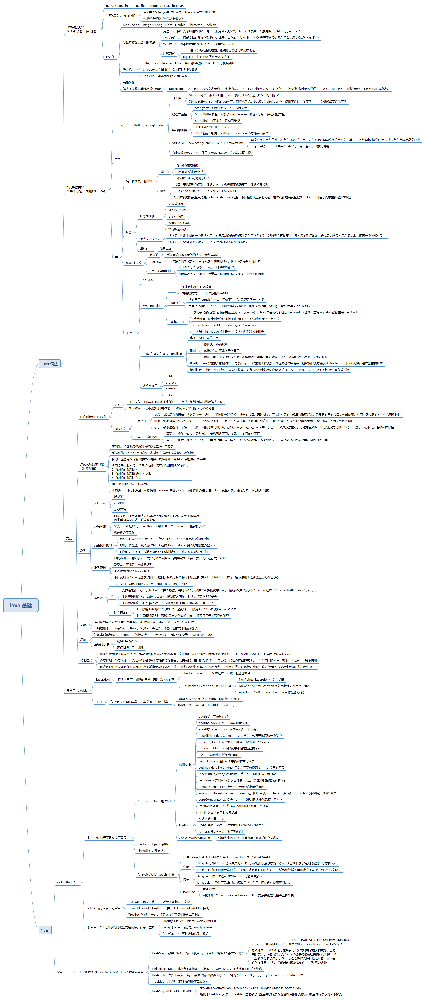
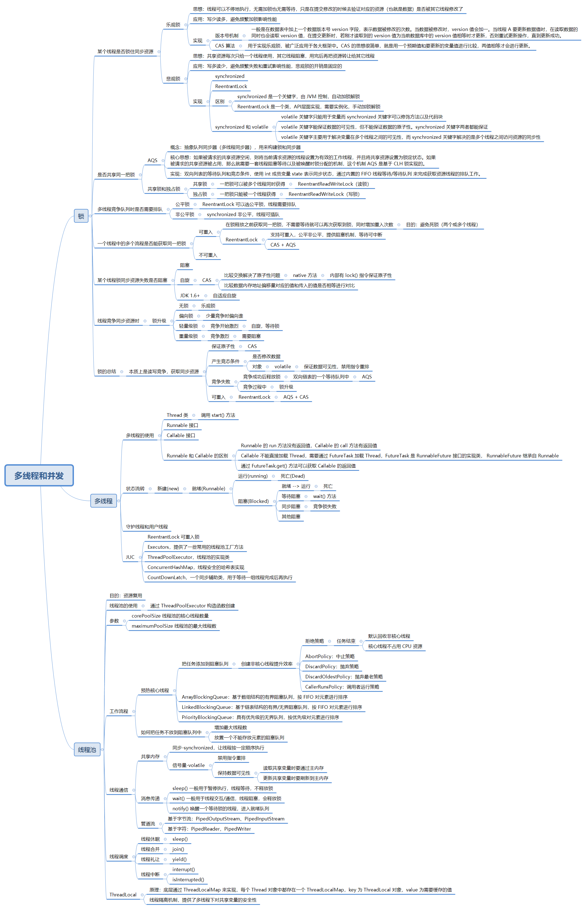

# JavaSE

## java基础

## 多线程和并发

## HashMap 

### 原理
`HashMap` 是基于哈希表的数据结构，用于存储**键值对**（`key-value`）。其核心是将键的哈希值映射到数组索引位置，通过**数组 + 链表**（在 Java 8 及之后是**数组 + 链表 + 红黑树**）来处理**哈希冲突严重时的性能问题**。
> 红黑树是一棵**二叉搜索树（BST）**，保证了基本操作（查找、插入、删除）在 **O(log n)** 时间复杂度内完成。

`HashMap` 使用键的 `hashCode()` 方法计算哈希值，并通过 `indexFor` 方法（JDK 1.7 及之后版本移除了这个方法，直接使用 `(n - 1) & hash`）确定元素在数组中的存储位置。哈希值是经过一定扰动处理的，防止哈希值分布不均匀，从而减少冲突。

`HashMap` 的默认初始容量为 16，负载因子为 0.75。也就是说，当存储的元素数量超过 16 × 0.75 = 12 个时，`HashMap` 会触发扩容操作，容量x2并重新分配元素位置。这种扩容是比较耗时的操作，频繁扩容会影响性能。

## Integer和int的区别

> 1. Integer的初始值是null，int的初始值是0
> 2. Integer存储在堆内存，int类型是直接存储在栈空间
> 3. Integer是对象类型，它封装了很多的方法和属性，我们在使用的时候更加灵活

### ThreadLocal内存泄漏：

key是弱引用，value是强引用。如果弱引用被回收了，此时value就是内存泄漏了。手动remove是一个手动将value进行清除，此时就不会发生内存泄露了。

> 强引用：使用最普遍的引用，一个对象具有强引用，不会被垃圾器回收，当内存不足时，java虚拟机宁愿抛出作物使程序终止，也不回收对象。
>
> 如果想取消强引用，显示的将引用赋值为null，这样可以使JVM在合适的时间回收该对象。
>
> 弱引用：JVM进行垃圾回收时，无论内存是否充足，都会回收被弱引用相关联的对象。

# 多线程

> ConcurrentHashMap、ConcurrentLinkedQueue、ConcurrentSkipListSet和CopyOnWriteArrayList

**CopyOnWriteArrayList**：是一个线程安全的可变数组实现，适用于读多写少的场景。它通过在每次修改操作时创建列表的副本来实现线程安全。写操作（如 `add`、`remove` 等）代价较高

**Collections.synchronizedList(new ArrayList<>())**：就是将所有的方法加了`synchronized`锁，每次访问或修改列表时，都需要获取锁，这确保了在同一时刻只有一个线程可以访问列表。

- **读操作远多于写操作**：使用 `CopyOnWriteArrayList`。
- **需要高并发处理的键值对存储**：使用 `ConcurrentHashMap`。
- **需要高并发处理的队列**：使用 `ConcurrentLinkedQueue` 或 `BlockingQueue` 实现。
- **需要双端队列**：使用 `ConcurrentLinkedDeque`。
- **需要简单的同步包装**：使用 `Collections.synchronizedList`，但要注意手动同步块

# JVM

## JVM内存结构  
1. 程序计数器（Program Counter Register）：  
    每个线程都有自己的程序计数器，是一个小内存空间。它记录了当前线程执行的字节码的地址，帮助CPU知道下一步要执行的指令是哪个。这也是唯一一个在JVM规范中不报内存溢出的区域。  
2.  Java虚拟机栈（Java Virtual Machine Stack）：  
    每个线程也有自己独立的虚拟机栈。栈中保存着由一个个栈帧（Stack Frame）组成的信息。每个栈帧对应一次方法调用，保存局部变量表、操作数栈、动态链接、方法出口等信息。当方法执行完后，栈帧会弹出。  
3. 本地方法栈（Native Method Stack）：  
    与虚拟机栈类似，但用于处理本机方法。Java程序使用JNI（Java Native Interface）调用其他语言（如C/C++）编写的程序，此时本地方法栈会被使用。  
4. 堆（Heap）：  
    JVM用来存储对象实例和数组。它是所有线程共享的区域，也是垃圾回收的主要区域。Java堆由多个代（年轻代、老年代）构成，这是为了提高GC效率。所有Java对象的实例都在这里分配内存。  
5. 方法区（Method Area）：  
    也是线程共享的，用于存储已被JVM加载的类信息、常量、静态变量，即时编译后的代码等。Java 8开始将方法区移出了堆内存，成为了一个独立的元空间（Metaspace），并存储在本地内存中。

## 什么是三色标记

三色标记法是一种用于垃圾回收算法中的对象标记方法，特别用于标记-清除型垃圾回收器。这种方法通过使用三种颜色（白色、灰色和黑色）来跟踪对象的可达性和垃圾回收状态，以避免对象的重复回收和丢失

### 原理：
首先我们需要知道三色标记法就是根据可达性分析，从GC Roots开始进行遍历访问，在遍历对象过程中，按“是否检查过”这个条件将对象标记成三种颜色

三色标记的基本概念  
●白色：表示对象尚未被检查。白色对象可能是垃圾，直到证明它们是可达的。  
●灰色：表示对象被检查过，并且其本身是可达的，但其引用的对象还未全部检查。  
●黑色：表示对象和它所有引用的对象都已检查且是可达的。  

三色标记步骤  
1初始化：所有对象开始时都是白色。  
2标记开始：从GC Roots开始，根对象标记为灰色。  
3扫描灰色对象：  
○将灰色对象引用的所有白色对象标记为灰色。  
○然后将该灰色对象标记为黑色。  
4重复步骤3直到没有更多的灰色对象。  
5清除：未标记为黑色的对象为白色，即垃圾，可被回收。

### 存在的问题

浮动垃圾：标记过不是垃圾的，变成了垃圾

对象漏标问题：需要的对象被回收

## JVM 垃圾回收机制（GC）
### JVM 中有哪些垃圾回收算法和垃圾收集器？
### **常见 GC 算法**

1. **标记-清除（Mark-Sweep）**：
    
    - 标记存活对象，清除未标记对象，导致 **内存碎片化**。
        
2. **复制（Copying）**：
    
    - 将存活对象复制到新区域，适用于 **新生代 GC**（Eden → Survivor）。
        
3. **标记-整理（Mark-Compact）**：
    
    - 先标记对象，再整理存活对象，避免碎片化，适用于 **老年代 GC**。
        

### **常见垃圾收集器**

| GC 类型      | 名称        | 特点                              |
| ---------- | --------- | ------------------------------- |
| **年轻代 GC** | Serial GC | 单线程，适用于 **单核 CPU 低内存** 环境       |
|            | ParNew GC | **多线程版 Serial GC**，常用于 **并发应用** |
|            | G1 GC     | 低延迟，适用于 **大内存应用**               |
| **老年代 GC** | CMS GC    | 低延迟，并发执行 GC，适用于 **高并发服务**       |
|            | G1 GC     | 替代 CMS，减少 STW（Stop The World）   |

**如何选择 GC？**

- **高吞吐量场景（批处理、大量数据分析）**：选择 **Parallel GC**。
    
- **低延迟场景（电商、交易系统）**：选择 **G1 GC** 或 **ZGC（JDK 11+）**。

## JVM 调优 & 常见 JVM 参数

### **JVM 调优步骤**

1. **监控 GC**：使用 `-XX:+PrintGCDetails` 观察 GC 日志。
    
2. **设置合适的堆大小**：如 `-Xms512m -Xmx2g`。
    
3. **选择合适的 GC**：如 `-XX:+UseG1GC`。
    
4. **使用 JVisualVM、JProfiler、JConsole 监控性能**。
    

### **常见 JVM 参数**

- `-Xms<size>`：初始堆大小（如 `-Xms512m`）。
    
- `-Xmx<size>`：最大堆大小（如 `-Xmx2g`）。
    
- `-XX:+UseG1GC`：启用 G1 GC。
    
- `-XX:+HeapDumpOnOutOfMemoryError`：OOM 时生成堆转储文件。

### 总结
三色标记算法是根可达算法的一种实现方案，其目的是为了找出所有可达对象。三色标记算法会产生多标和漏标问题，其中漏标问题最严重。漏标问题会导致本该存活的对象被回收，从而导致严重的程序问题。

# 数据库

## 2.1 MySql常见的存储引擎及区别

> 一、InnoDB
>
> 二、MyISAM
>
> 三、Memory

**一、InnoDB**

1. 支持事务
2. 用的锁粒度默认为行级锁，可以支持更高的并发；也支持表锁
3. 持外键约束；外键约束其实降低了表的查询速度，增加了表之间的耦合度

**二、MyISAM**

1. 不提供事务支持
2. 只支持表级锁
3. 不支持外键

**三、Memory**

数据存储在内存中

总结：

> - MyISAM管理非事务表，提供高速存储和检索以及全文搜索能力，如果在应用中执行大量select操作，应该选择MyISAM
>
> - InnoDB用于事务处理，具有ACID事务支持等特性，如果在应用中执行大量insert和update操作，应该选择InnoDB

## 2.2 Redis

### 2.2.1双写一致性问题
> 这个是redis和mysql同步的问题

原理：[后端面试反复问的缓存双写一致性问题_哔哩哔哩_bilibili](https://www.bilibili.com/video/BV1Jz421e7an/)
解决方案：[【IT老齐062】缓存一致性如何保障？先写库还是先写缓存？聊聊Cache Aside Pattern与延迟双删_哔哩哔哩_bilibili](https://www.bilibili.com/video/BV1aF411e7ur/)
> 双写一致，需要  **先更新数据库再删缓存+延时双删**+**删除重试**