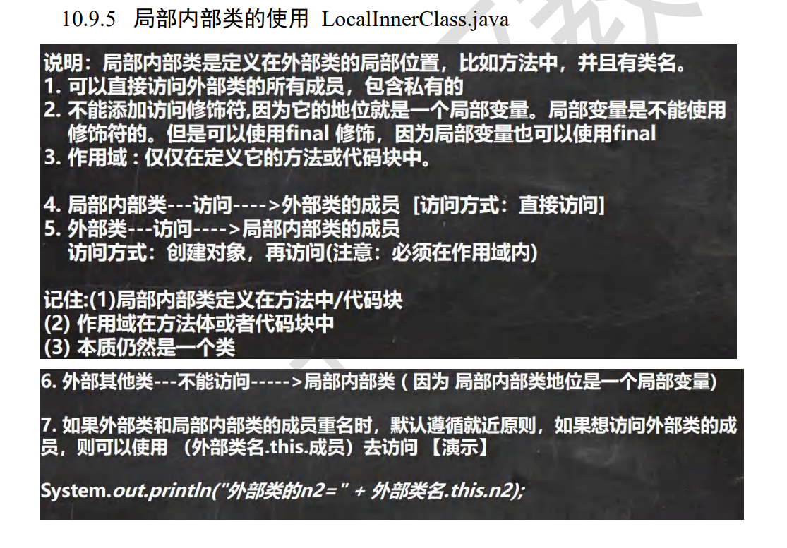
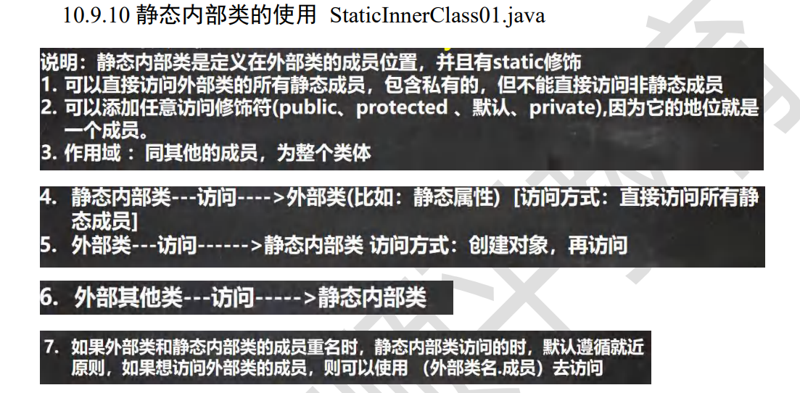

# 内部类：

1. 如果定义类在局部位置(方法中/代码块) :局部内部类 (2) 匿名内部类 

2. 定义在成员位置: 成员内部类 (2)  静态内部类


## 局部内部类：




## 匿名内部类：


```java
//5. tiger的编译类型 ? IA
//6. tiger的运行类型 ? 就是匿名内部类  Outer04$1
/*
    我们看底层 会分配 类名 Outer04$1
    class Outer04$1 implements IA {
        @Override
        public void cry() {
            System.out.println("老虎叫唤...");
        }
    }
 */

IA tiger = new IA() {
    @Override
    public void cry() {
        System.out.println("老虎叫唤...");
    }
};


interface IA {}//接口
class Tiger implements IA {}
```


## 成员内部类：


## 静态成员内部类：


