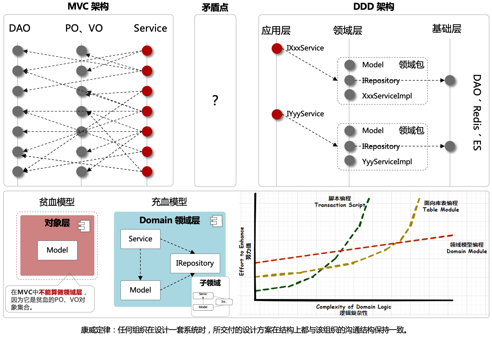
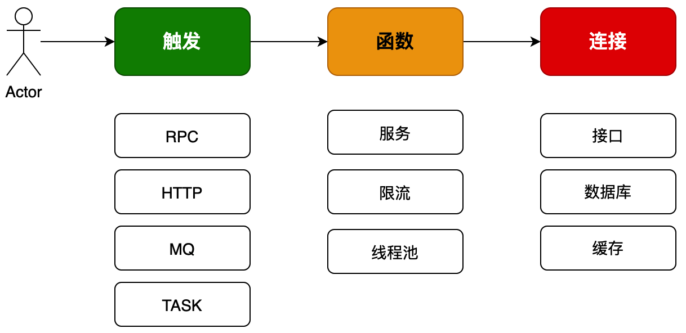
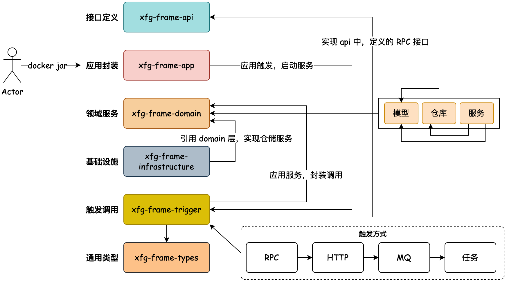
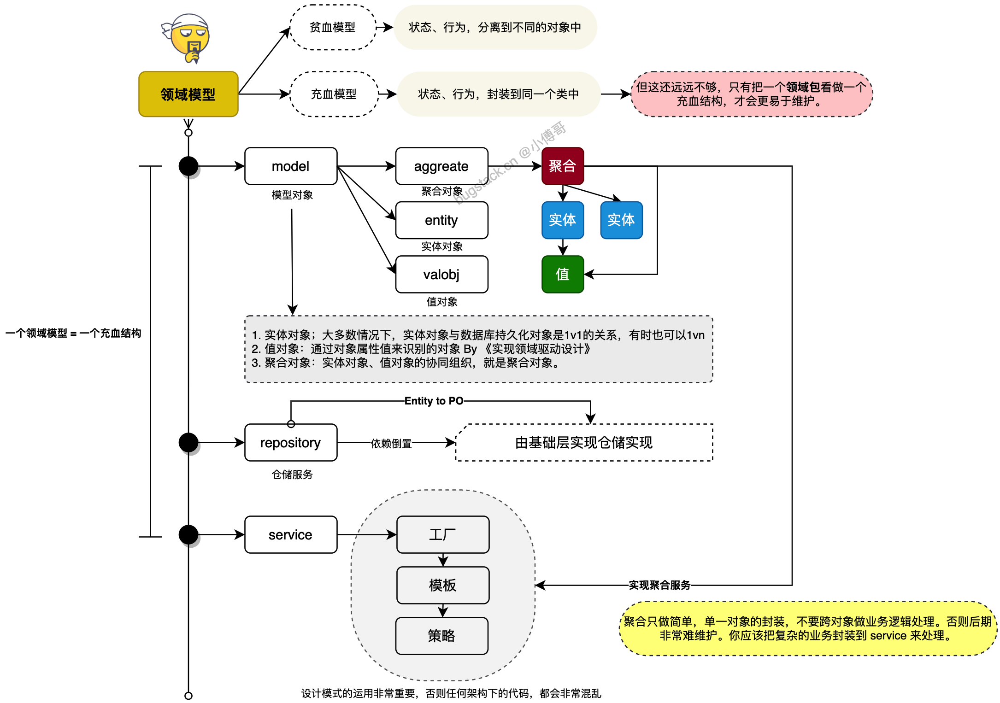
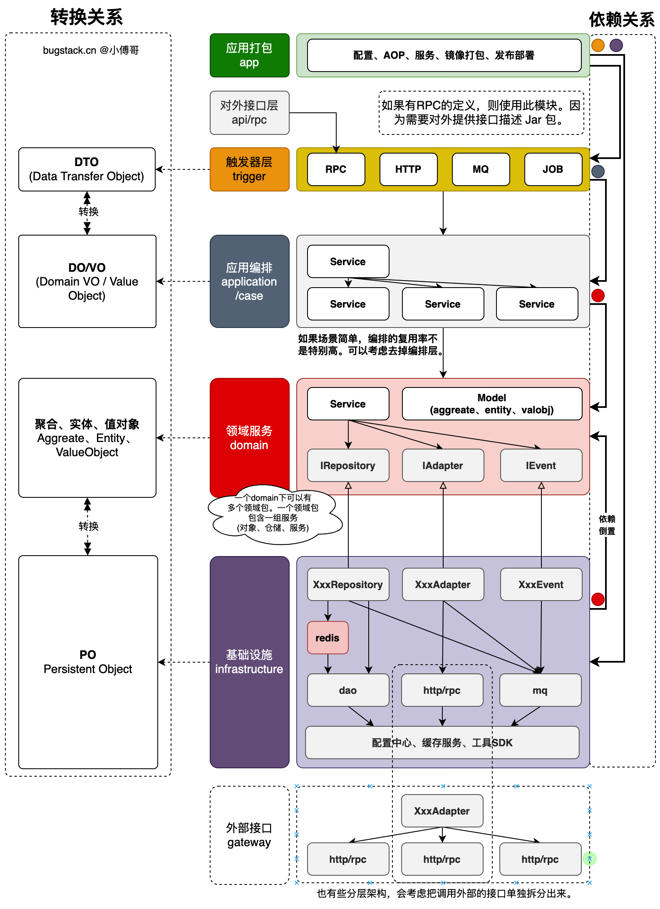
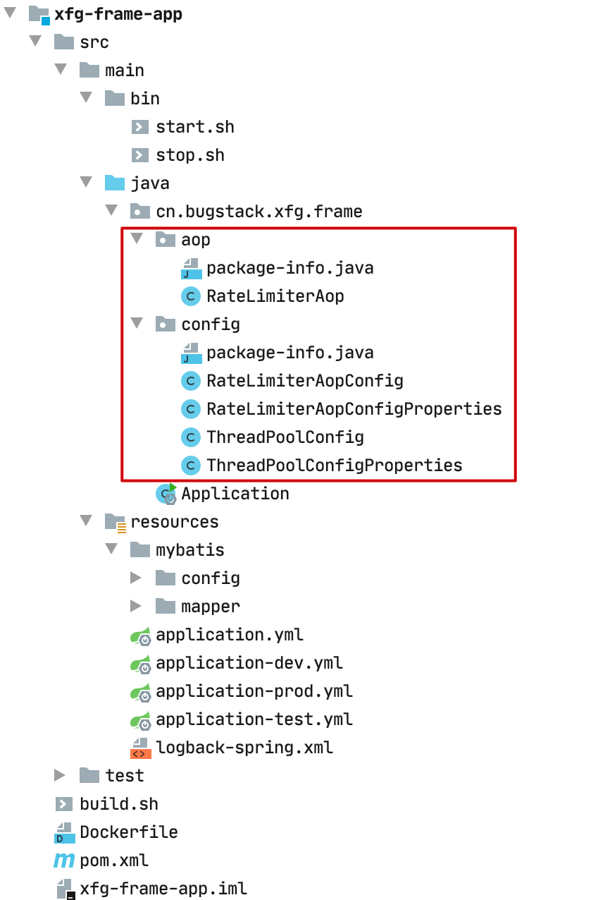

## 一、问题碰撞

`你用 MVC 写代码，遇到过最大的问题是什么？`🤔

简单、容易、好理解，是 MVC 架构的特点，但也正因为简单的分层逻辑，在适配较复杂的场景并且需要长周期的维护时，代码的迭代成本就会越来越高。如图；



- 如果你接触过较大型且已经长期维护项目的 MVC 架构，你就会发现这里的 DAO、PO、VO 对象，在 Service 层相互调用。那么长期开发后，就导致了各个 PO 里的属性字段数量都被撑的特别大。这样的开发方式，将`”状态”`、`“行为“`分离到不同的对象中，代码的意图渐渐模糊，膨胀、臃肿和不稳定的架构，让迭代成本增加。
- 而 DDD 架构首先以解决此类问题为主，将各个属于自己领域范围内的行为和逻辑封装到自己的领域包下处理。这也是 DDD 架构设计的精髓之一。它希望在分治层面合理切割问题空间为更小规模的若干子问题，而问题越小就容易被理解和处理，做到高内聚低耦合。这也是康威定律所提到的，解决复杂场景的设计主要分为：分治、抽象和知识。

## 二、简化理解

在给大家讲解 MVC 架构的时候，小傅哥提到了一个简单的开发模型。开发代码可以理解为：`“定义属性 -> 创建方法 -> 调用展示”`但这个模型结构过于简单，不太适合运用了各类分布式技术栈以及更多逻辑的 DDD 架构。所以在 DDD 这里，我们把开发代码可以抽象为：`“触发 -> 函数 -> 连接”` 如图；



- DDD 架构常用于微服务场景，因此也一个系统的调用方式就不只是 HTTP 还包括；`RPC 远程`、`MQ 消息`、`TASK 任务`，因此这些种方式都可以理解为触发。
- 通过触发调用函数方法，我们这里可以把各个服务都当成一个函数方法来看。而函数方法通过连接，调用到其他的接口、数据库、缓存来完成函数逻辑。

接下来，小傅哥在带着大家把这些所需的模块，拆分到对应的DDD系统架构中。

## 三、架构分层

如下是 DDD 架构的一种分层结构，也可以有其他种方式，核心的重点在于适合你所在场景的业务开发。以下的分层结构，是小傅哥在使用 DDD 架构多种的方式开发代码后，做了简化和处理的。右侧的连线是各个模块的依赖关系。接下来小傅哥就给大家做一下模块的介绍。



- **接口定义 - xfg-frame-api**：因为微服务中引用的 RPC 需要对外提供接口的描述信息，也就是调用方在使用的时候，需要引入 Jar 包，让调用方好能依赖接口的定义做代理。
- **应用封装 - xfg-frame-app**：这是应用启动和配置的一层，如一些 aop 切面或者 config 配置，以及打包镜像都是在这一层处理。你可以把它理解为专门为了启动服务而存在的。
- **领域封装 - xfg-frame-domain**：领域模型服务，是一个非常重要的模块。无论怎么做DDD的分层架构，domain 都是肯定存在的。在一层中会有一个个细分的领域服务，在每个服务包中会有【模型、仓库、服务】这样3部分。
- **仓储服务 - xfg-frame-infrastructure**：基础层依赖于 domain 领域层，因为在 domain 层定义了仓储接口需要在基础层实现。这是依赖倒置的一种设计方式。
- **领域封装 - xfg-frame-trigger**：触发器层，一般也被叫做 adapter 适配器层。用于提供接口实现、消息接收、任务执行等。所以对于这样的操作，小傅哥把它叫做触发器层。
- **类型定义 - xfg-frame-types**：通用类型定义层，在我们的系统开发中，会有很多类型的定义，包括；基本的 Response、Constants 和枚举。它会被其他的层进行引用使用。
- **领域编排【可选】 - xfg-frame-case**：领域编排层，一般对于较大且复杂的的项目，为了更好的防腐和提供通用的服务，一般会添加 case/application 层，用于对 domain 领域的逻辑进行封装组合处理。

## 四、领域分层

DDD 领域驱动设计的中心，主要在于领域模型的设计，以领域所需驱动功能实现和数据建模。一个领域服务下面会有多个领域模型，每个领域模型都是一个充血结构。**一个领域模型 = 一个充血结构**



- model 模型对象；
  - aggreate：聚合对象，实体对象、值对象的协同组织，就是聚合对象。
  - entity：实体对象，大多数情况下，实体对象(Entity)与数据库持久化对象(PO)是1v1的关系，但也有为了封装一些属性信息，会出现1vn的关系。
  - valobj：值对象，通过对象属性值来识别的对象 By 《实现领域驱动设计》
- repository 仓储服务；从数据库等数据源中获取数据，传递的对象可以是聚合对象、实体对象，返回的结果可以是；实体对象、值对象。因为仓储服务是由基础层(infrastructure) 引用领域层(domain)，是一种依赖倒置的结构，但它可以天然的隔离PO数据库持久化对象被引用。
- service 服务设计；这里要注意，不要以为定义了聚合对象，就把超越1个对象以外的逻辑，都封装到聚合中，这会让你的代码后期越来越难维护。聚合更应该注重的是和本对象相关的单一简单封装场景，而把一些重核心业务方到 service 里实现。**此外；如果你的设计模式应用不佳，那么无论是领域驱动设计、测试驱动设计还是换了三层和四层架构，你的工程质量依然会非常差。**
- 对象解释
  - DTO 数据传输对象 (data transfer object)，DAO与业务对象或数据访问对象的区别是：DTO的数据的变异子与访问子（mutator和accessor）、语法分析（parser）、序列化（serializer）时不会有任何存储、获取、序列化和反序列化的异常。即DTO是简单对象，不含任何业务逻辑，但可包含序列化和反序列化以用于传输数据。


## 五MVC与DDD区别



### 1. 领域服务层

我们可以当 domain 领域层为一个充血模型结构，在一个 domain 领域层中，可以有多个领域包。当然理想状态下，如果你的 DDD 拆分的特别干净的新工程，那么可能一个 domain 就一个领域。但大部分时候微服务的拆分鉴于成本考虑不会那么细，还有一些老工程的重构，都是一个工程内有多个领域，对应的解决方案是在一个工程下建多个同级分层包。比如：账户领域包、授信领域包、结算领域包等，每个包内聚合实现不同的功能。

每一个 domain 下的领域包内，都包括：model 模型、仓储、接口、事件和服务的处理。

model 模型对象

- aggreate：聚合对象，实体对象、值对象的协同组织，就是聚合对象。
- entity：实体对象，大多数情况下，实体对象(Entity)与数据库持久化对象(PO)是1v1的关系，但也有为了封装一些属性信息，会出现1vn的关系。
- valobj：值对象，通过对象属性值来识别的对象 By 《实现领域驱动设计》

repository 仓储服务：从数据库等数据源中获取数据，传递的对象可以是聚合对象、实体对象，返回的结果可以是：实体对象、值对象。因为仓储服务是由基础层(infrastructure) 引用领域层(domain)，是一种依赖倒置的结构，但它可以天然的隔离PO数据库持久化对象被引用。

adapter 接口服务：是依赖于外包的其他 HTTP/RPC 接口的封装调用，通过在 domain 领域层定义适配器接口，再由依赖于 domain 的基础层设施层或者一个单独的专门处理接口的额外分层，来实现 domain 定义的适配器接口，完成对依赖的 HTTP/RPC 进行封装处理。

event 事件消息：在服务实现中，经常会有业务完成后，对外发送消息的情况。这个时候，可以在领域模型中定义事件消息的接口，再由基础设施层完成消息的推送。

service 服务设计：这里要注意，不要以为定义了聚合对象，就把超越1个对象以外的逻辑，都封装到聚合中，这会让你的代码后期越来越难维护。聚合更应该注重的是和本对象相关的单一简单封装场景，而把一些重核心业务放到 service 里实现。**此外，如果你的设计模式应用不佳，那么无论是领域驱动设计、测试驱动设计还是换了三层和四层架构，你的工程质量依然会非常差。**

### 2. 基础设施层

`提供数据库持久化`、`提供Redis和配置中心数据支撑`、`提供事件消息推送`、`提供外部服务接口封装`。总之这一层的核心目的就是更好的辅助 domain 领域层完成领域功能的开发。

而调用方式则为依赖倒置，也就是`领域服务层`定义接口，`基础设施层`做功能实现。这样可以有效的避免基础设施层中的对象被对外暴露，如数据库持久化对象，在这样的分层结构中，天然的被保护在基础设施层中，外部是没法引入的，否则就循环依赖了。

有了这一层以后，domain 层不会关心数据的细节处理。传递给基础设施层的方法中，会把聚合对象或实体对象通过接口方法传递下来。之后在基础设施层中完成数据事务的操作。也会含有事务处理后，写入Redis缓存和发送MQ消息。如果说有跨领域的事务，一般可能就是跨库表，这个时候要使用 MQ 事件的方式进行驱动。

### 3. 类型对象层

这一层就比较简单了，只是一些通用的出入参对象 Response，还有枚举对象、异常对象等。供给于对外的接口层使用。但如果是 RPC 这样的接口，建议同 RPC 对外提供的接口描述包中提供，因为对外只提供1个轻量化的包且不依赖于任何其他包，是最好维护管理的。


## 六、架构源码

### 1. 环境

- JDK 1.8
- Maven 3.8.6
- SpringBoot 2.7.2
- MySQL 5.7 - 如果你使用 8.0 记得更改 pom.xml 中的 mysql 引用
- Dubbo - [https://cn.dubbo.apache.org/zh-cn/overview/mannual/java-sdk/reference-manual/registry/multicast/ (opens new window)](https://cn.dubbo.apache.org/zh-cn/overview/mannual/java-sdk/reference-manual/registry/multicast/)文档&广播模式地址说明

### 2. 架构

- **源码**：[`https://gitcode.net/KnowledgePlanet/road-map/xfg-frame-ddd`(opens new window)](https://gitcode.net/KnowledgePlanet/road-map/xfg-frame-ddd)
- **树形**：`安装 brew install tree` `IntelliJ IDEA Terminal 使用 tree`

```java
.
├── README.md
├── docs
│   ├── dev-ops
│   │   ├── environment
│   │   │   └── environment-docker-compose.yml
│   │   ├── siege.sh
│   │   └── skywalking
│   │       └── skywalking-docker-compose.yml
│   ├── doc.md
│   ├── sql
│   │   └── road-map.sql
│   └── xfg-frame-ddd.drawio
├── pom.xml
├── xfg-frame-api
│   ├── pom.xml
│   ├── src
│   │   └── main
│   │       └── java
│   │           └── cn
│   │               └── bugstack
│   │                   └── xfg
│   │                       └── frame
│   │                           └── api
│   │                               ├── IAccountService.java
│   │                               ├── IRuleService.java
│   │                               ├── model
│   │                               │   ├── request
│   │                               │   │   └── DecisionMatterRequest.java
│   │                               │   └── response
│   │                               │       └── DecisionMatterResponse.java
│   │                               └── package-info.java
│   └── xfg-frame-api.iml
├── xfg-frame-app
│   ├── Dockerfile
│   ├── build.sh
│   ├── pom.xml
│   ├── src
│   │   ├── main
│   │   │   ├── bin
│   │   │   │   ├── start.sh
│   │   │   │   └── stop.sh
│   │   │   ├── java
│   │   │   │   └── cn
│   │   │   │       └── bugstack
│   │   │   │           └── xfg
│   │   │   │               └── frame
│   │   │   │                   ├── Application.java
│   │   │   │                   ├── aop
│   │   │   │                   │   ├── RateLimiterAop.java
│   │   │   │                   │   └── package-info.java
│   │   │   │                   └── config
│   │   │   │                       ├── RateLimiterAopConfig.java
│   │   │   │                       ├── RateLimiterAopConfigProperties.java
│   │   │   │                       ├── ThreadPoolConfig.java
│   │   │   │                       ├── ThreadPoolConfigProperties.java
│   │   │   │                       └── package-info.java
│   │   │   └── resources
│   │   │       ├── application-dev.yml
│   │   │       ├── application-prod.yml
│   │   │       ├── application-test.yml
│   │   │       ├── application.yml
│   │   │       ├── logback-spring.xml
│   │   │       └── mybatis
│   │   │           ├── config
│   │   │           │   └── mybatis-config.xml
│   │   │           └── mapper
│   │   │               ├── RuleTreeNodeLine_Mapper.xml
│   │   │               ├── RuleTreeNode_Mapper.xml
│   │   │               └── RuleTree_Mapper.xml
│   │   └── test
│   │       └── java
│   │           └── cn
│   │               └── bugstack
│   │                   └── xfg
│   │                       └── frame
│   │                           └── test
│   │                               └── ApiTest.java
│   └── xfg-frame-app.iml
├── xfg-frame-ddd.iml
├── xfg-frame-domain
│   ├── pom.xml
│   ├── src
│   │   └── main
│   │       └── java
│   │           └── cn
│   │               └── bugstack
│   │                   └── xfg
│   │                       └── frame
│   │                           └── domain
│   │                               ├── order
│   │                               │   ├── model
│   │                               │   │   ├── aggregates
│   │                               │   │   │   └── OrderAggregate.java
│   │                               │   │   ├── entity
│   │                               │   │   │   ├── OrderItemEntity.java
│   │                               │   │   │   └── ProductEntity.java
│   │                               │   │   ├── package-info.java
│   │                               │   │   └── valobj
│   │                               │   │       ├── OrderIdVO.java
│   │                               │   │       ├── ProductDescriptionVO.java
│   │                               │   │       └── ProductNameVO.java
│   │                               │   ├── repository
│   │                               │   │   ├── IOrderRepository.java
│   │                               │   │   └── package-info.java
│   │                               │   └── service
│   │                               │       ├── OrderService.java
│   │                               │       └── package-info.java
│   │                               ├── rule
│   │                               │   ├── model
│   │                               │   │   ├── aggregates
│   │                               │   │   │   └── TreeRuleAggregate.java
│   │                               │   │   ├── entity
│   │                               │   │   │   ├── DecisionMatterEntity.java
│   │                               │   │   │   └── EngineResultEntity.java
│   │                               │   │   ├── package-info.java
│   │                               │   │   └── valobj
│   │                               │   │       ├── TreeNodeLineVO.java
│   │                               │   │       ├── TreeNodeVO.java
│   │                               │   │       └── TreeRootVO.java
│   │                               │   ├── repository
│   │                               │   │   ├── IRuleRepository.java
│   │                               │   │   └── package-info.java
│   │                               │   └── service
│   │                               │       ├── engine
│   │                               │       │   ├── EngineBase.java
│   │                               │       │   ├── EngineConfig.java
│   │                               │       │   ├── EngineFilter.java
│   │                               │       │   └── impl
│   │                               │       │       └── RuleEngineHandle.java
│   │                               │       ├── logic
│   │                               │       │   ├── BaseLogic.java
│   │                               │       │   ├── LogicFilter.java
│   │                               │       │   └── impl
│   │                               │       │       ├── UserAgeFilter.java
│   │                               │       │       └── UserGenderFilter.java
│   │                               │       └── package-info.java
│   │                               └── user
│   │                                   ├── model
│   │                                   │   └── valobj
│   │                                   │       └── UserVO.java
│   │                                   ├── repository
│   │                                   │   └── IUserRepository.java
│   │                                   └── service
│   │                                       ├── UserService.java
│   │                                       └── impl
│   │                                           └── UserServiceImpl.java
│   └── xfg-frame-domain.iml
├── xfg-frame-infrastructure
│   ├── pom.xml
│   ├── src
│   │   └── main
│   │       └── java
│   │           └── cn
│   │               └── bugstack
│   │                   └── xfg
│   │                       └── frame
│   │                           └── infrastructure
│   │                               ├── dao
│   │                               │   ├── IUserDao.java
│   │                               │   ├── RuleTreeDao.java
│   │                               │   ├── RuleTreeNodeDao.java
│   │                               │   └── RuleTreeNodeLineDao.java
│   │                               ├── package-info.java
│   │                               ├── po
│   │                               │   ├── RuleTreeNodeLinePO.java
│   │                               │   ├── RuleTreeNodePO.java
│   │                               │   ├── RuleTreePO.java
│   │                               │   └── UserPO.java
│   │                               └── repository
│   │                                   ├── RuleRepository.java
│   │                                   └── UserRepository.java
│   └── xfg-frame-infrastructure.iml
├── xfg-frame-trigger
│   ├── pom.xml
│   ├── src
│   │   └── main
│   │       └── java
│   │           └── cn
│   │               └── bugstack
│   │                   └── xfg
│   │                       └── frame
│   │                           └── trigger
│   │                               ├── http
│   │                               │   ├── Controller.java
│   │                               │   └── package-info.java
│   │                               ├── mq
│   │                               │   └── package-info.java
│   │                               ├── rpc
│   │                               │   ├── AccountService.java
│   │                               │   ├── RuleService.java
│   │                               │   └── package-info.java
│   │                               └── task
│   │                                   └── package-info.java
│   └── xfg-frame-trigger.iml
└── xfg-frame-types
    ├── pom.xml
    ├── src
    │   └── main
    │       └── java
    │           └── cn
    │               └── bugstack
    │                   └── xfg
    │                       └── frame
    │                           └── types
    │                               ├── Constants.java
    │                               ├── Response.java
    │                               └── package-info.java
    └── xfg-frame-types.iml
 
       
    
```

以上是整个🏭工程架构的 tree 树形图。整个工程由 xfg-frame-app 模的 SpringBoot 驱动。这里小傅哥在 domain 领域模型下提供了 order、rule、user 三个领域模块。并在每个模块下提供了对应的测试内容。这块是整个模型的重点，其他模块都可以通过测试看到这里的调用过程。

### 3. 领域

一个领域模型中包含3个部分；model、repository、service 三部分；

- model 对象的定义 【含有；valobj = VO、entity、Aggregate】
- repository 仓储的定义【含有PO】
- service 服务实现

以上3个模块，一般也是大家在使用 DDD 时候最不容易理解的分层。比如 model 里还分为；valobj - 值对象、entity 实体对象、aggregates 聚合对象；

- **值对象**：表示没有唯一标识的业务实体，例如商品的名称、描述、价格等。
- **实体对象**：表示具有唯一标识的业务实体，例如订单、商品、用户等；
- **聚合对象**：是一组相关的实体对象的根，用于保证实体对象之间的一致性和完整性；

关于model中各个对象的拆分，尤其是聚合的定义，会牵引着整个模型的设计。当然你可以在初期使用 DDD 的时候不用过分在意领域模型的设计，可以把整个 domain 下的一个个包当做充血模型结构，这样编写出来的代码也是非常适合维护的。

### 4. 环境(开发/测试/上线)

**源码**：`xfg-frame-ddd/pom.xml`

```text
<profile>
    <id>dev</id>
    <activation>
        <activeByDefault>true</activeByDefault>
    </activation>
    <properties>
        <profileActive>dev</profileActive>
    </properties>
</profile>
<profile>
    <id>test</id>
    <properties>
        <profileActive>test</profileActive>
    </properties>
</profile>
<profile>
    <id>prod</id>
    <properties>
        <profileActive>prod</profileActive>
    </properties>
</profile>
 
       
    
```

- 定义环境；开发、测试、上线。

**源码**：`xfg-frame-app/application.yml`

```java
spring:
  config:
    name: xfg-frame
  profiles:
    active: dev # dev、test、prod
 
       
    
```

- 除了 pom 的配置，还需要在 application.yml 中指定环境。这样就可以对应的加载到；`application-dev.yml`、`application-prod.yml`、`application-test.yml` 这样就可以很方便的加载对应的配置信息了。尤其是各个场景中切换会更加方便。

### 5. 切面

一个工程开发中，有时候可能会有很多的统一切面和启动配置的处理，这些内容都可以在 xfg-frame-app 完成。



**源码**：`cn.bugstack.xfg.frame.aop.RateLimiterAop`

```java
@Slf4j
@Aspect
public class RateLimiterAop {

    private final long timeout;
    private final double permitsPerSecond;
    private final RateLimiter limiter;

    public RateLimiterAop(double permitsPerSecond, long timeout) {
        this.permitsPerSecond = permitsPerSecond;
        this.timeout = timeout;
        this.limiter = RateLimiter.create(permitsPerSecond);
    }

    @Pointcut("execution(* cn.bugstack.xfg.frame.trigger..*.*(..))")
    public void pointCut() {
    }

    @Around(value = "pointCut()", argNames = "jp")
    public Object around(ProceedingJoinPoint jp) throws Throwable {
        boolean tryAcquire = limiter.tryAcquire(timeout, TimeUnit.MILLISECONDS);
        if (!tryAcquire) {
            Method method = getMethod(jp);
            log.warn("方法 {}.{} 请求已被限流，超过限流配置[{}/秒]", method.getDeclaringClass().getCanonicalName(), method.getName(), permitsPerSecond);
            return Response.<Object>builder()
                    .code(Constants.ResponseCode.RATE_LIMITER.getCode())
                    .info(Constants.ResponseCode.RATE_LIMITER.getInfo())
                    .build();
        }
        return jp.proceed();
    }

    private Method getMethod(JoinPoint jp) throws NoSuchMethodException {
        Signature sig = jp.getSignature();
        MethodSignature methodSignature = (MethodSignature) sig;
        return jp.getTarget().getClass().getMethod(methodSignature.getName(), methodSignature.getParameterTypes());
    }

}
 
       
    
```

**使用**

```java
# 限流配置
rate-limiter:
  permits-per-second: 1
  timeout: 5
 
       
    
```

- 这样你所有的通用配置，又和业务没有太大的关系的，就可以直接写到这里了。—— 具体可以参考代码。


# 面试 和MVC区别


## 🧠 一、根本思想的不同：流程驱动 vs 领域驱动

如果说 MVC 更像是“**控制流程为主**”的架构，那么 DDD 更强调“**围绕业务构建模型**”。

| 维度     | MVC           | DDD             |
| ------ | ------------- | --------------- |
| 核心驱动   | 控制流程、分离职责     | 领域建模、业务驱动       |
| 面向     | 表层用户请求 → 数据响应 | 真实业务建模 → 语义驱动演进 |
| 最关心的问题 | 怎么把数据从 A 传到 B | 业务规则怎么组织才能稳定演进  |
| 模型理解   | DTO（数据结构）     | 领域对象（封装数据 + 行为） |


> **MVC 的“模型”是数据库的反射**；  
> **DDD 的“模型”是业务语义的具象。**

## 🧱 二、模型结构的核心分歧 —— “贫血” vs “充血”


```go
type User struct {
  ID   int
  Name string
  Age  int
}

func (u *User) CanRegisterActivity(activity Activity) bool {
  return u.Age >= activity.RequiredAge
}
```

- **`User` 封装了行为（业务规则）**， 而MVC却不是
- 领域模型不再是数据库表，而是 **业务语义载体**


1. **职责划分的维度不同：技术分层 vs 领域分层**

|项目|MVC|DDD|
|---|---|---|
|分层方式|通常分为 controller / service / model / dao|分为 application / domain / infrastructure|
|划分依据|技术角色（UI 控制、数据操作）|业务语义与职责边界|
**解释**：MVC 是按“做什么”来分，DDD 是按“属于谁”来分，DDD 会将业务核心逻辑放在 `domain` 层中，controller 只是入口。

---

## 🧩 三、具体例子：订单业务对比

### 🔸 MVC 写法

```go
func PayOrder(orderID string) error {
  order := db.Find(orderID)
  if order.Status != "Pending" {
    return errors.New("cannot pay")
  }
  order.Status = "Paid"
  db.Save(order)
}
```

- 状态判断在 service 中散落
- 逻辑不集中，业务行为不能复用
- 多个 service 操作订单，容易出错

---

### 🔹 DDD 写法

```go
type Order struct {
  ID     string
  Status string
}

func (o *Order) Pay() error {
  if o.Status != "Pending" {
    return errors.New("invalid state")
  }
  o.Status = "Paid"
  return nil
}

func PayOrder(orderID string) error {
  order := repo.Get(orderID)
  err := order.Pay()
  if err != nil {
    return err
  }
  return repo.Save(order)
}
```

- 行为内聚在模型，代码具有“语义性”
- 更符合人类对业务的认知
- 更容易做单元测试 & 演进

---

## 🧠 六、一句话总结（高级版）

> **DDD 是通过构建“充血模型”+“聚合边界”+“限界上下文”，将系统从“流程驱动”过渡到“语义驱动”，让代码表达业务、服务对齐组织结构，成为复杂系统的长期演进利器。**

---

## ✅ 补充建议（面试高阶提问应对）

- **Q:** 为什么 MVC 在复杂系统里会失控？  
    **A:** 因为它无法控制业务逻辑的聚合边界，模型只是数据结构，Controller/Service 会爆炸式膨胀，难以管理。
- **Q:** DDD 是不是很重？  
    **A:** 是的，DDD 更适合业务逻辑复杂、长期演进的系统。小项目或简单 CRUD 系统，MVC 足够高效。

---


### 区别
| 对比维度              | MVC（传统）                       | DDD（领域驱动设计）                      | 说明与简要解释            |
| ----------------- | ----------------------------- | -------------------------------- | ------------------ |
| **1. 模型结构**       | 贫血模型，只包含数据字段                  | 充血模型，数据+行为                       | 领域对象包含业务规则，不只是数据结构 |
| **2. 关注点**        | 数据流、控制流程                      | 业务规则、领域语义建模                      | 一个是过程导向，一个是语义导向    |
| **3. 控制层职责**      | 控制器处理业务逻辑，容易臃肿                | 控制器只协调流程，业务封装在模型或服务中             | DDD 更清晰的职责划分       |
| **4. 服务层设计**      | Service 承担绝大多数逻辑，常成为“上帝类”     | 应用服务协调领域模型，领域服务只管核心业务逻辑          | 避免胖 service，强化边界   |
| **5. 模块组织结构**     | 多为技术分层（controller/model/repo） | 多为领域分层（domain/application/infra） | 更贴近业务划分，更利于演进      |
| **6. 业务复杂度应对能力**  | 差，逻辑分散、难以维护                   | 强，逻辑集中、清晰、可扩展                    | DDD 针对复杂系统设计       |
| **7. 语义表达能力**     | 差，如 if status == 1 表示“已支付”    | 强，如 order.Pay() 一目了然             | 可读性/可维护性高          |
| **8. 测试友好性**      | 低：需要模拟 Controller + Service   | 高：可以直接对聚合根方法做单元测试                | 单测粒度更小             |
| **9. 数据与逻辑关系**    | 数据主导，逻辑附属                     | 行为主导，数据服务于语义                     | 模型设计思路不同           |
| **10. 拓展性 & 演进性** | 易崩塌、容易重复                      | 可拆分限界上下文、可演进                     | 微服务、事件驱动友好         |