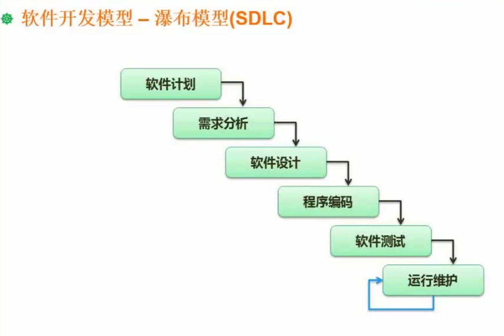

## 瀑布开发

美国国防部使用瀑布模型。

缺陷：

太强调文档化，标准化。

## 敏捷开发：

### 介绍

**特点**：以用户需求进化为核心，采用迭代或循序渐进的方式进行软件开发。敏捷强调的是适应性而非预见性，当项目需求发生了改变，团队能迅速响应，产品能快速交付。

在实际项目开发中，软件项目在初期可能被切分成多个子项目，各个子项目成果 都必须进行测试，具备可视化，可集成，可发布的特征。把一个大项目拆成多个互相联系但是也可以独立运行的小项目，并且分别完成。在这个过程中，主体软件要处于随时可发布可交付给用户的这样一个状态。

### 角色：

部长：部门领导

项目经理：项目层级

团队方面：

科长（Team Leader）

**产品或业务负责人PO（Product Owner）**：一般来说产品经理或者项目经理，确定产品的一个方向和愿景，定义产品发布时的内容，还有一些交付的任务优先级和交付时间。

**敏捷专家SM（Scrum Master）**：一般就是敏捷团队的开发负责人即Team Leader，既熟悉敏捷开发模式，又熟悉敏捷流程的实施流程。

**开发人员DEV**

**测试人员QA**

### 会议

1. **敏捷计划会：**

   一般是一个迭代开一次，任务明确，需求划分（分析），故事点[^1]切割（划分）。会确定每个迭代[^2]或者说每个冲刺（Sprint）[^3]。

2. **每日立会：**

   一般会有一个任务展板，谈论从昨天立会到现在完成了什么。从现在到明天的立会，我计划完成什么，有什么阻碍了我的进展，风险和困难抛出来。

3. **敏捷评审会：**

   一般一个月的月初开一次，向客户和其他利益干系的人来展示我们团队在本次迭代或者本次冲刺中完成的工作并获取客户的反馈。

4. **敏捷回顾会：**

   一般一个月的月末开一次，每个迭代结束时进行，总结工作中的经验和教训，一般都是半个小时和60分钟了，整个团队都需要参加。

   第一步：定量分析：confluence vicky文档工具。包含团队这个迭代完成了是否完成的目标，收集并评审迭代的一些度量指标包括：选代速率、迭代燃起燃尽图送代计划故事和实际完成故事、计划发布日期与实际发布日期客户满意度、团队满意度、生产环境Bug数生产Bug解决时间、用户故事。

   第二步：定性分析：描述团队那些做的好，那些做的不好的，那些保持的。

[^1]:一般是一个小的任务点，一到两天就能执行完成的。
[^2]:指的是软件开发过程中的一个周期或阶段。每个迭代都是一个完整的开发周期，从需求分析、设计、开发、测试到发布。迭代的长度可以根据项目需求而定，一般为1到4周。
[^3]:指的是一个固定长度的时间周期，通常为1到4周，团队在这个周期内完成预定的工作（通常是一组用户故事或任务）。每个冲刺结束时，团队应交付一个可工作的、可发布的产品增量。

实际案例

1、概念，可以参考敏捷宣言，强调适应变化，四句指导

个体和互动 高于 流程和工具（动员每个人积极交流，相互之间可以 batTLe，头脑风暴）；
工作的软件 高于 详尽的文档（好的代码是不需要注释和文档的，顶多有一些规范指南一类的在线协作文档）；
客户合作 高于 合同谈判（真心实意为客户创造价值，而不止于眼前的功能交付，这个很难，由此还专门有一个角色去 control 这件事）；
响应变化 高于 遵循计划（计划是赶不上变化的，随时改需求随时变动迭代计划，有迭代的概念）；

基于于右边，而更注重左边的价值，并不是说完全抛弃传统的瀑布式开发。

2、人员架构

因为公司没有所谓的各种领导，这里就说下交付组里，我所见的一些角色，也是每天在一起工作的小伙伴：

PM：项目管理者，这里不是项目经理，负责和客户签合同，各种会议的组织者，没有项目经理那种权利
BA：业务分析师，专门和客户谈需求，超强的交流和控制客户的能力，几乎每天都和客户泡在一起开会过需求，疯狂开会，驱动客户（我们组的BA是御姐型的，气场极强）
QA：测试人员
DEV：开发人员，其中有掌握技术话语权的 TL

PO：比较特殊，是客户某的部门领导人，一般和 PM 单独沟通，几乎没出现过，网友一样的存在

一个团队一般 1 PM、1 BA、1 QA 、6 DEV (三前三后，至少两个TL)

这里没有 MS，所以每个人都是 SM，233333

3、会议

IPM：迭代会议，每个迭代开始之前开一次，主要是排下个迭代的故事卡，并给每张卡估点，我遇到的是两周一个迭代（一般会有卡墙，有物理的，也有线上的）
Showcase：开发成果展示，每个迭代结束开一次，一般是BA或QA给客户演示上个迭代做的功能，当然也是优化和新改动提得最多的时候
Retro：回顾会议，每个迭代结束开一次，讨论上个迭代团队做得好和做得不好的事（不是针对和人，不含人身攻击），并给出改进方案，在下个迭代中执行
Stand Up：每天早上的站会，大家站成一圈，一般由 PM 主持，轮流阐述自己的昨天工作内容和工作进度，和今天要完成的工作，以及遇到的一些问题，及时反馈出来（我们组有个小龙猫的毛绒玩具，大家挨个传递，挨个阐述）

每天还有 Code Review，动态安排时间，我们团队一直坚持，刚开始是前后端一起过昨天每个人写的代码，后面时间太长，就前后端分开。大家一起来找茬，你的命名和代码逻辑划分，代码风格，都有个能会被挑刺。在相互找茬的过程中，坚持下去，对个人的成长有很大很大的帮助。

4、写代码

DEV 要做开发，就要先领故事卡，俗称开卡，自己选好一张故事卡，拉上BA和QA去过其中的细节，理清细节，然后才能上手开发，开发完后再拉上BA和QA去结卡，检查卡中的功能是不是都完成了，有问题就被打回去改，直到BA和QA觉得完善了，才能关卡。。。

代码质量要求很严格，遵循 TDD，前端有 lint，有单元测试（不能偷懒，而且有覆盖率要求），有 e2e 测试（必须写，和QA一起看），当你的代码走过这三个流程，提交到公共仓库，CI 自动构建会拉你的代码，再走一遍测试（挂了就要修代码），然后自动发布新版本到 Dev 环境。

你以为这就完了？还有代码嗅探器，时刻在扫描代码仓库，有两个重复的函数不行、重复率太高不行、使用了骚代码去做类型转换之类的不行、空间内有命名重叠不行。。。。这一套下来，再加上 code review，菜鸟开发每天一半的时间都在改昨天的代码。
