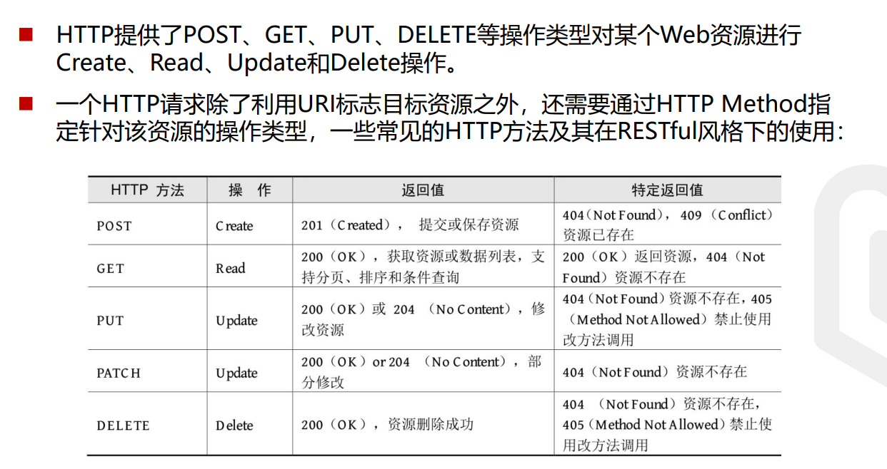
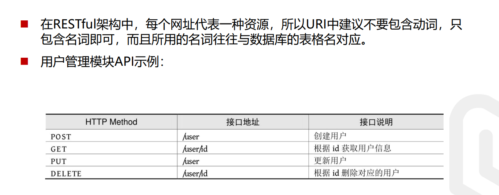
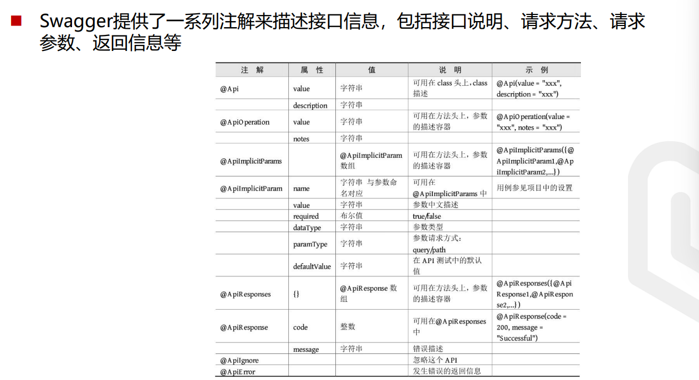

[TOC]


## RESful介绍

- RESTful是目前流行的互联网软件服务架构**设计风格**。
- REST并不是一个标准，它更像一组客户端和服务端交互时的架构理念和设计原 则，基于这种架构理念和设计原则的Web API更加简洁，更有

## RESful的特点

- 每一个URI代表一种资源 
- 客户端使用GET、POST、PUT、DELETE四种表示操作方式的动词对服务端资 源进行操作：GET用于获取资源，POST用于新建资源（也可以用于更新资源）， PUT用于更新资源，DELETE用于删除资源。
- 通过操作资源的表现形式来实现服务端请求操作。 
- 资源的表现形式是JSON或者HTML。 
- 客户端与服务端之间的交互在请求之间是无状态的，从客户端到服务端的每个请求都包含必需的信息。

## RESfulAPI

- 符合RESTful规范的Web API需要具备如下两个关键特性：
  - 安全性：安全的方法被期望不会产生任何副作用，当我们使用GET操作获取资源时，不会引起资源本身的改变，也不会引起服务器状态的改变。 
  - 幂等性：幂等的方法保证了重复进行一个请求和一次请求的效果相同（并不是 指响应总是相同的，而是指服务器上资源的状态从第一次请求后就不再改变 了），在数学上幂等性是指N次变换和一次变换相同

## HTTP Method




## HTTP状态码

- HTTP状态码就是服务向用户返回的状态码和提示信息，客户端的每一次请求， 服务都必须给出回应，回应包括HTTP状态码和数据两部分。
- HTTP定义了40个标准状态码，可用于传达客户端请求的结果。状态码分为以下 5个类别： 
  - 1xx：信息，通信传输协议级信息 
  - 2xx：成功，表示客户端的请求已成功接受 
  - 3xx：重定向，表示客户端必须执行一些其他操作才能完成其请求 
  - 4xx：客户端错误，此类错误状态码指向客户端 
  - 5xx：服务器错误，服务器负责这写错误状态码


## Spring Boot实现RESTful API

- Spring Boot提供的spring-boot-starter-web组件完全支持开发RESTful API， 提供了与REST操作方式（GET、POST、PUT、DELETE）对应的注解。 
- @GetMapping：处理GET请求，获取资源。 
- @PostMapping：处理POST请求，新增资源。 
- @PutMapping：处理PUT请求，更新资源。 
- @DeleteMapping：处理DELETE请求，删除资源。 
- @PatchMapping：处理PATCH请求，用于部分更新资源。


## Spring Boot实现RESTful API



## Swagger含义

- Swagger是一个规范和完整的框架，用于生成、描述、调用和可视化RESTful风 格的Web服务，是非常流行的API表达工具。
- Swagger能够自动生成完善的RESTful API文档，，同时并根据后台代码的修改 同步更新，同时提供完整的测试页面来调试API。

> 用自己的话来说, 就是一个手册, 前端可以看这个手册来使用后端的接口, 这个是实时更新的而已

- 依赖

  ```
  <!--        SwaggerApi文档依赖-->
          <dependency>
              <groupId>io.springfox</groupId>
              <artifactId>springfox-swagger2</artifactId>
              <version>2.9.2</version>
          </dependency>
          <dependency>
              <groupId>io.springfox</groupId>
              <artifactId>springfox-swagger-ui</artifactId>
              <version>2.9.2</version>
          </dependency>
  ```
  
  > Spring Boot 2.6.X后与Swagger有版本冲突问题，需要在 application.properties中加入以下配置：
  >
  > spring.mvc.pathmatch.matching-strategy=ant_path_matcher
  
  
  
- 配置Swagger2

  ```
  @Configuration // 告诉Spring容器， 这个类是个配置类
  @EnableSwagger2 // 启用Swagger2功能
  public class SwaggerConfig {
      public Docket createRestApi() {
          return new Docket(DocumentationType.SWAGGER_2)
                  .apiInfo(apiInfo())
                  .select()
                  // com包下的所有API都交给Swagger2管理
                  .apis(RequestHandlerSelectors.basePackage("com"))
                  .paths(PathSelectors.any()).build();
      }
  
      // API文档页面显示信息
      private ApiInfo apiInfo() {
          return new ApiInfoBuilder()
                  .title("演示项目API") // 标题
                  .description("演示项目") // 描述
                  .version("1.0") //版本
                  .build();
      }
  }
  
  ```
  
## 使用Swagger2进行接口测试

- 启动项目访问http://127.0.0.1:8080/swagger-ui.html ，127是本机可以直接用 http://localhost:8080/swagger-ui.html 即可打开自动生成的 可视化测试页面

## Swagger常用注解


