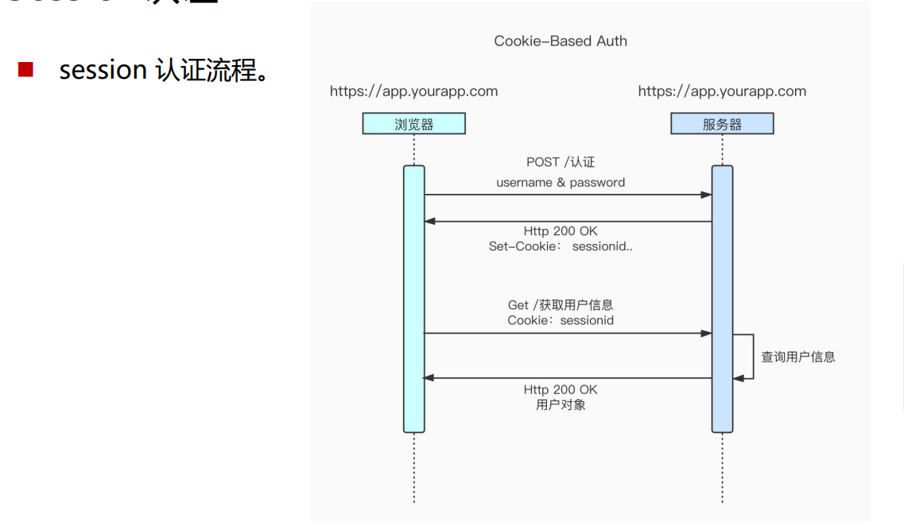
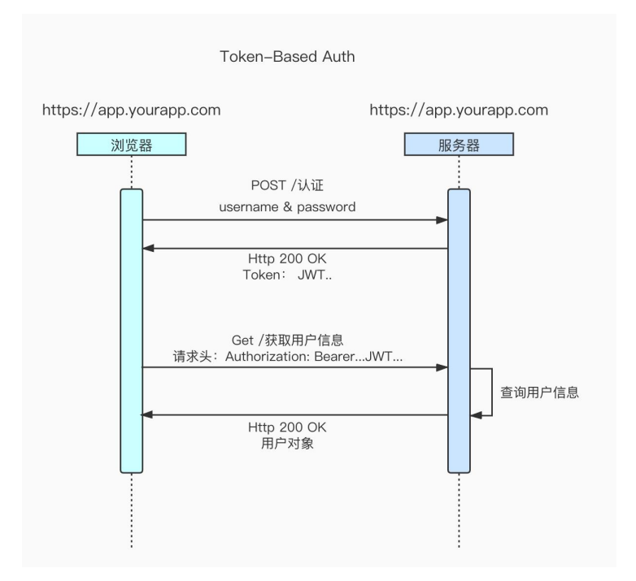

[TOC]


## Session认证

### 互联网服务离不开用户认证。一般流程如下： 

- 用户向服务器发送用户名和密码。
- 服务器验证通过后，在当前对话（session）里面保存相关数据，比如用户角色、 登录时间等。
- 服务器向用户返回一个 session_id，写入用户的 Cookie。
- 用户随后的每一次请求，都会通过 Cookie，将 session_id 传回服务器。
- 服务器收到 session_id，找到前期保存的数据，由此得知用户的身份。




### 问题

>  session 认证的方式应用非常普遍，但也存在一些问题，扩展性不好，如果是服务 器集群，或者是跨域的服务导向架构，就要求 session 数据共享，每台服务器都能 够读取 session，针对此种问题一般有两种方案：

- 一种解决方案是session 数据持久化，写入数据库或别的持久层。各种服务收 到请求后，都向持久层请求数据。这种方案的优点是架构清晰，缺点是工程量 比较大。
- 一种方案是服务器不再保存 session 数据，所有数据都保存在客户端，每次请 求都发回服务器。Token认证就是这种方案的一个代表。


## Token认证 

### 概念：

Token 是在服务端产生的一串字符串,是客户端访问资源接口（API）时所需要的资 源凭证，流程如下： 

- 客户端使用用户名跟密码请求登录，服务端收到请求，去验证用户名与密码 
- 验证成功后，服务端会签发一个 token 并把这个 token 发送给客户端 
- 客户端收到 token 以后，会把它存储起来，比如放在 cookie 里或者 localStorage 里
- 客户端每次向服务端请求资源的时候需要带着服务端签发的 token
- 服务端收到请求，然后去验证客户端请求里面带着的 token ，如果验证成功， 就向客户端返回请求的数据





### 特点：

- 基于 token 的用户认证是一种服务端无状态的认证方式，服务端不用存放 token 数据。
- 用解析 token 的计算时间换取 session 的存储空间，从而减轻服务器的压力， 减少频繁的查询数据库
- token 完全由应用管理，所以它可以避开同源策略


## JWT的使用

>  JSON Web Token（简称 JWT）是一个token的具体实现方式，是目前最流行 的跨域认证解决方案。 

### JWT 的原理是

- 服务器认证以后，生成一个 JSON 对象，发回给用户，具体如 下：

``` 
{
  "姓名": "张三",
  "角色": "管理员",
  "到期时间": "2018年7月"
}
```


- 用户与服务端通信的时候，都要发回这个 JSON 对象。服务器完全只靠这个对 象认定用户身份。 
- 为了防止用户篡改数据，服务器在生成这个对象的时候，会加上签名。

### JWT 的由三个部分组成 :

>  三部分最终组合为完整的字符串，中间使用 . 分隔，如下： n Header.Payload.Signature
>
> ```
> eyJhbGci0iJIUzI1NiIsInR5cCI6IkpXVCJ9.
> eyJzdWIiOiIxMjMONTY30DkwIiwibmFtZSI6IkpvaG4
> gRG9lIiwiaXNTb2NpYWwionRydWv9.
> 4pcPyMD09o1PSyXnrXCjTwXyr4BsezdI1AVTmud2fu4
> ```
>
> 

 #### 1. Header（标头）

- Header 部分是一个 JSON 对象，描述 JWT 的元数据 

```
{
  "alg": "HS256",
  "typ": "JWT"
}
```


- alg属性表示签名的算法（algorithm），默认是 HMAC SHA256（写成 HS256）
- typ属性表示这个令牌（token）的类型（type），JWT 令牌统一写为JWT 
- 最后，将上面的 JSON 对象使用 Base64URL 算法转成字符串。

#### 2. Payload（负载）

- Payload 部分也是一个 JSON 对象，用来存放实际需要传递的数据。JWT 规定 了7个官方字段，供选用。

```
iss (issuer): 签发人
exp (expiration time): 过期时间
sub(subject):主题
aud(audience): 受众
nbf(Not Before):生效时间
iat (lssued At):签发时间
jti(WT ID): 编号
```


- 注意，JWT 默认是不加密的，任何人都可以读到，所以不要把秘密信息放在这 个部分。
- 这个 JSON 对象也要使用 Base64URL 算法转成字符串。

#### 3. Signature（签名） 

- Signature 部分是对前两部分的签名，防止数据篡改。 
- 首先，需要指定一个密钥（secret）。这个密钥只有服务器才知道，不能泄露 给用户 
- 然后，使用 Header 里面指定的签名算法（默认是 HMAC SHA256），按照下 面的公式产生签名。

```
HMACSHA256(
base64Ur1Encode(header) + "." + 
base64UrTEncode(payload),
secret)
```

### 算出签名以后

把 Header、Payload、Signature 三个部分拼成一个字符串， 每个部分之间用"点"（`.`）分隔，就可以返回给用户。

```
Header
base64enc({
"alg:“HS256"
"typ":“JWT
})


Payload
base64enc({
"iss": "toptal.com"
"exp":1426420800
company": "Toptal"
awesome : true
})

Signature
HMACSHA256(
base64enc(header)
+"."+,
base64enc(payload)
,secretKey)
```


### JWT依赖

```
<!-- JWT -->
<dependency>
    <groupId>io.jsonwebtoken</groupId>
    <artifactId>jjwt</artifactId>
    <version>0.9.1</version>
</dependency>
```


## yml配置

```java
```


### TokenUtil——生成与解析token

> 在工具类TokenUtil.java中

```
public class JwtUtils {
  //7天过期
    private static long expire = 604800;
    //32位秘钥
    private static String secret = "abcdfghiabcdfghiabcdfghiabcdfghi"
    //生成token
    public static String generateToken(String username){
        Date now = new Date();
        Date expiration = new Date(now.getTime() + 1000 * expire);
        return Jwts.builder()
                .setHeaderParam( "type","JWT")
                .setSubject(username)
                .setIssuedAt(now)
                .setExpiration(expiration)
                .signWith(SignatureAlgorithm.HS512,secret)
                .compact);

    }

    //解析token
    public static Claims getClaimsByToken(String token){
        return Jwts.parser()
                .setSigningKey(secret)
                .parseClaimsJws(token)
                .getBody() ;
    }
}

```


## 跨域问题

- CorsConfig

```
package com.mushan.im.config;

import org.springframework.context.annotation.Bean;
import org.springframework.context.annotation.Configuration;
import org.springframework.web.cors.CorsConfiguration;
import org.springframework.web.cors.UrlBasedCorsConfigurationSource;
import org.springframework.web.filter.CorsFilter;
import org.springframework.web.servlet.config.annotation.CorsRegistry;
import org.springframework.web.servlet.config.annotation.WebMvcConfigurer;

@Configuration
public class CorsConfig  implements WebMvcConfigurer {

    private CorsConfiguration buildConfig() {
        CorsConfiguration corsConfiguration = new CorsConfiguration();
        corsConfiguration.addAllowedOrigin("*");
        corsConfiguration.addAllowedHeader("*");
        corsConfiguration.addAllowedMethod("*");
        corsConfiguration.addExposedHeader("Authorization");
        return corsConfiguration;
    }

    @Bean
    public CorsFilter corsFilter() {
        UrlBasedCorsConfigurationSource source = new UrlBasedCorsConfigurationSource();
        source.registerCorsConfiguration("/**", buildConfig());
        return new CorsFilter(source);
    }

    @Override
    public void addCorsMappings(CorsRegistry registry) {
        registry.addMapping("/**")
                .allowedOrigins("*")
                .allowedMethods("GET", "POST","PUT","DELET")
                .maxAge(3600);
    }

}
```

