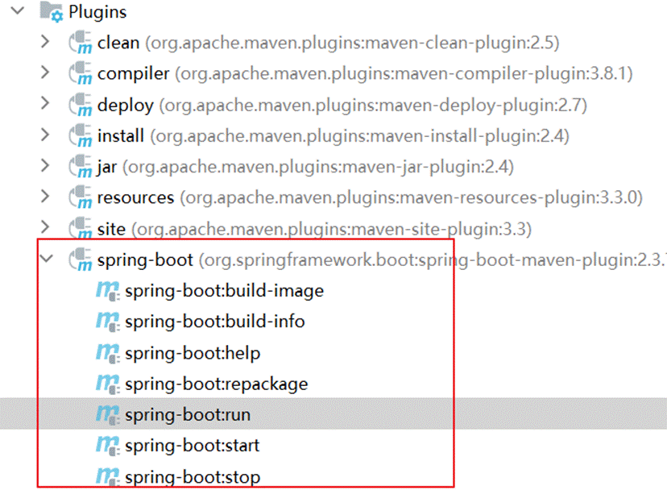

## 1 Jenkins安装配置

### 1.1 Jenkins介绍


Jenkins  是一款流行的开源持续集成（Continuous Integration）工具，广泛用于项目开发，具有自动化构建、测试和部署等功能。官网：  http://jenkins-ci.org/。

Jenkins的特征：

- 开源的 Java语言开发持续集成工具，支持持续集成，持续部署。
- 易于安装部署配置：可通过 yum安装,或下载war包以及通过docker容器等快速实现安装部署，可方便web界面配置管理。
- 消息通知及测试报告：集成 RSS/E-mail通过RSS发布构建结果或当构建完成时通过e-mail通知，生成JUnit/TestNG测试报告。
- 分布式构建：支持 Jenkins能够让多台计算机一起构建/测试。
- 文件识别： Jenkins能够跟踪哪次构建生成哪些jar，哪次构建使用哪个版本的jar等。
- 丰富的插件支持：支持扩展插件，你可以开发适合自己团队使用的工具，如 git，svn，maven，docker等。


Jenkins安装和持续集成环境配置


 更细的一层：


1 ）首先，开发人员每天进行代码提交，提交到Git仓库

2）然后，Jenkins作为持续集成工具，使用Git工具到Git仓库拉取代码到集成服务器，再配合JDK，Maven等软件完成代码编译，代码测试与审查，测试，打包等工作，在这个过程中每一步出错，都重新再执行一次整个流程。

3）最后，Jenkins把生成的jar或war包分发到测试服务器或者生产服务器，测试人员或用户就可以访问应用。

### 1.2 Jenkins环境搭建

#### 1.2.1  Jenkins安装配置


[Docker 安装jenkins](https://www.jenkins.io/doc/book/installing/docker/)

[使用 Docker 安装 Jenkins 并实现项目自动化部署-阿里云开发者社区 (aliyun.com)](https://developer.aliyun.com/article/892646)

> 使用官方docker安装方法，docker安装的话看这个也可以，可以使用中文的安装方法，不用英文版。
>
> 其中获取jdk的方法为进入jenkins容器然后查询
>
> ```
> docker exec -it 2a4616b5bc22 sh
> echo $JAVA_HOME
> ```

可以导入资料中的镜像：

```java
服务器用户名：root   密码：123456

jenkins  用户名：123456   密码：123456
```


1. 采用YUM方式安装

   加入jenkins安装源：

   ```sh
   sudo wget -O /etc/yum.repos.d/jenkins.repo https://pkg.jenkins.io/redhat-stable/jenkins.repo --no-check-certificate
   
   sudo rpm --import https://pkg.jenkins.io/redhat-stable/jenkins.io.key
   ```

   执行yum命令安装：

   ```sh
   yum -y install jenkins
   ```

2. 采用RPM安装包方式

   [Jenkins安装包下载地址](https://pkg.jenkins.io/redhat-stable/)

   ```sh
   wget https://pkg.jenkins.io/redhat-stable/jenkins-2.190.1-1.1.noarch.rpm
   ```

   执行安装：

   ```sh
   rpm -ivh jenkins-2.190.1-1.1.noarch.rpm
   ```

3. 配置：

   修改配置文件：

   ```sh
   vi /etc/sysconfig/jenkins
   ```

   修改内容：

   ```sh
   # 修改为对应的目标用户， 这里使用的是root
   $JENKINS_USER="root"
   # 服务监听端口
   JENKINS_PORT="16060"
   ```

   目录权限：

   ```sh
   chown -R root:root /var/lib/jenkins
   chown -R root:root /var/cache/jenkins
   chown -R root:root /var/log/jenkins
   ```

   重启：

   ```sh
   systemctl restart jenkins
   ```

   如果启动失败， 出现错误信息：

   ```sh
   Starting Jenkins bash: /usr/bin/java: No such file or directory
   ```

   创建JAVA环境的软链接：

   ```sh
   ln -s /usr/local/jdk/bin/java /usr/bin/java
   ```

4. 管理后台初始化设置

   http://192.168.200.100:16060/

   需要输入管理密码， 在以下位置查看：

   ```sh
   cat /var/lib/jenkins/secrets/initialAdminPassword
   ```

   

   按默认设置，把建议的插件都安装上

   

   这一步等待时间较长， 安装完成之后， 创建管理员用户：

   

配置访问地址：


配置完成之后， 会进行重启， 之后可以看到管理后台：


#### 1.2.2  Jenkins插件安装

在实现持续集成之前， 需要确保以下插件安装成功。

- Maven Integration plugin： Maven 集成管理插件。
- Docker plugin： Docker集成插件。
- GitLab Plugin： GitLab集成插件。
- Publish Over SSH：远程文件发布插件。
- SSH: 远程脚本执行插件。

安装方法：

1. 进入【系统管理】-【插件管理】

2. 点击标签页的【可选插件】

   在过滤框中搜索插件名称

   

3. 勾选插件， 点击直接安装即可。

>注意，如果没有安装按钮，需要更改配置
>
>在安装插件的高级配置中，修改升级站点的连接为：http://updates.jenkins.io/update-center.json   保存
>
>
>
>

#### 1.2.3  Git安装配置

1. yum 安装方式

   ```sh
   yum -y install git
   ```

2. 采用源码包方式安装

   - 安装依赖包

     ```sh
     yum -y install curl-devel expat-devel gettext-devel openssl-devel zlib-devel
     yum -y install gcc perl-ExtUtils-MakeMaker
     ```

   - 如果之前有安装旧版本， 先做卸载， 没有安装则忽略

     ```sh
     yum remove git
     ```

   - 下载源码包

     ```sh
     cd /usr/local
     wget https://mirrors.edge.kernel.org/pub/software/scm/git/git-1.8.3.1.tar.gz
     tar -xvf git-1.8.3.1.tar.gz
     ```

     也可以安装其他版本， 地址：https://mirrors.edge.kernel.org/pub/software/scm/git/

   - 编译安装

     ```sh
     cd git-1.8.3.1
     make prefix=/usr/local/git all
     make prefix=/usr/local/git install
     echo "export PATH=$PATH:/usr/local/git/bin" >> /etc/bashrc
     source /etc/bashrc
     ```

3. 检查git版本

   ```sh
   [root@localhost jenkins]# git version
   git version 1.8.3.1
   ```


#### 1.2.4  Maven安装配置

1. 下载安装包

   下载地址： https://maven.apache.org/download.cgi

2. 解压安装包

   ```sh
   cd /usr/local
   unzip -o apache-maven-3.6.1.zip 
   ```

   上传本地仓库并解压

   

3. 配置

   环境变量配置

   ```sh
   vi /etc/profile
   ```

   增加：

   ```sh
   export MAVEN_HOME=/usr/local/maven/apache-maven-3.6.1
   export PATH=$PATH:$MAVEN_HOME/bin
   ```

   如果权限不够，则需要增加当前目录的权限

   ```shell
   chmod 777 /usr/local/maven/apache-maven-3.6.1/bin/mvn
   ```

   

   修改镜像仓库配置：

   ```sh
   vi /usr/local/maven/apache-maven-3.6.1/conf/settings.xml
   ```

   需要把本机的仓库打包上传到服务器上（不上传会自动下载）

   然后指定上传后的仓库配置

   

#### 1.2.5  Docker安装配置

1. 更新软件包版本

   ```sh
   yum -y update
   ```

2. 卸载旧版本

   ```sh
   yum -y remove docker  docker-common docker-selinux docker-engine
   ```

3. 安装软件依赖包

   ```sh
   yum install -y yum-utils device-mapper-persistent-data lvm2
   ```

4. 设置yum源为阿里云

   ```sh
   sudo yum-config-manager --add-repo http://mirrors.aliyun.com/docker-ce/linux/centos/docker-ce.repo
   ```

5. 安装后查看docker版本

   ```sh
   docker -v
   ```

6. 启动

   设置开机启动：

   ```sh
   systemctl enable docker
   ```

   启动docker

   ```sh
   systemctl start docker
   ```


#### 1.2.6  Docker Registry私有仓库安装配置

###  1.3 Jenkins工具配置

1. 进入【系统管理】--> 【全局工具配置】

   

2. MAVEN配置全局设置

   

3. 指定JDK配置

   


4. 指定MAVEN 目录

   

5. 指定DOCKER目录

   

   如果不清楚docker的安装的目录，可以使用`whereis docker` 命令查看docker的安装的目录


## **3.3** **人工部署方式**

如果不使用CI/CD则需要人工手动对工程进行测试、打包、部署。使用CI/CD后通过自动化的工具去完成。

下边先演示手动部署方式，之后采用工具进行部署。

### 3.3.1 项目打包

 

1、在父工程聚合各模块

首先在父工程添加models，聚合各各模块

```
<modules>
    <module>../xuecheng-plus-base</module>
    <module>../xuecheng-plus-checkcode</module>
    <module>../xuecheng-plus-gateway</module>
    <module>../xuecheng-plus-auth</module>
    <module>../xuecheng-plus-content</module>
    <module>../xuecheng-plus-learning</module>
    <module>../xuecheng-plus-media</module>
    <module>../xuecheng-plus-orders</module>
    <module>../xuecheng-plus-message-sdk</module>
    <module>../xuecheng-plus-search</module>
    <module>../xuecheng-plus-system</module>
</modules>

```


 

2、配置打包插件(哪一个服务需要运行就加哪一个服务下面)

使用springboot打包插件进行打包，在需要打可执行包的工程中配置spring-boot-maven-plugin插件否则报 “jar中没有主清单属性” 。

注意：在要打可执行jar包的工程中配置该插件。

```
<build>
    <finalName>${project.artifactId}-${project.version}</finalName>
    <plugins>
        <plugin>
            <groupId>org.springframework.boot</groupId>
            <artifactId>spring-boot-maven-plugin</artifactId>
            <version>${spring-boot.version}</version>
            <executions>
                <execution>
                    <goals>
                        <goal>repackage</goal>
                    </goals>
                </execution>
            </executions>
        </plugin>
    </plugins>
</build>

```


说明：

配置了springboot打包插件即可在maven窗口显示如下：



 

功能说明：

build-info：生成项目的构建信息文件 build-info.properties

repackage：这个是默认 goal，在 mvn package 执行之后，这个命令再次打包生成可执行的 jar，同时将 mvn package 生成的 jar 重命名为 *.origin

run：这个可以用来运行 Spring Boot 应用

start：这个在 mvn integration-test 阶段，进行 Spring Boot 应用生命周期的管理

stop：这个在 mvn integration-test 阶段，进行 Spring Boot 应用生命周期的管理

 

在父工程执行：clean install -DskipTests -f pom.xml 对所有工程进行打包

打包完成可在本地通过java -jar 运行jar包观察是否可以正常运行。

下边测试验证码服务：

进入验证码服务的target目录，cmd运行：
```java
java -Dfile.encoding=utf-8 -jar xuecheng-plus-checkcode-0.0.1-SNAPSHOT.jar 
```

如下图：


使用httpclient测试申请验证码：

  JavaScript   ###  申请验证码   POST localhost:63075/checkcode/pic  

 

### 3.3.2 部署到Linux

将打成的jar包拷贝到Linux，生成镜像，并创建容器。

1、编写Dockerfile文件
```java
  JavaScript   FROM  java:8u20   MAINTAINER docker_maven docker_maven@email.com   WORKDIR /ROOT   ADD xuecheng-plus-checkcode-0.0.1-SNAPSHOT.jar xuecheng-plus-checkcode.jar   CMD ["java", "-version"]   ENTRYPOINT ["java",  "-Dfile.encoding=utf-8","-jar",  "xuecheng-plus-checkcode.jar"]   EXPOSE 63075        
```


2、创建镜像

  JavaScript   docker  build -t checkcode:1.0 .  

创建成功，查询镜像:


 

3、创建容器

  JavaScript   docker  run --name xuecheng-plus-checkcode -p 63075:63075 -idt checkcode:1.0  

 

再次测试

  JavaScript   ###  申请验证码   POST 192.168.101.65:63075/checkcode/pic  
