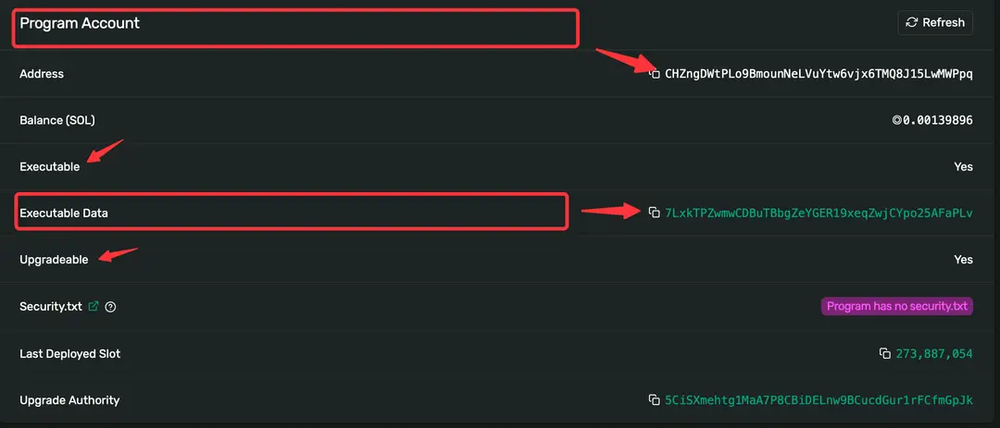

## 错误处理

### ProgramResult 枚举

ProgramResult是 solana 中定义的一个通用错误处理类型，它是solana_program中的一个结构体，具体如下：

```rust
use solana_program::entrypoint::ProgramResult;
```

代表着 Solana 程序中指令处理函数的返回值，该类型代表 Transaction 交易中指令的处理结果，成功时为单元类型()，即返回值为空，失败时返回值为ProgramError，它本身又是个枚举。

```rust
use std::result::Result as ResultGeneric;

pub type ProgramResult = ResultGeneric<(), ProgramError>;
```

在 ProgramError 中定义了 23 种常见的错误原因枚举值，也支持自定义的错误类型，如下：

```rust
pub enum ProgramError {
    // 用户自定义错误类型
    #[error("Custom program error: {0:#x}")]
    Custom(u32),

		// 参数无效
    #[error("The arguments provided to a program instruction were invalid")]
    InvalidArgument,

		// 指令数据无效
    #[error("An instruction's data contents was invalid")]
    InvalidInstructionData,

		// 账户数据无效
    #[error("An account's data contents was invalid")]
    InvalidAccountData,
    
		// ……
}
```

## Solana 入口点

Solana 网络上存储的所有数据都包含在所谓的帐户中。每个帐户都有自己唯一的地址，用于识别和访问帐户数据。Solana 程序只是一种特定类型的 Solana 帐户，用于存储和执行指令。

### **Solana crate** solana_program

[solana_program crate文档](https://docs.rs/solana-program/latest/solana_program/index.html)。

对于基本程序，我们需要将 solana_program 库中的以下项目纳入作用域：

```javascript
use solana_program::{
    account_info::AccountInfo,
    entrypoint,
    entrypoint::ProgramResult,
    pubkey::Pubkey,
    msg
};
```

●AccountInfo：account_info 模块中的一个结构体，允许我们访问帐户信息。

●entrypoint：声明程序入口点的宏，类似于 Rust 中的 main 函数。

●ProgramResult：entrypoint 模块中的返回值类型。

●Pubkey：pubkey 模块中的一个结构体，允许我们将地址作为公钥访问。

●msg：一个允许我们将消息打印到程序日志的宏，类似于 Rust 中的 println宏。

### **Solana 程序入口点**

Solana 程序需要单个入口点来处理程序指令。入口点是使用entrypoint!声明的宏。

通过如下方式声明程序的入口点函数：

```javascript
// 声明程序入口点函数
entrypoint!(process_instruction);
```

该指令处理函数我们在前面章节已介绍过，这里不再赘述。


```javascript
fn process_instruction(
		// 当前的程序ID
    program_id: &Pubkey,
		// 该指令涉及到的账户集合
    accounts: &[AccountInfo],
		// 该指令的参数
    instruction_data: &[u8],
) -> ProgramResult;
```


## 指令处理函数

Solana 程序帐户仅存储处理指令的逻辑。这意味着程序帐户是“只读”和“无状态”的。程序处理指令所需的“状态”（数据集）存储在数据帐户中（与程序帐户分开）

### 数据账户的定义

我们的 Solana 程序要实现计数器的累加，那就必须先定义该数据是以何种形式存储在 Solana 链上的，这里我们使用结构体CounterAccount，之所以使用Account后缀，因为它是一个数据账户（这个概念一开始对从以太坊转过来的开发者来说很困惑，但慢慢的你就会发现这的确是个巧妙的设计）。

```rust
/// 定义数据账户的结构
#[derive(BorshSerialize, BorshDeserialize, Debug)]
pub struct CounterAccount {
    pub count: u32,
}
```

该结构体中定义了u32类型的count属性，在我们每次发起交易指令时，它都会+1操作。因为该值的存储和传输都是使用的字节码，要把字节码转为Rust 类型，我们还需要（反）序列化操作，这里需要引入borsh库。

```rust
use borsh::{BorshDeserialize, BorshSerialize};
```

实际进行（反）序列化操作是通过`BorshSerialize`、`BorshDeserialize`这2个派生宏实现的，该宏的定义如下，它们都是对解析后类型为`TokenStream`的 Rust 代码元数据进行处理，并返回处理后的元数据。

```rust
#[proc_macro_derive(BorshSerialize, attributes(borsh_skip))]
pub fn borsh_serialize(input: TokenStream) -> TokenStream {
    // 序列化逻辑……
}

#[proc_macro_derive(BorshDeserialize, attributes(borsh_skip, borsh_init))]
pub fn borsh_deserialize(input: TokenStream) -> TokenStream {
    // 反序列化逻辑……
}
```


### 指令处理函数

这个函数的定义我们在前面已经介绍过，这里看下它的实现逻辑。

```rust
pub fn process_instruction(
		// 程序ID，即程序地址
    program_id: &Pubkey,
		// 该指令涉及到的账户集合
    accounts: &[AccountInfo]) -> ProgramResult {
    
    // 账户迭代器
    let accounts_iter = &mut accounts.iter();

    // 获取调用者账户
    let account = next_account_info(accounts_iter)?;

    // ……
}
```

为了处理指令，指令所需的数据帐户必须通过accounts参数显式传递到程序中。这里因为要对数据账户进行累加的操作，所以 accounts 包含了该数据账户，我们通过迭代器获取到该账户account。

account数据账户是由该程序派生出来的账户，因此当前程序为它的owner所有者，并且只有所有者才可以对其进行写操作。所以我们在这里要进行账户权限的校验。

```rust
// 验证调用者身份
if account.owner != program_id {
    msg!("Counter account does not have the correct program id");
    return Err(ProgramError::IncorrectProgramId);
}
```

全部代码：

```rust
pub fn process_instruction(
		// 程序ID，即程序地址
    program_id: &Pubkey,
		// 该指令涉及到的账户集合
    accounts: &[AccountInfo],
		// 指令数据
    _instruction_data: &[u8],
) -> ProgramResult {
    msg!("Hello World Rust program entrypoint");

    // 账户迭代器
    let accounts_iter = &mut accounts.iter();

    // 获取调用者账户
    let account = next_account_info(accounts_iter)?;

    // 验证调用者身份
    if account.owner != program_id {
        msg!("Counter account does not have the correct program id");
        return Err(ProgramError::IncorrectProgramId);
    }

    // 读取并写入新值
    let mut counter = CounterAccount::try_from_slice(&account.data.borrow())?;
    counter.count += 1;
    counter.serialize(&mut *account.data.borrow_mut())?;

    Ok(())
}
```


## 修改数据

### 读取数据账户

通过上一节的账户权限校验，我们可以确定当前的数据账户是正确的，那么接下来，就是读取该账户存储的数据了。

```javascript
let mut counter = CounterAccount::try_from_slice(&account.data.borrow())?;
```

这行代码的目的是从 Solana 数据账户中反序列化出 `CounterAccount` 结构体的实例。

1. `&account.data`：获取账户的数据字段的引用。在 Solana 中，账户的数据字段data存储着与账户关联的实际数据，对于程序账户而言，它是程序的二进制内容，对于数据账户而言，它就是存储的数据。

2. `borrow()`：使用该方法获取data数据字段的可借用引用。并通过`&account.data.borrow()`方式得到账户数据字段的引用。

3. `CounterAccount::try_from_slice(...)`：调用`try_from_slice`方法，它是`BorshDeserializetrait` 的一个方法，用于从字节序列中反序列化出一个结构体的实例。这里`CounterAccount`实现了`BorshDeserialize`，所以可以使用这个方法。

4. `?`：是一个错误处理操作符，如果`try_from_slice`返回错误，整个表达式将提前返回，将错误传播给调用方。

通过如上方式，我们获取了`CounterAccount`数据账户进行了反序列化，并获取到它的可变借用。

### 修改数据账户

接下来我们就可以对该数据账户进行修改：

```rust
counter.count += 1;
counter.serialize(&mut *account.data.borrow_mut())?;
```

●首先对`CounterAccount`结构体中的count字段进行递增操作。

●`&mut *account.data.borrow_mut()`：通过`borrow_mut()`方法获取账户数据字段的可变引用，然后使用*解引用操作符获取该data字段的值，并通过`&mut`将其转换为可变引用。

●`serialize`函数方法，它是`BorshSerialize trait` 的一个方法，用于将结构体序列化为字节数组。

●`?`：是一个错误处理操作符，如果`serialize`方法返回错误，整个表达式将提前返回，将错误传播给调用方。

通过如上的方式，将`CounterAccount`结构体中的修改后的值递增，并将更新后的结构体序列化为字节数组，然后写入 Solana 账户的可变数据字段中。实现了在 Solana 程序中对计数器值进行更新和存储。


### 总程序代码

```rust
use borsh::{BorshDeserialize, BorshSerialize};
use solana_program::{
    account_info::{next_account_info, AccountInfo},
    entrypoint,
    entrypoint::ProgramResult,
    msg,
    program_error::ProgramError,
    pubkey::Pubkey,
};

/// 定义数据账户的结构
#[derive(BorshSerialize, BorshDeserialize, Debug)]
pub struct CounterAccount {
    pub count: u32,
}

// 定义程序入口点函数
entrypoint!(process_instruction);

pub fn process_instruction(
		// 程序ID，即程序地址
    program_id: &Pubkey,
		// 该指令涉及到的账户集合
    accounts: &[AccountInfo],
		// 指令数据
    _instruction_data: &[u8],
) -> ProgramResult {
    msg!("Hello World Rust program entrypoint");

    // 账户迭代器
    let accounts_iter = &mut accounts.iter();

    // 获取调用者账户
    let account = next_account_info(accounts_iter)?;

    // 验证调用者身份
    if account.owner != program_id {
        msg!("Counter account does not have the correct program id");
        return Err(ProgramError::IncorrectProgramId);
    }

    // 读取并写入新值
    let mut counter = CounterAccount::try_from_slice(&account.data.borrow())?;
    counter.count += 1;
    counter.serialize(&mut *account.data.borrow_mut())?;

    Ok(())
}
```


部署：

部署成功后，我们可以在 Solana 区块链浏览器中查看[该笔交易信息](https://explorer.solana.com/tx/n4rQU85FmLjB82RAkRvRwj9jYYSseUYfvRi4jY6ZpxuoNGd8qFCiV4UsDbyKVviY5GWcBm7hwNVzMvr5JhvYaux?cluster=devnet)。其中5CiS...为我们的wallet钱包公钥，而CHZn.…为程序账户，它具有executable可执行属性，并且updateable可升级，该程序ID下对应的7Lxk…账户存储了程序的二进制文件（请注意：二进制文件并不是直接存储在程序账户中，而是下面的子账户中）。


这里展示了程序账户和子账户（存储程序二进制文件）之间的关系。




# Anchor

Anchor 是一个用于**快速**、**安全**的构建 Solana 程序的框架。它为您编写大量的样板代码，比如（反）序列化帐户和指令数据等，使您更专注于业务逻辑的开发。同时，它也会执行特定的安全检查、账号验证等，当然，也支持您轻松地实现自定义的其他检查。

Anchor 也为前端项目提供了一系列的库和工具，简化了跟链上程序交互的复杂度。它也对 PDA （程序衍生账户）、CPI（跨程序调用） 提供了一系列的支持。


## 安装

Anchor 本身是 Rust 写的 Solana 开发框架，同时也支持前端项目，因此它的安装涉及到一系列的依赖，比如 Rust、Solana、Yarn，在完成依赖的安装后，再安装 Anchor 版本管理工具(Anchor Version Manager) avm，如果你熟悉 Nodejs，他就像管理 nodejs 版本的 nvm。 通过avm，我们能更加灵活的使用和管理 Anchor。[安装指南可以看这里](https://www.anchor-lang.com/docs/installation)。


```sh

C:\Users\Administrator>solana-keygen new
Generating a new keypair

For added security, enter a BIP39 passphrase

NOTE! This passphrase improves security of the recovery seed phrase NOT the
keypair file itself, which is stored as insecure plain text

BIP39 Passphrase (empty for none):


Wrote new keypair to C:\Users\Administrator\.config\solana\id.json
=====================================================================
pubkey: GhuT9vp4JnLEYBsDFFAShUXekw4nSEq8XZyrsc8efPNu
=====================================================================
Save this seed phrase and your BIP39 passphrase to recover your new keypair:
coyote honey kit valve excuse nominee farm fan trick board quote tone
=====================================================================
```


### 常用指令

1、**创建新项目**：这个命令用于创建一个新的 Anchor 项目，包含了 demo 代码，你可以用自己的项目名称替换 **my_project** 。

```rust
anchor init my_project
```

2、**构建新的程序（智能合约）**：这个命令用于构建和编译程序。它会在target/deploy目录下生成编译后的合约二进制文件。如果在项目目录下可以省略项目名称。

```bash
anchor build [my_project]
```

**3**、**测试程序逻辑**：运行这个命令会执行程序的测试套件，确保程序的功能正常。

```bash
anchor test
```

4**、部署程序到指定网络**：Solana 的 devnet 是一个专门用于开发和测试的网络，通常我们会把项目先部署在本地或者开发测试网进行验证，验证通过后部署到主网 mainnet-beta。

```rust
// 部署到开发测试网
anchor deploy --env devnet
// 部署到主网
anchor deploy --env mainnet-beta
```

### 项目目录结构

创建完项目 **my_project** 后，我们进入 **my_project** 文件夹， 可以看到 Anchor 自动生成的文件和目录：

```bash
my_project/
├── Anchor.toml
├── programs/
│   └── my_program/
│       ├── Cargo.toml
│       ├── src/
│       │   └── lib.rs
│       └── tests/
│           └── program_test.rs
├── target/
└── tests/
    └── integration_test.rs
```

这是一个简化的结构，提供了一个基本的框架，使你能够开始编写、测试和部署程序。在具体的项目中，你可能需要根据需求添加其他文件和目录，例如配置文件、文档等。以下是一些关键文件和目录的说明：

●**Anchor.toml****：** 项目的配置文件，包含项目的基本信息、依赖关系和其他配置项。

●**programs**目录**：** 包含你的程序的目录。在这个例子中，有一个名为**my_program**的子目录。

●**Cargo.toml****：** 程序的Rust项目配置文件。

●**src**目录**：** 包含实际的程序代码文件，通常是**lib.rs**，在实际的项目中我们会根据模块划分，拆的更细。

●**tests**目录**：** 包含用于测试程序的测试代码文件。

●**target**目录**：** 包含构建和编译生成的文件。

●**tests**目录**：** 包含整合测试代码文件，用于测试整个项目的集成性能。


`anchor help`

```sh
anchor help

available commands:
  init      初始化一个工作空间。
  build     构建整个工作空间。
  expand    展开宏（cargo expand 的包装）。
  verify    验证链上字节码是否与本地编译的构件匹配。在程序子目录中运行此命令，即包含程序的 Cargo.toml 文件的目录。
  test      在本地网络运行集成测试。
  new       创建一个新的程序。
  idl       与接口定义语言（IDL）交互的命令。
  clean     从目标目录中删除除程序密钥对之外的所有构建产物。
  deploy    部署工作空间中的每个程序。
  migrate   运行部署迁移脚本。
  upgrade   部署、初始化接口定义并一次性迁移所有内容的命令。升级单个程序。配置的钱包必须是升级权限。
  cluster   集群命令。
  shell     启动一个带有 anchor 客户端设置的节点 shell。
  run       运行由当前工作空间的 anchor.toml 定义的脚本。
  login     将来自注册表的 API 令牌保存到本地。
  publish   将经过验证的构建发布到 anchor 注册表。
  keys      密钥对命令。
  localnet  本地网络命令。
  account   使用提供的接口定义获取并反序列化帐户。
  help      打印此消息或给定子命令的帮助信息。
```

```rust
anchor help deploy
```


### **anchor init** **和** **anchor new** **有什么区别？**

它们都是用于创建 Anchor 项目的命令，但它们有不同的目的和用法：

1.`anchor init` ：初始化工作空间，该命令会创建一个包含基本项目结构和配置文件的工作空间。你需要指定一个工作空间的名称，例如 `anchor init my_workspace` 中的 `my_workspace`。

2.`anchor new`：创建新程序，创建一个新的 Anchor 程序（智能合约），包括相关的目录和文件。你需要指定一个程序的名称，例如 `anchor new my_program` 中的`my_program`。

通常，你会首先使用anchor init初始化一个工作空间，然后使用anchor new在该工作空间中创建一个或多个程序。

### anchor verify 指令有什么作用？

该指令用于验证链上部署的程序的字节码是否与本地编译的构件（artifact）匹配。这个命令通常在开发者部署程序到 Solana 区块链之后使用，以确保链上的合约与本地开发环境中的代码一致。

在使用这个命令时，你需要在包含程序程序的目录中运行，即包含程序的Cargo.toml文件的目录。执行anchor verify会比较链上合约的字节码和本地编译的构件，确保它们一致。

验证的过程通常包括以下步骤：

1.检查链上合约的程序 ID 是否与本地编译的程序 ID 一致。

2.对比链上合约的字节码和本地编译的构件，确保它们相匹配。

通过这个命令，开发者可以确保在本地开发环境中编写的合约与实际部署到链上的合约是一致的，减少了由于编译或其他环境问题引起的潜在错误。


### anchor upgrade 指令有什么作用？

该命令是用于一次性升级程序的命令。它的作用是部署、初始化接口定义（IDL），并将执行所有迁移的过程集成在一起。这个命令通常用于升级一个单独的程序，而不是整个工作空间。这个命令会执行以下步骤：

1.**部署最新版本的程序：**意味着将程序的最新版本上传到 Solana 区块链网络上，并在链上创建一个新的程序实例。这个过程涉及将新的程序二进制文件部署到链上，以便替换先前部署的程序版本。

2.**初始化接口定义**（IDL）：IDL 是一种描述程序接口的语言，用于定义合约的数据结构、方法和事件。初始化接口定义的过程是将这些接口定义部署到链上，以便客户端能够与程序进行交互，并能够正确地解析合约的数据结构和方法。

3.**执行所有必要的迁移脚本**：迁移脚本是用于在合约升级或修改时执行的脚本。它包含了在链上执行的逻辑，例如更新存储结构、迁移数据等。迁移脚本的目的是确保链上合约状态的平滑过渡，使新版本的合约能够与旧版本兼容。
