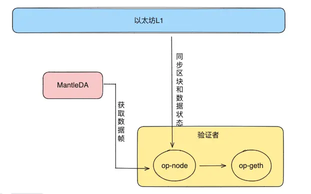
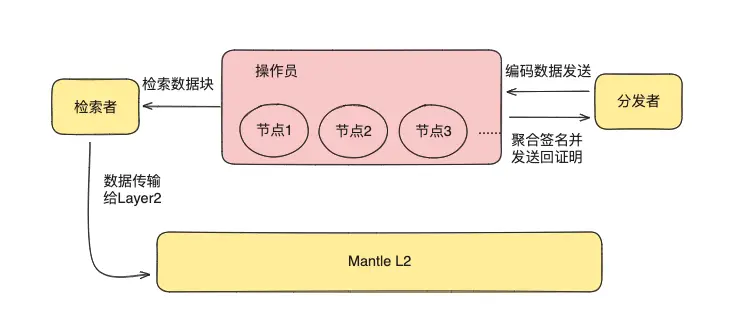

# 1 Layer 2 简介

## 1.1 Layer分层

区块链的分层

- **Layer 0**是数据传输层，指的就是区块链最基础的底层协议，也就是节点之间传递讯息的通讯层，负责基础的数据传递及建立共识达成效率。
- **Layer 1**是底层区块链。比特币(BTC)、以太坊(ETH)、币安智能链(BNB)和Solana都属于Layer-1协议。
- **Layer2**又称链下扩容，指不改变区块链底层协议和基础规则，通过状态通道、侧链等方案提高交易处理速度。
- **Layer3**指的是应用层。

### 1.1.1 Layer0

**Layer 0数据传输层**

L0是数据传输层，指的就是区块链最基础的底层协议，也就是节点之间传递讯息的通讯层，负责基础的数据传递及建立共识达成效率。

第0层赋能了以下三方面：

**1）允许不同区块链交互**

- 一个很好的例子是Cosmos，它它通过其"TendermintIBC”（区块链间通信协议）创建了一个可互操作的区块链生态系统。希望打造一套区块链通用的开发框架并解决跨链问题，使多链宇宙成为可能。有意思的是，Cosmos生态中的项目Terra，其市值超过了Cosmos。基于 Cosmos SDK 开发的区块链还有 LUNA、CRO、OSMO 等市值超过 10 亿美金的项目。
- 对于开发人员来说，这是巨大的进步。如果一个Dapp可以在一个区块链上运行，它也可以在其他区块链上自动运行，只要它们使用相同的第0层构建。无需投入更多时间和资源在另一条链上构建相同的应用程序。

**2）交易更快、成本更低**

- 过IBC，PoS共识可以跨多个链实现，导致最终确定时间几乎在瞬间发生（最终确定=块被批准、不能回滚且被认为是不可逆的）。这样的结果是让跨链交易所的交易更快、更便宜

**3）开发人员的基础设施**

- 开发人员不需要从头开始，从头开始构建他们的区块链。许多功能都是预先构建的，可以立即实施。

**实例：**

Polkadot、Cosmos、Avalanche、Cardano

### 1.1.2 Layer 1

**L1底层区块链**

第1层是区块链（比特币和以太坊），它们在自己的区块链上处理和完成交易。这是处理共识（PoW、PoS）和所有技术细节（如区块时间和争议解决）的地方。

区块链最重要的三个方面是克服区块链三难困境：去中心化、安全性和可扩展性。到目前，仍然没有一个区块链能够解决这三个问题。

Solana支持每秒71万次交易，可以说当之无愧的高性能公链。使用的是时间历史证明机制（PoH）和可验证的延迟机制，允许节点通过本地生成时间戳，无需在整个网络上进行广播时间戳信息，最大化的提高了公链数据的传输线程，提高传输效率，但Solana区块链在不到一年的时间里遭遇了一系列的中断，其安全性备受社区成员的质疑。

比特币的稳定性和安全性毋庸置疑，但可扩展性太差。

以太坊升级到2.0后，采用**分片来解决扩展性问题**

Celo采用PoS权益共识，交易速度能达到5秒的速度，而Gas费低至0.00004美元。它能使用稳定币支付Gas费，规避了加密货币的波动性问题，很适合跨国汇款，在非洲应用较为广泛。

**实例：**

Ethereum、Celo、Binance、Solana

### 1.1.3 Layer 2

**L2链下扩容**

L2又称链下扩容，指不改变区块链底层协议和基础规则，通过状态通道、侧链等方案提高交易处理速度。

第2层是与第1层结合使用的第三方集成，以提高可扩展性和每秒事务（系统吞吐量）。Polygon是一个去中心化的以太坊扩展平台,使开发人员能够以低交易费用构建可扩展的用户友好 dApp，而无需牺牲安全性。

除此之外，还有很多的以太坊 L2，比如所谓的"四大Rollups"，包括 Optimistic Rollups (ORU)和 Arbitrum，它们已上线并拥有快速增长的用户和开发人员基础。还包括 zk-rollups(ZKRs)和 StarkNet。

如零撸（zk）、侧链或任何与加快事务吞吐量有关的技术，都属于第2层。

实例：

Optimism、Polygon、Starknet、Arbitrum

### 1.1.4 Layer 3

**L3应用层**

第3层是应用层。这是作为消费者实际与之交互的用户界面。

比如有人认为使用以太坊Layer2，交易吞吐量仍然有限，而且Gas不够便宜，无法执行以订单簿为中心的CEX（中心化交易所，如币安)所需的所需交易，就需要依靠第三层分流。

目前在Layer1和Layer2 之间使用的跨链通道非常低效且昂贵。所以将层级间与同层间的组合操作平移至Layer3可能是一个不错的选择，而且更易于实施。因为定制化的 Layer3 是通过Layer2 而不是Layer1 进行互操作，这显然会更便宜。

L3的应用程序，包括DEX(去中心化交易所，如UniSwap)、DeFi(去中心化金融，如Maker)、NFT(非同质化代币，如CryptoKities)、DAO(去中心化自治组织)、GameFi (Decentraland）等。

还有一种分法，从L3 中再分出L4，也就是区块链技术应用于现实世界的解决方案。可能是为了方便人们操作的，体验更好的用户界面。

## 1.2 为什么需要 Layer 2

Layer 1 是指区块链的基础层，也称为主链或基础协议层，比特币和以太坊就是典型的 Layer 1 区块链。

因为在 Layer 1 上进行交易和智能合约执行需要全网节点的参与，所以会面临一些挑战，如低吞吐量、高交易费用和延迟较高。这些挑战对于一些需要高性能和低成本的应用场景来说是不利的，比如支付、游戏和去中心化交易所等。

Layer 2 技术的出现就是为了解决 Layer 1 的这些瓶颈和挑战，Layer 2 技术通过将一部分交易或计算迁移到 Layer 2，可以大大提高系统的吞吐量和性能。同时，由于 Layer 2 不需要全网节点的参与，所以可以降低交易的成本和延迟。这使得区块链技术更加适用于各种实际应用，并能够满足更多用户的需求。

## 1.3Layer 2 - 状态通道

> 一种 Layer 2 的实现方式，叫做状态通道。

### 1.3.1 问题

因为 Alice 的公司在与其他公司做跨境交易，每一笔订单交易的金额其实不是很大，平均数在 100 美元。

Alice 和客户是在 Bitcoin 一层网络做交易结算的，随着时间流逝她发现有如下问题：

1.为了防止货物发出去了但是没有收到款项，Alice 和别的公司交易都是一笔订单结算完成才进行下一笔（一般为 100 美元），毕竟只有一笔被违约的话还是可以承受的，两笔交易都被对方违约的风险就无法承受了。由于每一笔交易在 Bitcoin 一层网络结算完成一般都要等待 10 分钟，每一天的交易量就不能很多，Alice 本可以赚更多钱的。

2.由于 Bitcoin 一层网络的交易手续费太贵了，所以 Alice 这边每一笔交易其实都少赚了一些钱，所以她更希望订单的价值大一些，这样更容易摊平这些手续费损失。

### 1.3.2 解决方案

因为这些问题的存在，Alice 就去找 Bob 请教，Bob 告诉了她一种方法叫做状态通道。具体的方案如下：

- 每天上午 9 点上班的时候，Alice 和客户一起创建一个多签名钱包（多个私钥控制），将一定数量的资金锁定在这个钱包中，并将该交易记录在区块链上。这个交易作为开启通道的证据。
- 通道建立之后，Alice 和客户就可以在通道内进行频繁的交易了，这些交易并不会立即被提交到 Bitcoin 一层网络上，而仅仅是双方都将交易的状态变化记录在本地，并相互交换更新后的状态。
- 每一天下午 6 点下班前，Alice 和客户希望关闭通道时，他们可以将最终的状态提交到 Bitcoin 一层网络上，并由 Bitcoin 一层网络验证和执行这个状态更新，最终状态包含了通道运行期间内的所有交易信息。

如此一来，

- Alice 和客户每天的交易就可以无限多了，因为在通道内完成交易是非常快的，可能每秒钟都可以完成 10 笔交易了，完全够用了。

- 另外 Alice 每天只要下班前统一付一次 Bitcoin 一层网络的手续费就行了，省下了很多钱。

但是由于 Alice 和客户都在各自的本地记录交易状态变化，难免有时候会出现不一致的时候，她们需要制定出争议解决的方案，方案如下：

- 如果 Alice 和客户之间发生争议，例如一方欺诈或拒绝合作，她们可以选择将争议提交到 Bitcoin 一层网络上进行解决，在争议解决阶段，Bitcoin 一层网络将验证这个争议，以确定最终的状态。

- 其中一种常用的验证机制是简化支付验证（Simplified Payment Verification，SPV）

- SPV 验证过程中的关键步骤是验证交易在区块链中的位置和有效性。参与者可以使用 Merkle 树结构来验证交易是否包含在特定的区块中。Merkle 树是一种二叉树结构，其中每个叶子节点代表一个交易，而每个非叶子节点的值是其子节点值的哈希。通过比较交易的哈希与 Merkle 树的根哈希，参与者就可以确认该交易是否包含在区块中了。

- 一层网络验证之后，争议解决了，双方的钱款就会按照正确的值返回到各自的钱包里了。

如此一来，Alice 的问题解决了，她非常开心，打算明天就试试这个方案。

### 1.3.3 小结

**原理如下**：

1.打开通道：参与者质押一定链上资产在多签合约中以打开状态通道；

2.使用通道：参与者在通道中自由进行交易，本地更新状态，不提交到链上；

3.关闭通道：在所有参与者一致同意后，提交最终状态到链上进行最终清算，一定时间内无人质疑即完成交易。

## 1.4 Layer 2 - 侧链

### 1.4.1 问题

1. Alice 开始与客户们采取状态通道的方式来进行交易，但是 Alice 的客户们太多了，遍布全球，每个客户都需要开一个单独的状态通道让 Alice 一个人有些难以管理。因为状态通道里面的交易需要双方都进行签名，以证明其参与和同意了这一笔交易，当 Alice 的公司停电或者她去上厕所的时候其实交易就无法继续进行下去了。
2. 状态通道里面其实 Alice 只能与客户们进行简单的转账交易，但其实有的时候她们还想做一些活动比如打折，升级之类的，这些东西状态通道做不了。

### 1.4.2 解决方案

因为这些问题的存在，Alice 就去找 Bob 请教，Bob 告诉了她一种方法叫做侧链。具体的方案如下：

- Alice 和客户们一起创建一个新的区块链 X，这个区块链有自己独立的共识机制和规则，节点就是 Alice 和她的客户们以及一些知名的跨境电商机构在运行。

- Alice 和客户们都分别将一定数量的 BTC 在 Bitcoin 一层网络进行锁定，然后在这个新的区块链 X 上生成相同数量侧链版的 BTC（SideBTC）。

- 在侧链上，Alice 就可以和客户们进行各种交易和操作，包括代币转移、智能合约执行等。

- 当 Alice 或者客户们希望将侧链资产转移到 Bitcoin 一层网络时，他们就将相应数量的侧链资产锁定，并在 Bitcoin 一层网络上生成相应的解锁交易，解锁交易被确认后，相应数量的 BTC 就在 Bitcoin 一层网络上解锁并可用了。

如此一来，Alice 的问题解决了，她非常开心，打算明天就试试这个方案。

### 1.4.3 小结

侧链这种方案，它的技术原理如下：

1. **创建侧链**：参与者们一起创建一个独立的区块链X，该区块链具有自己的共识机制和规则。

2. **锁定资产**：参与者们在比特币一层网络上锁定一定数量的BTC，并在侧链X上生成相同数量的侧链版BTC（SideBTC）。

3. **侧链交易**：在侧链X上，参与者们可以进行各种交易和操作，包括代币转移和智能合约执行等。

4. **转移资产**：当参与者们希望将侧链资产转移到比特币一层网络时，他们将相应数量的侧链资产锁定，并在比特币一层网络上生成相应的解锁交易。

5. **解锁资产**：解锁交易在比特币一层网络上确认后，相应数量的BTC就在比特币一层网络上解锁并可用。
6. **案例应用**：一个著名的侧链项目例子是Liquid Network，它是比特币的一个侧链，专注于提高交易速度和隐私性，主要服务于需要高频交易和即时结算的机构用户。另一例子是Polygon（前身为Matic Network），它作为以太坊的侧链，旨在解决以太坊网络的拥堵和高Gas费用问题，提供更快、成本更低的交易环境。

它解决了状态通道个数过多难以维护，和状态通道支持的交易种类过于局限的问题。

## 1.5 Layer 2 - OP Rollup

### 1.5.1 问题

1. Alice 开始与客户们采取侧链的方式来进行交易，但是侧链的节点运行者是 Alice 的客户们和一些知名的跨境机构。因为 Alice 的公司赚钱过多，平常会有一些品牌溢价，赚的盆满钵满，这招来了同行们的嫉妒。于是同行们联合起来去找她的客户们，他们商量好说一起在节点运行逻辑里面作恶，把 Alice 的钱全部转走。因为侧链具备独立的共识机制和规则，只要恶意节点个数达到一定的比例，就可以发起攻击。
2. 但是这个事情被 Alice 知道了，因为其中有一个客户是她三舅妈的好朋友。Alice 必须要及时解决这个问题，否则不但生意做不下去了，连本钱都保不住了。

### 1.5.2 解决方案

> **乐观卷积（Optimistic Rollups）**：这是一种二层（Layer 2）扩展解决方案，允许大量交易在链下处理，并且只将最终结果提交到以太坊主链上。这样大大减轻了以太坊主链的负担。

因为这些问题的存在，Alice 就去找 Bob 请教，Bob 告诉了她一种方法叫做 Optimistic Rollup。具体的方案如下：

- Alice 跟客户们说，以后不让你们当节点了，因为你们可能联合起来作恶。我一个人独立当节点，批量打包压缩所有的交易到 Bitcoin 一层网络上去。

- 但是其他客户们说，那这样风险其实不就转嫁到我们自己身上了吗？他们强烈反对。

- 最终 Alice 和客户们想出了一个办法，就是创造出一种挑战机制，让任何人都可以去挑战提交到一层网络的最终交易状态，然后一层网络会做验证，只要真的发现 Alice 作恶，那么系统就会惩罚 Alice，例如将她的钱分给大家。

- 可是这样的挑战机制在原来的 Bitcoin 一层网络上非常难实现，因为 Bitcoin 的可编程性比较差。而这时候他们发现有一个新的 Layer1 叫做 Ethereum，它原生支持智能合约，可以写非常复杂的业务逻辑，这个挑战机制在它上面可以很容易实现。Alice 再次咨询了 Bob，确认这个方法是具备技术可行性的。

- Alice 和客户们花了一些钱将这个方案外包了出去，一个月后他们开始开心地用起来新的系统 Optimistic Rollup。

如此一来，Alice 的问题解决了，她非常开心，打算继续使用这个方案。

### 1.5.3 小结

Optimistic Rollup 这种方案，它的技术原理如下：

1. 构建侧链：首先，创建一个独立的侧链，通常基于以太坊虚拟机（EVM）的兼容链。这个侧链可以是一个独立的区块链，也可以是一个分区（rollup）。

2. 执行和验证：在侧链上执行智能合约的交易，并验证其执行结果。验证过程通常是通过在侧链上运行一些验证节点来完成的。

3. 状态提交：在侧链上执行和验证完交易后，只需将状态的提交信息发送到以太坊主链上。这个提交信息通常包括侧链上的状态根哈希和一些证明数据，用于证明侧链上的计算是正确的。

4. 争议解决：一旦状态提交到以太坊主链上，就进入了一个争议解决期。在这个期间，任何人都可以提出对状态提交的争议，并提供相关的证据。争议解决机制通常是基于可选的仲裁者或社区投票来决定提交是否有效。

5. 回滚和奖励：如果没有争议或争议被解决并确认为无效，侧链上的状态转移将被视为有效。在这种情况下，侧链上的交易将被批准，并且参与者将获得相应的奖励。如果争议被解决并确认为有效，那么侧链上的状态转移将被回滚，并可能导致相关参与者的处罚。

6. 案例应用： 

   - Optimism 是最知名的 Optimistic Rollup 解决方案之一，它直接以项目名称体现了技术类型。Optimism 为以太坊上的去中心化应用（DApps）提供了扩容解决方案，支持 EVM 兼容性，意味着开发者可以无缝地将他们的智能合约从以太坊主链迁移过来。Optimism 通过欺诈证明（Fraud Proofs）机制确保了安全性，即如果有人质疑某个交易的有效性，可以通过提交欺诈证明到主链上来挑战并解决争议。

   - Arbitrum 是另一种流行的 Optimistic Rollup 平台，由 Offchain Labs 开发。Arbitrum One 是其主网，同样致力于提高以太坊交易的效率和降低成本。Arbitrum 提供了与以太坊虚拟机（EVM）几乎完全兼容的环境，使得开发者可以轻松迁移现有的智能合约。它也采用了 Optimistic Rollup 的欺诈证明机制来处理潜在的争议。

它解决了纯粹的侧链容易被节点联合作恶的问题。

## 1.6 Layer 2 - ZK Rollup

> 零知识证明(Zero-Knowledge Proofs)是一种密码学技术，允许一方（证明者）向另一方（验证者）证明某个声明是真实的，而无需透露声明本身的具体内容。在 ZK Rollup 中，零知识证明用于验证交易的有效性。

### 1.6.1 问题

1. Alice 开始与客户们采取 Optimistic Rollup 的方式来进行交易，且存在挑战机制导致 Alice 不敢作假，因为作假会被惩罚。
2. 但是客户们里面有一个非常有钱的人，他之前追求 Alice 不成，于是恼羞成怒，决定疯狂攻击 Alice 的这个系统。于是他每天都去申请挑战 Alice 提交的交易，虽然 Alice 没有作假，他挑战不成功会遭到金钱上的惩罚，但是他很有钱根本就无所谓。每一次挑战都会耽误一些时间，主链长期处于争议解决期，Alice 客户们都不太敢在这里做交易了，因为动不动就争议，他们觉得提心吊胆的。 
3. 另外一方面，Alice 的客户们每一次想从 Layer2 提出资金到主链的时候，都需要等待完整个的挑战期，一般为 7 天，他们觉得资金的流转效率不是很高。关于这一点，客户们跟 Alice 已经闹过好几次意见了。

### 1.6.2 解决方案

因为这些问题的存在，Alice 就去找 Bob 请教，Bob 告诉了她一种方法叫做 Zero-knowledge (ZK) Rollup。具体的方案如下：

- Alice 跟客户们说，以后我们不搞挑战期了，我们用数学的方式来证明我提交到主链的交易一定是正确且没有作假的。

- 但是其他客户们说，我们凭什么相信你呢？Alice 说，现在数学上面有一种方法，可以让我不用提交所有交易的细节，只需要提交一个 commitment，通过这个 commitment 你们就可以验证我绝对没有作假。

- 看到客户们还是一脸懵逼，Alice 打了个比方说，
  - 假设我是一个数学家，我知道一个公式，但是我不想透露这个公式，可是我想证明我知道这个公式。
  - 只要你给我一个输入，我绝对在有限的时间就能给你返回一个输出，你有能力验证这个输出是正确的，你问我一万次都正确的话，在数学概率上我基本 100% 是知道这个公式的，所以你可以相信我。
  - 这就是零知识证明的原理。

- 客户们找到了一些教授，发现这个东西还真的存在，于是他们同意了，说那我们开始用这个方式吧。

- Alice 和客户们花了一些钱将这个方案外包了出去，一个月后他们开始开心地用起来新的系统 ZK Rollup，且每一次提交交易都不需要挑战了，因为从数学上证明了这玩意是绝对无法造假的。

如此一来，Alice 的问题解决了，她非常开心，打算继续使用这个方案。

### 1.6.3 小结

这一小节我们学习了 ZK Rollup 这种方案，它的技术原理如下：

1. 构建侧链：首先，创建一个独立的侧链，通常基于以太坊虚拟机（EVM）的兼容链。这个侧链可以是一个独立的区块链，也可以是一个分区（rollup）。

2. 执行和批量提交：在侧链上执行智能合约的交易，并将这些交易按照一定的规则进行批量提交。每个批次通常包含多个交易。

3. 状态转移和合并：在每个批次提交时，侧链上的状态转移被记录，并与之前的状态进行合并。这样，侧链的状态会逐步更新和累积，反映所有已提交的批次的状态转移。

4. 零知识证明：在每个批次提交时，为了确保侧链上的状态转移的正确性和可验证性，使用零知识证明来证明每个批次的交易执行是正确的，而无需公开详细的交易内容。这样可以保护交易的隐私。

5. 主链提交：定期（通常是每个批次或一定的时间间隔）将侧链上的状态根哈希和相应的零知识证明提交到以太坊主链上。这个提交信息作为一个摘要，证明了侧链上的状态转移是有效的，并且可以在主链上进行验证。

6. 主链验证：在以太坊主链上，验证人（validators）可以验证提交的状态根哈希和零知识证明，以确保侧链上的状态转移是正确的。验证人可以根据需要进行验证，并有机会参与主链上的共识机制。

7. 案例应用：

   - **zkSync**: zkSync 是由 Matter Labs 开发的 zkRollup 解决方案，它提供了一个可扩展的支付网络，支持以太坊上的 ERC-20 代币和原生 ETH 的转账。zkSync 的目标是提供接近即时的交易确认和显著降低的交易费用，同时保持以太坊的安全性。

   - **StarkEx**: 由 StarkWare 创建的 StarkEx 是一个通用的 zkRollup 平台，它已被用于多个项目，包括 DeFi 应用 dYdX 和 NFT 市场 OpenSea。StarkEx 使用名为 STARK 的高效零知识证明，允许在 Layer 2 上处理复杂的智能合约操作。

   - **Aztec Protocol**: Aztec 是一个隐私保护的 zkRollup 解决方案，它不仅提供扩容服务，还通过零知识证明技术实现了交易的匿名性。Aztec 的 zkRollup 解决方案允许用户在以太坊上进行隐私交易，同时保持 Layer 2 的效率。

   - **Celer Network**: 虽然 Celer Network 提供多种扩容解决方案，包括状态通道和路由优化，但它也支持 zkRollup 技术，尤其是针对需要快速、低成本交易的场景。

   - **Loopring**: Loopring 是一个去中心化的交易所（DEX）协议，它利用 zkRollup 技术来提高交易处理速度和降低成本。Loopring 的 zkRollup 解决方案允许用户在 DEX 上进行快速的资产兑换，同时保持以太坊的安全性。

它解决了 Optimistic Rollup 持续被挑战带来的持续争议问题，以及为了保证安全导致的挑战期过长问题。

这里面因为线下使用zk，所以说这里减少时间了，少了一个挑战期时间过长。

### 1.6.4 零知识证明

零知识证明（Zero-Knowledge Proof, ZKP）是一种加密协议，它允许一方（证明者）向另一方（验证者）证明自己知道某个信息或拥有某个陈述的真实性，而无需实际透露该信息本身。这个过程保证了证明的完整性，同时确保了信息的机密性，即验证者除了知道证明者确实知道该秘密之外，得不到任何其他有用信息。

零知识证明的关键特性包括：

1. **完整性（Completeness）**：如果证明者知道秘密并且按照协议进行，那么诚实的验证者将接受证明。
2. **声音性（Soundness）**：如果证明者不知道秘密，无论其行为如何，没有恶意的验证者能够被错误地诱导接受证明的概率非常小。
3. **零知识性（Zero-Knowledge）**：即使证明完成了，验证者除了知道证明者对于声明的了解外，没有学习到任何其他有关秘密的信息。

零知识证明的应用广泛，特别是在密码学和区块链领域，例如：

- **隐私保护**：在不泄露个人身份或具体信息的前提下，验证个人是否满足特定条件，如年龄、信用评分或账户余额。
- **区块链扩容**：如ZK-Rollups技术，使用零知识证明在链下批量处理交易，然后将交易证明上传至区块链，以此提高交易速度并减少费用，同时保持交易的安全性。
- **密钥交换**：在密码协议中安全地验证对方的身份，而不暴露用于加密通信的密钥。

一个经典的零知识证明示例是“洞穴探宝问题”：假设证明者知道通往宝藏的路径，验证者不知道。证明者可以在不展示具体路径的情况下，多次与验证者交换位置，最终让验证者相信确实存在这样一条路径，而不会泄露路径的细节。

# 2 Mantle Network

## 2.1 Mantle 的起源和目标

### 2.1.1 介绍

Mantle 是由 BitDAO 孵化的。BitDAO 是一个具有雄厚资金实力的知名 DAO 组织，由新加坡知名加密衍生品交易所 Bybit 在 2021 年创建，其金库拥有超过 30 亿美元的资金，这为 Mantle 提供了充足的资金和技术支持。 

Mantle 团队决定基于 Optimistic Rollup 技术构建一个通用的 Layer2，支持很多种不同的应用场景。与此同时，它创新性地采用了 EigenLayer 提供的 EigenDA 技术，带来了更先进的数据可用性解决方案，加上多方计算（MPC）技术以及更加去中心化的 Sequencer ，这些创新提高了交易的吞吐量、降低了交易费用，还增强了网络的安全性和可扩展性。 看到这里是不是很懵呀？放心吧，这些新名词在后面的教程里面都会学到，同学们先不要着急。 Mantle 的目标是通过其技术创新和强大的生态支持，为以太坊生态系统带来更高的性能、更低的费用以及更强的安全性和去中心化特性，从而推动整个区块链行业的前进。

## 2.2 Mantle - 模块化架构

### 2.2.1 模块化架构

Mantle 团队在实际做设计的时候，考虑到传统 OP Rollups 方案的局限性，于是创新性地引入了模块化 Rollups 设计，旨在提高其效率和性能。

区块链的模块化架构是一种新型的区块链架构，在这种结构中，区块链的主要功能（比如执行交易、达成共识、结算和数据存储）被分散到不同的专业层级上。这就像是在一个大公司里，不同的部门各司其职，负责不同的业务一样。

### 2.2.2 模块化的区块链有什么优势呢？

模块化设计可以让系统更具灵活性和可扩展性。每个层级既专注于特定功能，也可以独立地进行升级和优化，尽可能不影响其他层级的功能运行。例如：

- 共识层：负责区块链网络的共识机制，可以独立于交易处理进行优化，比如我们可以引入更高效的共识算法来提高验证速度，而不影响执行层和数据层的效率。

- 数据层：处理数据存储和传输，比如我们可以采用新的技术来提升数据层的可扩展性，处理和存储更大批量的交易，而不影响共识机制的安全性和执行层的计算速度。

这种模块化架构提升了区块链系统的整体性能，使得各个层级都可以独立优化，提高了整体系统的灵活性和可扩展性，从而能更好地满足未来的发展需求。

## 2.3 Mantle - 交易是怎么发起和处理的

### 2.3.1 发起交易

1. Alice 首先需要确保她有一个数字钱包能够与 Mantle 网络交互，这个很简单直接从 Mantle 官方网站去下载安装就可以了。钱包里面添加了 Mantle 网络的 RPC（远程过程调用）节点地址，通过 RPC 节点就可以与 Mantle 网络进行通信了，允许她的钱包发送和接收信息。
   - 关于 RPC ：全称是远程过程调用（ Remote Procedure Call ）。它是一种通信机制，允许一台计算机（客户端）通过网络请求另一台计算机（服务器）上的程序来执行某些特定的任务。简而言之，就是 RPC 允许你的设备通过网络告诉另一台设备去做某件事。
   - RPC 在区块链中的应用：在区块链技术中，RPC 扮演了连接用户（如 Alice）和区块链网络（如 Mantle）的桥梁的角色，Alice 的钱包设备（客户端）通过 RPC 与 Mantle 网络上的节点（服务器）进行交互。

2. 当 Alice 想要在 Mantle 区块链上进行交易时，
   - 她打开自己的数字钱包，选择转账功能，输入了 Bob 的地址和她想要转账的金额；
   - 发送交易前，钱包会检查她的账户余额是否足够。如果余额不足，交易将无法进行；
   - 钱包是怎么知道 Alice 的余额的呢？通常有两种方式
   - 钱包会定期调用 RPC 接口从二层网络获取 Alice 的账户余额，并缓存在钱包本地
   - 有一个钱包提供方的爬块程序会负责爬取一层网络共识的 block，实时 push Alice 在主链上的余额变动信息给钱包应用。
   - 一旦确认余额充足，Alice 点击发送。她的钱包软件（客户端）会通过 RPC 向 Mantle 网络中的节点发送交易请求。这个请求包括了交易的具体细节，如收款人地址、转账金额等。
   - Mantle 节点接收到 Alice 的交易请求后，会开始处理这笔交易，这标志着 Alice 向 Bob 转账的过程正式开始。

### 2.3.2  处理交易

1. Alice 的转账请求已经通过 RPC 节点发送出去后，Mantle 网络中的一种特殊节点 Sequencer，会接收并处理这个请求。
   - 关于 Sequencer ：Sequencer 的主要任务是将收到的交易（比如 Alice 的转账请求）进行有效的排序和打包。Sequencer 的角色可以比喻成邮局的处理中心，它们会把接收到的所有快递包裹，进行分拣和打包。在Mantle中，排序器由op-node和op-geth组成，op-node是Mantle的共识客户端，负责区块传递和验证；op-geth是Mantle的执行客户端，负责区块执行和存储。
   - Mantle 本身是基于 OP Rollup 扩容解决方案实现的，排序器是 OP Rollup 技术中的一个常见组件，它允许 Mantle 网络处理更多的交易，提高交易处理速度和降低成本。在 Mantle 架构中，Sequencer 负责收集、排序和打包交易，之后会有另外一个模块（后面的章节会展开描述）负责将这个打包后的区块提交到一层网络。

2. 交易打包的必要性：
   - 在 Alice 的转账例子中，不仅仅是她一个人在进行交易。在同一时间，可能有成百上千的人也在 Mantle 区块链上执行类似的操作，比如转账、执行智能合约等。
   - 如果 Mantle 网络单独对每一笔交易都立刻进行一次 rollup 到一层网络的操作，那么处理时间会显著增加，网络也可能因此变得拥堵。
   - 因此 Sequencer 将众多交易，例如 Alice 和其他用户的转账请求，打包成一个区块。这种方法类似于将许多小包裹合成一个大包裹，从而减少了 rollup 的总工作量。

3. Squencer 带来的好处分析：
   - 降低网络拥堵：通过累计很多交易再统一提交的方式，大幅减少了新交易在 Layer2 需要等待的时间，从而降低了网络的拥堵。
   - 提高处理速度：当交易被合并并作为一个区块提交时，主链只需验证和确认这一个区块，而不是成百上千的单独交易，这大大加快了整体处理速度。
   - 节省资源：这种方法减少了主链上的计算和存储需求，因为处理一个包含多个交易的区块，比处理相同数量的单独交易更节省资源。

4. Mantle 相比于 Ethreum 对于用户交易的直接影响:
   - 对于 Alice 来说，这意味着她在 Mantle 的转账请求可以更快得到处理，更重要的是，交易费用相比之前在以太坊主网转账要便宜非常多，通过打包，交易费用就会在该区块的所有交易中进行平摊。降低交易费用，对于频繁进行交易的用户和需要大规模交易的场景来说尤为重要。

综上，排序器 在 Mantle 网络中不仅提高了交易处理的效率，还通过打包交易降低了单个用户的交易费用，使得整个区块链网络更加经济高效。对于像 Alice 这样的普通用户来说，这种方法不仅加速了她的转账处理，还降低了她的成本负担，提高了区块链技术的实用性。

## 2.4 Mantle - 交易是怎么在公链上传输和提交的

> Mantle 公链中是怎么传输的，最终又是怎么被提交到一层网络的。

### 2.4.1 传输和提交交易

1. 一旦 Alice 的交易被某个 Sequencer 打包进一个区块，这个区块就准备好被进一步处理和验证了。

2. 此时轮到 op-batcher 接手，op-batcher是负责将第二层(L2)的交易数据压缩并上传到以太坊（L1）的组件，op-batcher从排序器获取数据，把数据编码和压缩后将交易信息传输给Mantle DA存储，后续可用于验证。
   - 关于Mantle DA：全称是Mantle数据可用性（**Mantle Data Availability**），负责存储交易数据，第6节会详细讲解这个组件的工作流程。

3. 除了将数据传输给Mantle DA，op-batcher同时也会将交易数据编码和压缩后上传到L1。

4. 对用户使用的直接影响:
   - 对于 Alice 来说，op-batcher通过将多个交易打包成批次上传到L1，op-batcher显著降低了对主链资源的需求，从而提高了整体网络效率和降低了交易成本。
   - op-batcher为Mantle DA（数据可用性层）提供批量交易信息，确保即使在L2处理大量交易时，这些交易数据仍然可被验证和回溯。这确保了她的交易不仅被快速处理，而且提高了交易的可靠性和安全性。

### 2.4.2 StateRootData

Mantle 中用于提交区块交易状态根到一层网络的组件叫做 op-proposer。 在介绍 op-proposer 之前，我们先学习关于 StateRoot 的概念，这对于我们接下来的学习至关重要。

1. 在区块链系统中，特别是在 Layer 2 解决方案中，直接处理和存储所有交易数据是非常耗费资源的。这会导致处理速度变慢，增加存储需求，降低整体网络效率。

2. 如果能只提交全部数据的压缩版而不是全部数据，而且保证这份压缩版的数据可以有效地验证区块链的当前状态，这将大幅提高了验证过程的效率，而我们接下来要提到的 StateRoot就是将全部数据做压缩的一种方式。

3. 在目前的 Layer 2 方案中，主要目标之一就是减轻主链的负担。Mantle 也是如此，如果可以通过只提交部分证明数据到主链，就可以减少对主链资源的需求，同时能继续保持 Layer 2 交易的安全性和不可更改性。

### 2.4.3 op-proposer计算和提交交易状态根

有了 StateRoot 的前置知识之后，我们知道Alice 在 Mantle 区块链上向 Bob 转账的交易会被纳入一个区块，也会生成一个新的 StateRoot 表示当前区块链的状态，这时候我们又有疑问，如何使用 state root data，接下来我们就可以来介绍 op-proposer。

1. op-proposer的职责：
   - 在L2上执行交易后，op-proposer负责计算出新的状态根。
   - op-proposer将计算出的新状态根提交到L1，保持L1和L2之间的状态同步。
   - 通过将状态根提交到L1，op-proposer为整个系统增加了一层额外的安全保障，确保了数据的完整性和不可更改性，即使在L2遭受攻击或数据损坏的情况下。

2. 对用户使用的直接影响:
   - 比如对于 Alice 的这次转账来说，op-propose 的运作确保了她的交易状态被准确地记录在 Layer 1上，在本来降低交易费用的基础上，这个功能又增加了交易的透明度和可信度。
   - 本质就是确保 Layer 2 上的交易最终在 Layer 1 上得到确认和验证的关键环节，从而为用户比如 Alice 的转账提供了额外的安全保障。

### 2.4.4 为什么既需要 op-batcher 又需要 op-proposer ？

- **角色互补**：op-batcher 主要负责数据的压缩和打包，以优化数据存储和传输效率；而op-proposer 则专注于状态的更新和安全性，确保网络状态的准确和不可更改性。
- **优化性能与安全性**：在Layer 2解决方案中，性能优化和安全性是两个核心目标。op-batcher 通过减少需要提交到L1的数据量来提高效率；op-proposer 则通过定期更新状态根到 L1 来增强安全性和数据的不可更改性。

- **保持L1和L2之间的同步**：这两个组件共同工作，确保 L2 上的交易和状态变更能够及时且准确地反映到L1上，同时优化资源使用和降低交易成本。

总之，op-batcher 和 op-proposer 共同确保了 Layer 2 网络能够高效、安全地运行，同时减轻了主链的负担，提高了整个系统的可扩展性。对于像 Alice 这样的用户来说，这意味着她的转账操作不仅在 Mantle 上得到快速处理，而且在整个以太坊网络中都得到了充分的确认和记录。

## 2.5 Mantle - 交易是怎么验证的

### 2.5.1 验证者（Verifier）

Alice 的交易经历了 Mantle 网络中的多个重要阶段，打包、传输、提交和确认，其实对于这笔交易在 Mantle 网络上的运作已经接近完成了，但接下来我们要来看一个至关重要的环节 —— Verifier 。这些节点是 Mantle 网络中维护数据完整性和安全性的守护者。

1. 背景介绍
   - 在我们前面介绍的 Mantle 网络里，虽然 op-proposer 通过将状态根提交到L1，为整个系统增加了一层额外的安全保障，但还需要一个更全面的验证机制来确保系统的完整性和安全性。这就是 Verifier的职责所在。Verifier 和 Sequencer 一样，也是由 op-node 和op-geth组成。
   - Verifier 的出现，就是为了在 Mantle 网络中提供一层额外的安全保障，确保像 Alice 这样的用户交易还有一群“哨兵守护者”**随时来确保每一笔交易的准确性和真实性**。

2. 检查方式
   - Verifier 负责从 Mantle DA（数据可用性层，下一节我们会详细介绍）同步 Rollup 数据。这是确保L2网络能够访问最新和准确数据的基础。
   - 它们也会检查 op-proposer 提交的每个交易块的 StateRoot，以确保其与已知的正确状态相匹配。这是通过与 Layer1 记录的数据进行对比来完成的，从而确保 Layer2 的数据准确无误。

3. 处理数据争议
   - 如果 Verifier 从 数据可用性层（ Mantle DA）提取的数据中发现任何问题（可能是引发争议的交易和状态更新），它可以通过提交 Fraud Proof 来挑战这些数据。这个 Fraud Proof 包含了足够的信息来证明某笔交易或状态更新是错误的。例如，Alice 发起了一笔交易，但 Verifier 发现交易的处理过程存在问题。该节点就可以生成一个 Fraud Proof 并提交给网络，以指出这个错误。
   
     > 备注：Fraud Proof 是区块链网络中的一种机制，用于允许参与者在怀疑某笔交易或区块数据存在问题时，提出挑战。这通常在 Layer2 解决方案中被广泛使用，尤其是在 OP Rollups 类型的解决方案中。
   
   - 当 Fraud Proof 被提交到网络时，Layer1 的智能合约会利用这些证据来检查 Layer2 提交的状态更新是否合法。这个过程就是状态转换验证。
   
   - 状态转换验证是一种确保区块链网络中状态更新正确性的过程，它涉及到检查特定的交易或一系列操作是否按照原来设定好的规则正确地执行。例如，如果 Alice 的交易被挑战，Layer1 合约会检查提供的数据，以确认这个交易是否真的按照规则改变了区块链网络状态。如果验证失败，说明 Layer2 的状态更新确实有误。
   
   - 通过这种方式，可以确保即使在 Layer2 发生错误，Layer1 也能作为最终的审查者，提供一个安全网，确保整个系统的准确性和完整性。

## 2.6 Mantle - Layer2 数据是怎么存储的

### 2.6.1 Mantle DA（Mantle数据可用性）

随着 Alice 的交易在 Mantle 网络上的各个阶段逐步得到处理和验证，接下来我们关注的是这些原始的交易数据要存储在何处，以及如何确保其完整性和可访问性。 这就引出了 Mantle 区块链中的另一个关键组件 —— Mantle DA。

1. 背景介绍:

   - 在传统的区块链系统，尤其是在 OP Rollups 等 Layer2 解决方案中，虽然将计算转移到了链下，提高交易速度并减少了交易费用，但最后还是需要将交易数据打包并发布到 Layer1 ，随着网络参与率的不断增长，需要存储的数据量未来还是会急剧增加，处理和存储所有交易数据是一项挑战。

     例如，Alice 的转账虽然在 Layer2 上快速处理，但完整数据最终仍需在 Layer1（例如以太坊主链）上得到记录和确认。

   - 因此，我们需要一种既能提高交易吞吐量，还能确保所有交易数据仍然是可访问、可验证的高效数据存储方案，这就是 Mantle DA 的诞生原因。

2. 数据存储与完整性保证:
   - Mantle DA 作为 Mantle 网络的一个数据可用性层，负责存储所有 rollup 交易的数据。这就像是一个巨大的数字档案库，保存着 Alice 和其他用户的所有交易记录。
   - 重要的是，Mantle DA 不仅存储数据，还保证了数据的完整性和透明性，使得任何人都能验证交易和区块的有效性。

3. Mantle DA 核心组件：
   - **操作员节点（ Node Operator ）/ DA 节点**：这些节点是网络的基础，提供数据存储服务。操作员通过使用数字签名并质押资产（作为保证金）来证明他们参与网络的承诺。简而言之，他们保管数据，并在需要时提供数据。
   - **分发者（ Disperser ）**：分发者负责确保数据随时可用。他们通过将数据编码成块、支付费用并将这些块分发给操作员来完成这一任务。然后，他们会收集操作员的签名作为证明，并将这些证明发布到区块链上，以确认数据在一定时间内是可用的。这个角色通常是由负责组织和排序交易的Rollup排序器扮演。
   - **检索者（Retriever）**：检索者在网络中扮演监督者的角色。他们监控网络操作，确保所有事情都按照规则进行。如果发现有害操作，他们可以强制这些操作被提交到链上处理，这可能会导致违规操作员的保证金被扣除。
   - **MantleLayer 和 Mantle DA 智能合约**：这些智能合约在以太坊上运行，构成了 Mantle DA 服务的核心逻辑。它们确保只有当那些提供了足够保证金的操作员共同签名后，数据才会被接受。这些合约还为检索者提供了一个机制，以在链上披露数据，并在必要时验证数据的有效性，并执行削减操作员保证金的操作。

4. 以 Alice 的交易为例，我们来了解下 Mantle DA 的工作流程
   - **编码：** 分发者将 Alice 交易的数据块进行编码并为操作员生成证明，以验证块的正确性。
   - **分发：** 将编码后的交易数据块发送给相应的操作员。
   - **认证：** 操作员收到交易数据块后，会根据事先的约定进行验证，确保数据的准确性。一旦验证成功，操作员会继续存储数据块直到分发者指定的时间，并发送回证明。
   - **聚合：** 如果收集到足够的验证证明，分发者会将它们汇总起来，并将整个集合发布到以太坊的L1层上。
   - **检索：** 在需要的时候，检索者会从操作员那里获取有效的数据块，并将数据传输到L2应用层。

5. 作用和好处
   - Mantle DA 的一个主要优势是能够减轻主链上的负载。它通过仅发布很小的压缩数据到主链上，处理和存储更大量的交易数据，从而提高了整个系统的效率。
   - 对于像 Alice 这样的用户来说，她直接感受到体验，不仅是交易快速，而且费用更低。

总结来说，Mantle DA 在 Mantle 网络中扮演着数据可用性层至关重要的角色。它不仅确保了所有交易数据的安全存储和快速访问，还通过其先进的技术极大地提高了数据处理效率和系统的整体性能。对于像 Alice 这样的用户来说，Mantle DA 的存在使得她的交易体验更加顺畅，安全和透明。

## 2.7 Mantle - 架构总结

### 2.7.1 Mantle DA

Alice 在 Mantle 上完成资金转移的过程展示了 Mantle 架构的效率和安全性。她的交易由排序器处理并打包，然后，处理过的交易批次由 op-batcher 上传到 L1。与此同时，op-proposer 负责处理和记录状态变更，确保 L2 网络的状态更新准确反映在 L1 上，从而为 Alice 的转账提供安全保障。最终，验证者确保了整个网络的数据完整性和正确性。Alice 的 Mantle 转账之旅展示了 Mantle 如何在保持交易速度和降低成本的同时，确保交易的安全性和透明度。

下面列出更详细的交互过程，方便我们更好地理解每个模块的工作原理：

1. Mantle Users：用户通过 RPC 节点提交交易。

2. Sequencers：节点接收了用户的交易后，Sequencers 负责将它们打包成区块。这些区块包含了所有交易的数据，包括交易的具体信息，比如交易双方的地址、转账金额、智能合约调用的数据等。

3. Verifier：Verifier 负责从 Mantle DA 同步 Rollup 数据。这确保了 L2 网络可以访问最新和准确的数据。op-proposer 在 L2 提交状态根，验证者负责检查这些状态根的有效性，确保它们与已知的正确状态匹配。

4. Op-Batcher和Op-Proposer：Op-Batcher 负责将交易数据打包成区块并上传到以太坊的第1层( L1 )网络，而 Op-Proposer 负责处理和记录状态变更，以确保 L2 网络的状态更新准确反映在 L1网络上。

5. Mantle DA：这是存储 rollup 交易数据的地方，确保数据完整性和可访问性。

6. Verifiers and Fraud Proof：Verifiers 还可以随时从 Mantle DA 提取数据来检查其有效性，如果他们发现问题，那么 Verifiers 可以通过提交 Fraud Proof 来挑战它。
   - Challenges：为了解决这个挑战，这个 Fraud Proof 包含的 Layer 2 数据（可能是引发争议的交易和状态更新）会被发布到 Layer 1 网络；
   - Verify：Layer 1 的智能合约将使用这些数据来执行状态转换，如果状态转换验证失败，说明 Layer 2 的更新确实有误。这样的机制提供了一种方法来纠正 Layer 2 上的错误，确保整个网络的正确性。

### 2.7.2  总结

通过探索 Alice 在 Mantle 区块链上的转账过程，我们不仅深入理解了 Mantle 的高效和安全性，还看到了如何在保持交易速度和降低成本的同时，确保交易的安全性和透明度。

## 2.8 Mantle 的特点（拓展）

### 2.8.1 原生代币

Mantle 中，$MNT 是系统的原生代币，$MNT 将像在其他 L2 方案中的以太币( ETH )一样，享有同样的优先级和地位，这样做可以更紧密地与以太坊的原生设计对齐，使 L2 节点更容易与主网代码升级同步。 Mantle v2 引入了对 EIP-1559 类型交易（基础费用和小费的双重费用结构）的支持，$MNT 可以在这类交易中作为小费代币，控制交易优先级。 想要了解更多关于原生代币细节，可以查看

https://docs-v2.mantle.xyz/devs/concepts/native

### 2.8.2 元交易（ Meta Transaction ）

为了提升用户体验和降低用户入门的障碍，Mantle 引入了元交易功能，第三方赞助者（ sponsors ）代表用户支付交易费用，使用户与去中心化应用（ dApps ）交互时无需支付燃气费或等待交易确认，这使得非加密货币原生用户能够更容易地与区块链交互，无需深入了解加密货币钱包和复杂的交易过程。 想要了解更多关于元交易细节，可以查看

https://docs-v2.mantle.xyz/devs/concepts/metatx

# 跨链

> 侧链 htlc notary relay

> **侧链（Sidechain）**：
>
> - 侧链是一种独立于主链的区块链，但与主链保持互操作性。它允许资产在主链和侧链之间转移，而不会影响主链的安全性。通过侧链，用户可以在不同链之间传输资产或数据，同时享受不同区块链的特性，如速度或隐私。
>
> **HTLC（Hash Time-Locked Contract）**：
>
> - HTLC 是一种智能合约，用于跨链交易。它通过哈希锁定和时间锁定机制确保交易双方的安全性和信任性。交易的执行依赖于某个哈希预映像的提交，若在规定时间内未提交，交易将被取消。HTLC 通常用于原子交换（Atomic Swap），确保在不同区块链之间交换资产时，不会出现一方失去资产而另一方获益的情况。
>
> **Notary（公证人机制）**：
>
> - 公证人机制是一种跨链技术，通过一个或多个可信的第三方（公证人）来验证和确认跨链交易的真实性和有效性。这些公证人通过签名或投票的方式，决定是否执行跨链交易。在联盟链或许可链中，公证人机制通常由特定的节点或机构执行。
>
> **Relay（中继）**：
>
> - Relay（中继）是跨链通信的一种方式，它通过在一条链（源链）上运行另一条链（目标链）的轻客户端，来验证目标链上的交易或状态。Relay 的核心思想是利用轻节点或 SPV（Simplified Payment Verification）证明来验证目标链的区块头或交易，然后在源链上执行相应的操作。

