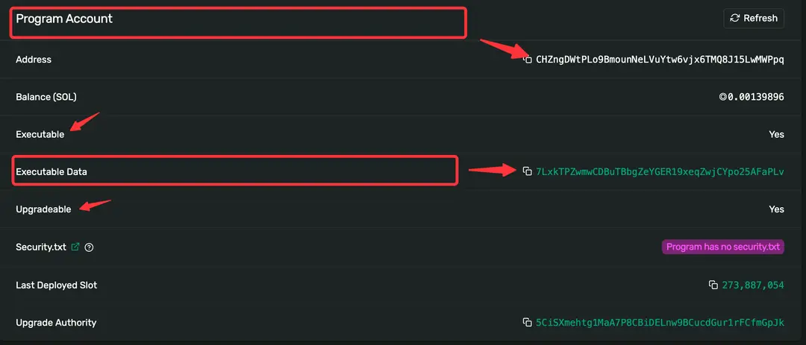

# 1 Solana 基础概念
## 1.1 介绍
[再解Solana技术架构：将要迎来第二春吗？ - PANews (panewslab.com)](https://www.panewslab.com/zh/articledetails/o84f9rcey4oo.html)

### 1.1.1 共识机制

**Solana**使用的是Proof of History (PoH)与Proof of Stake (PoS)的结合，使得网络能够达到**每秒数千笔**交易处理速度。PoH 是 Solana 独有的创新性机制，用于记录和验证区块的时间戳和顺序。PoH 通过在每个区块中引入时间证明，使得节点能够迅速达成共识，而无需等待整个网络确认。而 Solana 的 PoS 机制用于选择验证者。验证者是通过抵押一定数量的代币来参与网络验证的。持有更多代币的验证者有更大的机会被选中生成新的区块和验证交易。因此，PoH 确保区块的时间戳和顺序，PoS 则确保网络的安全性和抗攻击性，这使得 Solana 成为一个适用于高性能去中心化应用和高频交易场景的区块链平台。

**以太坊** 于2022 年 9 月完成了从Proof of Work (PoW)到Proof of Stake (PoS)的以太坊2.0版本升级，将保护以太坊安全所需的能源消耗减少了 **99.95%**，同时创建一个**更安全、碳成本更低的以太坊网络**。

### 1.1.2 交易处理能力

**Solana**支持对交易的并行处理，通过将交易分成多个子集，并将每个子集分配给不同的验证节点进行处理，从而实现交易的并行处理。这种方法可以显著提高交易吞吐量，同时保证交易的安全性和可靠性。Solana 的平均出块时间为 400 毫秒，平均每秒 2000+ 笔交易，在高负载时保持较低的交易费用。

**以太坊** 每笔交易串行执行，一笔交易执行完成再开始下一笔交易，状态依次更新，这也限制了以太坊吞吐量长期维持在每秒15笔～30笔，以牺牲性能换来安全性和一致性。不过以太坊交易处理能力的提升，主要是通过Layer2的Rollup方案来实现的，Rollup 将数百笔交易捆绑（“打包”）为以太坊网络上的单笔交易，能够将燃料费减少多达100倍，同时，24年初即将上线的 **Proto-Danksharding** 升级，会进一步降低 gas 费，提升交易吞吐量。

### 1.1.3 交易费用（Gas费）

**Solana**它的交易费用是根据交易的复杂度和大小动态计算的，这意味着，交易费用会根据交易的执行成本而变化，而不是根据网络上的交易量变化。Solana 的平均交易费用通常低于 0.01 美元，平均为 0.00025 美元，这使得进行小额交易更具成本效益。

**以太坊** 的交易费用因网络拥堵而波动，这是一种纯粹的市场机制，网络中交易拥堵情况下你的交易要想被确认，就需要支付高昂的手续费。目前一笔转账交易的手续费大概在 1 ～ 10 美元左右。但其EIP-1559升级引入了一种新的费用市场机制，旨在使费用更可预测。

### 1.1.4 智能合约

**Solana**中一切皆账户，它的智能合约（Solana 中称之为**程序**program，后续也统一使用“程序”这一术语）也是账户，但细分为**可执行账户**和**数据账户**，前者存储程序的代码，用来执行特定的逻辑，后者存储状态，即程序运行时的数据。这种分离的模式，使得程序的升级更加简单，因为程序本身无状态，可以直接升级为新的代码逻辑。

**以太坊** 的智能合约本身就包含了合约的逻辑代码，以及状态数据。因此合约部署之后，就不支持直接的升级，只能通过代理的方式间接升级，即重新部署一套合约代码，生成新的合约地址，代理再指向这个新的合约地址。

### 1.1.5 账户

**Solana**中一切皆账户，它的账户就像一个容器（或者电脑中的文件夹），可以包含程序代码、状态数据以及账户元数据。按照功能可划分为**可执行账户**和**数据账户**，前者为存储程序代码的账户，也称为程序账户。后者包括**普通用户账户**和其他非程序账户，这些账户存储了用户的余额、交易历史和其他相关数据，但它们本身不包含程序代码。对于熟悉以太坊账户的同学来说，这种划分方式也许有点奇怪，不过随着了解的深入，就会认识到 Solana 的单一账户模型，使得多个交易能够并行处理，这正是 Solana 高性能的基础。

**以太坊** 分为**EOA账户**和**智能合约**，前者是普通用户在以太坊网络中的账户，用于存储以太币（ETH）和进行交易。后者是包含智能合约代码和状态的账户，这些账户由合约创建并部署在以太坊区块链上。通过这两种账户类型的结合，以太坊提供了一个灵活且功能强大的去中心化应用开发平台。

### 1.1.6 编程语言和开发友好性

**Solana**支持包括Rust和C在内的多种编程语言，这些语言以高性能而闻名。

**以太坊** 的Solidity语言是为智能合约设计的，拥有大量的开发工具和广泛的开发者社区，这为新加入的开发者提供了丰富的资源和支持。

### 1.1.7 生态系统和用户基础

**Solana**正在快速建立其生态系统，但相对于以太坊来说还较新，存在很多机会。

**以太坊** 拥有最大的去中心化应用（DApp）生态系统，以及广泛的用户和开发者社区，这为其提供了强大的网络效应和更高的去中心化程度。

通过比较，我们会发现每个平台都有自己的优势和挑战。以太坊的广泛采用和成熟的生态系统为其提供了稳定性和信任，而 Solana 的高性能和低成本则为那些需要这些特性的应用提供了优势。


## 1.2 Solana PoH

### 1.2.1 Hash函数

Solana 的 POH 共识机制中使用的哈希函数是 SHA-256，这是一种安全哈希算法，它将任意长度的输入（也称为消息）转换为一个固定长度的输出。它的作用主要是为了确保网络的时间顺序性和安全性。这里我们看下 hash函数的一些重要特性：

1.每个不同的输入应该映射到**唯一**的哈希值，相反，从哈希值推导出原始输入数据应该是计算上不可行的。好的哈希函数应该是**单向**的，防止通过哈希值反向计算出原始数据。

2.输入数据的微小变化应该导致输出哈希值的**显著变化**。这意味着相似但不同的输入应该产生截然不同的哈希值，以提高安全性和减小冲突的可能性。

3.相同的输入应该始终产生相同的哈希值，以确保可重复性和一致性。

### 1.2.2 PoH 的工作流程

我们看一个简化版的 PoH 工作流程，从一个随机值开始，运行 hash 函数，并将输出（output）作为输入（input）再次运行该函数。记录函数执行的次数（index）以及每次调用的结果（output)。次数，提供了顺序和时间两个维度的支持；将输出作为输入，依次头尾相连，形成了一条完整的证据链。

### 1.2.3 PoH 的可验证性

由于PoH流是可验证有序的，在进行hash计算时我们会加入额外数据，如：Hash次数，事件信息等。因此，无论数据消息以多快的速度或多少被记录到基于PoH的数据结构中，我们都可以通过输入指定的次数和事件信息等来确定hash(区块)的先后顺序

### 1.2.4 PoH 的广播

当生成一个新区块时，我们可以将块的数据和结构进行切片并同时在多核GPU上并行运行验证，当验证完成后将会在Solana网络上进行广播。同时，由于区块的时序性，并且在各个节点中有一致的时间钟，我们很容易验证区块的有效性并且确定区块的先后顺序。

## 1.3 Solana Pos

### 1.3.1 介绍

先来了解下在 Solana的系统架构中最重要的两种角色：**Leader**（出块者）和 **Validator**（验证者）。两者实际上都是质押了 SOL 代币的全节点，只是在不同的出块周期内，Leader 会由不同的全节点来充当，而没有当选 Leader 的全节点会成为 Validator。 所以在选择验证者方面， Solana 采用的是 PoS（权益证明）机制，验证者是通过抵押一定数量的代币来参与网络交易的验证的，持有更多代币的验证者有更大的机会被选中生成新的区块。


1.用户发起交易后，会被客户端直接转发给 Leader 节点，或者先被普通节点接收，再立刻转发给 Leader；

2.出块者 Leader 接收网络内全部的待处理交易，一边执行，一边给交易指令排序，制成交易序列（类似区块）。每隔一段时间，Leader 会把排好的交易序列发送给 Validator 验证节点；

3.Validator 按照交易序列（区块）给定的顺序执行交易，产生相应的状态信息State（执行交易会改变节点的状态，比如改变某些账户的余额）；

4.每发送 N 个交易序列，Leader 会定期公开本地的状态 State，Validator会将其与自己的 State 作对比，给出 肯定/否定 的投票。这一步就类似于以太坊2.0或其他POS公链里的“检查点”。

5.如果在规定时间内，Leader收集到占全网 2/3 质押权重的节点们给出的肯定票，则此前发布的交易序列和状态 State 就被敲定，“检查点”通过，相当于区块完成最终确认 Finality；

6.一般而言，给出肯定票的 Validator 节点与出块者 Leader 所执行的交易、执行后的状态都是相同的，数据会同步。


### 1.3.2 Solana 如何通过 PoS 指定 Leader ？

在 Solana 的共识协议中，有 Epoch（纪元）和Slot（间隔）两大时间单位。每个 Slot 约为0.4~0.8秒，相当于一个区块的时间间隔。而每个Epoch周期包含43.2万个Slot（区块），长达2~4天。每过4个 Slot（出块周期），Leader节点就会进行一次变更。


在每个新的Epoch周期开始时，Solana网络会按照各节点的质押权重进行抽选，组成一个出块者Leader轮换名单，“钦定”了未来不同时刻的出块者。也就是说出块者会提前获知他们成为出块者。 具体而言，究竟如何指定 Leader 会考虑诸多因素，比如：

1.**质押的代币数量：** 在 PoS 中，质押的代币数量是一个关键的考虑因素。Validator 通常倾向于选择质押数量较大的节点，因为这增加了节点被选中为区块生产者的机会。这也有助于确保网络由具有足够利益参与的节点维护。

2.**节点的性能：** Validator 的节点性能是另一个关键因素。高性能的节点能够更快速地验证和打包交易，有助于维持网络的高吞吐量。Validator 可能会选择性能较好的节点以提高整个网络的效率。

3.**网络延迟：** Validator 可能会考虑节点之间的网络延迟。选择网络延迟较低的节点有助于减少区块的传播时间，从而提高网络的实时性。

4.**节点的可用性：** Validator 会关注节点的可用性，确保它们能够稳定运行而不容易出现故障。可靠的节点能够为网络提供更稳定的服务。

Solana 要实现的目标是选择一组合适的 Leader，确保网络的安全性、效率和公平性。通过综合考虑这些因素，Solana 能够做出最佳的区块生产决策，从而推动网络的正常运行。

### 1.3.3 回顾

现在在了解了基础的细节后，让我们来看看 Solana 的网络整体是如何通过 PoH 和 PoS 运作的：

1.**生成交易：** 用户创建并广播交易，包含交易的详细信息和数字签名。

2.**PoH 链上的排序：** 交易的哈希通过数字签名连接到 PoH 链上。由于 PoH 链是有序的，交易也就被排序了。

3.**Validator** **验证：** Validator 负责验证交易的有效性，并选择哪些交易将包含在下一个区块中。Validator 的选择可能基于质押的代币数量、验证者的性能等因素。

4.**交易打包成区块：** Validator 选择的交易被打包成一个区块，其中包括一个特殊的块生产交易，它包含了当前 PoH 链的哈希以及其他信息。

5.**区块传播和确认：** 区块广播到整个网络，其他节点验证并确认区块的有效性。确认后，区块和其中包含的交易就被添加到整个区块链中。

通过这个过程，Solana 通过 PoH 链的时间有序性和 PoS 的节点验证机制，实现了交易的流转和整个区块链的更新。这样的设计使得 Solana 平均出块时间被压缩至 400 毫秒，且无需 Layer2 即拥有较高速度，手续费亦可忽略不计。

> Solana 通过 PoH 的机制保证了网络中事件的有序性，通过 PoS 的节点验证机制，为其网络提供了高性能和低延迟的特性


## 1.4 Solana账户

账户之所以这么重要，是因为 Solana 作为一个分布式区块链系统，所有的信息都存储在账户中，如智能合约（Solana 叫 Onchain Program）、状态信息、Token数据、配置信息等都是存储在一个个账户中。

在学习 Solana 账户之前，让我们首先回顾一下以太坊的账户类型

以太坊将账户划分为两类：**外部账户（EOA）和合约账户（Contract Account）**。

### 1.4.1 外部账户

EOA-外部账户(external owned account)是由人们通过私钥创建的账户。 是真实世界的金融账户的映射，拥有该账户私钥的任何人都可以控制该账户。 如同银行卡，到ATM机取款时只需要密码输入正确即可交易。 这也是人类与以太坊账本沟通的唯一媒介，因为以太坊中的交易需要签名， 而只能使用拥有私有外部账户签名。大家通过 Metamask 创建的账户就属于外部账户。

外部账户特点总结：

1.拥有以太币余额。

2.能发送交易，包括转账和执行合约代码。

3.被私钥控制。

4.没有相关的可执行代码。

### 1.4.2 合约账户

含有合约代码的账户。 被外部账户或者合约创建，合约在创建时被自动分配到一个账户地址， 用于存储合约代码以及合约部署或执行过程中产生的存储数据。 合约账户地址是通过SHA3哈希算法产生，而非私钥。 因无私钥，因此无人可以拿合约账户当做外部账户使用。 只能通过外部账户来驱动合约执行合约代码。

让我们来理解一下外部账户和合约账户的异同


### 1.4.3 Solana 账户

在以太坊中，我们将代码与数据、状态直接存储在智能合约中。而 Solana 账户最大的不同就是将两者分开存放在不同的账户上。所以 Solana 账户又分为**程序账户**和**数据账户**。（*说明：Solana中的智能合约并不叫“智能合约”，而是“程序program”，尽管它们代表的是相似的概念。为了避免混淆，后续我们将统一使用“程序”这一术语。*）

●**程序账户（可执行账户）**：存储不可变的数据，主要用于存储程序的代码（BPF 字节码）。

●**数据账户（不可执行账户）**：存储可变的数据，主要用于存储程序的状态。

Solana 链上程序是只读或无状态的，即程序的账户（可执行账户）只存储代码，不存储任何状态，程序会把状态存储在其他独立的账户（不可执行账户）中。如果一个程序账户是一个数据账户的所有者，那么它就可以改变数据账户中的状态。

```rust
// 数据账户定义
#[account]
pub struct UserAccount {
    pub balance: u64,
}

// 程序账户定义
#[program]
pub mod my_game {
    use super::*;

    // 创建数据账户
    pub fn create_user_account(ctx: Context<CreateUserAccount>, initial_balance: u64) -> Result<()> {
        let user_account = &mut ctx.accounts.user_account;
        user_account.balance = initial_balance;
        Ok(())
    }

    // 更新用户账户
    pub fn update_balance(ctx: Context<UpdateBalance>, amount: u64) -> Result<()> {
        let user_account = &mut ctx.accounts.user_account;
        user_account.balance += amount; // 更新余额
        Ok(())
    }
}

// 账户上下文
#[derive(Accounts)]
pub struct CreateUserAccount<'info> {
    #[account(init, payer = user, space = 8 + UserAccount::SIZE)]
    pub user_account: Account<'info, UserAccount>, // 数据账户
    pub user: Signer<'info>, // 创建者
    pub system_program: Program<'info, System>, // 系统程序
}

#[derive(Accounts)]
pub struct UpdateBalance<'info> {
    #[account(mut)]
    pub user_account: Account<'info, UserAccount>, // 可变数据账户
}

```
- **程序账户**:
    - 程序账户在部署合约时自动创建，包含程序逻辑。
    - 只需要提供程序的字节码，而不需要额外的状态信息。
- **数据账户**:
    - 数据账户需要在程序中通过指令显式创建，通常需要指定初始状态（例如余额）。
    - 可以使用 `#[account(init)]` 属性来初始化。


> 在以太坊中，智能合约有自己的存储空间来保持状态数据。状态数据通常是合约执行过程中生成并存储的变量和信息。这些数据存储在以太坊虚拟机 (EVM) 中，并且可以在后续的交易和调用中被访问和修改。
>
> 在 Solana 中，智能合约的执行不依赖于特定的合约存储，而是通过访问和修改关联账户的数据字段。这种设计使得 Solana 在处理大规模并行交易时具有更高的效率。


### 1.4.4 Solana 的账户与租金

Solana 账户模型中还有一个特殊的「租金（Rent）」的概念。租金与交易费用不同。用户支付租金以将数据存储在 Solana 区块链上。而交易费用是为了处理网络上的指令而支付的。

与以太坊不同，Solana 会收取在其网络上的账户一笔用于存储数据状态的费用，即租金。如果账户无法支付租金，系统将删除这个账户，以减少为那些不再维护的数据花费存储成本。如果账户中的资产超过两年租金的最低余额，那么这个账户可以免交租金。Solana 上的租金存储费用为每字节 0.00000348 SOL/年，钱包数据大小为 372 字节，每个活跃钱包持有者必须保留 0.0026 SOL。

### 1.4.5 **账户的分类**

●用户账户：普通的钱包用户，类似于以太坊的 EOA 账户。

●程序账户：执行指定任务的账户，存储了程序的二进制文件，我们会在接下来的章节详细介绍。

●PDA(Program Derived Addresses)：程序派生地址。该类账户存储程序的状态，即程序执行过程中存储的数据，跟以太坊的状态是一个概念，只不过在这里被拆分到了单独的账户中。在下一节会进行专门的介绍。

●ATA(Associated Token Account)账户：关联账户。它是用户与特定的 SPL（Solana Program Library）Token 代币关联的账户，主要作用是允许用户方便管理他们持有的代币。


```rust
#[derive(Accounts)]
pub struct InitializeATA<'info> {
    #[account(mut)]
    pub user: Signer<'info>,
    pub mint: Account<'info, Mint>,
    #[account(
        init_if_needed,
        payer = user,
        associated_token::mint = mint,
        associated_token::authority = user,
    )]
    pub user_ata: Account<'info, TokenAccount>, // 这是实际的 TokenAccount
    pub token_program: Program<'info, Token>,
    pub associated_token_program: Program<'info, AssociatedToken>, // 这是 ATA 生成的程序
    pub system_program: Program<'info, System>,
}

```

`AssociatedToken` 和 `TokenAccount` 各自有不同的作用：

1. **`AssociatedToken`**: `AssociatedToken` 程序专门用于创建并管理 **关联代币账户** (Associated Token Account, ATA)。它提供了一种 **标准化** 的方式，为每个用户和特定代币生成唯一的、与用户钱包地址关联的代币账户。`AssociatedToken` 程序允许程序在需要时 **自动创建 ATA**，如果它不存在。这减少了手动创建账户的麻烦，确保程序具有预期的地址结构和账户组织方式。
    
2. **`TokenAccount`**: `TokenAccount` 是通用的 SPL 代币账户类型，它可以是任何账户，而不仅限于关联代币账户（ATA）。`TokenAccount` 并没有自动创建的功能，它仅仅表示一个代币余额的账户。因此，如果需要确保账户是 **特定用户和特定代币的 ATA**，单靠 `TokenAccount` 是不足的。
> 这俩都是mint token的时候需要的，也就是mint的时候防止用户没有`TokenAccount`账户，使用`AssociatedToken`ATA生成程序自动生成，这个是一个Program指令账户。
**为什么需要同时带上 `AssociatedToken`**

在 `Anchor` 框架的上下文中，指定 `associated_token_program: Program<'info, AssociatedToken>` 的原因是为了能够调用关联代币程序的功能，确保在账户缺失时能够 **自动生成 ATA**。这在某些情况下能提升用户体验和账户管理的便捷性。

```rust
#[account(
    init_if_needed,
    payer = user,
    associated_token::mint = mint,
    associated_token::authority = user,
)]
pub ata: Account<'info, TokenAccount>,
```

在上面的例子中，`associated_token` 属性在账户初始化时，会通过 `AssociatedToken` 程序确保 ATA 的创建，**如果没有**该账户的话。没有 `AssociatedToken` 程序的支持，仅依靠 `TokenAccount` 是无法完成这个功能的。因此，`associated_token_program` 参数是关键的一部分。

```ts
import {

ASSOCIATED_TOKEN_PROGRAM_ID,

} from "@solana/spl-token";

// 使用这个进行调用，一般来说可以不用调用

```

### 总结

- **`TokenAccount`** 表示一个通用的代币账户，但没有自动创建功能。
- **`AssociatedToken`** 程序用于确保自动创建用户与代币的唯一关联账户（ATA）。

### 1.4.6 账户的定义

现在让我们通过一个账户的定义来回顾一下 Solana 账户的概念：

```javascript
pub struct Account {
  /// 余额
  pub lamports: u64,
  /// 数据
  pub data: Vec<u8>,
  /// 所有者
  pub owner: Pubkey,
  /// 是否可执行账户
  pub executable: bool,
  /// 下次收租的时期
  pub rent_epoch: Epoch,
}
```

●**lamports**: 表示账户余额，lamport 是 Solana 中的基本货币单位，类似于以太坊的wei。

●**data**：表示存储的内容，这是一个字节数组，可以包含任意类型的数据，如程序的状态、用户资产信息，以及存储程序的字节码等。

●**owner**：表示拥有或管理该账户的程序的公钥。这表示了哪个程序有权对该账户进行操作。如果账户包含的数据是可执行的，那么owner表示加载该账户的程序。

●**executable**：表示是否可执行，如果为true，表示该账户中的数据可以被执行，是程序账户。如果为false，表示该账户用于存储普通的数据，而不是可执行代码。

●**rent_epoch**：表示下一次该账户将被扣除租金的时期。Solana使用租金机制来防止账户被无限期占用而不使用，避免状态膨胀。

## 1.5 PDA

### 1.5.1 什么是 PDA？

在Solana区块链中，PDA指的是“程序派生地址”（Program Derived Address）。这是一种特殊类型的地址，由 Solana 的程序生成，而不是由用户的私钥直接派生。**PDA的主要目的是允许程序拥有和控制某些数据或资产，而不需要传统的私钥签名**。

读到这还一头雾水吗，没关系让我们把这个概念拆开做更详细的解释。

### 1.5.2 私钥、公钥与助记词

Solana 和以太坊一样，有私钥、公钥、助记词三种东西。私钥是私自保管不可示人的，当我们授权某一笔交易时，我们需要通过私钥签名并“授权”该交易。私钥是一串乱码，不好记，与之对应有一串助记词。助记词可以通过算法推出私钥，所以实际上我们在使用钱包时，只要记住助记词。而我们可以通过加密算法从私钥推算出公钥。公钥是可以展示给别人看的，别人通过你的公钥给你转账，同时公钥也是程序的地址，也叫 program_id。

要注意的是我们只能从助记词通过加密算法推算出私钥，从私钥推算出公钥，而无法反向从公钥推算出私钥，从私钥推算出助记词。否则我们所有加密地址中的代币都可以被任何人控制了。这其中的过程通过ECDSA算法进行计算，如果希望了解具体的原理可以先从了解 ECDSA算法开始。但是理解 PDA 账户可以不必这么深入，让我们先把这个过程进行一个简化。

这就是 PDA 的原理，“程序派生地址”（Program Derived Address）是没有对应的私钥的，它是由一个程序的program_id和seed派生/衍生出来的，这也是为什么它被称之为“程序派生地址”（Program Derived Address）。有时候我们通过 program_id 和 seed 获得的公钥正好有对应的私钥，那么这种情况下我们就需要重新生成一个公钥，通常是在我们的 program_id 和 seed 之外再加上一个数字（这个数字有个专有名词叫 bump），这个数字从 255 开始，依次往下，直到生成的公钥没有私钥为止。

### 1.5.3 那我们为什么需要 PDA

在区块链中，你需要一个私钥来证明你拥有一个公钥的所有权，同时你才能签字同意这个账户的转账请求。但如果这个账户的所有者不是一个人而是一个去中心化程序，那么把私钥放在这个程序上就不是一个好主意，因为所有程序代码都在链上都是公开的，如果所有人都能看到你的私钥，那么人们就能进行一些恶意操作，比如偷走你的代币。这时我们就需要一个没有私钥的 PDA。 这样程序不需要私钥就能对一个地址进行签名操作。

### 1.5.4 如何生成 PDA 地址

> 简单点来说：带有`seeds`和`bump`属性的就是

这里我们使用 Solana 的Anchor开发框架，实现 PDA 账户的初始化（Anchor 框架我们会在后续章节专门介绍，这里只是让大家简单了解下 PDA 账户的生成过程）。

```javascript
// PDA 账户存储的数据
pub struct Counter {
    count: u64
}
```

这个 PDA 账户存储的是Counter结构的数据，它包含了一个u64类型的count值。

```javascript
pub struct InitializeAccounts<'info> {
		#[account(
			init, 
			seeds = [b"my_seed", 
							 user.key.to_bytes().as_ref()
							]
			bump,
			payer = user, 
			space = 8 + 8
		)]
		pub pda_counter: Account<'info, Counter>,
}
```

其中的pda_counter字段为要生成的PDA 账户，我们标记了初始化时用到的seeds值及bump，其中的 seeds 可以是根据业务场景设置的任意字节数组，Anchor 默认使用符合条件的第一个 bump 值，不需要我们手动指定，同时Anchor 内部也会自动获取program_id，同样不需要我们手动指定。

但是我们需要指定账户所占用的空间大小space以及支付初始化交易费的账户payer。这里指定账户的空间大小为16个字节，前 8 个字节存储 Anchor 自动添加的鉴别器，用于识别帐户类型。接下来的 8 个字节为存储在Counter帐户类型中的数据分配空间（count为 u64 类型，占用 8 字节），space 主要用于计算账户在网络中的租金。

以上就是生成 PDA 账户的部分代码示意，虽然并不完整，但向我们展示了 PDA 账户涉及到的相关内容：program_id 程序ID、seed 种子、bump 值、space 空间。后续章节会进行详细的介绍。

## 1.6 程序

### 1.6.1 什么是程序

Solana 程序，在其他链上叫做智能合约，是所有链上活动的基础。任何开发者都可以在 Solana 链上编写以及部署程序。 链上的一切活动，从去中心化金融（DeFi），到非同质化代币（NFT），再到社交媒体，链上游戏，都由Solana程序所驱动。

### 1.6.2 Solana 的**程序有哪几种**

通常可以分为以下两种：

**On-chain Programs：**这些是部署在 Solana 上的用户编写的程序，由开发者在 Solana 网络上根据具体业务场景开发的程序。它们可以通过升级权限进行升级，该权限通常是部署程序的帐户或者指定的其他账户。

**Native programs：**这些是集成到 Solana 核心模块中的程序。它们提供了验证节点（validator）运行所需的基本功能。native programs 只能通过网络范围内的软件更新进行升级。常见的原生程序有 [System Program](https://docs.solana.com/developing/runtime-facilities/programs#system-program)、[BPF Loader Program](https://docs.solana.com/developing/runtime-facilities/programs#bpf-loader) 、[Vote program](https://docs.solana.com/developing/runtime-facilities/programs#vote-program) 和 [Solana Program Libraries - SPL](https://spl.solana.com/)等。其中 [System Program](https://docs.solana.com/developing/runtime-facilities/programs#system-program) 这个程序负责管理建立新账户以及在两个账户之间转账SOL。[Solana SPL](https://spl.solana.com/) 程序定义了一系列的链上活动，其中包括针对代币的创建，交换，借贷，以及创建质押池，维护链上域名解析服务等。

### 1.6.3 Solana 的**程序有特点？**

Solana 程序模型的显着特征之一是**代码和数据的分离**。程序存储在程序账户中，它是无状态的，这意味着它们不会在内部存储任何状态，但它是可执行的executable，会执行相应的逻辑。相反，它们需要操作的所有数据都存储在单独的数据帐户中，这些帐户在 Transaction 交易中通过引用传递给程序账户，因为它本身是不可执行的。


Solana中将**程序和状态**分离的设计，这是很多以太坊开发者来到Solana生态最大的困惑，但这样的设计确实带来了很大的好处：

程序可以独立于状态进行开发、测试、部署和升级，提高了程序的可重用性和可扩展性。相反在以太坊中，智能合约和状态是绑定到一起的，合约的升级是一件非常麻烦的事情，必须通过代理模式间接实现逻辑和状态的分离，才可以进行逻辑的升级，并且在新的智能合约中，新增变量的处理要非常小心，避免存储布局 Layout 冲突，覆盖掉旧变量。

此外，由于状态数据是以账户的形式存储在网络中，因此可以方便地进行分片和并行处理，从而提高了 Solana 网络的吞吐量和效率。

所以，Solana中的程序和状态分离的设计提高了程序的可重用性和可扩展性，同时也提高了Solana网络的吞吐量和效率，使得网络的升级和维护变得更加容易。

### 1.6.4 **如何编写程序**

这里我们看一个简单的 solana 程序，这是 Rust 编写的 hello world 程序，实现了简单的日志打印。通常我们将程序写在lib.rs文件中：


```javascript
// 引入 Solana 程序的相关依赖
use solana_program::{
    account_info::AccountInfo,
    entrypoint,
    entrypoint::ProgramResult,
    pubkey::Pubkey,
    msg
};

// 程序入口点
entrypoint!(process_instruction);

// 指令处理逻辑
pub fn process_instruction(
    program_id: &Pubkey,
    accounts: &[AccountInfo],
    instruction_data: &[u8]
) -> ProgramResult{
    msg!("Hello, world!");

    Ok(())
}
```

所有的程序都有一个单独的入口点，类似于 Rust 中的main函数，指令的执行就是从这里开始的（即process_instruction），参数须包括：

●program_id: pubkey （程序ID，即程序地址）

●accounts: AccountInfo数组，指令所涉及的账户集合。

●instruction_data: byte array字节数组，即指令所需的参数，该例子中并没有用到。

在实际的项目中，通常不会把所有逻辑都写在lib.rs文件中，为了更清晰的划分功能模块，大部分程序遵循以下架构：


Preview

最近，[Anchor](https://www.anchor-lang.com/) 逐渐成为了一个广受欢迎的Solana程序开发框架，它通过减少样板代码并简化序列化和反序列化来简化程序的创建。在后续的章节，我们也会有专门的介绍。


## 1.7 交易与指令

### 1.7.1 **交易（Transaction）**

交易是一组原子性的操作，代表对区块链状态的一系列更改，包括转账代币、调用程序、更新账户状态等。每个交易都具有唯一的签名，并由一个或多个指令组成。交易费用的支付通常使用 Solana 的原生代币 SOL。

**签名：每个交易都必须由一个或多个账户的私钥进行签名，以确保交易的身份和完整性。**

### 1.7.2 **指令（Instruction）**
指令是交易中的一条具体指令，包含执行指令所需的具体数据，可以包括执行指令的程序唯一标识 program_id、账户列表、指令参数、配置信息等，用于执行一个特定的操作。

多个指令组成的交易可以实现多个不同的操作，形成一个**原子性**的事务。

当我们需要通过 Solana 发起一笔转账，或者调用一个程序时我们就需要通过交易（Transaction）来来完成。每个交易都包含：

●instructions：一个或多个指令

●blockhash：最新的块哈希值

●signatures：指令对应的发起人的签名

我们通过交易与 Solana 发生交互，而交互的最小单元就是交易中的指令（Instruction）。一个交易可以打包多个指令，指令指定调用哪个程序，要读取或修改哪些账户，以及执行程序需要的额外数据。

在进行一笔转账交易后我们可以在区块链浏览器查看相关操作，就可以看见一笔转账交易包含了三个指令: **Compute Budget: Set Compute Unit Price**， **Compute Budget：Set Compute Unit Limit**和 **Sol Transfer**

> **Set Compute Unit Price**： 设置单个CU的价格
>
> **Set Compute Unit Limit**：设置最多能消耗的CU的数量
>
> **Transfer**: 进行一次转账

## 1.8 交易费与确认

### 1.8.1 交易费用

我们在上一章提到什么是交易与指令，那么执行一个交易就需要 **Compute unit。**

如果你熟悉 EVM，**CU(Compute unit)就像是gas fee**

当然如果你不熟悉也没关系，Solana 就像个由多个节点连接组成的公共巨型计算机，节点运行者往往需要投入大量的物理资源(如CPU, GPU)来维持巨型计算机的稳定运行，为了奖励节点运行者处理链上大量的交易维持网络的稳定，gas费将做为他们贡献的补偿。

当然 CU 的存在还有一些别的目的，比如：

1.通过对交易引入实际成本，减少网络垃圾

2.设定每笔交易的最低费用金额，为网络提供长期的经济稳定性

因此，当用户在链上发送一笔交易时，往往需要支付一笔手续费用于处理交易中所包含的指令。

### 1.8.2 CU最大限制

由于每笔交易中所包含的指令调用数量和数据量的不同，每笔交易都设定了**最大的CU限制**——”**compute budget**”以确保单笔交易的数据量不会过大从而造成网络的拥堵。

每条指令的执行都会消耗不同数量的CU，在消耗了大量的CU后(即消耗的CU已经超出了”compute budget”所限定的最大CU)，指令运行将停止并返回错误，从而导致交易失败。

### 1.8.3 交易费

在一笔转账交易中，我们可以看到其中包含了对于**CU limit**和**CU price**的设置。

指令Set Compute Unit Price中，可以看到compute budget 程序将每CU的价格设定为 50000 lamports (**1 SOL = 1000,000,000 lamports**)

指令Set Compute Unit Limit中，compute budget程序将该笔交易的CU消耗上限设置为**200,000.** 当一笔交易所有的指令CU消耗超过了200,000时，交易将会失败。

手续费的计算公式为: **CU数量 \* CU价格 = 手续费用**

### 1.8.4 交易的确认

一笔交易在根据在solana网络上的确认程度可以分为以下几类主要状态:


```javascript
'processed': 查询已通过连接节点获得1次确认的最新区块
'confirmed': 查询已通过集群获得1次确认的最新区块
'finalized': 查询已由集群完成的最新区块
```


### 1.8.5 交易费的基本组成
#### Solana的Gas组成

1. **基本费用（Base Fee）**
   
    - 每个交易都有固定的基本费用，通常由网络的状态和当前的负载决定。即使交易未被执行，基本费用也会被收取。开发者应注意基本费用在高负载期间可能会有所增加。
2. **计算费用（Compute Fee）**
   
    - Solana使用计算单位（Compute Units）来衡量合约执行时所需的资源。每个操作（如数据读取、数学计算等）消耗一定数量的计算单位。复杂的合约逻辑、循环和条件语句都会增加计算费用。
3. **存储费用（Storage Fee）**
   
    - 写入和更新链上状态（例如创建账户或存储数据）会产生存储费用。每个状态的初始创建和后续更新都有相应的费用。存储费用的结构设计旨在鼓励开发者合理管理链上数据。
4. **数据传输费用（Data Transfer Fee）**
   
    - 数据在链上的传输（例如在不同账户间移动数据）也可能产生费用。虽然这部分费用通常较小，但在频繁的数据操作中也会有所累积。
5. **网络拥堵和动态费用机制**
   
    - 在网络高负载情况下，Solana会动态调整基本费用以反映网络的真实成本。这意味着在拥堵期间，费用可能会显著上升。

#### 如何减少Gas费用

作为开发人员，有几种策略可以帮助减少Solana上的gas费用：

1. **优化合约逻辑**
   
    - 减少复杂度：避免不必要的计算和复杂的控制流结构，如循环和深层嵌套条件。尽量减少合约中的状态变化，以降低计算费用。
    - 使用高效的数据结构：选择合适的数据结构（如数组、映射等），以优化存储和读取操作。
2. **批量处理**
   
    - 在合约中实现批量操作，尽量将多个操作合并为一个交易。这可以显著降低计算和存储费用，因为多个操作共享基本费用。
3. **减少存储操作**
   
    - 尽量减少对链上状态的写入和更新。使用内存存储（如局部变量）来保存临时数据，减少对链上存储的依赖。
4. **使用条件逻辑避免冗余操作**
   
    - 在合约中加入条件检查，以避免执行不必要的操作。例如，在更新状态之前检查新值是否与当前值不同。
5. **监控和调整费用**
   
    - 在开发和测试阶段，使用Solana的工具（如`solana transaction`命令）监控交易的计算单位消耗。根据这些数据，调整合约逻辑以优化费用。
6. **使用最新的Solana工具**
   
    - 关注Solana的更新和优化，确保使用最新版本的SDK和工具。这些工具通常会包含性能改进和优化，使开发更高效。


#### Solana的Gas组成示例

1. **基本费用（Base Fee）**
   
    - 每笔交易都有一个基本费用，例如，当前网络状态下的固定费用。假设基本费用为0.000005 SOL。
2. **计算费用（Compute Fee）**
   
    - 计算单位（Compute Units）是Solana衡量合约执行消耗的标准。每个操作消耗的计算单位数量不同：
        - 数据读取：约1个计算单位
        - 数据写入：约5个计算单位
        - 算术运算：约1个计算单位
    - 假设你有一个合约执行10次加法运算和1次数据写入，计算费用可能为：`10 * 1 + 5 = 15`个计算单位。
3. **存储费用（Storage Fee）**
   
    - 存储新账户或状态的费用。假设创建新账户的费用为0.002 SOL，每次更新可能会产生额外费用，例如0.0001 SOL。
4. **数据传输费用（Data Transfer Fee）**
   
    - 在链上移动数据的费用，通常较小，但在大规模数据操作中会累积。

#### 优化Gas费用的策略与示例

1. **优化合约逻辑**
   
    - **示例**：假设你有一个合约，在一个循环中执行多个数据写入操作：
      
        rust
        
        复制代码
        
        `pub fn batch_update(accounts: &[AccountInfo], data: Vec<u8>) -> ProgramResult {     for i in 0..data.len() {         // 每次循环写入         accounts[i].data.borrow_mut().copy_from_slice(&data[i]);     }     Ok(()) }`
        
        **优化**：通过一次性写入数据，避免循环中的多次写入：
        
        rust
        
        复制代码
        
        `pub fn batch_update(accounts: &[AccountInfo], data: Vec<u8>) -> ProgramResult {     let mut buffer = vec![0u8; data.len()];     buffer.copy_from_slice(&data);     accounts[0].data.borrow_mut().copy_from_slice(&buffer);     Ok(()) }`
        
    - 这样可以显著减少计算单位的消耗。
2. **减少存储操作**
   
    - **示例**：假设你频繁更新合约状态。每次更新都会产生存储费用。你可以使用临时变量，减少对链上状态的写入：
      
        rust
        
        复制代码
        
        `pub fn update_state(current: u32) -> ProgramResult {     let new_value = current + 1; // 计算新值     if new_value != current {         // 仅在值变化时写入         // 更新状态     }     Ok(()) }`
    
3. **批量处理**
   
    - **示例**：如果你需要同时处理多个用户的请求，可以将多个操作合并为一个交易。例如，假设你需要处理多个转账：
      
        rust
        
        复制代码
        
        `pub fn multi_transfer(transfers: Vec<(Pubkey, u64)>) -> ProgramResult {     for (recipient, amount) in transfers {         // 执行转账     }     Ok(()) }`
        
    - 通过批量处理，可以减少基本费用的消耗，因为所有操作在一个交易中提交。
4. **使用条件逻辑**
   
    - **示例**：在更新状态时先进行条件检查，避免不必要的写入：
      
        rust
        
        复制代码
        
        `pub fn conditional_update(state: &mut State, new_value: u32) -> ProgramResult {     if state.value != new_value {         state.value = new_value; // 仅在值改变时更新     }     Ok(()) }`
    
5. **监控和调整费用**
   
    - 开发时使用命令行工具监控计算单位消耗，例如：
      
        bash
        
        复制代码
        
        `solana transaction <TRANSACTION_SIGNATURE>`
        
    - 通过分析交易消耗的计算单位和费用，找出潜在的优化点。

## 1.9 加密与钱包

### 1.9.1 什么是 Keypair 密钥对

在 Solana 中，采用了Ed25519 curve非对称加密算法，用于生成数字签名和验证数字签名。与对称加密算法不同，非对称加密使用一对密钥：pubkey公钥和secretkey私钥，如果使用公钥加密，则只有对应的私钥能够进行解密；如果使用私钥加密，则可以使用对应的公钥验证签名，即判断该签名是否由私钥的持有者发起。

Solana 中公钥用作指向网络上帐户的address地址，由于地址本身可读性较差，也可以使用域名系统，如使用example.sol来指向dDCQNnDmNbFVi8cQhKAgXhyhXeJ625tvwsunRyRc7c8这样的地址，使得地址的辨识度更高。

私钥用于验证该密钥对的权限。如果您拥有某个地址的私钥，您就可以控制该地址内的代币。当然，您应该始终对私钥保密。更推荐的做法是使用钱包。

Solana 的[Playground](https://beta.solpg.io/)是一个在线 IDE 工具，用于在浏览器中体验和测试 Solana 区块链的功能，类似于以太坊的Remix开发工具。我们在后续的课程中会大量地使用 Solana Playground。

在 Playground 中，Wallet（钱包）通常是通过 Solana 提供的默认生成机制生成的，包括一个公钥和一个私钥。可以通过该 keypair 密钥对 Playground 中执行各种操作，如创建账户、发送交易等。用户可以通过界面上的相关功能查看和管理生成的钱包。

对于开发环境，我们可以在这个[🚰🚰🚰水龙头](https://faucet.solana.com/)地址领取测试sol，每小时最多10个（后续课程中我们需要用到大量的测试币，请提前领取）。

请注意，由于 Solana Playground 是一个测试和学习工具，生成的钱包主要用于模拟 Solana 区块链上的交互，并不适用于真实的生产环境。在真实的应用中，我们需要更安全和专业的方式来生成和管理钱包。

### Phantom 软件钱包

在进行实际的资产管理时，我们应该使用专业的软件钱包或硬件钱包。

比如，[Phantom](https://phantom.app/) 是 Solana 生态系统中使用最广泛的软件钱包之一。它支持一些最流行的浏览器，并具有用于随时随地连接的移动应用程序。更多的信息，大家可以在它的官网查阅。


## **1.10 Solana 上 NFT 的介绍**

**介绍**

**NFT**

NFT（非同质化代币）是基于区块链技术的一种独特的数字资产形式，与同质化代币不同，每个 NFT 都是唯一的，这使得它们成为数字艺术、收藏品、链游道具等理想的发行方式。

**Solana NFT**

相较于以太坊上有专门为 NFT 设计的标准，如 ERC-721、ERC-1155，Solana NFT 的标准和发行依托于 Solana 的 SPL Token 标准，但在这个基础上进行了专门的设计，以适应 NFT 的独特性。

也就是说，Solana 上的 NFT 跟其他普通的 Token 一样，都是通过 SPL Token 标准来实现的，但它与普通 Token 的区别是：

●**供应量**：每个 NFT 的供应量设置为 1，确保了其唯一性。

●**精度**：NFT 的精度设置为0，因为它们是不可切割的。

精度指代币小数点后的位数，比如，代币精度为 2 的代币，最小单位为0.01。精度为 0 意味着最小单位为 1 ，没有小数部分，所以说是不可切割的。

●**铸造权限**：铸造权限被设置为 null ，也就意味着一旦铸造完成，就不能再创建新的同类 Token，确保供应量永不改变，保证其唯一性。


### **Metadata Account**

**Metaplex**

相较于以太坊上部署的智能合约，它们包含该合约所需的逻辑代码和数据，而 Solana 并非如此，在 Solana 中，**程序**（相当于智能合约）与存储在程序外部的**数据帐户**进行交互，这样数据就不再受程序大小的限制，我们就能够实现很多更具扩展性的功能。

基于此，**Metaplex** 组织推出了一系列工具和程序，以便于 Solana NFT 的创建、发布和交易，让您轻松管理包括创建和铸造 NFT 集合的整个流程。

> **Metaplex** 协议主要包含了三个程序，分别是 **Token Metadata**、**The Candy Machine** 、**Auction House** 
>
> 1. Token Metadata 用来定义NFT元数据的标准； 
> 2. The Candy Machine 负责NFT的分发 
> 3. Auction House 负责NFT拍卖和销售。

本课程主要用到的是 **Token Metadata** 程序，作用是将附加数据添加到 SPL Token 中，该元数据包含了代币创建者的许多信息，包括创建者、名称、交易税、URL、升级管理等信息。

**Metadata Account**

关于 SPL Token，假如我们现在想要向其他人发送一些 Kitty 代币，但其他人目前没有任何关于 Kitty 代币的账户，那该怎么办？难到我们要为他们创建一个新的 Kitty 代币帐户，然后才能向他们发送 Kitty 代币吗？

通过前面对 Solana 基础课程的学习，我们知道解决方案就是 **PDA** （程序派生地址），它使用特殊算法从其他公钥派生出新的公钥。这样，给定一个“**钱包账户**”和一个“**铸币账户**”，我们就可以确定地找到关联的代币账户，这些账户被称为 **ATA** （关联令牌账户）

**Metaplex** 协议中的 **Metadata Account** 同样是在这个基础之上做了扩展，定义了用来存储 NFT 元数据信息的 Account，我们叫做 "**Metadata Account**"，其地址是经由**Metadata NFT** 管理程序和 SPL Token 的 **Mint Account**，推导出来的 PDA 唯一地址。

因此，我们知道了 SPL Token ，也就可以知道其对应的 Metadata。

理解了这个概念，我们知道如何为 NFT 添加名称（Name）、符号（Symbol）和创作者（Creators）等等附加信息。

**Master Edition Account**

在前面的学习中，我们知道了 Solana 上的 NFT 也是普通的 SPL Token，只是把供应量固定为 1，但如果有艺术家想把自己的一个作品发行 100 份，每一份有单独的版本号，也算是限量版的 1/1 NFT，那得怎么才能做到呢？

它同样是基于最初的 **Mint Account**，以 PDA 的方式推导出 **Master Edition Account** 地址，这样只要我们知道了 SPL Token ，也就可以知道其对应的 **Master Edition Account**。

它有 2 个关键的属性：

●**Supply**：当前供应量，也就是原版 NFT 被增发、复刻的次数。

●**Max Supply**：最大供应量，一旦供应量达到最大供应量，就不能再以这种方式铸造更多的 NFT。但请注意，如果 **Master Edition** 的 **Max Supply** 属性被设置为空，意味着这个 NFT 是可以被无限量增发的。


https://creatorsdao.github.io/
[调试 Solana 程序 | Solana Co Learn (creatorsdao.github.io)](https://creatorsdao.github.io/solana-co-learn/cookbook-zh/guides/debugging-solana-programs)

## 合约部署到链上的流程

- **创建钱包**：使用Solana CLI创建一个钱包，生成公私钥对。私钥用于签名交易，公钥是钱包地址。
  
- **请求SOL**：在测试网络上，使用`solana airdrop`命令获取一些SOL，以便支付部署费用。
  
- **构建合约**：在合约目录中，运行`anchor build`，这会生成`target/deploy`文件夹，其中包含编译后的合约二进制文件。
  
- **生成交易**：使用`solana program deploy`命令时，Solana CLI会创建一个交易，并将合约的BPF二进制文件包含在其中。
  
- **签名交易**：CLI会自动使用钱包的私钥对交易进行签名。这一步非常重要，因为只有签名的交易才能被提交到Solana网络。
  
- **发送交易**：签名后，交易会被发送到Solana网络，节点会验证签名，并将合约部署到链上。
  
- **确认交易**：通过`solana confirm`命令检查交易是否成功，确保合约已被成功部署并获得地址。

> BPF（Berkeley Packet Filter）起初是为了网络数据包过滤而设计的一种技术，但在Solana等区块链平台中，它作为一种通用的字节码格式，被用于智能合约的执行。Solana的运行时环境将合约编译为BPF字节码，使其能够在虚拟机中高效执行。


# Solana Rust

[如何在 Solana 中编写您的第一个锚点程序 - 第 2 部分 |QuickNode 快节点 --- How to Write Your First Anchor Program in Solana - Part 2 | QuickNode](https://www.quicknode.com/guides/solana-development/anchor/how-to-write-your-first-anchor-program-in-solana-part-2)

[Solana 中文开发教程 (solanazh.com)](https://www.solanazh.com/)

[anchor/examples/tutorial/basic-0 at master · coral-xyz/anchor](https://github.com/coral-xyz/anchor/tree/master/examples/tutorial/basic-0)


## 错误处理

### ProgramResult 枚举

ProgramResult是 solana 中定义的一个通用错误处理类型，它是solana_program中的一个结构体，具体如下：

```rust
use solana_program::entrypoint::ProgramResult;
```

代表着 Solana 程序中指令处理函数的返回值，该类型代表 Transaction 交易中指令的处理结果，成功时为单元类型()，即返回值为空，失败时返回值为ProgramError，它本身又是个枚举。

```rust
use std::result::Result as ResultGeneric;

pub type ProgramResult = ResultGeneric<(), ProgramError>;
```

在 ProgramError 中定义了 23 种常见的错误原因枚举值，也支持自定义的错误类型，如下：

```rust
pub enum ProgramError {
    // 用户自定义错误类型
    #[error("Custom program error: {0:#x}")]
    Custom(u32),

		// 参数无效
    #[error("The arguments provided to a program instruction were invalid")]
    InvalidArgument,

		// 指令数据无效
    #[error("An instruction's data contents was invalid")]
    InvalidInstructionData,

		// 账户数据无效
    #[error("An account's data contents was invalid")]
    InvalidAccountData,
    
		// ……
}
```

## Solana 入口点

Solana 网络上存储的所有数据都包含在所谓的帐户中。每个帐户都有自己唯一的地址，用于识别和访问帐户数据。Solana 程序只是一种特定类型的 Solana 帐户，用于存储和执行指令。

### **Solana crate** solana_program

[solana_program crate文档](https://docs.rs/solana-program/latest/solana_program/index.html)。

对于基本程序，我们需要将 solana_program 库中的以下项目纳入作用域：

```javascript
use solana_program::{
    account_info::AccountInfo,
    entrypoint,
    entrypoint::ProgramResult,
    pubkey::Pubkey,
    msg
};
```

●AccountInfo：account_info 模块中的一个结构体，允许我们访问帐户信息。

●entrypoint：声明程序入口点的宏，类似于 Rust 中的 main 函数。

●ProgramResult：entrypoint 模块中的返回值类型。

●Pubkey：pubkey 模块中的一个结构体，允许我们将地址作为公钥访问。

●msg：一个允许我们将消息打印到程序日志的宏，类似于 Rust 中的 println宏。

### **Solana 程序入口点**

Solana 程序需要单个入口点来处理程序指令。入口点是使用entrypoint!声明的宏。

通过如下方式声明程序的入口点函数：

```javascript
// 声明程序入口点函数
entrypoint!(process_instruction);
```

该指令处理函数我们在前面章节已介绍过，这里不再赘述。

```javascript
fn process_instruction(
		// 当前的程序ID
    program_id: &Pubkey,
		// 该指令涉及到的账户集合
    accounts: &[AccountInfo],
		// 该指令的参数
    instruction_data: &[u8],
) -> ProgramResult;
```


## 指令处理函数

Solana 程序帐户仅存储处理指令的逻辑。这意味着程序帐户是“只读”和“无状态”的。程序处理指令所需的“状态”（数据集）存储在数据帐户中（与程序帐户分开）

### 数据账户的定义

我们的 Solana 程序要实现计数器的累加，那就必须先定义该数据是以何种形式存储在 Solana 链上的，这里我们使用结构体CounterAccount，之所以使用Account后缀，因为它是一个数据账户（这个概念一开始对从以太坊转过来的开发者来说很困惑，但慢慢的你就会发现这的确是个巧妙的设计）。

```rust
/// 定义数据账户的结构
#[derive(BorshSerialize, BorshDeserialize, Debug)]
pub struct CounterAccount {
    pub count: u32,
}
```

该结构体中定义了u32类型的count属性，在我们每次发起交易指令时，它都会+1操作。因为该值的存储和传输都是使用的字节码，要把字节码转为Rust 类型，我们还需要（反）序列化操作，这里需要引入borsh库。

```rust
use borsh::{BorshDeserialize, BorshSerialize};
```

实际进行（反）序列化操作是通过`BorshSerialize`、`BorshDeserialize`这2个派生宏实现的，该宏的定义如下，它们都是对解析后类型为`TokenStream`的 Rust 代码元数据进行处理，并返回处理后的元数据。

```rust
#[proc_macro_derive(BorshSerialize, attributes(borsh_skip))]
pub fn borsh_serialize(input: TokenStream) -> TokenStream {
    // 序列化逻辑……
}

#[proc_macro_derive(BorshDeserialize, attributes(borsh_skip, borsh_init))]
pub fn borsh_deserialize(input: TokenStream) -> TokenStream {
    // 反序列化逻辑……
}
```


### 指令处理函数

这个函数的定义我们在前面已经介绍过，这里看下它的实现逻辑。

```rust
pub fn process_instruction(
		// 程序ID，即程序地址
    program_id: &Pubkey,
		// 该指令涉及到的账户集合
    accounts: &[AccountInfo]) -> ProgramResult {
    
    // 账户迭代器
    let accounts_iter = &mut accounts.iter();

    // 获取调用者账户
    let account = next_account_info(accounts_iter)?;

    // ……
}
```

为了处理指令，指令所需的数据帐户必须通过accounts参数显式传递到程序中。这里因为要对数据账户进行累加的操作，所以 accounts 包含了该数据账户，我们通过迭代器获取到该账户account。

●`?`：是一个错误处理操作符，如果`serialize`方法返回错误，整个表达式将提前返回，将错误传播给调用方。

account数据账户是由该程序派生出来的账户，因此当前程序为它的owner所有者，并且只有所有者才可以对其进行写操作。所以我们在这里要进行账户权限的校验。

```rust
// 验证调用者身份
if account.owner != program_id {
    msg!("Counter account does not have the correct program id");
    return Err(ProgramError::IncorrectProgramId);
}
```

全部代码：

```rust
pub fn process_instruction(
		// 程序ID，即程序地址
    program_id: &Pubkey,
		// 该指令涉及到的账户集合
    accounts: &[AccountInfo],
		// 指令数据
    _instruction_data: &[u8],
) -> ProgramResult {
    msg!("Hello World Rust program entrypoint");

    // 账户迭代器
    let accounts_iter = &mut accounts.iter();

    // 获取调用者账户
    let account = next_account_info(accounts_iter)?;

    // 验证调用者身份
    if account.owner != program_id {
        msg!("Counter account does not have the correct program id");
        return Err(ProgramError::IncorrectProgramId);
    }

    // 读取并写入新值
    let mut counter = CounterAccount::try_from_slice(&account.data.borrow())?;
    counter.count += 1;
    counter.serialize(&mut *account.data.borrow_mut())?;

    Ok(())
}
```


## 修改数据

### 读取数据账户

通过上一节的账户权限校验，我们可以确定当前的数据账户是正确的，那么接下来，就是读取该账户存储的数据了。

```javascript
let mut counter = CounterAccount::try_from_slice(&account.data.borrow())?;
```

这行代码的目的是从 Solana 数据账户中反序列化出 `CounterAccount` 结构体的实例。

1. `&account.data`：获取账户的数据字段的引用。在 Solana 中，账户的数据字段data存储着与账户关联的实际数据，对于程序账户而言，它是程序的二进制内容，对于数据账户而言，它就是存储的数据。

2. `borrow()`：使用该方法获取data数据字段的可借用引用。并通过`&account.data.borrow()`方式得到账户数据字段的引用。

3. `CounterAccount::try_from_slice(...)`：调用`try_from_slice`方法，它是`BorshDeserializetrait` 的一个方法，用于从字节序列中反序列化出一个结构体的实例。这里`CounterAccount`实现了`BorshDeserialize`，所以可以使用这个方法。

4. `?`：是一个错误处理操作符，如果`try_from_slice`返回错误，整个表达式将提前返回，将错误传播给调用方。

通过如上方式，我们获取了`CounterAccount`数据账户进行了反序列化，并获取到它的可变借用。

### 修改数据账户

接下来我们就可以对该数据账户进行修改：

```rust
counter.count += 1;
counter.serialize(&mut *account.data.borrow_mut())?;
```

●首先对`CounterAccount`结构体中的count字段进行递增操作。

●`&mut *account.data.borrow_mut()`：通过`borrow_mut()`方法获取账户数据字段的可变引用，然后使用*解引用操作符获取该data字段的值，并通过`&mut`将其转换为可变引用。

●`serialize`函数方法，它是`BorshSerialize trait` 的一个方法，用于将结构体序列化为字节数组。

●`?`：是一个错误处理操作符，如果`serialize`方法返回错误，整个表达式将提前返回，将错误传播给调用方。

通过如上的方式，将`CounterAccount`结构体中的修改后的值递增，并将更新后的结构体序列化为字节数组，然后写入 Solana 账户的可变数据字段中。实现了在 Solana 程序中对计数器值进行更新和存储。


### 总程序代码

```rust
use borsh::{BorshDeserialize, BorshSerialize};
use solana_program::{
    account_info::{next_account_info, AccountInfo},
    entrypoint,
    entrypoint::ProgramResult,
    msg,
    program_error::ProgramError,
    pubkey::Pubkey,
};

/// 定义数据账户的结构
#[derive(BorshSerialize, BorshDeserialize, Debug)]
pub struct CounterAccount {
    pub count: u32,
}

// 定义程序入口点函数
entrypoint!(process_instruction);

pub fn process_instruction(
		// 程序ID，即程序地址
    program_id: &Pubkey,
		// 该指令涉及到的账户集合
    accounts: &[AccountInfo],
		// 指令数据
    _instruction_data: &[u8],
) -> ProgramResult {
    msg!("Hello World Rust program entrypoint");

    // 账户迭代器
    let accounts_iter = &mut accounts.iter();

    // 获取调用者账户
    let account = next_account_info(accounts_iter)?;

    // 验证调用者身份
    if account.owner != program_id {
        msg!("Counter account does not have the correct program id");
        return Err(ProgramError::IncorrectProgramId);
    }

    // 读取并写入新值
    let mut counter = CounterAccount::try_from_slice(&account.data.borrow())?;
    counter.count += 1;
    counter.serialize(&mut *account.data.borrow_mut())?;

    Ok(())
}
```


部署：

部署成功后，我们可以在 Solana 区块链浏览器中查看[该笔交易信息](https://explorer.solana.com/tx/n4rQU85FmLjB82RAkRvRwj9jYYSseUYfvRi4jY6ZpxuoNGd8qFCiV4UsDbyKVviY5GWcBm7hwNVzMvr5JhvYaux?cluster=devnet)。其中5CiS...为我们的wallet钱包公钥，而CHZn.…为程序账户，它具有executable可执行属性，并且updateable可升级，该程序ID下对应的7Lxk…账户存储了程序的二进制文件（请注意：二进制文件并不是直接存储在程序账户中，而是下面的子账户中）。


这里展示了程序账户和子账户（存储程序二进制文件）之间的关系。



## 状态管理

### 租金计算

```rust
// 计算存储结构体 NoteState 所需的账户大小
// 4字节用于存储后续动态数据（字符串）的大小
// 8字节用于存储64位整数ID
let account_len: usize = (4 + title.len()) + (4 + body.len()) + 8;

// 计算所需租金
let rent = Rent::get()?;
let rent_lamports = rent.minimum_balance(account_len);
```


# Anchor

Anchor 是一个用于**快速**、**安全**的构建 Solana 程序的框架。它为您编写大量的样板代码，比如（反）序列化帐户和指令数据等，使您更专注于业务逻辑的开发。同时，它也会执行特定的安全检查、账号验证等，当然，也支持您轻松地实现自定义的其他检查。

Anchor 也为前端项目提供了一系列的库和工具，简化了跟链上程序交互的复杂度。它也对 PDA （程序衍生账户）、CPI（跨程序调用） 提供了一系列的支持。


## 安装

Anchor 本身是 Rust 写的 Solana 开发框架，同时也支持前端项目，因此它的安装涉及到一系列的依赖，比如 Rust、Solana、Yarn，在完成依赖的安装后，再安装 Anchor 版本管理工具(Anchor Version Manager) avm，如果你熟悉 Nodejs，**他就像管理 nodejs 版本的 nvm。** 通过avm，我们能更加灵活的使用和管理 Anchor。[安装指南可以看这里](https://www.anchor-lang.com/docs/installation)。


```sh
C:\Users\Administrator>solana-keygen new
Generating a new keypair

For added security, enter a BIP39 passphrase

NOTE! This passphrase improves security of the recovery seed phrase NOT the
keypair file itself, which is stored as insecure plain text

BIP39 Passphrase (empty for none):


Wrote new keypair to C:\Users\Administrator\.config\solana\id.json
=====================================================================
pubkey: GhuT9vp4JnLEYBsDFFAShUXekw4nSEq8XZyrsc8efPNu
=====================================================================
Save this seed phrase and your BIP39 passphrase to recover your new keypair:
coyote honey kit valve excuse nominee farm fan trick board quote tone
=====================================================================
```


### 常用指令

1、**创建新项目**：这个命令用于创建一个新的 Anchor 项目，包含了 demo 代码，你可以用自己的项目名称替换 **my_project** 。

```rust
anchor init my_project
```

2、**构建新的程序（智能合约）**：这个命令用于构建和编译程序。它会在target/deploy目录下生成编译后的合约二进制文件。如果在项目目录下可以省略项目名称。

```bash
anchor build [my_project]
```

**3**、**测试程序逻辑**：运行这个命令会执行程序的测试套件，确保程序的功能正常。

```bash
anchor test
```

4**、部署程序到指定网络**：Solana 的 devnet 是一个专门用于开发和测试的网络，通常我们会把项目先部署在本地或者开发测试网进行验证，验证通过后部署到主网 mainnet-beta。

```rust
// 部署到开发测试网
anchor deploy --env devnet
// 部署到主网
anchor deploy --env mainnet-beta
```

### 项目目录结构

创建完项目 **my_project** 后，我们进入 **my_project** 文件夹， 可以看到 Anchor 自动生成的文件和目录：

```bash
my_project/
├── Anchor.toml
├── programs/
│   └── my_program/
│       ├── Cargo.toml
│       ├── src/
│       │   └── lib.rs
│       └── tests/
│           └── program_test.rs
├── target/
└── tests/
    └── integration_test.rs
```

这是一个简化的结构，提供了一个基本的框架，使你能够开始编写、测试和部署程序。在具体的项目中，你可能需要根据需求添加其他文件和目录，例如配置文件、文档等。以下是一些关键文件和目录的说明：

●**Anchor.toml****：** 项目的配置文件，包含项目的基本信息、依赖关系和其他配置项。

●**programs**目录**：** 包含你的程序的目录。在这个例子中，有一个名为**my_program**的子目录。

●**Cargo.toml****：** 程序的Rust项目配置文件。

●**src**目录**：** 包含实际的程序代码文件，通常是**lib.rs**，在实际的项目中我们会根据模块划分，拆的更细。

●**tests**目录**：** 包含用于测试程序的测试代码文件。

●**target**目录**：** 包含构建和编译生成的文件。

●**tests**目录**：** 包含整合测试代码文件，用于测试整个项目的集成性能。


`anchor help`

```sh
anchor help

available commands:
  init      初始化一个工作空间。
  build     构建整个工作空间。
  expand    展开宏（cargo expand 的包装）。
  verify    验证链上字节码是否与本地编译的构件匹配。在程序子目录中运行此命令，即包含程序的 Cargo.toml 文件的目录。
  test      在本地网络运行集成测试。
  new       创建一个新的程序。
  idl       与接口定义语言（IDL）交互的命令。
  clean     从目标目录中删除除程序密钥对之外的所有构建产物。
  deploy    部署工作空间中的每个程序。
  migrate   运行部署迁移脚本。
  upgrade   部署、初始化接口定义并一次性迁移所有内容的命令。升级单个程序。配置的钱包必须是升级权限。
  cluster   集群命令。
  shell     启动一个带有 anchor 客户端设置的节点 shell。
  run       运行由当前工作空间的 anchor.toml 定义的脚本。
  login     将来自注册表的 API 令牌保存到本地。
  publish   将经过验证的构建发布到 anchor 注册表。
  keys      密钥对命令。
  localnet  本地网络命令。
  account   使用提供的接口定义获取并反序列化帐户。
  help      打印此消息或给定子命令的帮助信息。
```

```rust
anchor help deploy
```


### **anchor init** **和** **anchor new** **有什么区别？**

它们都是用于创建 Anchor 项目的命令，但它们有不同的目的和用法：

1.`anchor init` ：初始化工作空间，该命令会创建一个包含基本项目结构和配置文件的工作空间。你需要指定一个工作空间的名称，例如 `anchor init my_workspace` 中的 `my_workspace`。

2.`anchor new`：创建新程序，创建一个新的 Anchor 程序（智能合约），包括相关的目录和文件。你需要指定一个程序的名称，例如 `anchor new my_program` 中的`my_program`。

通常，你会首先使用anchor init初始化一个工作空间，然后使用anchor new在该工作空间中创建一个或多个程序。

### anchor verify 指令有什么作用？

该指令用于验证链上部署的程序的字节码是否与本地编译的构件（artifact）匹配。这个命令通常在开发者部署程序到 Solana 区块链之后使用，以确保链上的合约与本地开发环境中的代码一致。

在使用这个命令时，你需要在包含程序程序的目录中运行，即包含程序的Cargo.toml文件的目录。执行anchor verify会比较链上合约的字节码和本地编译的构件，确保它们一致。

验证的过程通常包括以下步骤：

1.检查链上合约的程序 ID 是否与本地编译的程序 ID 一致。

2.对比链上合约的字节码和本地编译的构件，确保它们相匹配。

通过这个命令，开发者可以确保在本地开发环境中编写的合约与实际部署到链上的合约是一致的，减少了由于编译或其他环境问题引起的潜在错误。


### anchor upgrade 指令有什么作用？

该命令是用于一次性升级程序的命令。它的作用是部署、初始化接口定义（IDL），并将执行所有迁移的过程集成在一起。这个命令通常用于升级一个单独的程序，而不是整个工作空间。这个命令会执行以下步骤：

1.**部署最新版本的程序：**意味着将程序的最新版本上传到 Solana 区块链网络上，并在链上创建一个新的程序实例。这个过程涉及将新的程序二进制文件部署到链上，以便替换先前部署的程序版本。

2.**初始化接口定义**（IDL）：IDL 是一种描述程序接口的语言，用于定义合约的数据结构、方法和事件。初始化接口定义的过程是将这些接口定义部署到链上，以便客户端能够与程序进行交互，并能够正确地解析合约的数据结构和方法。

3.**执行所有必要的迁移脚本**：迁移脚本是用于在合约升级或修改时执行的脚本。它包含了在链上执行的逻辑，例如更新存储结构、迁移数据等。迁移脚本的目的是确保链上合约状态的平滑过渡，使新版本的合约能够与旧版本兼容。


## 程序结构

在执行完anchor init my_project命令后，会自动生成 Anchor 示例项目，其中的lib.rs文件是 Anchor 框架的核心模块，包含了许多macros宏，这些宏为我们的程序生成 Rust 模板代码以及相应的安全校验。这里主要用到的宏是：

●**declare_id!**: 声明**程序地址**。该宏创建了一个存储程序地址program_id的字段，你可以通过一个指定的program_id访问到指定的链上程序。

●**#[program]**: 程序的**业务逻辑代码**实现都将在#[program]模块下完成。

●**#[derive(Accounts)]**: 由于Solana 账户模型的特点，大部分的参数将以**账户集合**的形式传入程序，在该宏修饰的结构体中定义了程序所需要的账户集合。

●**#[account]**：该宏用来修饰程序所需要的自定义账户。

### Anchor 框架的结构

我们以下面代码为例，该程序使用instruction_one指令函数接收u64类型的数据，并保存在链上Counter结构体中。当然，Solana 中一切皆账户，所以Counter结构体也是该程序的派生账户 PDA。

```rust
// 引入 anchor 框架的预导入模块
use anchor_lang::prelude::*;

// 程序的链上地址
declare_id!("3Vg9yrVTKRjKL9QaBWsZq4w7UsePHAttuZDbrZK3G5pf");

// 指令处理逻辑
#[program]
mod anchor_counter {
    use super::*;
    pub fn instruction_one(ctx: Context<InstructionAccounts>, instruction_data: u64) -> Result<()> {
        ctx.accounts.counter.data = instruction_data;
        Ok(())
    }
}

// 指令涉及的账户集合
#[derive(Accounts)]
pub struct InstructionAccounts<'info> {
    #[account(init, seeds = [b"my_seed", user.key.to_bytes().as_ref()], payer = user, space = 8 + 8)]
    pub counter: Account<'info, Counter>,
    #[account(mut)]
    pub user: Signer<'info>,
    pub system_program: Program<'info, System>,
}

// 自定义账户类型
#[account]
pub struct Counter {
    data: u64
}
```


**1、导入框架依赖：**这里导入了 Anchor 框架的预导入模块，其中包含了编写Solana 程序所需的基本功能，比如AnchorDeserialize和AnchorSerialize（反序列化和序列化）、Accounts（用于定义和管理程序账户的宏）、Context（提供有关当前程序执行上下文的信息，包括账户、系统程序等）…**…**


```rust
1// 引入相关依赖
2use anchor_lang::prelude::*;
```

**2、** **declare_id!宏**：指定 Solana 链上程序地址。当你首次构建 Anchor 程序时，框架会自动生成用于部署程序的默认密钥对，其中相应的公钥即为declare_id!宏所声明的程序ID（program_id）。

通常情况下，每次构建 Anchor 框架的 Solana 程序时，program_id 都会有所不同。但是通过declare_id!宏指定某个地址，我们就能保证程序升级后的地址不变。这种升级方式比起以太坊中智能合约的升级（使用代理模式），要简单很多。


```rust
1// 这里只是示意，实际的 program_id 会有所不同
2declare_id!("Fg6PaFpoGXkYsidMpWTK6W2BeZ7FEfcYkg476zPFsLnS");
```

**3、** **#[program]宏**：修饰包含了所有程序 instructions 指令的模块，该模块中实现了处理指令的具体业务逻辑，每个pub修饰的公共函数，都是一个单独的指令。函数的参数有以下2种：

●第一个参数为 Context 类型，包含了处理该指令的上下文信息。

●第二个参数为指令的数据，可选。

**4、** **#[derive(Accounts)] 派生宏**：定义了 instruction 指令所要求的账户列表。该宏实现了给定结构体InstructionAccounts（反）序列化的 Trait 特征，因此在获取账户时不再需要手动迭代账户以及反序列化操作。并且实现了账户满足程序安全运行所需要的安全检查，当然，需要`#[account]`宏配合使用。

**5、** **#[account]**：该宏用来修饰程序所需要的自定义账户，它支持定义账户的属性并实现相应的安全校验。这里我们的自定义了一个计数器Counter。当然，可以有更复杂的结构，取决于我们的具体业务逻辑。


### #[program]宏

> 该宏定义一个 Solana 程序模块，其中包含了程序的指令（instructions）和其他相关逻辑。它包含如下的功能：

**1、定义处理不同指令的函数：**在程序模块中，开发者可以定义处理不同指令的函数。这些函数包含了具体的指令处理逻辑。上节只有1个指令函数instruction_one，本节我们在 #[program] 宏中实现了2个指令函数：initialize和increment，用来实现计数器的相关逻辑，使其更接近于实际的业务场景。

```rust
#[program]
mod anchor_counter {
    use super::*;
		// 初始化账户，并以传入的 instruction_data 作为计数器的初始值
    pub fn initialize(ctx: Context<InitializeAccounts>, instruction_data: u64) -> Result<()> {
				ctx.accounts.counter.count = instruction_data;
        Ok(())
    }

		// 在初始值的基础上实现累加 1 操作
    pub fn increment(ctx: Context<UpdateAccounts>) -> Result<()> {
        let counter = &mut ctx.accounts.counter;
        msg!("Previous counter: {}", counter.count);
        counter.count = counter.count.checked_add(1).unwrap();
        msg!("Counter incremented. Current count: {}", counter.count);
        Ok(())
    }
}
```

**2、提供与** **Solana SDK** **交互的功能：**通过 #[program] 宏，Anchor 框架提供了一些功能，使得与 Solana SDK 进行交互变得更加简单。例如，可以直接使用 declare_id、Account、Context、Sysvar 等结构和宏，而不必手动编写底层的 Solana 交互代码，本单元第一节我们没有使用 Anchor 框架，所以需要手动迭代账户、判断账户权限等操作，现在 Anchor 已经替我们实现了这些功能。

**3、自动生成 IDL（接口定义语言）：**#[program] 宏也用于自动生成程序的 IDL。IDL 是用于描述 Solana 程序接口的一种规范，它定义了合约的数据结构、指令等。Anchor 框架使用这些信息生成用于与客户端进行交互的 Rust 代码。

Solana 的 IDL（接口定义语言）和以太坊的 ADSL（Application Binary Interface Description Language）有一些相似之处。它们都是一种用于描述智能合约接口的语言规范，包括合约的数据结构、指令等信息。

### Context

Context是 Anchor 框架中定义的一个结构体，用于封装与 Solana 程序执行相关的上下文信息，**包含了 instruction 指令元数据以及逻辑中所需要的所有账户信息**。它的结构如下：

```rust
// anchor_lang::context
pub struct Context<'a, 'b, 'c, 'info, T> {
    /// 当前的program_id
    pub program_id: &'a Pubkey,
    /// 反序列化的账户集合accounts
    pub accounts: &'b mut T,
    /// 不在 accounts 中的账户，它是数组类型
    pub remaining_accounts: &'c [AccountInfo<'info>],
    /// ...
}
```

Context 使用泛型`T`指定了指令函数所需要的账户集合，在实际的使用中我们需要指定泛型 `T` 的具体类型，如`Context<InitializeAccounts>`、`Context<UpdateAccounts>`等，通过这个参数，指令函数能够获取到如下数据：

●`ctx.program_id`：程序ID，当前执行的程序地址。它是一个 Pubkey 类型的值。

●`ctx.accounts`：账户集合，它的类型为泛型 T 所指定的具体类型，如初始化操作所需的账户集合`InitializeAccounts`，更新操作所需的账户集合`UpdateAccounts`，通过派生宏 `#[derive(Accounts)]` 生成。并且 Anchor 框架会为我们自动进行反序列化。

●`ctx.remaining_accounts`：剩余账户集合，包含了当前指令中未被 `#[derive(Accounts)]` 明确声明的账户。它提供了一种灵活的方式，使得程序能够处理那些在编写程序时不确定存在的账户，或者在执行过程中动态创建的账户。其中的账户不支持直接的反序列化，需要手动处理。

#### `Context<T>` 泛型 T

我们先看下第一个指令函数的泛型T：`InitializeAccounts`，该账户集合有3个账户，第1个为数据账户`pda_counter`，它是该程序的衍生账户，用于存储计数器数据；第2个参数为对交易发起签名的账户`user`，支付了该笔交易费；第3个参数为 Solana 系统账户`system_program`，因为PDA账户需要由系统生成，所以我们也需要这个系统账户。

```rust
#[derive(Accounts)]
pub struct InitializeAccounts<'info> {
		// pda 账户
    #[account(init, seeds = [b"my_seed", user.key.to_bytes().as_ref()], payer = user, space = 8 + 8)]
    pub pda_counter: Account<'info, Counter>,
		// 交易签名账户
    #[account(mut)]
    pub user: Signer<'info>,
    pub system_program: Program<'info, System>,
}
```

#### 指令参数（可选）

在 Anchor 框架中，指令函数的第一个参数ctx是**必须**的，而第二个参数是指令函数执行时传递的额外数据，是**可选**的，是否需要取决于指令的具体逻辑和需求。在initialize中，它被用于初始化计数器的初始值；而在increment中，该指令不需要额外的数据，所以只有ctx参数。


### Accounts

使用ctx.accounts可以获取指令函数的账户集合InitializeAccounts，它是一个实现了#[derive(Accounts)]派生宏的结构体。该派生宏为结构体生成与 Solana 程序账户相关的处理逻辑，以便开发者能够更方便地访问和管理其中的账户。

```rust
// anchor_lang::context
pub struct Context<'a, 'b, 'c, 'info, T> {
    pub accounts: &'b mut T,
    // ...
}

#[program]
mod anchor_counter {
    pub fn initialize(ctx: Context<InitializeAccounts>, instruction_data: u64) -> Result<()> {
        ctx.accounts.counter.count = instruction_data;
        Ok(())
    }
}

#[derive(Accounts)]
pub struct InitializeAccounts<'info> {
    #[account(init, payer = user, space = 8 + 8)]
    pub counter: Account<'info, Counter>,
    // ...
} 
```


#### #[derive(Accounts)] 宏的介绍

该宏应用于指令所要求的账户列表，实现了给定 struct 结构体数据的反序列化功能，**因此在获取账户时不再需要手动迭代账户以及反序列化操作，并且实现了账户满足程序安全运行所需要的安全检查**，当然，需要#[account]宏配合使用。

1、下面我们看下示例中的InitializeAccounts结构体，当initialize指令函数被调用时，程序会做如下2个校验：

```rust
#[derive(Accounts)]
pub struct InitializeAccounts<'info> {
    #[account(init, seeds = [b"my_seed", user.key.to_bytes().as_ref()], payer = user, space = 8 + 8)]
    pub pda_counter: Account<'info, Counter>,
    #[account(mut)]
    pub user: Signer<'info>,
    pub system_program: Program<'info, System>,
}
```

●**账户类型校验：**传入的账户是否跟InitializeAccounts定义的账户类型相匹配，例如Account、Singer、Program等类型。

●**账户权限校验**：根据账户标注的权限，框架会进行相应的权限校验，例如检查是否有足够的签名权限、是否可以修改等。

如果其中任何一个校验失败，将导致指令执行失败并产生错误。

2、InitializeAccounts结构体中有如下3种账户类型：

2.1、 **Account类型**：它是AccountInfo类型的包装器，**可用于验证账户所有权并将底层数据反序列化为Rust类型**。对于结构体中的counter账户，Anchor 会实现如下功能：

```rust
pub pda_counter: Account<'info, Counter>,
```


① 该账户类型的 Counter 数据自动实现反序列化。

② 检查传入的所有者是否跟 Counter 的所有者匹配。

2.2、**Signer类型**：这个类型会检查给定的账户是否签署了交易，但并不做所有权的检查。只有在并不需要底层数据的情况下，才应该使用Signer类型。**表示这个账户是一个签名者，即它拥有进行交易或操作的权限。**

```rust
pub user: Signer<'info>,
```

2.3、**Program类型**：验证这个账户是个特定的程序。对于system_program 字段，Program 类型用于指定程序应该为系统程序，Anchor 会替我们完成校验。

system_program 属性是用于执行Solana上的基本操作，**如账户的创建和管理。这个属性是程序与Solana系统级功能交互的桥梁。**

`<'info> `确保这些引用在整个 **Initialize** 结构体的生命周期内都是有效的。这意味着，只要 **Initialize** 结构体存在，其中的账户数据就可以安全地被访问和使用。

```rust
pub system_program: Program<'info, System>,
```

完整代码


```rust
// 引入 anchor 框架的预导入模块
use anchor_lang::prelude::*;

// 程序的链上地址
declare_id!("3Vg9yrVTKRjKL9QaBWsZq4w7UsePHAttuZDbrZK3G5pf");

// 指令处理逻辑
#[program]
mod anchor_counter {
    use super::*;
    pub fn initialize(ctx: Context<InitializeAccounts>, instruction_data: u64) -> Result<()> {
        ctx.accounts.counter.count = instruction_data;
        Ok(())
    }

    pub fn increment(ctx: Context<UpdateAccounts>) -> Result<()> {
        let counter = &mut ctx.accounts.counter;
        msg!("Previous counter: {}", counter.count);
        counter.count = counter.count.checked_add(1).unwrap();
        msg!("Counter incremented. Current count: {}", counter.count);
        Ok(())
    }
}

// 指令涉及的账户集合
#[derive(Accounts)]
pub struct InitializeAccounts<'info> {
    #[account(init, seeds = [b"my_seed", user.key.to_bytes().as_ref()], payer = user, space = 8 + 8)]
    pub pda_counter: Account<'info, Counter>,
    #[account(mut)]
    pub user: Signer<'info>,
    pub system_program: Program<'info, System>,
}

#[derive(Accounts)]
pub struct UpdateAccounts<'info> {
    #[account(mut)]
    pub counter: Account<'info, Counter>,
    pub user: Signer<'info>,
}

// 自定义账户类型
#[account]
pub struct Counter {
    count: u64
}
```


## account核心

 Anchor实现的**账户属性约束**：**#[account(..)]**。

```rust
#[derive(Accounts)]
struct ExampleAccounts {
  #[account(
    seeds = [b"example_seed"],
    bump
  )]
  pub pda_account: Account<'info, AccountType>,
  
	#[account(mut)]
  pub user: Signer<'info>,
}
```

### **#[account(..)]** 宏的介绍-PDA

> 这个可以理解为上链，pda生成的一个链上账户数据

PDA账户是由`program_id`、`seeds` 和 `bump` 的哈希生成的。

> 如果你在 `#[account]` 宏中添加 `init` 属性，而所提供的 `seeds` 和 `bump` 值与现有的账户相同，是不会生成一个新的账户的。因为 `init` 的作用是**初始化一个账户**，而账户地址是基于 `program_id`、`seeds` 和 `bump` 的哈希生成的。
> 其中的bump是程序在计算地址时自动生成的一个值（Anchor 默认使用符合条件的第一个 bump 值）

**Bump 值的使用流程：**
> 初始计算: 当你定义一个 PDA 并使用 seeds 和 program_id 时，系统会首先尝试使用这些种子和 program_id 来生成一个地址。这是通过计算哈希值实现的。
> 
> 检查是否存在: 生成的 PDA 地址会被检查是否已经存在。如果该地址没有对应的私钥（即没有已存在的账户），那么这个地址就被视为有效，无需使用 bump 值。

**冲突处理:**
> 如果发现地址已经存在（即已经有一个账户与该 PDA 地址对应），系统会开始增加 bump 值。
> Bump 值的范围: 通常，bump 值的范围是从 0 到 255。系统会从 255 开始递减，逐个尝试，直到找到一个没有对应私钥的 PDA 地址。
> 每次尝试使用新的 bump 值时，PDA 地址都会重新计算。
> 生成有效 PDA: 一旦找到一个没有冲突的地址，系统就会使用该地址和相应的 bump 值。


**1、初始化一个派生账户地址 PDA ：**它是根据seeds、program_id以及bump动态计算而来的，其中的bump是程序在计算地址时自动生成的一个值（Anchor 默认使用符合条件的第一个 bump 值），不需要我们手动指定。

```rust
#[account(
	init, 
	seeds = [b"my_seed"], 
	bump,
	payer = user, 
	space = 8 + 8
)]
pub pda_counter: Account<'info, Counter>,
pub user: Signer<'info>,
```


●**init：**Anchor 会通过相关属性配置初始化一个派生帐户地址 PDA 。

●**seeds：**种子（seeds）是一个任意长度的字节数组，通常包含了派生账户地址 PDA 所需的信息，在这个例子中我们仅使用了字符串my_seed作为种子。当然，也可以包含其他信息：如指令账户集合中的其他字段user、指令函数中的参数instruction_data，示意代码如下：

```rust
#[derive(Accounts)]
#[instruction(instruction_data: String)]
pub struct InitializeAccounts<'info> {
		#[account(
			init, 
			seeds = [b"my_seed", 
			user.key.to_bytes().as_ref(),
			instruction_data.as_ref()]
			bump,
			payer = user, 
			space = 8 + 8
		)]
		pub pda_counter: Account<'info, Counter>,
		pub user: Signer<'info>,
}
```

●**payer：**指定了支付账户，即进行账户初始化时，使用user这个账户支付交易费用。

●**space：**指定账户的空间大小为16个字节，前 8 个字节存储 Anchor 自动添加的鉴别器，用于识别帐户类型。接下来的 8 个字节为存储在Counter帐户类型中的数据分配空间（count为 u64 类型，占用 8 字节）。


```rust
#[derive(Accounts)]
#[instruction(instruction_data: String)]
pub struct Example<'info> {
    #[account(seeds = [b"example-seed", user.key().as_ref(), instruction_data.as_ref()]
    pub pad_account: Account<'info, AccountType>,
    #[account(mut)]
    pub user: Signer<'info>,
}
```
在此示例中，通过`seed`和`bump`约束验证`pda_account`的地址是否是预期的`PDA`。

推导`PDA`的 `seeds`包括：

- `example_seed` - 一个硬编码的字符串值
- `user.key()` - 传入账户的公钥 `user`
- `instruction_data` - 传入指令的数据
    - 你可以通过`#[instruction(...)]`属性来访问这些数据

默认情况下，`init`会将创建账户的所有者设置为当前正在执行的程序。

- 当使用`init`与`seeds`和`bump`初始化`PDA`账户时，所有者必须是正在执行的程序
- 这是因为创建账户需要签名，只有执行程序的`PDA`才能提供
- 如果用于派生`PDA`的`programId`与正在执行的程序的`programId`不匹配，则`PDA`账户初始化的签名验证将失败
- 因为`init`使用`find_program_address`来推导`PDA`，所以不需要指定`bump`值
- 这意味着`PDA`将使用规范的`bump`进行推导
- 在为执行`Anchor`程序所初始化和拥有的账户分配`space`时，请记住前8个字节是保留给唯一账户`discriminator`的，`Anchor`程序使用该`discriminator`来识别程序账户类型

**2、验证派生账户地址 PDA ：**有些时候我们需要在调用指令函数时，验证传入的 PDA 地址是否正确，也可以采用类似的方式，只需要传入对应的seeds和bump即可，Anchor就会按照此规则并结合program_id来计算 PDA 地址，完成验证工作。注意：这里不需要init属性。

```rust
#[derive(Accounts)]
#[instruction(instruction_data: String)]
pub struct InitializeAccounts<'info> {
		#[account(
			seeds = [b"my_seed", 
							 user.key.to_bytes().as_ref(),
							 instruction_data.as_ref()
							]
			bump
		)]
		pub pda_counter: Account<'info, Counter>,
		pub user: Signer<'info>,
}
```

 #### **#[account(mut)]** **属性约束**

●**mut：**表示这是一个可变账户，即在程序的执行过程中，这个账户的数据（包括余额）可能会发生变化。在Solana 程序中，对账户进行写操作需要将其标记为可变。

```rust
#[derive(Accounts)]
pub struct InstructionAccounts {
		// 账户属性约束
    #[account(init, seeds = [b"mySeeds"], payer = user, space = 8 + 8)]
    pub account_name: Account<'info, MyAccount >,
    ...
}

// 账户结构体上的 #[account] 宏
#[account]
pub struct MyAccount {
    pub my_data: u64,
}
```

在许多情况下，你可能需要更新现有账户而不是创建新账户。`Anchor`提供了出色的`realloc`约束，为现有账户重新分配空间提供了一种简便的方法。

```
#[derive(Accounts)]
#[instruction(instruction_data: String)]
pub struct ReallocExampl<'info> {
    #[account(
        mut,
        seeds = [b"example_seed", user.key().as_ref()]
        bump,
        realloc = 8 + 4 + instruction_data.len(),
        realloc::payer = user,
        realloc::zero = false,
    )]
    pub pda_account: Account<'info, AccountType>,
    #[account(mut)]
    pub user: Signer<'info>,
    pub system_program: Program<'info, System>,
}

#[account]
pub struct AccountType  {
    pub data: u64
}
```

`realloc`约束必须与以下内容结合使用：

- `mut` - 账户必须设置为可变
- `realloc::payer` - 账户空间的增加或减少将相应增加或减少账户的`lamports`
- `realloc::zero` - 一个布尔值，用于指定是否应将新内存初始化为零
- `system_program` - `realloc`约束要求在账户验证结构中存在`system_program`

例如，重新分配用于存储`String`类型字段的账户的空间。

- 使用`String`类型时，除了`String`本身所需的空间外，还需要额外的4个字节来存储`String`的长度
- 如果账户数据长度是增加的，为了保持租金豁免，`Lamport`将从`realloc::payer`转移到程序账户
- 如果长度减少，`Lamport`将从程序账户转回`realloc::payer`
- 需要`realloc::zero`约束来确定重新分配后是否应对新内存进行零初始化
- 在之前减小过空间的账户上增加空间时，应将此约束设置为true


#### `close` 关闭操作

当你用完一个账户并不再需要它时会发生什么呢？你可以将它关闭！

通过这样做，你可以腾出空间，并收回用于支付租金的`SOL`！

执行关闭操作是通过使用 `close` 约束来完成的：

```rust
pub fn close(ctx: Context<Close>) -> Result<()> {
    Ok(())
}

#[derive(Accounts)]
pub struct Close<'info> {
    #[account(mut, close = receiver)]
    pub data_account: Account<'info, AccountType>,
    #[account(mut)]
    pub receiver: Signer<'info>,
}
```

- `close` 约束会在指令执行结束时将账户标记为已关闭，并通过将其`discriminator`设置为 `CLOSED_ACCOUNT_DISCRIMINATOR`，同时将其 `lamports` 发送到特定的账户。
- 将`discriminator`设置为特定的变量，以阻止账户复活攻击（例如，后续指令重新添加租金豁免的`lamports`）。
- 我们将关闭名为 `data_account` 的账户，并将用于租金的`lamports`发送到名为 `receiver` 的账户。
- 然而，目前任何人都可以调用关闭指令并关闭 `data_account`。

```rust
pub fn close(ctx: Context<Close>) -> Result<()> {
    Ok(())
}

#[derive(Accounts)]
pub struct Close<'info> {
    #[account(mut, close = receiver, has_one = receiver)]
    pub data_account: Account<'info, AccountType>,
    #[account(mut)]
    pub receiver: Signer<'info>,
}

#[account]
pub struct AccountType {
    pub data: String,
    pub receiver: PubKey,
}
```

- **`has_one` 约束可以用来核实传入指令的账户是否与存储在 `data` 账户字段中的账户匹配。**
- 你必须在所使用的账户的 `data` 字段上应用特定的命名规则，以便进行 `has_one` 约束检查。
- 使用 `has_one = receiver`时：
    - 账户的 `data` 需要有一个名为 `receiver` 的字段与之匹配。
    - 在 `#[derive(Accounts)]` 结构中，账户名称也必须称为 `receiver`。
- 请注意，虽然使用 `close` 约束只是一个例子，但 `has_one` 约束可以有更广泛的用途。


### 跨程序调用-CPI

`CPI`可以使用 `invoke` 或 `invoke_signed` 来实现。

```
pub fn invoke(
    instruction: &Instruction,
    account_infos: &[AccountInfo],
) -> ProgramResult
```

```
pub fn invoke_signed(
    instruction: &Instruction,
    account_infos: &[AccountInfo],
    signers_seeds: &[&[u8]],
) -> ProgramResult
```

当你不需要签署交易时，使用 `invoke`。当你需要签署交易时，使用 `invoke_signed`。在我们的例子中，我们是唯一可以为`PDA`签署的人，因此我们将使用 `invoke_signed`。

- **`invoke`**:
  - 用于所有账户都已签名的情况。
  - 不需要额外的种子或签名种子。
- **`invoke_signed`**:
  - 用于包含未签名账户（如 **PDA**）的情况。
  - 需要额外的种子和签名种子来生成派生账户的公钥。

`CpiContext::new(cpi_program, cpi_accounts)`

`CpiContext::new_with_signer(cpi_program, cpi_accounts, seeds)`


>  左边是需要被调用的cpi例子，右边是调用cpi的例子
>  [How to Create a System Program PDA and transfer sol to PDA | QuickNode](https://www.quicknode.com/guides/solana-development/anchor/system-program-pda#initializing-a-system-pda)
>
> 建议看完图片代码之后再看anchor跨程序调用，这里面很优秀


[图片代码](https://github.com/coral-xyz/anchor/blob/master/examples/tutorial/basic-3/programs/puppet-master/src/lib.rs)

看完图片代码看下面这个

[跨程序调用 - Docs --- Cross-Program Invocations - Docs (anchor-lang.com)](https://www.anchor-lang.com/docs/cross-program-invocations)

[How to CPI with a PDA Signer in a Solana program | Solana](https://solana.com/zh/developers/guides/getstarted/how-to-cpi-with-signer)

```rust
pub fn create_reward_mint(
        ctx: Context<CreateTokenReward>,
        uri: String,
        name: String,
        symbol: String,
    ) -> Result<()> {
        msg!("Create Reward Token");

        let seeds = &["mint".as_bytes(), &[*ctx.bumps.get("reward_mint").unwrap()]];

        let signer = [&seeds[..]];

        let account_info = vec![
            ctx.accounts.metadata.to_account_info(),
            ctx.accounts.reward_mint.to_account_info(),
            ctx.accounts.user.to_account_info(),
            ctx.accounts.token_metadata_program.to_account_info(),
            ctx.accounts.token_program.to_account_info(),
            ctx.accounts.system_program.to_account_info(),
            ctx.accounts.rent.to_account_info(),
        ];

        invoke_signed(
            &create_metadata_accounts_v2(
                ctx.accounts.token_metadata_program.key(),
                ctx.accounts.metadata.key(),
                ctx.accounts.reward_mint.key(),
                ctx.accounts.reward_mint.key(),
                ctx.accounts.user.key(),
                ctx.accounts.user.key(),
                name,
                symbol,
                uri,
                None,
                0,
                true,
                true,
                None,
                None,
            ),
            account_info.as_slice(),
            &signer,
        )?;

        Ok(())
    }
```


### **#[account]** 宏的介绍


Anchor 框架中，#[account]宏是一种特殊的宏，它用于处理账户的**（反）序列化**、**账户识别器、所有权验证**。这个宏大大简化了程序的开发过程，使开发者可以更专注于业务逻辑而不是底层的账户处理。它主要实现了以下几个 Trait 特征：

●**（反）序列化**：Anchor框架会自动为使用 #[account] 标记的结构体实现序列化和反序列化。这是因为 Solana 账户需要将数据序列化为字节数组以便在网络上传输，同时在接收方需要将这些字节数组反序列化为合适的数据结构进行处理。

●**Discriminator（账户识别器）**：它是帐户类型的 8 字节唯一标识符，源自帐户类型名称 SHA256 哈希值的前 8 个字节。在实现帐户序列化特征时，前 8 个字节被保留用于帐户鉴别器。因此，在对数据反序列化时，就会验证传入账户的前8个字节，如果跟定义的不匹配，则是无效账户，账户反序列化失败。

●**Owner（所有权校验）**：使用 #[account] 标记的结构体所对应的 Solana 账户的所有权属于程序本身，也就是在程序的**declare_id!**宏中声明的程序ID。上面代码中MyAccount账户的所有权为程序本身。


## 前端调用

[anchor](https://www.bilibili.com/video/BV118411i7pS/?p=1&t=1860)


[密钥对和钱包 | Solana Co Learn (creatorsdao.github.io)](https://creatorsdao.github.io/solana-co-learn/cookbook-zh/references/keypairs-and-wallets)


```ts
import * as anchor from "@coral-xyz/anchor";
import { Program } from "@coral-xyz/anchor";
import { Counter } from "../target/types/counter";


describe("counter", () => {
  // Configure the client to use the local cluster.
  const provider = anchor.AnchorProvider.env()
  anchor.setProvider(provider);
  const wallet = provider.wallet as anchor.Wallet;
  const connection = provider.connection;
  
  const program = anchor.workspace.Counter as Program<Counter>;
  
  const counterSeed = Buffer.from("counter");
  


  it("Is initialized!", async  () => {
    // Add your test here.
    const [counterPubkey]  =  anchor.web3.PublicKey.findProgramAddressSync(
      [counterSeed],
      program.programId
    )

    const initialize = await program.methods.initialize()
    .accounts({
      counter: counterPubkey,
      authority: wallet.publicKey,
      systemProgram: anchor.web3.SystemProgram.programId,
    })
    .rpc()

    console.log("第一个函数 Initialized!完成: ", initialize)


    const increment = await program.methods.increment()
      .accounts({
        count: counterPubkey,
        authority: wallet.publicKey,
      })
      .rpc()


      console.log("第二个函数 increment", increment);
  });
});

```


## 类型区别

```rust
    // 买家
    #[account(mut)]
    pub buyer: Signer<'info>,
    // 卖家
    #[account(mut)]
    pub lister: AccountInfo<'info>,
    // 交易费用大小
    #[account(mut)]
    pub fee: AccountInfo<'info>,
```

1. **买家 (`Signer`)**

- **`#[account(mut)]`**: 表示这个账户是可变的。
- **`pub buyer: Signer<'info>`**: `Signer` 类型表示这个账户必须是一个签名者（signer），即拥有该账户私钥的实体能够对交易进行签名。这意味着买家必须参与交易的签名过程，以证明其身份和授权。

2. **卖家 (`AccountInfo`)**

- **`#[account(mut)]`**: 表示这个账户是可变的。
- **`pub lister: AccountInfo<'info>`**: `AccountInfo` 类型表示这是一个普通的账户信息对象。它不需要是签名者，只需要提供账户的基本信息（如公钥、余额等）。卖家可能不需要直接参与交易的签名过程，但仍然需要访问其账户信息。

3. **费用 (`AccountInfo`)**

- **`#[account(mut)]`**: 表示这个账户是可变的。
- **`pub fee: AccountInfo<'info>`**: 同样，`AccountInfo` 类型表示这是一个普通的账户信息对象。费用账户通常用于存储交易费用或其他相关资金。它不需要是签名者，只需要提供账户的基本信息即可。s

- **买家** (`Signer`)：需要参与交易签名，证明其身份和授权。
- **卖家** (`AccountInfo`)：不需要直接参与交易签名，但需要访问其账户信息。
- **费用** (`AccountInfo`)：不需要直接参与交易签名，主要用于存储交易费用或其他资金信息。


- `AccountInfo` 是一个基础的账户信息接口，提供了账户的基础元数据。
- `Account` 通常指具体的账户数据结构，包含了账户的状态和功能逻辑。


## Demo

### 猜数游戏

```rust
#[derive(Accounts)]
pub struct ProgramAccountContext<'info> {
    #[account(
        init_if_needed,
        space=8+4,
        payer=payer,
        seeds = [b"guessing pda"],
        bump
    )]
    pub guessing_account: Account<'info, GuessingAccount>,
}
```

`guessing_account: Account<'info, GuessingAccount>`：

●**'info**：是一个生命周期参数，让这个账户引用在整个结构体生命周期内都是有效的。

●**GuessingAccount**：上节课刚学过这个结构体，在这里它是类型参数，指定了这个账户将持有的数据类型。

这里我们还使用 #[account] 宏，用来配置了 PDA 账户的各种属性，如初始化方式、占用的空间大小和付款账户等。

**#[account]** 是 Anchor 框架中的一个属性宏，提供了一种声明式的方式来指定账户的初始化、权限、空间（占用字节数）、是否可变等属性，从而简化了与 Solana 程序交互的代码。

**参数解析：**

1.`init_if_needed`: 通知 Anchor 框架在需要时自动初始化一个派生账户地址 PDA。如果账户尚未初始化，Anchor 会根据提供的其他参数（如 space 和 payer ）来初始化它。

2.`space=8+4`：指定账户的空间大小为 8+4 个字节，前 *8* 个字节为账户类型识别器，用于识别帐户类型，这样 Anchor 就能对账户进行（反）系列化。

接下来的 *4* 个字节为存储在 GuessingAccount 帐户类型中的数据分配空间（ number 为 u32 类型，占用 *4* 字节）。

3.`payer=payer`: 指定了支付账户。

4.`seeds = [b"guessing pda"], bump`: 用于生成一个**Program Derived Address** (**PDA**)。


```rust
use anchor_lang::prelude::*;
use solana_program::clock::Clock;

declare_id!("ZRotXTzojzsNxwS9rZXqLva6jN8N2izhCPfjMibjNjj");

#[program]
pub mod anchor_bac {
    use super::*;
    use std::cmp::Ordering;

    pub fn initialize(ctx: Context<AccountContext>) -> Result<()> {
        let guessing_account = &mut ctx.accounts.guessing_account;
        guessing_account.number = generate_random_number();
        Ok(())
    }

    pub fn guess(ctx: Context<AccountContext>, number: u32) -> Result<()> {
        let guessing_account = &mut ctx.accounts.guessing_account;
        let target = guessing_account.number;

        match number.cmp(&target) {
            Ordering::Less => return err!(MyError::NumberTooSmall),
            Ordering::Greater => {
                return err!(MyError::NumberTooLarge);
            }
            Ordering::Equal => return Ok(()),
        }
    }
}

fn generate_random_number() -> u32 {
    let clock = Clock::get().expect("Failed to get clock");
    let last_digit = (clock.unix_timestamp % 10) as u8;
    let result = (last_digit + 1) as u32;
    result
}

#[account]
pub struct GuessingAccount {
    pub number: u32,
}

#[derive(Accounts)]
pub struct AccountContext<'info> {
    #[account(
        init_if_needed,
        space=32,
        payer=payer,
        seeds = [b"guessing pda"],
        bump
    )]
    pub guessing_account: Account<'info, GuessingAccount>,

    #[account(mut)]
    pub payer: Signer<'info>,

    pub system_program: Program<'info, System>,
}

#[error_code]
pub enum MyError {
    #[msg("Too small")]
    NumberTooSmall,
    #[msg("Too larget")]
    NumberTooLarge,
}
```

> 4zXYCV9JReJHStTe8cHVjxe23YZmschEGXj3vhqwEaHYY6gS1jbTP9v1GTcFx8LPxreudwHV6MHdJwoWM4g28dHC


```rust
use anchor_lang::prelude::*;
use solana_program::clock::Clock;
use std::collections::hash_map::DefaultHasher;
use std::hash::{Hash, Hasher};

declare_id!("FnGPg3RqjuwAxPY7KTPA1m4Wc6Ydb7XCFjyBLp4DGiAp");

#[program]
pub mod anchor_bac {
    use super::*;

    pub fn initialize(ctx: Context<AccountContext>) -> Result<()> {
        let guessing_account = &mut ctx.accounts.guessing_account;
        guessing_account.number_hash = generate_hashed_random_number();
        Ok(())
    }

    pub fn guess(ctx: Context<AccountContext>, number: u32) -> Result<()> {
        let guessing_account = &ctx.accounts.guessing_account;

        let guess_hash = generate_hash(number);

        if guess_hash == guessing_account.number_hash {
            return Ok(());
        } else if guess_hash < guessing_account.number_hash {
            return err!(MyError::NumberTooSmall);
        } else {
            return err!(MyError::NumberTooLarge);
        }
    }
}

fn generate_hashed_random_number() -> u32 {
    let clock = Clock::get().expect("Failed to get clock");
    let random_value = (clock.unix_timestamp % 100) as u32;

    generate_hash(random_value)
}

fn generate_hash(number: u32) -> u32 {
    let mut hasher = DefaultHasher::new();
    number.hash(&mut hasher);
    hasher.finish() as u32
}

#[account]
pub struct GuessingAccount {
    pub number_hash: u32,
}

#[derive(Accounts)]
pub struct AccountContext<'info> {
    #[account(
        init_if_needed,
        space = 32,
        payer = payer,
        seeds = [b"guessing pda"],
        bump
    )]
    pub guessing_account: Account<'info, GuessingAccount>,

    #[account(mut)]
    pub payer: Signer<'info>,

    pub system_program: Program<'info, System>,
}

#[error_code]
pub enum MyError {
    #[msg("Too small")]
    NumberTooSmall,
    #[msg("Too large")]
    NumberTooLarge,
}

```


```ts
const program = pg.program;
const seeds = Buffer.from("guessing pda");
const guessingPdaPubkey = anchor.web3.PublicKey.findProgramAddressSync(
  [seeds],
  program.programId
);

async function initialize() {
  try {
    const initializeTx = await program.methods
      .initialize()
      .accounts({
        guessingAccount: guessingPdaPubkey[0],
        payer: pg.wallet.publicKey,
        systemProgram: web3.SystemProgram.programId,
      })
      .rpc();

    console.log(
      "Initialize successfully!\n Your transaction signature is:",
      initializeTx
    );
  } catch (errors: any) {
    console.log(errors);
  }
}

async function guessing(number: number) {
  try {
    const guessingTx = await program.methods
      .guess(number)
      .accounts({
        guessingAccount: guessingPdaPubkey[0],
        payer: pg.wallet.publicKey,
        systemProgram: web3.SystemProgram.programId,
      })
      .rpc();
    console.log("Congratulation you're right!");
  } catch (errors: any) {
    console.log(errors.error.errorMessage);
  }
}

// initialize();
guessing(3);

```


### 带有权限验证的计数器项目

```rust
use anchor_lang::prelude::*;
use std::ops::DerefMut;

declare_id!("4rYU4LZNaM1smqPx3omxBrKkRdUEMQvfFoJ2F3nNYVv5");

#[program]
pub mod counter {
    use super::*;

    pub fn initialize(ctx: Context<Initialize>) -> Result<()> {
        let counter = ctx.accounts.counter.deref_mut();
        let bump = ctx.bumps.counter;

        *counter = Counter {
            authority: *ctx.accounts.authority.key,
            count: 0,
            bump,
        };

        Ok(())
    }

    pub fn increment(ctx: Context<Increment>) -> Result<()> {
        require_keys_eq!(
            ctx.accounts.authority.key(),
            ctx.accounts.counter.authority,
            ErrorCode::Unauthorized
        );

        ctx.accounts.counter.count += 1;
        Ok(())
    }
}

#[derive(Accounts)]
pub struct Initialize<'info> {
    #[account(
        init,
        payer = authority,
        space = Counter::SIZE,
        seeds = [b"counter"],
        bump
    )]
    counter: Account<'info, Counter>,
    #[account(mut)]
    authority: Signer<'info>,
    system_program: Program<'info, System>,
}

#[derive(Accounts)]
pub struct Increment<'info> {
    #[account(
        mut,
        seeds = [b"counter"],
        bump = counter.bump
    )]
    counter: Account<'info, Counter>,
    authority: Signer<'info>,
}

#[account]
pub struct Counter {
    pub authority: Pubkey,
    pub count: u64,
    pub bump: u8,
}

impl Counter {
    pub const SIZE: usize = 8 + 32 + 8 + 1;
}

#[error_code]
pub enum ErrorCode {
    #[msg("You are not authorized to perform this action.")]
    Unauthorized,
}
```


用户的调用代码

```rust
const wallet = pg.wallet;
const program = pg.program;
const counterSeed = Buffer.from("counter");

const counterPubkey = await web3.PublicKey.findProgramAddressSync(
  [counterSeed],
  pg.PROGRAM_ID
);

const initializeTx = await pg.program.methods
  .initialize()
  .accounts({
    counter: counterPubkey[0],
    authority: pg.wallet.publicKey,
    systemProgram: web3.SystemProgram.programId,
  })
  .rpc();

let counterAccount = await program.account.counter.fetch(counterPubkey[0]);
console.log("account after initializing ==> ", Number(counterAccount.count));

const incrementTx = await pg.program.methods
  .increment()
  .accounts({
    counter: counterPubkey[0],
    authority: pg.wallet.publicKey,
  })
  .rpc();

counterAccount = await program.account.counter.fetch(counterPubkey[0]);
console.log("account after increasing ==>", Number(counterAccount.count));
```


```ts
import * as anchor from "@coral-xyz/anchor";

import { Program } from "@coral-xyz/anchor";

import { Counter } from "../target/types/counter";

  
  
  
  

describe("counter", () => {

  // Configure the client to use the local cluster.

  const provider = anchor.AnchorProvider.env()

  anchor.setProvider(provider);

  const wallet = provider.wallet as anchor.Wallet;

  const connection = provider.connection;

  const program = anchor.workspace.Counter as Program<Counter>;

  const counterSeed = Buffer.from("counter");

  
  

  it("Is initialized!", async  () => {

    // Add your test here.

    const [counterPubkey]  =  anchor.web3.PublicKey.findProgramAddressSync(

      [counterSeed],

      program.programId

    )

  

    const initialize = await program.methods.initialize()

    .accounts({

      counter: counterPubkey,

      authority: wallet.publicKey,

      systemProgram: anchor.web3.SystemProgram.programId,

    })

    .rpc()

  

    console.log("第一个函数 Initialized!完成: ", initialize)

  
  

    const increment = await program.methods.increment()

      .accounts({

        count: counterPubkey,

        authority: wallet.publicKey,

      })

      .rpc()

  
  

      console.log("第二个函数 increment", increment);

  });

});
```


### nft

[How to Create and Mint Fungible SPL Tokens Using Anchor | QuickNode](https://www.quicknode.com/guides/solana-development/anchor/create-tokens)

[Check it out on YouTube!](https://www.youtube.com/playlist?list=PLUBKxx7QjtVnU3hkPc8GF1Jh4DE7cf4n1)

#### Unit 2-程序初始化

本课程将使用强大的 Anchor 框架来开发，因此，首要步骤是导入 Anchor 框架的相关依赖。

2. **导入 Anchor 依赖**

   欢迎来到我们 Solana NFT 课程的第一节课。

   首先，我们程序初始化的第一步——导入依赖，在这一步骤中我们将学习如何正确地导入所需的库和模块，确保了我们有合适的工具来编写和运行我们的代码。

   本课程将使用强大的 **Anchor** **框架**来开发，因此，首要步骤是导入 Anchor 框架的相关依赖。

   1.导入 anchor_lang 的 prelude 模块

   ```rust
   use anchor_lang::prelude::*;
   ```

   **prelude** 模块里包含了我们后续开发所需要的 Anchor 关键模块和函数。

   2.导入 anchor_lang 的 invoke 函数

   ```rust
   use anchor_lang::solana_program::program::invoke;
   ```

   它可以让我们的程序调用另一个已部署好的外部程序，这在我们后续的铸造 NFT 操作中需要用到。
   
3. **声明程序ID**

   1.导入 anchor_lang 的 prelude 模块

   ```rust
   use anchor_lang::prelude::*;
   ```

   prelude 模块里包含了我们后续开发所需要的 Anchor 关键模块和函数。

   2.导入 anchor_lang 的 invoke 函数

   ```rust
   use anchor_lang::solana_program::program::invoke;
   ```

   它可以让我们的程序调用另一个已部署好的外部程序，这在我们后续的铸造 NFT 操作中需要用到。

   在 Anchor 框架中，我们使用 declare_id! 宏来指定程序的链上地址。当您第一次构建一个 Anchor 程序时，框架会生成一个新的密钥对。这个密钥对的公钥就是您的程序 ID。

   ```rust
   declare_id!("Fg6PaFpoGXkYsidMpWTK6W2BeZ7EfcYkg476zPFsLnS");
   ```

   通常情况下，每次基于 Anchor 框架去构建 Solana 程序时，程序 ID 都会有所不同。但是，我们通过 declare_id! 宏可以为程序指定某个固定的 ID，这样后续即使程序升级，它的 ID 仍然不会发生改变。


4. **定义程序模块**

   1.使用`#[program]`宏：用来定义一个 Solana 程序模块，它包含了程序的相关指令和其他相关操作函数。

   ```rust
   #[program]
   ```

   2.定义 metaplex_nft 模块：接下来，我们将定义一个名为metaplex_nft的模块。在这个模块中，我们将编写核心的业务逻辑和智能合约函数。

   ```rust
   #[program]
   pub mod metaplex_nft {}
   ```

   声明为 pub 模块，使模块中的内容可以被外部访问和使用。

   3.导入父模块中的内容

   ```rust
   1#[program]
   2pub mod metaplex_nft {
   3    use super::*;
   4    // 后续业务逻辑
   5}
   ```

   这样，我们就可以直接使用父模块定义的所有组件，而不需要重复声明。


#### Unit 3－构建MintNFT账户结构

在这一节中，我们将开始构建 **MintNFT** 结构体，这是我们 NFT 铸造功能的重要基础，它将包含所有必要的账户引用，用于程序的执行。

首先，我们定义结构体并使用 **`#[derive(Accounts)]`** 宏。


```rust
#[derive(Accounts)]
pub struct MintNFT<'info> {}
```

让我们来理解这两行代码的基本构成和作用：

1. `#[derive(Accounts)]`： 回顾下前面 Anchor 基础课，我们知道这个派生宏可以实现对给定结构体数据的反序列化，自动生成账户等操作。
   更详细的解释就是，有了这个派生宏，在获取账户时不再需要手动迭代账户以及反序列化操作，并且实现了账户满足程序安全运行所需要的安全检查。

2. `pub struct MintNFT<'info> {}`：这定义了一个名为MintNFT的公共结构体。<'info>是一个生命周期参数，它在这里表明结构体中的所有引用都必须在同一生命周期内有效。

首先，我们第一个定义的是 **mint_authority** 属性，它负责交易的授权和签名，简而言之，就是定义了谁有权限发起 NFT 铸造操作。


**添加** **mint_authority** **字段：**

```rust
#[derive(Accounts)]
pub struct MintNFT<'info> {
    #[account(mut)]
    pub mint_authority: Signer<'info>,
    #[account(mut)]
    pub mint: UncheckedAccount<'info>,
    // #[account(mut)]
    pub token_program: Program<'info, Token>,
    #[account(mut)]
    pub metadata: UncheckedAccount<'info>,
    #[account(mut)]
    pub token_account: UncheckedAccount<'info>,
    pub token_metadata_program: UncheckedAccount<'info>,
    #[account(mut)]
    pub payer: AccountInfo<'info>,
    pub system_program: Program<'info, System>,
    pub rent: AccountInfo<'info>,
    #[account(mut)]
    pub master_edition: UncheckedAccount<'info>,
}
```

●**`Signer<'info>`**：**mint_authority** 是 Signer 类型，表示进行 NFT 铸造操作的账户，支持进行交易、签名的操作。

●**`#[account(mut)]`**：这个属性宏表示 **mint_authority** 是一个可变的账户引用。因为在执行铸造过程中，这个账户的状态可能会发生变化（如余额），所以我们需要把这个属性标记为可变的。

●**UncheckedAccount VS. Account**

​	**mint** 属性使用 UncheckedAccount 作为账户类型而不是 Account ，因为：

1. 当你使用 Account 类型时，Anchor 框架会自动为你执行一系列检查和验证，例如检查账户的所有权、确保它没有被关闭等；

2. 而在 NFT 铸造场景，我们使用 UncheckedAccount 可以实现自定义的验证和错误处理，带来了更多的控制权和操作的灵活性。

●**`Program<'info, Token>`**：**token_program** 字段是 Program 类型，表示 Solana 上的程序，泛型使用了 Token 来指定，说明它是负责执行所有与代币相关的操作，如代币的转移、铸造等。

●**`#[account(mut)]`** ：表示 **metadata** 是一个可变的账户引用，因为在 NFT 铸造过程中，账户的状态（如存储的信息）可能会发生变化。

●**token_account** : 这个属性代表了与即将被铸造的 NFT 相关联的代币账户，简而言之，就是程序会将新铸造出来的 NFT 发送到 **token_account** 指定的账户。

●**token_metadata_program** : 它指向一个处理元数据相关的程序，由于我们项目是基于 **Metaplex** 协议进行 NFT 开发，因此 **token_metadata_program** 指向一个 **Metaplex** 的元数据程序。这个程序负责管理和存储与 NFT 相关的所有元数据，比如 NFT 的描述、作者信息等。

●**`AccountInfo<'info>`**：**payer** 帐户使用 **Anchor** 的 AccountInfo 账户类型。Account 帐户类型虽然是一种更安全的帐户声明方式，它也包含 AccountInfo 的所有方法，但它适用在需要对账户进行所有权检查、将底层数据反序列化为指定类型的场景。其次我们将该帐户标记为 `#[account(mut)]`，因为交易时会涉及到交易费用，需要更改帐户的余额。

●**`Program<'info, System>`**：**system_program** 使用 Program 类型，指 Solana 的系统程序（System Program），它是 Solana 区块链的基础组成部分，提供了一系列底层功能，如账户的创建、管理和资金的转移。        在我们项目中定义 **system_program** ，是利用系统程序的基础功能，实现账户的创建和修改。

●**rent** : 它负责 Solana 上的租金系统账户，用于处理账户维护费用

●**master_edition** : 这个属性在 NFT 铸造过程中非常关键，它代表了 NFT 的“Master Edition”，用于管理 NFT 的限量发行和维护其元数据的一致性。  在 Metaplex Solana NFT 标准中，**MasterEditions** 的概念就是一个 “主” NFT，用户在其中要指定需要铸造的副本数量、NFT 的元数据信息，确保其稀缺性和独特性。（后面我们会更详细介绍）


#### Unit4－铸造NFT

为了实现我们 NFT 铸造，我们需要导入 anchor_spl 库，它可以通过与 Solana 标准程序库（SPL）的交互，实现代币管理等常见的功能。

1.导入 anchor_spl::token 模块。

```rust
use anchor_spl::token;
```

它基于 Solana 的代币标准，提供了处理代币相关操作的基础功能。通过导入这个模块，我们就能够在程序中轻松实现代币的创建、转账和查询等操作。

2.导入anchor_spl::token模块中的 **MintTo** 和 **Token** 结构体。

```rust
use anchor_spl::token::{MintTo, Token};
```

●**MintTo** 允许我们在程序中铸造新的代币；

●**Token** 是一个代币实例；


```rust
#[program]
pub mod metaplex_anchor_nft {
    // ... 其他代码 ...

    pub fn mint_nft(
        ctx: Context<MintNFT>,
        creator_key: Pubkey,
        uri: String,
        title: String) -> Result<()> {

        let cpi_accounts = MintTo {
            mint: ctx.accounts.mint.to_account_info(),
            to: ctx.accounts.token_account.to_account_info(),
            authority: ctx.accounts.payer.to_account_info(),
        };
		let cpi_program = ctx.accounts.token_program.to_account_info();
		let cpi_ctx = CpiContext::new(cpi_program, cpi_accounts);
        token::mint_to(cpi_ctx, 1)?;
    }
}
```


**函数参数：**

●**`ctx: Context<MintNFT>`**：这是一个包含所有必要账户信息的上下文，用于后续执行 NFT 的铸造操作。

●creator_key: Pubkey：创建者的公钥，代表了 NFT 的创建者。

●uri: String：NFT 元数据的 **URI**，通常是指向描述 NFT 详细信息的外部链接。

●title: String：NFT 的标题。


cpi_accounts **的作用：** 它是一个 **MintTo** 结构体的实例，包含了进行 NFT 铸造操作所需的账户信息，为接下来进行跨程序调用做准备。

●**mint**：指向 NFT 的 mint 账户，用于铸造 NFT。

●**to**：接收铸造 NFT 的目标账户。

●**authority**：执行铸造操作的授权账户，通常是支付交易费用的账户。

> CPI 在 Solana 编程和 Anchor 框架中指的是 "Cross-Program Invocation"，即跨程序调用。这是 Solana 智能合约（程序）之间交互的一种机制，允许一个程序（合约）调用另一个已经部署在 Solana 区块链上的程序的函数或方法。
>
> 例如，在 NFT 铸造的过程中，一个程序需要调用 Solana 的 Token Program 来创建新的代币或修改代币的状态。这就是通过 CPI 来实现的，即一个程序（NFT 铸造程序）调用另一个程序（Token Program）的功能。

**cpi_program** 和 **cpi_accounts**，表示铸造代币要调用的程序和相关的账户,使用这些变量来构建 **cpi_ctx**：

●**ctx.accounts.token_program**：这是通过 Anchor 框架 **Context** 传递(**MintNFT**)的 Token Program 的引用 - **token_account**。

●**to_account_info()** **：**将 Anchor 包装账户 **token_account** 转换为 **Solana** 原生的 AccountInfo 类型。

AccountInfo 是 **Solana** 程序之间进行交互时使用的基本账户类型，当我们进行跨程序调用时，需要统一转换为这种基本类型。


```rust
token::mint_to(cpi_ctx, 1)?;
```

●这个函数负责在指定的 **mint** 账户上创建指定数量的代币。在我们使用场景里，铸造数量为 1 的代币，也就是铸造一个新的 NFT。

●cpi_ctx ：封装了 mint 账户、接收账户和授权账户等信息。


#### Unit5－添加NFT 元数据

导入 **Metaplex** 协议 mpl_token_metadata 库中的两个相关函数：

1.**create_master_edition_v3**：这一函数用于创建 Master Edition NFT，它会指定关联的元数据账户、最大铸造数量等参数，确保每个 NFT 都是独一无二。

> **Master Edition** 是 Metaplex 协议中的一个特殊概念。它代表了一个NFT的“原版”。拥有 **Master Edition** 的用户可以创建该 NFT 的有限或无限数量的复制品（称为Prints）。 
>
> 简而言之，我们第3章创建的 NFT 仅仅是一个普通的Token，MasterEditions 的概念为合约标准增加了更多的可能性，它的目的是建立了一个“主”NFT，用户可以在这个**主 NFT** 指定需要铸造的副本数量。 
>
> 这对于艺术家来说是一个重要的功能，因为它允许他们保留原始作品的控制权，同时能够发行多个副本。

2.**create_metadata_accounts_v2**：此函数则是用于在区块链上为每个 NFT 实现创建和存储元数据，包括创作者信息、作品标题等。

```rust
1use mpl_token_metadata::instruction::{create_master_edition_v3, create_metadata_accounts_v2};
```


```rust
pub fn mint_nft(
        ctx: Context<MintNFT>,
        creator_key: Pubkey,
        uri: String,
        title: String) -> Result<()> {
        
		// ... 前面的代码 ...

		let account_array = vec![
        ctx.accounts.metadata.to_account_info(),
        ctx.accounts.mint.to_account_info(),
        ctx.accounts.mint_authority.to_account_info(),
        ctx.accounts.payer.to_account_info(),
        ctx.accounts.token_metadata_program.to_account_info(),
        ctx.accounts.token_program.to_account_info(),
        ctx.accounts.system_program.to_account_info(),
        ctx.accounts.rent.to_account_info(),
    ];
}
```

●**metadata**: 存储 NFT 的元数据信息，例如名称、描述、图片链接等。

●**mint**: NFT 的 mint 账户，用于标识 NFT 的唯一性。

●**mint_authority**: NFT 的铸造授权账户，具有创建 NFT 的权限。

●**payer**: 支付交易费用的账户。

●**token_metadata_program**: Metaplex 的 Token Metadata 程序账户，用于创建和更新 NFT 元数据。

●**token_program**: Solana 的 Token Program 账户，用于执行代币相关操作。

●**system_program**: Solana 的系统程序账户，用于一些程序基本操作。

●**rent**: Solana 网络的租金账户，用于支付数据存储的费用。


```rust
		let creator_arr = vec![
            mpl_token_metadata::state::Creator {
                address: creator_key,
                verified: false,
                share: 100,
            },
            mpl_token_metadata::state::Creator {
                address: ctx.accounts.mint_authority.key(),
                verified: false,
                share: 0,
            },
     ];
```


**Creator** **中的属性说明：**

●每个 **Creator** 结构体实例代表一个创作者，包括其地址、是否经过验证和其在作品中得到的版税比例。

●**address**: 创作者的地址。

●**verified**: 标记创作者的身份是否被确认和验证。在 NFT 市场上，这可以增加 NFT 的可信度。在这个例子中，初始设置为 *false*。

●**share**: 创作者在版税中所占的比例。

1.主创作者： **address** 字段设置为 **creator_key**，代表了 NFT 的原始创作者。share: 100 表示原创作者拥有所有相关版税的 100%。

2.协助创作者：也就是被授权帮助执行创作的人，他的 **address** 字段设置为 **ctx.accounts.mint_authority.key()**，代表他是 NFT 的铸造授权者。share: 0 表示他在版税中没有份额，通常就是某个协助角色或合作方。

```rust
pub fn mint_nft(
        ctx: Context<MintNFT>,
        creator_key: Pubkey,
        uri: String,
        title: String) -> Result<()> {
        
		// ... 前面的代码 ...
		let creator_arr = vec![
            mpl_token_metadata::state::Creator {
                address: creator_key,
                verified: false,
                share: 100,
            },
            mpl_token_metadata::state::Creator {
                address: ctx.accounts.mint_authority.key(),
                verified: false,
                share: 0,
            },
     ];

		let symbol = std::string::ToString::to_string("nft_symb");

		invoke(
        &create_metadata_accounts_v2(
            ctx.accounts.token_metadata_program.key(),
            ctx.accounts.metadata.key(),
            ctx.accounts.mint.key(),
            ctx.accounts.mint_authority.key(),
            ctx.accounts.payer.key(),
            ctx.accounts.payer.key(),
            title,
            symbol,
            uri,
            Some(creator),
            1,
            true,
            false,
            None,
            None,
        ),
        account_info.as_slice(),
    )?;
}
```

> 
> ●**ctx.accounts.token_metadata_program.key()**: 指向 Token Metadata 程序的 key。
>
> ●**ctx.accounts.metadata.key()**: 指向存储 NFT 元数据的账户的 key。
>
> ●**ctx.accounts.mint.key()**: 指向 NFT 的 mint 账户的 key。
>
> ●**ctx.accounts.mint_authority.key()**: 指向铸造 NFT 的授权账户的 key。
>
> ●**ctx.accounts.payer.key()**: 指向支付交易费用的账户的 key。
>
> ●**title, symbol, uri**: 分别代表 NFT 的标题、符号和元数据 URI。
>
> ●**Some(creator)**: 创作者信息。
>
> ●**1, true, false, None, None:** 其他配置选项（seller_fee_basis_points、is_mutable、update_authority_is_signer、collection、uses），包括版税和是否可更新。

在 NFT 元数据中，**creator_arr** 数组用于记录 NFT 的创作者信息。这些信息对于追踪 NFT 的起源和版权至关重要。

**symbol** 字符串在 NFT 元数据中用作代币的简称标识。类似于加密资产的代币符号、股票市场中的股票简称。

还记得前面我们学习了如何导入 create_metadata_accounts_v2 函数吗？它是 **Metaplex** 框架中的一个函数，用于在 Solana 区块链上创建和初始化 NFT 的元数据账户。**与 NFT 原始 mint 账户有什么区别？**

1.**NFT 账户（Mint 账户）：**

●每个 NFT 在 Solana 上都有一个唯一的 mint 账户。

●这个账户代表了 NFT 本身，记录了它的存在和唯一性。

●Mint 账户用于标识 NFT，并控制它的所有权和转移。

2.**NFT 元数据账户：**

●当你使用 create_metadata_accounts_v2 时，它会为特定的 NFT 创建一个新的元数据账户。

●这个账户存储了 NFT 的描述性信息，例如艺术家、标题、图像链接（URI）、版税信息等。

●元数据账户与 NFT 的 mint 账户相关联，确保了这些描述性信息可以直接与特定的 NFT 对应起来。

NFT 的 mint 账户和元数据账户是分开的，但它们通过 NFT 的唯一标识（mint 账户的公钥）关联了起来。


#### Unit 6 - 创建 NFT Master Edition

#### Unit 7－交互

使用**Solana CLI** 将网络设置为 **devnet**

```sh
solana config set --url devnet
```

确认网络是否设置生效

```sh
Config File: /Users/anoushkkharangate/.config/solana/cli/config.yml
RPC URL: https://api.devnet.solana.com
WebSocket URL: wss://api.devnet.solana.com/ (computed)
Keypair Path: /Users/anoushkkharangate/.config/solana/id.json
Commitment: confirmed
```

**使用 Anchor CLI 来** **创建项目**

```sh
anchor init metaplex_nft
```

找到Anchor.toml 文件，其中 provider 的网络是否设置为 **devnet**

```rust
[features]
seeds = false
[programs.devnet]
metaplex_nft = "Fg6PaFpoGXkYsidMpWTK6W2BeZ7FEfcYkg476zPFsLnS"

[registry]
url = "https://anchor.projectserum.com"

[provider]
cluster = "devnet"
wallet = "/Users/<user-name>/.config/solana/id.json"

[scripts]
test = "yarn run ts-mocha -p ./tsconfig.json -t 1000000 tests/**/*.ts"
```

**项目导入依赖：**

找到 **programs** 的文件夹，转到 programs/metaplex_nft/Cargo.toml 并添加这些依赖项。

```rust
[dependencies]
anchor-lang = "0.24.2"
anchor-spl = "0.24.2"
mpl-token-metadata = { version = "1.2.5", features = ["no-entrypoint"] }
```

在您的项目中，找到 **programs** 的文件夹，转到 programs/metaplex_nft/src/lib.rs ，并导入我们前面学习的项目代码：


```rust
use anchor_lang::prelude::*;
use anchor_lang::solana_program::program::invoke;
use anchor_spl::token;
use anchor_spl::token::{MintTo, Token};
use mpl_token_metadata::instruction::{create_master_edition_v3, create_metadata_accounts_v2};

declare_id!("");

#[program]
pub mod metaplex_nft {
    use super::*;

    pub fn mint_nft(
        ctx: Context<MintNFT>,
        creator_key: Pubkey,
        uri: String,
        title: String,
    ) -> Result<()> {
        msg!("Initializing Mint Ticket");
        let cpi_accounts = MintTo {
            mint: ctx.accounts.mint.to_account_info(),
            to: ctx.accounts.token_account.to_account_info(),
            authority: ctx.accounts.payer.to_account_info(),
        };
        msg!("CPI Accounts Assigned");
        let cpi_program = ctx.accounts.token_program.to_account_info();
        msg!("CPI Program Assigned");
        let cpi_ctx = CpiContext::new(cpi_program, cpi_accounts);
        msg!("CPI Context Assigned");
        token::mint_to(cpi_ctx, 1)?;
        msg!("Token Minted !!!");
        let account_info = vec![
            ctx.accounts.metadata.to_account_info(),
            ctx.accounts.mint.to_account_info(),
            ctx.accounts.mint_authority.to_account_info(),
            ctx.accounts.payer.to_account_info(),
            ctx.accounts.token_metadata_program.to_account_info(),
            ctx.accounts.token_program.to_account_info(),
            ctx.accounts.system_program.to_account_info(),
            ctx.accounts.rent.to_account_info(),
        ];
        msg!("Account Info Assigned");
        let creator = vec![
            mpl_token_metadata::state::Creator {
                address: creator_key,
                verified: false,
                share: 100,
            },
            mpl_token_metadata::state::Creator {
                address: ctx.accounts.mint_authority.key(),
                verified: false,
                share: 0,
            },
        ];
        msg!("Creator Assigned");
        let symbol = std::string::ToString::to_string("symb");
        invoke(
            &create_metadata_accounts_v2(
                ctx.accounts.token_metadata_program.key(),
                ctx.accounts.metadata.key(),
                ctx.accounts.mint.key(),
                ctx.accounts.mint_authority.key(),
                ctx.accounts.payer.key(),
                ctx.accounts.payer.key(),
                title,
                symbol,
                uri,
                Some(creator),
                1,
                true,
                false,
                None,
                None,
            ),
            account_info.as_slice(),
        )?;
        msg!("Metadata Account Created !!!");
        let master_edition_infos = vec![
            ctx.accounts.master_edition.to_account_info(),
            ctx.accounts.mint.to_account_info(),
            ctx.accounts.mint_authority.to_account_info(),
            ctx.accounts.payer.to_account_info(),
            ctx.accounts.metadata.to_account_info(),
            ctx.accounts.token_metadata_program.to_account_info(),
            ctx.accounts.token_program.to_account_info(),
            ctx.accounts.system_program.to_account_info(),
            ctx.accounts.rent.to_account_info(),
        ];
        msg!("Master Edition Account Infos Assigned");
        invoke(
            &create_master_edition_v3(
                ctx.accounts.token_metadata_program.key(),
                ctx.accounts.master_edition.key(),
                ctx.accounts.mint.key(),
                ctx.accounts.payer.key(),
                ctx.accounts.mint_authority.key(),
                ctx.accounts.metadata.key(),
                ctx.accounts.payer.key(),
                Some(0),
            ),
            master_edition_infos.as_slice(),
        )?;
        msg!("Master Edition Nft Minted !!!");

        Ok(())
    }
}

#[derive(Accounts)]
pub struct MintNFT<'info> {
    #[account(mut)]
    pub mint_authority: Signer<'info>,
    #[account(mut)]
    pub mint: UncheckedAccount<'info>,
    // #[account(mut)]
    pub token_program: Program<'info, Token>,
    #[account(mut)]
    pub metadata: UncheckedAccount<'info>,
    #[account(mut)]
    pub token_account: UncheckedAccount<'info>,
    pub token_metadata_program: UncheckedAccount<'info>,
    #[account(mut)]
    pub payer: AccountInfo<'info>,
    pub system_program: Program<'info, System>,
    pub rent: AccountInfo<'info>,
    #[account(mut)]
    pub master_edition: UncheckedAccount<'info>,
}
```

**构建并部署程序**

`anchor deploy -- --use-rpc`

运行 `anchor build && anchor deploy` ，您应该会看到已部署的 **Program ID**

将 **Program ID** 粘贴到 Anchor.toml 和 lib.rs 文件中的临时 ID。


**导入调用 Solana 程序并铸造 NFT 的代码**

在您的项目中，找到 **tests** 的文件夹，转到 tests/metaplex_nft.ts 并粘贴下面的代码：


```ts
import * as anchor from '@project-serum/anchor'
import { Program, Wallet } from '@project-serum/anchor'
import { MetaplexAnchorNft } from '../target/types/metaplex_nft'
import { TOKEN_PROGRAM_ID, createAssociatedTokenAccountInstruction, getAssociatedTokenAddress, createInitializeMintInstruction, MINT_SIZE } from '@solana/spl-token' // IGNORE THESE ERRORS IF ANY
const { SystemProgram } = anchor.web3

describe('metaplex_nft', () => {
  // Configure the client to use the local cluster.
  const provider = anchor.AnchorProvider.env();
  const wallet = provider.wallet as Wallet;
  anchor.setProvider(provider);
  const program = anchor.workspace.MetaplexAnchorNft as Program<MetaplexAnchorNft>

  it("Is initialized!", async () => {
    // Add your test here.

    const TOKEN_METADATA_PROGRAM_ID = new anchor.web3.PublicKey(
      "metaqbxxUerdq28cj1RbAWkYQm3ybzjb6a8bt518x1s"
    );
    const lamports: number =
      await program.provider.connection.getMinimumBalanceForRentExemption(
        MINT_SIZE
      );
    const getMetadata = async (
      mint: anchor.web3.PublicKey
    ): Promise<anchor.web3.PublicKey> => {
      return (
        await anchor.web3.PublicKey.findProgramAddress(
          [
            Buffer.from("metadata"),
            TOKEN_METADATA_PROGRAM_ID.toBuffer(),
            mint.toBuffer(),
          ],
          TOKEN_METADATA_PROGRAM_ID
        )
      )[0];
    };

    const getMasterEdition = async (
      mint: anchor.web3.PublicKey
    ): Promise<anchor.web3.PublicKey> => {
      return (
        await anchor.web3.PublicKey.findProgramAddress(
          [
            Buffer.from("metadata"),
            TOKEN_METADATA_PROGRAM_ID.toBuffer(),
            mint.toBuffer(),
            Buffer.from("edition"),
          ],
          TOKEN_METADATA_PROGRAM_ID
        )
      )[0];
    };

    const mintKey: anchor.web3.Keypair = anchor.web3.Keypair.generate();
    const NftTokenAccount = await getAssociatedTokenAddress(
      mintKey.publicKey,
      wallet.publicKey
    );
    console.log("NFT Account: ", NftTokenAccount.toBase58());

    const mint_tx = new anchor.web3.Transaction().add(
      anchor.web3.SystemProgram.createAccount({
        fromPubkey: wallet.publicKey,
        newAccountPubkey: mintKey.publicKey,
        space: MINT_SIZE,
        programId: TOKEN_PROGRAM_ID,
        lamports,
      }),
      createInitializeMintInstruction(
        mintKey.publicKey,
        0,
        wallet.publicKey,
        wallet.publicKey
      ),
      createAssociatedTokenAccountInstruction(
        wallet.publicKey,
        NftTokenAccount,
        wallet.publicKey,
        mintKey.publicKey
      )
    );

    const res = await program.provider.sendAndConfirm(mint_tx, [mintKey]);
    console.log(
      await program.provider.connection.getParsedAccountInfo(mintKey.publicKey)
    );

    console.log("Account: ", res);
    console.log("Mint key: ", mintKey.publicKey.toString());
    console.log("User: ", wallet.publicKey.toString());

    const metadataAddress = await getMetadata(mintKey.publicKey);
    const masterEdition = await getMasterEdition(mintKey.publicKey);

    console.log("Metadata address: ", metadataAddress.toBase58());
    console.log("MasterEdition: ", masterEdition.toBase58());

    const tx = await program.methods.mintNft(
      mintKey.publicKey,
      "https://arweave.net/y5e5DJsiwH0s_ayfMwYk-SnrZtVZzHLQDSTZ5dNRUHA",
      "NFT Title",
    )
      .accounts({
        mintAuthority: wallet.publicKey,
        mint: mintKey.publicKey,
        tokenAccount: NftTokenAccount,
        tokenProgram: TOKEN_PROGRAM_ID,
        metadata: metadataAddress,
        tokenMetadataProgram: TOKEN_METADATA_PROGRAM_ID,
        payer: wallet.publicKey,
        systemProgram: SystemProgram.programId,
        rent: anchor.web3.SYSVAR_RENT_PUBKEY,
        masterEdition: masterEdition,
      },
      )
      .rpc();
    console.log("Your transaction signature", tx);
  });
});
```


运行 `anchor test`，铸造NFT

```bash
1Account:  4swRFMNovHCkXY3gDgAGBXZwpfFuVyxWpWsgXqbYvoZG1M63nZHxyPRm7KTqAjSdTpHn2ivyPr6jQfxeLsB6a1nX
2Mint key:  DehGx61vZPYNaMWm9KYdP91UYXXLu1XKoc2CCu3NZFNb
3User:  7CtWnYdTNBb3P9eViqSZKUekjcKnMcaasSMC7NbTVKuE
4Metadata address:  7ut8YMzGqZAXvRDro8jLKkPnUccdeQxsfzNv1hjzc3Bo
5MasterEdition:  Au76v2ZDnWSLj23TCu9NRVEYWrbVUq6DAGNnCuALaN6o
6Your transaction signature KwEst87H3dZ5GwQ5CDL1JtiRKwcXJKNzyvQShaTLiGxz4HQGsDA7EW6rrhqwbJ2TqQFRWzZFvhfBU1CpyYH7WhH
7    ✔ Is initialized! (6950ms)
8
9
10  1 passing (7s)
11
12✨  Done in 9.22s.
```

**查看 NFT**

用前面铸造完成输出的 Mint key 替换掉下面链接的 **Token**，打开链接即可查看：

https://solscan.io/token/DehGx61vZPYNaMWm9KYdP91UYXXLu1XKoc2CCu3NZFNb?cluster=devnet


## 网站

[Metaplex Developer Hub](https://developers.metaplex.com/)

[Quickstart - Docs (anchor-lang.com)](https://www.anchor-lang.com/docs/solana-playground)

[How to Create and Mint Fungible SPL Tokens Using Anchor | QuickNode](https://www.quicknode.com/guides/solana-development/anchor/create-tokens)

[開發者工具 (notion.site)](https://solanazh.notion.site/97bb28dd0bc34281894ae761fa49bee6)


[Solar Dev](https://soldev.cn/)


rpc:
https://solana.com/rpc

   "https://api.mainnet-beta.solana.com",
    "https://cold-hanni-fast-mainnet.helius-rpc.com/",
    "https://mainnet-beta.solflare.network"

alchemy
这三个都是免费的RPC节点，不用登录和注册

## 命令


```sh
anchor deploy -- --use-rpc
anchor deploy --provider.cluster
```

> 使用本地部署

```anchor
anchor test --skip-deploy
```

> 先跳过deploy，直接test，这是基于已经deploy

```sh
solana program close --buffers
```

> 关闭所有部署，并且返还sol


```sh
solana-test-validator
```
搭建本地验证节点


发布合约的账户当每次发布合约的时候会给租金给第二个用户
> `user` 账户（第一个账户）支付了一部分 `SOL` 作为交易费用和账户租金，因此它的余额减少了 `0.001402 SOL`。


## 新增


