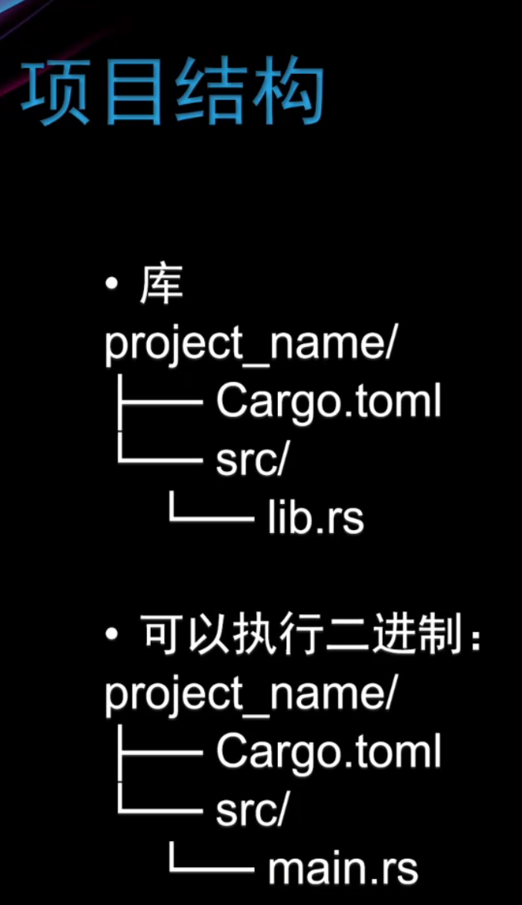

# 1 介绍


## 1.1 Rust特点

1. 具有独一无二的所有权机制，可以防止悬垂引用，并发中产生竞争
2. 没有垃圾回收，具有高性能
3. 零成本抽象
4. 完备的函数式编程（面向函数，而不是面向对象），如模式匹配，高阶函数，闭包，迭代


## 1.2 安装

[Rust官网安装](https://www.rust-lang.org/)：一般会直接安装`Rustup`

1.Stable：这是最稳定和可靠的版本，适用于大多数生产环境的应用程序。Rust的稳定版经过了广泛测试和验证，确保了向后兼容性，这意味着你编写的代码在未来的稳定版本中仍然可以运行。

2.Nightly：这是每天构建的最新版本，包含最新的功能和实验性质的特性。夜版是Rust的开发版本，通常包含最新的语言特性和实验性质的改进，但也可能包含一些不稳定的内容。因此，它不适用于生产环境，但可以用于尝试最新的语言功能或为Rust的发展做贡献。


`Rustup`的安装与使用：

- 更新rust： `Rustrustup update`
- 卸载：`rustup self uninstall`
- 添加组件 ：`rustup component add rustfmt`
- 查看版本： `rustup --version`
- 安装rust：`rustup install stable/nightly`
- 切换rust：`rustup default stable/ngihtly`
- 帮助：`rustup --help`


vscode插件

- rust-analyzer

- Error Lens


## 1.3 rust包管理工具Cargo

隐式地使用rustc进行编译

**命令：**

**创建**：`cargo new project_name`

`cargo new --lib project_name `创建一个新的 Rust 库项目的

**构建项目** (生成二进制可执行文件或库文件)：`cargo build`

`cargo build--release`为生成优化的可执行文件，常用于生产环境

**检测**：`cargo check`

**运行/测试**：`cargo run/cargo test`


## 1.4 项目结构与路径


对于Cargo.toml文件：

> package
>
> - 设置项目名
> - 版本
>
> dependencies
>
> - 设置依赖
> - [build-dependencies]列出了在构建项目时需要的依赖项
> - [dev-dependencies]列出了只在开发时需要的依赖项

- Package（包）：Cargo的特性，让你构建、测试、共享crate
- Crate（单元包）：一个模块树，它可产生一个library或可执行文件
- Module（模块）、Use：让你控制代码的组织、作用域、私有路径


对于rand crate需要使用rand进行使用crate

对于module使用 `mod`关键词定义：
```rust
mod front_of_house{ // 注意，如果是根级，可以不加pub
	pub mod hosting { // mod可以嵌套 注意这个需要使用公有
		pub fn add_to_waitlist(){} // 注意也需要使用公有
		
	}
}

pub fn eat_at() {
	crate::front_of_house::hosting::add_to_waitlist(); // 绝对路径

	front_of_house::hosting::add_to_waitlist(); // 相对路径
}
```

`super`关键字
> 用来访问父级模块路径中的内容，注意是mod
```rust
fn serve_order() {}

mod back_of_house {
	fn fix_incorrect_order() {
		super::serve_order(); // 这里面直接跳出了back_of_house这个mod，而不是函数作用域
		crate::serve_order(); // 绝对路径
	}
}
```


## 1.5 如何获取Rust的库和国内源

Rust第三方库：[crates.io: Rust Package Registry](https://crates.io/)

更推荐安装Cargo插件 cargo-edit

> - 安装
>
>   - `cargo install cargo-edit`
>
> - 添加库
>
>   - `cargo add dependency_name`
>
>   - 安装指定版本
>
>     - `cargo add dependency_name@1.2.3`
>
>   - 添加开发时用的依赖库
>     - `cargo add --dev dev_dependency_name`
>   - 添加构建时用的依赖库
>     - `cargo add --build build_dependency_na-me`
> - 删除库
>   `cargo rm dependency_name`


国内源：

推荐[RsProxy](https://rsproxy.cn/)

windows进入`./cargo/config`

```toml
[source.crates-io]
replace-with = 'rsproxy-sparse'
[source.rsproxy]
registry = "https://rsproxy.cn/crates.io-index"
[source.rsproxy-sparse]
registry = "sparse+https://rsproxy.cn/index/"
[registries.rsproxy]
index = "https://rsproxy.cn/crates.io-index"
[net]
git-fetch-with-cli = true
```


## 1.6 开发规则

变量命名：小写下划线`let nice_count = 100;`


## 1.7 相比其他语言独特

1. 变量不可变性
2. 所有权，所有权系统实参进入函数后会被销毁，move和copy
3. 不支持继承，和面向对象，而是函数式编程，组合与委托


# 2 语言基础

## 2.1 变量

### 2.1.1 变量与不可变性

1. 在 Rust 中声明变量时，使用 `let` 关键字。

2. Rust 支持类型推导，但你也可以显式指定变量的类型：  

   ```rust
   let x: i32 = 5; // 显式指定 x 的类型为 i32
   ```

3. 变量名蛇形命名法（Snake Case）：**小写加下划线**，而枚举和结构体命名使用帕斯卡命名法（Pascal Case）：小驼峰。如果变量没有用到可以前置下划线，消除警告。

4. 强制类型转换 (Casting a Value to a Different Type)：  

   ```rust
   let a = 3.1;
   let b = a as i32;
   ```

5. 打印变量 (`{}` 与 `{:?}` 需要实现特质之后章节会介绍，基础类型默认实现)：  

   ```rust
   println!("val: {}", x);
   println!("val: {:?}", x);
   ```

**Rust中的变量是默认不可变的**

> 不可变性是Rust实现其可靠性和安全性目标的关键
>
> 它迫使程序员更深入地思考程序状态的变化，并明确哪些部分的程序状态可能会发生变化的
>
> 不可变性有助于防止一类常见的错误，如数据竞争和并发问题

**使用mut关键字进行可变声明**

如果你希望一个变量是可变的，你需要使用mut关键字进行明确声明

```rust
let mut y=10；//可变变量
y = 20;//合法的修改
```

**Shadowing Variables并不是重新赋值**

>  Rust允许您隐藏一个变量，这意味着您可以声明一个与现有变量同名的新变量，从而有效地隐藏前一个变量。
>
> 作用：
>
> 可以改变值
>
> 可以改变类型
>
> 可以改变可变性

```rust
let a = 10;
let a = 20; // Shadowing Variables
```


### 2.1.2 常量 const 与 静态变量static

#### 2.1.2.1 Const 常量

- 常量的值必须是在编译时已知的常量表达式，必须指定类型与值
- 与C语言的宏定义（宏替换）不同，Rust 的const常量的值被直接嵌入至生成的底层机器代码中，而不是进行简单的字符替换
- 常量的作用域是块级作用域，它们只在声明他们的作用域内可见

#### 2.1.2.2 static静态变量

- 与const常量不同，static 变量是在运行时分配内存的
- 并不是不可变的，可以使用unsafe修改
- 静态变量的生命周期为整个程序的运行时间

#### 2.1.2.3 总结

- 常量名与静态变量命名必须全部大写，单词之间加入下划线


## 2.2 Rust 数据类型与集合

### 2.2.1 基本数据类型

如果不自动设置类型的话，rust默认的类型是i32
**1、Integer**

- Integer types 默认推断为 i32:
  - i8、i16、i32、i64、i128
- Unsigned Integer Types:
  - u8、u16、u32、u64、u128
- Platform-Specific Integer Type(由平台决定):
  - usize
  - isize

**2、Float**

- Float Types:
  - f32 与 f64
  - 尽量用 f64，除非你清楚边界需要空间

**3、Boolean**

- Boolean Values:
  - true
  - false

**4、Char**

- Character Types:
  - Rust 支持 Unicode 字符
  - 表示 char 类型使用单引号

**5、元组和数组**

- 元组

  > 元组是固定长度的异构集合
  >
  > `EmptyTuple()`：为函数默认返回值
  >
  > 元组获取元素：`tup.index`没有`len ()`

- 数组

  > 组是固定长度的同构集合
  >
  > 创建方式：`[a, b, c]`或者`[value; size]`
  >
  > 获取元素：`arr[index]`
  >
  > 获取长度：`arr.Ien ()`

- 元组与数组异同

> - 相同点
>  1. 元组和数组都是Compound Types，而Vec和Map都是Collection Types
>   2. 元组和数组长度都是固定的
>   3. 可以设置可变
> 
> - Tuples不同类型的数据类型
>
> - Arrays 同一类型的数据类型


**6、String与&str**

- `String`是一个堆分配的可变字符串类型

  源码:
  ```rust
  pub struct String {vec: Vec<u8>}
  ```

- `&str`是指字符串切片引用，是在栈上分配的

  - 不可变引用，指向存储在其他地方的 UTF-8编码的字符串数
  - 由指针和长度构成

  

- **注意`String`是具有所有权的，而`&str`并没有**
  
- `Struct`中属性推荐使用`String`

  - 对于`&str`，如果不使用显式声明生命周期无法使用`&str`，不只是麻烦，还有更多的隐患，如下：

  ```rust
  struct Person<'a> {
      name: &'a str,
      color: String,
      age:i32,
  }
  ```

> 如果不使用`&str`就不需要标注生命周期

- 函数形参参数推荐使用`&str`（如果不想交出所有权）

  - `&str`为参数，可以传递`&str`和`&String`
  - `&String`为参数，只能传递`&String`不能传递`&str`

  ```rust
  // &String &str 两个都可以传输
  fn print(data: &str) {
      println!("{}", data);
  }
  
  // &String 只能传输这个
  fn print_string_borrow(data: &String) {
      println!("{}", data);
  }
  ```

  

- 两者相互转换

  ```rust
  let strings = String::from("value c++");
  let str = "rust".to_owned();
  let str = "rust".to_string();
  ```

  > 使用`"rust".to_owned()`或者`"rust".to_string(())`将`&str`转化为`String`


**7、枚举**

枚举（enums）是一种用户自定义的数据类型，用于表示具有一组离散可能值的变量

- 每种可能值都称为"variant"（变体)

- 枚举名::变体名

```rust
enum Shape {
    Circle(f64),
    Rectangle(f64, f64),
    Square(f64),
    Unknown, // 表示不知道是否有这个类型，什么类型也不知道
}
```

常用枚举

```rust
pub enum Option<T> {
    None,
    Some(T),
}

pub enum Result<T, E> {
    Ok(T),
    Err(E),
}
```

枚举的好处

- 可以使你的代码更严谨、更易读
- More robust programs

常与匹配模式一起使用：

1. match 关键字实现

2. 必须覆盖所有的变体
3. 可以用`_、..=、三元（if)`等来进行匹配

```rust
match number {
    0=> println!("Zero"),
    1|2 => println!("One or Two"),
    3..=9 => println!("From Three to Nine"),
    n if n % 2 == 0 => println!("Even number"),
    _ => println!("Other"),
}
```


```rust
enum Color {
    Red,
    Yellow,
    Blue,
    Block,
}

fn print_color(my_color: Color) {
    match my_color {
        Color::Red => println!("Red"),
        Color::Yellow => println!("Yellow"),
        Color::Blue => println!("Blue"),
        _ => println!("Other"),
    }
}

fn main() {
    print_color(Color::Yellow);
}
```


```rust
enum BuildingLocation {
    Number(i32),
    Name(String), // 不用&str等来进行匹配
    Unknown,
}

impl BuildingLocation {
    fn print_location(&self) {
        match self {
            BuildingLocation::Number(c) => println!("building number{}", c),
            BuildingLocation::Name(s) => println!("building name{}", s),
            BuildingLocation::Unknown => println!("unknown"),
        }
    }
}

// 调用
let house: BuildingLocation = BuildingLocation::Name("fdgd".to_string());
house.print_location();
```

> - **`impl BuildingLocation`**: `impl` 关键字用于实现特定类型（这里是 `BuildingLocation`）的方法或trait。这意味着下面定义的函数是属于 `BuildingLocation` 类型的。
> - **`fn print_location(&self)`**: 定义了一个名为 `print_location` 的方法，它接受一个引用到 `self`（即枚举实例自身）作为参数。`&self` 是 Rust 中的方法自引用的惯用写法，意味着这个方法不会获取 `self` 的所有权，仅借用它来读取数据。
>
> 这里面有一个关键的思想就是面向函数式编程，而不是面向对象


### 2.2.2 集合


Rust 提供了几种集合类型来存储和操作一系列值，主要包括向量（`Vec<T >`）、哈希映射（`HashMap<K, V>`）、集合（`HashSet<T >`）和链接列表（`LinkedList<T >`）等。下面是对这些集合的基本介绍及使用示例：

#### 2.2.2.1. 向量（`Vec<T >`）

向量是一种动态数组，可以自动调整其大小。它是存储同类型元素序列的最常用方式。

#### 基本使用

```
rustuse std::vec::Vec;

fn main() {
    // 创建并初始化向量
    let mut vec = Vec::new(); // 创建一个空向量
    // let mut vec = vec![1,2,3];
    vec.push(1); // 添加元素

    // 访问元素
    println!("{:?}", vec[0]); // 输出第一个元素

    // 遍历向量
    for elem in &vec {
        println!("{}", elem);
    }

    // 删除最后一个元素
    vec.pop();

    // 获取长度
    println!("Length: {}", vec.len());
}
```

#### 2.2.2.2. 哈希映射（`HashMap<K, V>`）

哈希映射是一种键值对的集合，其中键（Key）是唯一的，用于快速查找对应的值（Value）。

#### 基本使用

```
rustuse std::collections::HashMap;

fn main() {
    let mut map = HashMap::new();
    map.insert("one", 1);
    map.insert("two", 2);

    // 访问值
    match map.get(&"one") {
        Some(value) => println!("The value for 'one' is: {}", value),
        None => println!("No entry found for 'one'"),
    }

    // 遍历哈希映射
    for (key, value) in &map {
        println!("{}: {}", key, value);
    }
}
```

#### 2.2.2.3. 集合`（HashSet<T >）`

集合是一种不包含重复元素的集合类型，常用于成员检查、交集、并集等操作。

#### 基本使用

```
rustuse std::collections::HashSet;

fn main() {
    let mut set: HashSet<i32> = HashSet::new();
    set.insert(1);
    set.insert(2);
    set.insert(3);

    // 检查成员
    if set.contains(&2) {
        println!("Set contains the number 2");
    }

    // 遍历集合
    for &num in &set {
        println!("{}", num);
    }
}
```

#### 2.2.2.4. 链接列表`（LinkedList<T >）`

链接列表是一种线性集合，其中元素在内存中不是连续存放的，而是通过指针链接起来。它适用于频繁的插入和删除操作。

#### 基本使用

```
rustuse std::collections::LinkedList;

fn main() {
    let mut list: LinkedList<i32> = LinkedList::new();
    list.push_back(1);
    list.push_back(2);
    list.push_front(0);

    // 遍历链接列表
    for elem in &list {
        println!("{}", elem);
    }
}
```

这些集合类型提供了丰富的API来执行各种操作，包括但不限于添加、删除、查找、遍历等。选择合适的集合类型对于编写高效、清晰的 Rust 代码至关重要。


## 2.3 move所有权转移

### 2.3.1 move与copy与clone

Move：所有权转移

Clone：深拷贝

Copy：Copy是在Clone的基础建立的markertrait(Rust中最类似继承的关系)

1. trait（特质）是一种定义共享行为的机制。Clone也是特质

2. markertrait是一个没有任何方法的trait，它主要用于向编译器传递某些信息，以改变类型的默认行为然


**通过 `as_ref()`、`as_mut()` 或 `.clone()` 避免所有权转移**


**move如下：**

在 Rust 编程语言中，`move` 所有权转移是一种机制，当值的所有权从一个变量转移到另一个变量时发生。具体来说，`move` 发生在以下几种情况：

1. **变量赋值**: 当你将一个拥有堆分配数据（如 `String`、`Vec` 或自定义的动态大小类型）的变量赋值给另一个变量时，原始变量的所有权会转移到新变量，原始变量将不再有效。

```rust
   let s1 = String::from("hello");
   let s2 = s1; // s1的所有权转移到s2，s1不能再使用
```

2. **作为参数传递给函数或闭包**: 如果函数或闭包参数采用值传递（即没有 `&` 或 `&mut`），那么调用时传递的变量的所有权会转移到函数内部，函数结束后该值将被清理。

```rust
fn take_ownership(s: String) {
   println!("{}", s);
}
   
let s = String::from("hello");
take_ownership(s); // s的所有权转移到take_ownership函数内
```

3. **结构体和枚举的字段**: 当你将拥有堆分配数据的变量放入结构体或枚举时，也会发生所有权转移。
4. **从函数返回拥有堆数据的值**: 函数返回拥有堆数据的值时，该值的所有权会从函数内部转移到调用者。

```rust
fn returns_string() -> String {
   String::from("hello")
}

let s = returns_string(); // 返回值的所有权转移到s
```

`move` 操作的核心在于确保任何时候只有一个变量拥有对某个数据的控制权，这有助于避免数据竞争和内存泄漏，是 Rust 安全和高效内存管理策略的基础。


### 2.3.2 move类型

1. **字符串 (`String`)**: `String` 类型在堆上分配内存来存储可变长度的字符串数据。当一个 `String` 被赋值给另一个变量或作为参数传递给函数时，所有权会转移。
2. **向量 (`Vec<T>`)**: `Vec<T>` 类似于动态数组，也在堆上分配内存来存储元素。所有权转移规则同样适用。
3. **自定义结构体和枚举**: 当结构体或枚举中包含上述可变大小类型或其他所有权类型时，整个结构体会在所有权转移时受到影响。
4. **Box`<T >`**: `Box<T>` 是一个智能指针，用于在堆上分配单个值。所有权转移规则适用于 `Box<T>` 实例。
5. **其他堆分配类型**: 任何在堆上分配的类型，或者包含堆分配数据的复合类型，都可能涉及所有权的转移。

**copy类型：**

整数（`i32`, `u8` 等）、浮点数、布尔值和元组（只要元组中的每个元素都是 Copy 类型）

只要记住，基本数据类型如果想指向一个地址就取地址，不然就是浅拷贝。


## 2.4 类型位置与堆栈

### 2.4.1 stack

- **介绍**
> 1. 堆栈将按照获取值的顺序存储值，并以相反的顺序删除值
> 2. 操作高效，**函数作用域就是在栈上**
> 3. 堆栈上存储的所有数据都必须具有已知的固定大小数据

- **存储类型**
1. 基础类型 
2. `tuple`和`array`
3. `struct`与枚举等也是存储在栈上 如果属性有`String`等在堆上的数据类型会有指向堆的


### 2.4.2 heap
- **介绍**
> 1. 堆的规律性较差，当你把一些东西放到你请求的堆上时，你请求，请求空间，并返回一个指针，这是该位置的地址
> 2. 长度不确定


- **存储类型**
`Box` `Rc` `String/Vec`等

一般来说在栈上的数据类型都默认实现了copy，但struct等默认为move，需要Copy只需要设置数据类型实现Copy特质即可，或是调用Clone函数（需要实现Clone特质）

**栈上的数据基本都有所有权**  [move所有权查看](# 2.3.2 move类型)

```rust
    let x = "ss".to_string();
    let y = x;
    print!("{:?}", x); //会报错，所有权转移了

    // 解决方案 clone()
    let y = x.clone();
```


## 2.5 输入输出

有两种输出

```rust
let x = 10;
println!("x : {}", x);
println!("x : {x}");
```

> 两种输出都可


MAX & MIN 打印方式

```rust
println!("u32 max: {}", u32::MAX);
println!("u32 min: {}", i32::MIN);
println!("isize is {} bytes", std::mem::size_of::<isize>()); // 查看数据的字节数


let f1: f32 = 1.23234
println!("Float are {:.2}", f1); // 1.23 打印两位

let tup3 = ();
println!("tup3 {:?}", tup3);
```


# 3 进阶

## 3.1 函数

### 3.1.1 函数基础与Copy值参数传递

- 如果数据类型实现Copy特质，则在函数传参时会实现Copy by value操作

- 会将实参拷贝为形参，形参改变并不会影响实参

- 如果要改变形参需要加mut


- Struct、枚举、集合等并没有实现Copytrait，会实现move操作失去所有权
- 为数据类型实现Copy trait，就可实现Copy by value


### 3.1.2 函数值参数传递、不可变借用参数传递、可变借用参数传递

**函数值参数传递**

​	函数的代码本身通常是存储在可执行文件的代码段，而在调用时函数会在栈上开辟一个新的stack frame（栈空间），用于存储函数的局部变量、参数和返回地址等信息，而当函数结束后会释放该空间。

而当传入non-Copy value(Vec、String等)

- 传入函数时实参会转移value的所有权给形参，实参会失去value的所有权而在函数结束时，value的所有权会释放


**不可变借用参数传递**

如果你不想失去value的所有权，你又没有修改value的需求，你可以使用不可变借用

在Rust中，你可以将不可变引用作为函数的参数，从而在函数内部访问参数值但不能修改它。这有助于确保数据的安全性，防止在多处同时对数据进行写操作，从而避免数据竞争。

如何应用不可变借用

- `Use ＊ to deference`，去获取其的值

```rust
fn string_func_borrow(s: &String) {
    println!("{}", (*s).to_uppercase()) // *获取值
}


let s = String::from("hello");
string_func_borrow(&s); // 使用&传递
```


**可变借用参数传递**

如果你有修改值的需求你可以使用可变借用，以允许在函数内部修改参数的值。这允许函数对参数进行写操作，但在同一时间内只能有一个可变引用。

需要在形参前加`&mut`

如何应用可变借用

- 同样使用`Use * to deference`，去获取其的值

```rust
struct Point {
    x: i32,
    y: i32,
}

fn modify_point(point: &mut Point) {
    (*point).x += 2; // 原始
    point.y += 2; // 编译器会自动处理解引用的过程
}


let mut p = Point { x: 1, y: 2 };
modify_point(&mut p);
```


### 3.1.3 函数返回值与所有权机制

**返回Copy与Non-Copy都可以返回**

但是要注意Non-Copy是在堆上的

性能：

​	在一般情况下，返回Copy类型的值通常具有更好的性能。这是因为Copy类型的值是通过复制进行返回的，而不涉及堆上内存的分配和释放，通常是在栈上分配。这样的操作比涉及堆上内存的分配和释放更为高效


**返回引用**

- 在只有传入一个引用参数，只有一个返回引用时，生命周期不需要声明
- 其他情况下需要声明引用的生命周期
- 慎用‘static


### 3.1.4 高阶函数 函数作为参数与返回值

**高阶函数与集合**

1、`map`函数：`map`函数可以用于对一个集合中的每个元素应用一个函数，并返回包含结果的新集合。

2、`filter`函数：`filter`函数用于过滤集合中的元素，根据一个谓词函数的返回值。

3、`fold`：`fold`函数（有时也称为`reduce`）可以用于迭代集合的每个元素，并将它们累积到一个单一的结果中


## 3.2 错误处理

### 3.2.1 错误处理之：Result、Option以及panic!宏

Rust中的错误可以分为两种

- Recoverable error：有返回类型
  - 返回Result类型
  - 返回Option类型

- Unrecoverable type：没有返回类型，直接崩溃
  - panic macro将终止当前线程

**Result、Option处理返回的都是枚举，需要使用match**


**Result**

Result是一个枚举类型，有两个变体：Ok和Err。它通常用于表示函数的执行结果，其中ok表示成功的结果，Err表示出现了错误

```rust
 pub enum Result<T, E> {
     Ok (T),
     Err (E),
}
```


```rust
fn divide(a: i32, b: i32) -> Result<f64, String> {
    if b == 0 {
        return Err(String::from("cannot be zero"));
    }

    let a: f64 = a as f64;
    let b: f64 = b as f64;
    Ok(a / b)
}

fn main() {
    // result
    match divide(a: 1, b: 2) {
        Ok(number) => println!("{}", number),
        Err(err) => println!("{}", err),
    }
}
```

> 返回的Result是一个枚举，需要使用match进行匹配


**Option**

Option也是一个枚举类型，有两个变体：Some和None。它通常用于表示一个可能为空的值

```rust
pub enum Option<T> {
    None,
    Some (T),
}
```


```rust
fn find_element(array: &[i32], target: i32) -> Option<usize> {
    for (index, &item) in array.iter().enumerate() {
        if item == target {
            return Some(index);
        }
    }
    None
}

fn main() {
    let arr = [1, 2, 3, 4, 5];

    match find_element(array: &arr, target: 4) {
        Some(index) => println!("found at index {}", index),
        None => println!("None"),
    }
}
```


**panic!**

当程序遇到无法继续执行的错误时，可以使用`panic!`宏来引发恐慌。恐慌会导致程序立即终止，并显示一条错误消息。


```rust
// 第一种系统自带的
let arr = vec![1, 2, 3, 4, 5];
arr[34]; // 数组越界就是
```


### 3.2.2 错误处理之：unwrap()与'?'


**`unwrap()`**

注意：该方法并不安全

`unwrap()`是`Result`和`Option` 类型提供的方法之一。它是一个简便的方法，用于获取` Ok `或 `Some` 的值，如果是 `Err` 或 `None` 则会引发 `panic`

```rust
fn main() {
    let result_ok: Result<i32, &str> = Ok(32);
    let value: i32 = result_ok.unwrap();
    println!("{}", value);


    let result_err: Result<i32, &str> = Err("ff");
    let value: i32 = result_err.unwrap();
}
```

> 注意：使用 unwrap 解包 Err 类型的结果会导致 panic 然后导致程序崩溃


**`?`运算符**

`?`用于简化 `Result` 或 `Option`类型的错误传播。它只能用于返回`Result` 或`Option` 的函数中，并且在函数内部可以像使用`unwrap（）`一样访问`Ok` 或 `Some`的值，**但是如果是 `Err` 或 `None` 则会提前返回**


```rust
fn test() {
    let result_ok: Result<i32, &str> = Ok(32);
    let value: i32 = result_ok?;
    println!("{}", value);
}
```

> 这里如果是`result_ok`为空或者错误的时候会直接返回。下面的打印将不会再执行


### 3.2.3 传递错误

```rust
fn parse_numbers(input: &str) -> Result<i32, ParseIntError> {
    let val= input.parse::<i32>()?;
    Ok(val);
}

match parse_numbers("d"){
    Ok(i） => println!("parsed {}",i),
        Err(err) => println!("failed to parse: {}", err),
    }
```

> 这里面错误传递是在函数中加了`ParseIntError`这个类型，如果


### 3.2.4 自定义一个Error类型

步骤:

1. 定义错误类型结构体：创建一个结构体来表示你的错误类型，通常包含一些字段来描述错误的详细信息。
2. 实现`std::fmt::Display` trait：实现这个trait以定义如何展示错误信息。这是为了使错误能够以人类可读的方式打印出来。
3. 实现`std::error::Error` trait：实现这个 trait以满足Rust 的错误处理机制的要求

```rust
// 第一步，创建结构体，表示错误类型，描述错误详情
#[derive(Debug)]
struct MyError {
    detail: String,
}

// 第二步，实现std::fmt::Display特质，实现打印方法
impl std::fmt::Display for MyError {
    fn fmt(&self, f: &mut std::fmt::Formatter) -> std::fmt::Result {
        write!(f, "MyError: {}", self.detail)
    }
}

// 第三步，实现std::error::Error特质，实现基础机制（包括不限于，错误传递）
impl std::error::Error for MyError {
    fn description(&self) -> &str {
        // 这里&String自动转换成&str
        &self.detail
    }
}

fn do_something() -> Result<(), MyError> {
    // 这里实现一些操作，可能会返回错误
    // 如果返回错误，使用MyError来封装错误信息
    Err(MyError {
        detail: String::from("Something went wrong"),
    })
}

fn main() -> Result<(), Box<dyn std::error::Error>> {
    // 使用match匹配模式
    match do_something() {
        Ok(_) => println!("Everything went well"),
        Err(err) => println!("Error: {}", err),
    }

    // 或者使用?操作符简化代码
    do_something()?;
    Ok(())
}

```


## 3.3 Rust的内存管理模型

> 内存分配，内存释放，内存管理单元，堆栈，指针，内存保护，虚拟内存，内存碎片化处理。

> ​	"Stoptheworld"是与垃圾回收（GarbageCollection）相关的术语，它指的是在进行垃圾回收时系统暂停程序的运行。
>
> ​	这个术语主要用于描述一种全局性的暂停，即所有应用线程都被停止，以便垃圾回收器能够安全地进行工作。这种全局性的停止会导致一些潜在的问题，特别是对于需要低延迟和高性能的应用程序。
>
> ​	需要注意的是，并非所有的垃圾回收算法都需要"stop the world"，有一些现代的垃圾回收器采用了一些技术来减小全局停顿的影响，比如并发垃圾回收和增量垃圾回收


**模型：**

- 所有权系统（Ownership System)

- 借用（Borrowing)·

  - 不可变引用 (不可变借用)
  - 可变引用 (可变借用)

- 生命周期（Lifetimes)

- 引用计数 (Reference Counting)


**注意：** 一般来说这里需要查看一下所有权：所以先去3.4看所有权系统，之后去2.4看一下类型位置，在之后去2.3看一下move类型。 


## 3.4 所有权系统

> - 每个值都有一个变量，这个变量是该值的所有者
>
> - 每个值同时只能有一个所有者
> - 当所有者超出作用域（scope）时，该值将被删除

```rust
fn get_length(s: String) -> usize {
    println!("{}", s);
    s.len()
}

fn main() {
    let s1 = String::from("vlaue");
    let s1_len = get_length(s1);

    println!("{}", s1_len);
}
```

> 这里面首先和其他语言不同的是s1在get_length()中随着函数被销毁销毁了，类似s1的所有权被传进去了，而不是像其他语言一样创建一个变量啥的，而是直接被销毁了。
>
> 通过usize返回值返回。

```rust
fu dangle() -> &str{}
```

> 这个返回一个引用会报错，因为rust的所有权机制，它不知道改引用的生命周期是什么，什么时候销毁。
>
> 解决：
>
> ```rust
> fn dangle() -> String{}
> ```
>
> 这个是直接返回一个类型。
>
>
> ```rust
> fn dangle () -> &'static str {
>     "hello"
> }
> ```
>
> 这个不推荐，因为将这个函数设置为了静态的生命周期，污染了全局变量


看完之后可以看[4.2 所有权与结构体](# 4.2 所有权与结构体)


## 3.5 借用（Borrowing)

- 引用 (不可变借用)

  > 不可变引用允许你读取数据但不能修改它。不可变引用的语法是使用 `&` 符号。

  ```rust
  fn main() {
      let s = String::from("hello");
      let r1 = &s; // 不可变引用
      let r2 = &s; // 另一个不可变引用
  
      println!("r1: {}, r2: {}", r1, r2); // 可以读取数据
      // 不能修改 s
  }
  ```

  如果想看内存相关的
  

- 可变引用 (借用)

  > 可变引用允许你修改数据。可变引用的语法是使用 `&mut` 符号。

  ```rust
  fn main() {
      let mut s = String::from("hello");
      let r1 = &mut s; // 可变引用
  
      r1.push_str(", world"); // 可以修改数据
  
      println!("r1: {}", r1);
  }
  ```


**orrow Checker的规则**

1. 不可变引用规则：
   在任何给定的时间，要么有一个可变引用，要么有多个不可变引用，**但不能同时存在可变引用和不可变引用**。这确保了在同一时间只有一个地方对数据进行修改，或者有多个地方同时读取数据。
2. 可变引用规则：
   在任何给定的时间，只能有一个可变引用来访问数据。这防止了并发修改相同数据的问题，从而防止数据竞争。
3. 生命周期规则：
   引用的生命周期必须在被引用的数据有效的时间范围内。这防止了悬垂引用，即引用的数据已经被销毁，但引用仍然存在。
4. 可变引用与不可变引用不互斥：
   可以同时存在多个不可变引用，因为不可变引用不会修改数据，不会影响到其他引用。但不可变引用与可变引用之间是互斥的


## 3.6 生命周期


### 3.6.1 生命周期与函数

大多数情况下，生命周期是隐式且被推断的

生命周期的主要目的是防止悬垂引用

​	关于“悬垂引用”的概念是指，引用指向的数据在代码结束后被释放，但引用仍然存在。生命周期的引入有助于确保引用的有效性，防止程序在运行时出现悬垂引用的情况。通过生命周期的推断，Rust能够在编译时检查代码，确保引l用的有效性，而不是在运行时出现悬垂引引用的错误


编译器在没有显式注解的情况下，使用三个规则来推断这些生命周期：

1. 第一个规则是，每个作为引用的参数都会得到它自己的生命周期参数。
2. 第二个规则是，如果只有一个输入生命周期参数，那么该生命周期将被分配给所有输出生命周期参数（该生命周期将分配给返回值）。
3. 第三个规则是，如果有多个输入生命周期参数，但其中一个是对self或不可变 self 的引l用时。因为在这种情况下它是一个方法，所以seIf 的生命周期被分配给所有输出生命参数


```rust
// 没有返回值，不用标注生命周期
fn print(s: &str) {
    println!("s: {}", s)
}

// 不是引用时，不用标注生命周期
fn clone(s: &str) -> String {
    s.to_owned()
}

// 在返回引用时，只有一个参数和返回值，Rust内部自动帮忙标注隐式生命周期
fn get(s: &str) -> &str {
    s
}

// 不确定返回的引用，使用where来限定，进行对多个生命周期取交集，这种更灵活性能好
fn long<'a, 'b, 'out>(s1: &'a str, s2: &'b str) -> &'out str
where
    'a: 'out,
    'b: 'out,
{
    if s1.len() > s2.len() {
        s1
    } else {
        s2
    }
}

// 临时处理，使用静态生命周期'static，这种耗费性能，一般在处理生命周期比较烦的时候又编译不过时临时使用一下
fn urgent(s1: &'static str, s2: &'static str) -> &'static str {
    if s1.len() > s2.len() {
        s1
    } else {
        s2
    }
}


fn main() {
    // 函数
    print("hello rust");

    let s = clone("hello rust");
    println!("s: {}", s);

    let s = get("hello rust");
    println!("s: {}", s);

    let s = long("hello world", "hello rust");
    println!("s: {}", s);

    let s = urgent("hello world", "hello rust");
    println!("s: {}", s);
}

```

> 这里面有三种写法：
>
> 1. 不返回引用或者返回一个引用不用标注生命周期
> 2. 临时处理，使用静态生命周期'static，这种耗费性能，一般在处理生命周期比较烦的时候又编译不过时临时使用一下
> 3. 不确定返回的引用，使用where来限定，进行对多个生命周期取交集，这种更灵活性能好
>
> ```rust
> fn long<'a, 'b, 'out>(s1: &'a str, s2: &'b str) -> &'out str
> where
>     'a: 'out,
>     'b: 'out,
> {
>     if s1.len() > s2.len() {
>         s1
>     } else {
>         s2
>     }
> }
> ```
>
> 可以看作a中包含out，b中包含out


### 3.6.1 生命周期和结构体

在结构体中的引用需要标注生命周期

结构体的方法（&self等）不需要标注生命周期


```rust
// 对比组，与下面Person结构体
struct Point {
    x: i32,
    y: i32,
}

// 在结构体中，使用了引用，需要标注生命周期
#[derive(Debug)]
struct Person<'a> {
    name: &'a str,
}

// 关键函数，生命周期标注示例
impl<'a> Person<'a> {
    fn get_name(&self) -> &str {
        // 自动解引用强制特性，self.name = (*self).name
        self.name
    }
}

fn main() {

    // 结构体
    let name = "danile"; // 引用具有copy特质
    let p = Person { name: name };
    println!("p: {:?}, name: {}", p, p.get_name())
}

```


  


# 4 面向对象

Ownership 与结构体、枚举

## 4.1 结构体

### 4.1.1 定义使用

结构体是一种用户定义的数据类型，用于创建自定义的数据结构。

- 每条数据(x和y)称为属性 (字段 field)
- 通过点(.)来访问结构体中的属性


### 4.1.2 关联函数

关联函数（方法）是指，通过实例调用（`&self`、`&mut self`、`self`)

```rust
impl Point {
    fn distance(&self, other: &Point) -> f64 {
        let dx = (self.x - other.x) as f64;
        let dy = (self.y - other.y) as f64;
        (dx * dx + dy * dy).sqrt()
    }
}
```

这里 `self` 指代的是结构体 `Point` 的实例。在 Rust 中，有三种常见的 `self` 调用方式：

1. `&self`: 表示方法接受一个 `Point` 结构体的只读引用。在这种情况下，方法不能修改 `self` 对象的内容。
2. `&mut self`: 表示方法接受一个 `Point` 结构体的可变引用。这种方法可以修改 `self` 对象的内容。
3. `self`: 表示方法接受 `Point` 结构体的所有权。在方法结束后，所有权会转移回调用方。

相关请看：[4.2.2 结构体中调用函数的形参参数](# 4.2.2 结构体中调用函数的形参参数)


### 4.1.3 调用函数

调用时为结构体名::函数

```rust
impl Point {
    fn name(x: u32, y: u32) -> Self {
        Point { x, y }
    }
}

// 调用
Point::name(x, y);
```

> 注意，这里面的`Self`指的是Point


### 4.1.4 调用变量

这里的变量是指，和结构体类型相关的变量，也可以在特质或是枚举中

```rust
impl Point {
    const PI: f64 = 3.14;
}

// 调用
Point::PI
```


## 4.2 所有权与结构体

### 4.2.1 所有权机制的规则：

1. Rust 中的每个值都有一个所有者

2. 一次可以有一个所有者

3. 当所有者超出范围时，Values 会自动删除


每当将值从一个位置传递到另一个位置时，borrow checker都会重新评估所有权。

1．ImmutableBorrow使用不可变的借用，值的所有权仍归发送方所有，接收方直接接收对该值的引l用，而不是该值的副本。但是，他们不能使用该引用来修改它指向的值，编译器不允许这样做。释放资源的责任仍由发送方承担。仅当发件人本身超出范围时，才会删除该值

2．MutableBorrow使用可变的借用所有权和删除值的责任也由发送者承担。但是接收方能够通过他们接收的引用来修改该值。

3．Move 这是所有权从一个地点转移到另一个地点。borrow checker关于释放该值的决定将由该值的接收者（而不是发送者）通知。由于所有权已从发送方转移到接收方，因此发送方在将引用移动到另一个上下文后不能再使用该引用，发送方在移动后对vlaue的任何使用都会导致错误。


所有权会涉及到堆栈，请看[4.3 堆与栈](# 4.3 堆与栈)，然后看[2.3 ‘引用数据类型’](# 2.3 ‘引用数据类型’)的move


### 4.2.2 结构体中调用函数的形参参数

`&self(self: &Self)`
不可变引用

`&mut self (self: &mut Self)`
可变引用

`self(self: Self)`
Move(Self大写)

```rust
impl Point {
    get(self: Self) -> i32 {
        self.x
    }
}
```

> `self` 参数相当于 `Point::get(point)`，调用后丧失所有权（point 为实例对象）
>
> `&self` 参数相当于 `Point::get(&point)`，
> `&mut self` 参数相当于 `Point::get(&mut point)`

实例请看：[4.1.3 调用函数](# 4.1.3 调用函数)


## 4.3 Box

Box是一个智能**指针**，它提供对堆分配内存的所有权。**它允许你将数据存储在堆上而不是栈上**，并且在复制或移动时**保持对数据的唯一拥有权**。使用Box可以避免一些内存管理问题，如悬垂指针和重复释放。

1. 所有权转移
2. 释放内存
3. 解引用
4. 构建递归数据结构


```rust
struct Point {
    x: i32,
    y: i32,
}

// 使用new将数据存储在堆上
let boxed_point = Box::new(Point { x: 1, y: 2 });
```


```rust
    let mut boxed_point = Box::new(32);
    *boxed_point += 10;
```

> 这里主要说明box是一个指针


## 4.4 继承和多态

继承和多态都需要特质和impl进行结合使用


请转到[5.4 特质](# 5.4 特质)，[5.4.5 Trait与多态和继承](# 5.4.5 Trait与多态和继承)，实现的话是impl


# 5 高阶应用


## 5.1 泛型 

**Generic Structures**

```rust
// 使用一个泛型类型
#[derive(Debug)]
struct Point<T> {
    x: T,
    y: T,
}

// 使用多个泛型类型
#[derive(Debug)]
struct Car<T, E> {
    name: T,
    price: E,
}

fn main() {
    // 结构体
    // 隐式写法
    let point = Point { x: 5, y: 10 };
    println!("point: {:?}", point);
    // 显示写法
    let point = Point::<f64> { x: 1.2, y: 1.3 };
    println!("point: {:?}", point);
    
    // 结构体的方法
    let p = point.get();
    print!("point: {:?}", p);

    let car = Car {
        name: String::from("BYD"),
        price: 240_000,
    };
    println!("car: {:?}", car);
}
```


**Generic Function**

```rust
// 交换
fn swap<T>(a: T, b: T) -> (T, T) {
    (b, a)
}

struct Point<T> {
    x: T,
    y: T,
}

impl<T> Point<T> {
    fn new(x: T, y: T) -> Self {
        Point { x, y }
    }
    // 方法
    fn get_coordinates(&self) -> (&T, &T) {
        (&self.x, &self.y)
    }
}

fn main() {
    let result = swap::<f64>(0.1, 1.0);
    let result: (f64, f64) = swap(0.1, 1.0);
    println!("{:?}", result);
    let str2 = swap("hh", "tt");
    println!("str2.0 {} str2.1 {}", str2.0, str2.1);
    let str2 = swap(str2.0, str2.1);
    println!("str2.0 {} str2.1 {}", str2.0, str2.1);

    let i32_point = Point::new(2, 3);
    let f64_point = Point::new(2.0, 3.0);
    let (x1, y1) = i32_point.get_coordinates();
    let (x2, y2) = f64_point.get_coordinates();
    println!("i32 point: x= {} y= {}", x1, y1);
    println!("f64 point: x= {} y= {}", x2, y2);
    // String 不要用&str
    let string_point = Point::new("xxx", "yyyy");
    println!("string point x = {} y = {}", string_point.x, string_point.y);
}

```


## 5.2 特质

### 5.2.1 Trait特质

**介绍**：

在Rust中，特质（Traits）是一种定义方法签名的机制

​	特质允许你定义一组方法的签名，但可以不提供具体的实现（也可以提供）。这些方法签名可以包括参数和返回类型，但可以不包括方法的实现代码。

​	任何类型都可以实现特质，只要它们提供了特质中定义的所有方法。这使得你可以为不同类型提供相同的行为

Trait Object 包含了两个部分的“胖指针”：

1. **数据指针**：指向实际存储的数据。
2. **虚拟表指针（vtable pointer）**：指向一个包含实际类型相关信息和函数指针的表。这个表使得在运行时能够根据对象的实际类型查找并调用正确的函数实现。

**特点：**

1. 内置常量：特质可以内置常量（const），特质中定义的常量在程序的整个生命周期内都是有效的，就是静态的。
2. 默认实现：特质可以提供默认的方法实现。如果类型没有为特质中的某个方法提供自定义实现，将会使用默认实现。
3. 多重实现：类型可以实现多个特质，这允许你将不同的行为组合在一起。
4. 特质边界：在泛型代码中，你可以使用特质作为类型约束。这被称为特质边界，它限制了泛型类型必须实现的特质。
5. Trait Alias：Rust 还支持 trait alias，允许你为复杂的 trait 组合创建简洁的别名，以便在代码中更轻松地引l用.


### 5.2.2 Trait Object与Box

**Trait Object介绍**

1. 在运行时动态分配的对象  “运行时泛型”  比泛型要灵活的多
2. 可以在集合中混入不同的类型对象  更容易处理相似的数据  
3. 有一些小小的性能损耗

**dyn关键字**

dyn是Rust中的关键字，用于声明特质对象（trait object）的类型。特质对象是实现了特定特质（trait）的类型的实例，但其具体类型在编译时是未知的因此，为了让编译器知道我们正在处理的是特质对象，我们需要在特质名称前面加上 dyn 关键字。

dyn关键字的作用是指示编译器处理特质对象

**Trait Object如何实现数据传输**

- 不可变引用（lmmutable References）
  `&dyn Trait`
- 可变引用（Mutable References)
  `&mut dyn Trait`
- Move语义所有权转移
  特质需要用`Box<dyn Trait>`实现Move,如果你需要在函数调用之间传递特质的所有权，并且希望避免在栈上分配大量的内存，可以使用 `Box<dyn Trait>`。

**创建trait Object的三种方式**

第一种  

```rust
let o = Object{};
let o_obj: &dyn Object = &o;
```

第二种

```rust
let o_obj: &dyn Object = &Object{};
```

第三种

```rust
let o_obj: Box<dyn Object> = Box::new(Object{});
```

第一种和第二种都是创建不可变引用

第三种最常用也最灵活，一般来说会使用Box和特质来组成集合元素


```rust
// trait 不可变引用 \ Move
struct Obj {}
trait Overview {
    fn overview(&self) -> String {
        String::from("overview")
    }
}

impl Overview for Obj {
    fn overview(&self) -> String {
        String::from("Obj")
    }
}
// 不可变引用
fn call_obj(item: &impl Overview) {
    println!("Overview {}", item.overview());
}
// Move
fn call_obj_box(item: Box<dyn Overview>) {
    println!("Overview {}", item.overview());
}

// 集合的例子
trait Sale {
    fn amount(&self) -> f64;
}

struct Common(f64);
impl Sale for Common {
    fn amount(&self) -> f64 {
        self.0
    }
}

struct TenDiscount(f64);
impl Sale for TenDiscount {
    fn amount(&self) -> f64 {
        self.0 - 10.0
    }
}

struct TenPercentDiscount(f64);
impl Sale for TenPercentDiscount {
    fn amount(&self) -> f64 {
        self.0 * 0.9
    }
}

fn calculate(sales: &Vec<Box<dyn Sale>>) -> f64 {
    sales.iter().map(|sale| sale.amount()).sum()
}

fn main() {
    let a = Obj {};
    call_obj(&a);
    println!("{}", a.overview());
    let b_a = Box::new(Obj {});
    call_obj_box(b_a);
    // println!("{}", b_a.overview());
    
    // 集合的例子
    let c: Box<dyn Sale> = Box::new(Common(100.0));
    let t1: Box<dyn Sale> = Box::new(TenDiscount(100.0));
    let t2: Box<dyn Sale> = Box::new(TenPercentDiscount(200.0));

    let sales = vec![c, t1, t2]; // : Vec<Box<dyn Sale>>

    println!("pay {}", calculate(&sales));
}

```

> 这里面有两个例子，一个object和一个集合的例子


### 5.2.3 TraitObject与泛型

**泛型和Impl不同的写法**

`fn call(item1: &impl Trait, item2: &impl Trait);`可以是不同类型(Impl)

`fn call_generic<T: Trait>(item1: &T, item2: &T);`可以是相同类型(泛型)


**多个trait**

`fn call(item1: & (impl Trait + AnotherTrait));`

`fn call_generic<T: Trait + AnotherTrait>(item1: &T);`常用


```rust
trait Overview {
    fn overview(&self) -> String {
        String::from("Course")
    }
}

trait Another {
    fn hell(&self) {
        println!("welcome to hell");
    }
}

struct Course {
    headline: String,
    author: String,
}

impl Overview for Course {}
impl Another for Course {}

struct AnotherCourse {
    headline: String,
    author: String,
}

impl Overview for AnotherCourse {}

// 单个impl写法
fn call_overview(item: &impl Overview) {
    println!("Overview {}", item.overview());
}

// 单个泛型写法
fn call_overview_generic<T: Overview>(item: &T) {
    println!("Overview {}", item.overview());
}

// 单个impl写法 多参 可以传多个参数类型
fn call_overviewT(item: &impl Overview, item1: &impl Overview) {
    println!("Overview {}", item.overview());
    println!("Overview {}", item1.overview());
}

// 单个泛型写法 多参，泛型的多参只能是一个泛型
fn call_overviewTT<T: Overview>(item: &T, item1: &T) {
    println!("Overview {}", item.overview());
    println!("Overview {}", item1.overview());
}

// 多特质情况 
fn call_mul_bind(item: &(impl Overview + Another)) {
    println!("Overview {}", item.overview());
    item.hell();
}

fn call_mul_bind_generic<T>(item: &T)
where
    T: Overview + Another,
{
    println!("Overview {}", item.overview());
    item.hell();
}

fn main() {
    let c0 = Course {
        headline: "ff".to_owned(),
        author: "yy".to_owned(),
    };
    let c1 = Course {
        headline: "ff".to_owned(),
        author: "yy".to_owned(),
    };

    let c2 = AnotherCourse {
        headline: "ff".to_owned(),
        author: "yz".to_owned(),
    };
    // call_overview(&c1);
    // call_overview_generic(&c1);
    // call_overviewT(&c1, &c2);
    // println!("-------------------");
    // call_overviewTT(&c1, &c0);
    // call_overviewT(&c1, &c0);
    call_mul_bind(&c1);
    call_mul_bind_generic(&c1);
}

```


### 5.2.4 重载操作符（Operator)

只需要实现相应的特质

为结构体实现一个加号的例子`use std::ops::Add;`


```rust
use std::ops::Add;

// 编译时
#[derive(Debug)]
struct Point<T> {
    x: T,
    y: T,
}

// T的这样类型 它可以执行相加的操作
impl<T> Add for Point<T>
where
    T: Add<Output = T>,
{
    type Output = Self;
    fn add(self, rhs: Self) -> Self::Output {
        Point {
            x: self.x + rhs.x,
            y: self.y + rhs.y,
        }
    }
}

fn main() {
    let i1 = Point { x: 1, y: 2 };
    let i2 = Point { x: 1, y: 3 };
    let sum = i1 + i2;
    println!("{:?}", sum);
    let f1 = Point { x: 1.0, y: 2.2 };
    let f2 = Point { x: 1.0, y: 3.0 };
    let sum = f1 + f2;
    println!("{:?}", sum);
}

```


> ```rust
> where
>     T: Add<Output = T>,
> ```
>
> 这部分声明说，类型 `T` 必须实现了 `Add` trait，并且该 trait 的 `Output` 类型必须是 `T` 本身。这意味着 `T` 类型的值之间可以相加，并且相加的结果还是 `T` 类型。比如，对于整数类型 `i32`，`i32` 实现了 `Add` trait，其输出也是 `i32`。
>
> 接下来的部分是 `Add` trait 的具体实现：
>
> Rust
>
> ```rust
> impl< T> Add for Point< T>
> ```
>
> 这里 `Add` 是 Rust 标准库中的一个 trait，它定义了加法操作。`impl Add for Point<T>` 意味着我们正在为 `Point<T>` 类定义加法操作的行为。


### 5.4.5 Trait与多态和继承

首先，需要说明一下，**rust不支持继承**，不支持面向对象，它里面可以**使用层级才代替继承**


Rust并不支持传统的继承的概念，但是你可以在特质中通过层级化来完成你的需求

Rust选择了一种**函数式的编程范式**，即"**组合和委托**"而非"继承"

编程语言的大势也是组合优于继承

Rust中多态无处不在


```rust
use std::collections::VecDeque;
// 多态
trait Driver {
    fn drive(&self);
}
struct Car;
impl Driver for Car {
    fn drive(&self) {
        println!("Car is driving");
    }
}

struct SUV;
impl Driver for SUV {
    fn drive(&self) {
        println!("SUV is driving");
    }
}

fn road(vehicle: &dyn Driver) {
    vehicle.drive();
}


// 继承思想
// 单向特质
trait Queue {
    fn len(&self) -> usize;
    fn push_back(&mut self, n: i32);
    fn pop_front(&mut self) -> Option<i32>;
}

// 双向特质
trait Deque: Queue { // 这里就差不多继承
    fn push_front(&mut self, n: i32);
    fn pop_back(&mut self) -> Option<i32>;
}

#[derive(Debug)]
struct List {
    data: VecDeque<i32>,
}

impl List {
    fn new() -> Self {
        let data = VecDeque::<i32>::new();
        Self { data }
    }
}

impl Deque for List {
    fn push_front(&mut self, n: i32) {
        self.data.push_front(n)
    }

    fn pop_back(&mut self) -> Option<i32> {
        self.data.pop_back()
    }
}

impl Queue for List {
    fn len(&self) -> usize {
        self.data.len()
    }

    fn push_back(&mut self, n: i32) {
        self.data.push_back(n)
    }

    fn pop_front(&mut self) -> Option<i32> {
        self.data.pop_front()
    }
}

fn main() {
    // road(&Car);
    // road(&SUV);

    let mut l = List::new();
    l.push_back(1);
    l.push_front(0);
    println!("{:?}", l);
    l.push_front(2);
    println!("{:?}", l);
    l.push_back(2);
    println!("{:?}", l);
    println!("{}", l.pop_back().unwrap());
    println!("{:?}", l);
}

```


### 5.2.6 常见的Trait

Debug Clone Copy PartialEq这几个都是常见的特质。

```rust
// Debug Clone Copy PartialEq
// 层级
#[derive(Debug, Clone, Copy)]
enum Race {
    White,
    Yellow,
    Black,
}
impl PartialEq for Race {
    fn eq(&self, other: &Self) -> bool {
        match (self, other) {
            (Race::White, Race::White) => true,
            (Race::Yellow, Race::Yellow) => true,
            (Race::Black, Race::Black) => true,
            _ => false,
        }
    }
}

#[derive(Debug, Clone)]
struct User {
    id: u32,
    name: String,
    race: Race,
}

impl PartialEq for User {
    fn eq(&self, other: &Self) -> bool {
        self.id == other.id && self.name == other.name && self.race == other.race
    }
}

fn main() {
    let user = User {
        id: 3,
        name: "John".to_owned(),
        race: Race::Yellow,
    };
    println!("{:#?}", user);
    let user2 = user.clone();
    println!("{:#?}", user2);
    println!("{}", user == user2);
}

```


## 5.3 迭代器

### 5.3.1 选代与循环

迭代使用场景：适用于需要遍历数据结构中的元素的情况，例如数组、切片、集合等。


基础循环

```rust
   loop {
      println!("Hello, world!");
      std::thread::sleep(std::time::Duration::from_secs(1));)
   }
```

> 无限循环


**遍历数组**

for遍历的一种方式

```rust
    let numbers = [1, 2, 3, 4, 5].to_vec();
    for i in 0..numbers.len() {
        println!("{}", numbers[i]);
    }

    for i in 0..=numbers.len() {
        println!("{}", numbers[i]);
    }
```

> 注意，一个有`=`，一个没有。


迭代器遍历数组

```rust
    let numbers = [1, 2, 3, 4, 5].to_vec();
    let numbers = numbers.iter().map(|x| x * 2).collect::<Vec<_>>();
```


### 5.3.2 Intolterator、Iterator和Iter之间的关系泛型

**Intolterator**

- `IntoIterator` **用于将一个集合或其他数据结构转换为一个迭代器。**任何实现了 `IntoIterator` 的类型都可以通过调用, 如`vec`， 使用`into_iter` 方法生成一个迭代器。

- 该 Trait 包含一个方法 `into_iter`，该方法返回一个实现了Iterator Trait 的迭代器。

```rust
let vec = vec![1, 2, 3];
let iter = vec.into_iter(); // vec 被转换为一个迭代器，vec 本身被消耗

// 这样就可以使用迭代器的函数了

```

> 在这个例子中，`vec` 被转换为一个迭代器 `iter`。`into_iter` 方法消耗了 `vec`，所以在这之后你不能再使用 `vec`。


**Iterator** 

- Iterator 是 Rust 标准库中的 Trait，用于定义如何从迭代器中逐个获取元素。**所有的迭代器都实现了 `Iterator` trait。**
- 它包含了一系列方法，如`next`、`map`、`fiIter`、`sum`等，用于对序列进行不同类型的操作。

```rust
pub trait Iterator {
    type Item;
    fn next(&mut self) -> Option<Self::Item>;
}
```

```rust
let vec = vec![1, 2, 3];
let iter = vec.iter(); // 获取一个不可变引用的迭代器，vec 本身没有被消耗
```

> 在这个例子中，`vec.iter()` 返回一个 `Iter` 类型的迭代器，其元素类型为 `&i32`，即不可变引用。原始的 `vec` 并没有被消耗，之后仍然可以使用 `vec`。


**Iter**

- `Iter`是`Iterator Trait`的**一个具体实现**，通常用于对集合中的元素进行迭代。
- 在Rust中，你会经常看到`Iter`，特别是在对数组、切片等集合类型进行迭代时。
- `Iter` 是一个不可变引用的迭代器，通过调用集合的 `iter` 方法获取。

```rust
fn main() {
    // vec
    let v = vec![1, 2, 3, 4, 5]; // intoIterator 特质 into_iter
                                 // 转换为迭代器
    let iter = v.into_iter(); // move 所有权转移 类似ppt中的Iter Iterator的特质对象
    let sum: i32 = iter.sum();
    println!("sum: {}", sum);
    // println!("{:?}", v)
    // array
    let array = [1, 2, 3, 4, 5];
    let iter: std::slice::Iter<'_, i32> = array.iter();
    let sum: i32 = iter.sum();
    println!("sum: {}", sum);
    println!("{:?}", array);
    // chars
    let text = "hello, world!";
    let iter = text.chars();
    let uppercase = iter.map(|c| c.to_ascii_uppercase()).collect::<String>();
    println!("uppercase: {}", uppercase);
    println!("{:?}", text);
}

```

> 这里需要着重注意，`text.chars();`返回的是一个迭代器并且是不可变引用，最后一段代码可以打印


### 5.3.3 获取选代器的三种方法iter()、iter_mut()和lnto_iter()

**`iter()`**

`iter()`方法返回一个不可变引用的迭代器，用于只读访问集合的元素。

该方法适用于你希望在不修改集合的情况下迭代元素的场景


**`iter_mut()`**（少用，性能差）

`iter_mut()`方法返回一个可变引用的迭代器，用于允许修改集合中的元素。

该方法适用于你希望在迭代过程中修改集合元素的场景


**`into_iter()`**

`into_iter()`方法返回一个拥有所有权的迭代器，该迭代器会消耗集合本身，将所有权转移到迭代器。该方法适用于你希望在迭代过程中拥有集合的所有权，以便进行消耗性的操作，如移除元素


## 5.4 线程


## 5.6 闭包

### 5.6.1 闭包基础概念

闭包是一种可以捕获其环境中变量的匿名函数

定义闭包的语法类似 (但更简单)

- 在`||`内定义参数
- 可选地指定参数`/`返回类型
- 在`{}`内定义闭包体

你可以将闭包分配给一个变量,然后使用该变量，就像它是一个函数名，来调用闭包。

```rust
#[derive(Debug)]
struct User {
    name: String,
    score: u64,
}
// sort_by_key
// fn sort_score(users: &mut Vec<User>) {
//     users.sort_by_key(sort_helper);
// }

// fn sort_helper(u: &User) -> u64 {
//     u.score
// }
fn sort_score_closure(users: &mut Vec<User>) {
    users.sort_by_key(|u| u.score);
}

fn main() {
    let f = |a, b| a + b;
    println!("{}", f(1.0, 2.0));

    let a = User {
        name: "U1".to_owned(),
        score: 100,
    };
    let b = User {
        name: "U2".to_owned(),
        score: 80,
    };
    let c = User {
        name: "U3".to_owned(),
        score: 40,
    };
    let d = User {
        name: "U4".to_owned(),
        score: 90,
    };
    let mut users = vec![a, b, c, d];
    // sort_score(&mut users);
    sort_score_closure(&mut users);
    println!("{:?}", users);
}
```


### 5.6.2 闭包获取参数by reference与by value特质

由Rust编译器决定用那种方式获取外部参数

1. 不可变引用`Fn`
2. 可变引l用`FnMut`
3. 转移所有权（`Move`） `FnOnce`

`move`关键字强制将所有权转移到闭包


```rust
fn main() {
    // Fn不可变引用获取外部参数
    let s1 = String::from("1111111111111111111");
    let s2 = String::from("2222222222222222222");
    let fn_func = |s| {
        println!("{s1}");
        println!("I am {s}");
        println!("{s1}");
    };
    fn_func("yz".to_owned());
    fn_func("原子".to_owned());
    println!("{s1} {s2}");

    // FnMut 可变引用获取外部参数
    let mut s1 = String::from("1111111111111111111");
    let mut s2 = String::from("2222222222222222222");
    let mut fn_func = |s| {
        s1.push_str("😀");
        s2.push_str("😀");
        println!("{s1}");
        println!("I am {s}");
        println!("{s1}");
    };
    fn_func("yz".to_owned());
    fn_func("原子".to_owned());
    println!("{s1} {s2}");
    // 所有权转移 由编译器根据我们的代码来判读
    // 非强制
    let s1 = String::from("1111");
    let fn_Once_func = || {
        println!("{s1}");
        std::mem::drop(s1);
    };
    fn_Once_func();
    // println!("{s1}");
    // 强制
    let s1 = String::from("1111");
    let move_fn = move || {
        println!("{s1}");
    }; // Fn : FnMut : FnOnce
    move_fn();
    // println!("{s1}");
    let s1 = String::from("1111");
    std::thread::spawn(move || println!("d  {s1}"));
}

```


