## 网站：
[tradingview.com](https://cn.tradingview.com/chart/)

## 技术指标

### 均线
1、 **简单移动平均线（Simple Moving Average, SMA）**
公式：周期为N的移动平均线=N根K线**收盘价之和**/N

> 移动平均线简称均线，它是通过计算平均值得到的一组平滑曲线。软
> 件可以自动生成移动平均线，投资者只需设置参数即可。
> 这里的参数便是时间周期，例如，5日收盘价的移动平均线，就是当
> 前交易日的收盘价加上前4个交易日的收盘价之和，除以周期5得到
> 的数值，在图中用平滑曲线将每个交易日的均线数值连接起来，便形
> 成了收盘价的5日移动平均线

2、**指数移动平均线（Exponential Moving Average, EMA）**
[10分钟给学会MA移动平均线（Moving Average） SMA VS EMA vs WMA K线技術分析新手入門教学_哔哩哔哩_bilibili](https://www.bilibili.com/video/BV1eQ4y1o7Q5)

指数移动平均线是一种对最新数据赋予更高权重的均线类型，相比SMA，更加敏感于最近的价格变化。

近期价格分配更高的权重

EMA 是前一天的指数移动平均线值。

EMA强调最新的价格信息，因此对短期市场变化反应更快。
**计算公式：**

EMAt​=(Pt​×α)+(EMAt−1​×(1−α))

其中：

- EMAtEMA_tEMAt​ 是当前时间点的EMA值。
- PtP_tPt​ 是当前价格。
- EMAt−1EMA_{t-1}EMAt−1​ 是前一个时间点的EMA值。
- α\alphaα 是平滑因子，计算方式为：

α=2n+1\alpha = \frac{2}{n + 1} α=n+12​

**逻辑**：

> 一般是60日均线，60均线向上就买，60日均线向下就卖。

一般可以使用均线的金叉和死叉作为买入点和卖出点。（例如30周期（日）和60周期（日））

[【Jim】均线的用法和策略丨技术指标丨分析市场丨均线策略丨研究方向_哔哩哔哩_bilibili](https://www.bilibili.com/video/BV12L4y1L7TA/?p=2)

**价格的走势决定了均线的状态**

#### **如何构建策略：**

双均线策略
> - **短期均线**：通常代表较短时间内的价格趋势，如5日或10日移动平均线。
> - **长期均线**：代表较长时间内的价格趋势，如20日或50日移动平均线。

策略盈亏取决于标的和行情

#### 金叉 & 死叉
- **金叉**：当短期均线从下方穿越长期均线时，通常被视为买入信号，表明市场可能开始上涨。
- **死叉**：当短期均线从上方穿越长期均线时，通常被视为卖出信号，表明市场可能开始下跌。

### K线

[【技术分析】K线、均线、趋势_哔哩哔哩_bilibili](https://www.bilibili.com/video/BV1oS4y1A7sL?p=6)

**K线**（Candlestick Chart）是一种用于描述价格走势的图表类型，也称为**蜡烛图**或**阴阳线图**。K线图表明了某个时间段内的开盘价、收盘价、最高价和最低价，是技术分析中最常用的工具之一。K线通过形态的变化帮助交易者分析市场情绪和价格趋势。

1. **K线的组成**

   每根K线代表一个时间段的价格信息，这个时间段可以是1分钟、1小时、1天、1周甚至更长的时间。K线由以下四个主要价格构成：

   - **开盘价（Open）**：这个时间段内的第一个交易价格。
   - **收盘价（Close）**：这个时间段内的最后一个交易价格。
   - **最高价（High）**：这个时间段内交易的最高价格。
   - **最低价（Low）**：这个时间段内交易的最低价格。

2. **K线的结构**
   
   K线由**实体（Body）**和**影线（Shadow）**组成：
   
   - **实体（Body）**：显示开盘价和收盘价之间的差异。如果收盘价高于开盘价，K线的实体为**阳线**（通常用空心或红色表示）；如果收盘价低于开盘价，K线的实体为**阴线**（通常用实心或绿色表示）。
   - **影线（Shadow）**：显示最高价和最低价的范围。影线分为**上影线**和**下影线**，分别表示最高价与开盘/收盘价之间的距离，和最低价与开盘/收盘价之间的距离。
   
3. **K线公式**
   
   - **实体高度（阳线）** = 收盘价 - 开盘价
   - **实体高度（阴线）** = 开盘价 - 收盘价
   - **上影线长度** = 最高价 - 实体顶端（收盘价或开盘价）
   - **下影线长度** = 实体底端（开盘价或收盘价） - 最低价

如下图所示：

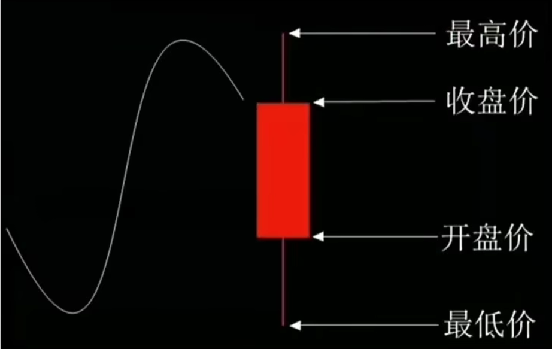

一般情况如下：

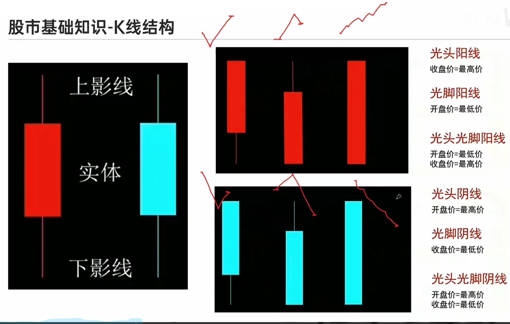

> 这里面需要说明一下，第一个光头阳线在趋势基本就是收盘价等于最高价，所以说先跌后涨，而且涨的比跌的高；第二个光脚阳线是开盘价等于最低价，所以说是先涨后跌，但是跌的比涨的少；第三个光头光脚阳线是直接一路涨。这里面收盘价一定大于开盘价
>
> 注意，这里需要说明一下，阳线是指收盘价高于开盘价，也就是为什么说光头光脚这种情况会有波折。

### MACD

名称：指数平滑异同移动平均线
参数：（(12,26,9)
组成：双线 (快线，慢线，能量柱，O轴)
            单线（(能量柱，0轴)
- **计算MACD线**：
    
    - MACD线是快速EMA（通常为12日EMA）和慢速EMA（通常为26日EMA）之间的差值。
    
    MACD线=快速EMA−慢速EMA\text{MACD线} = \text{快速EMA} - \text{慢速EMA}MACD线=快速EMA−慢速EMA
- **计算信号线**：
    
    - 信号线通常是MACD线的9日EMA，表示MACD线的平滑版本。
    
    信号线=EMA（MACD线）\text{信号线} = \text{EMA（MACD线）}信号线=EMA（MACD线）

> 是一个双均线衍生出来的指标

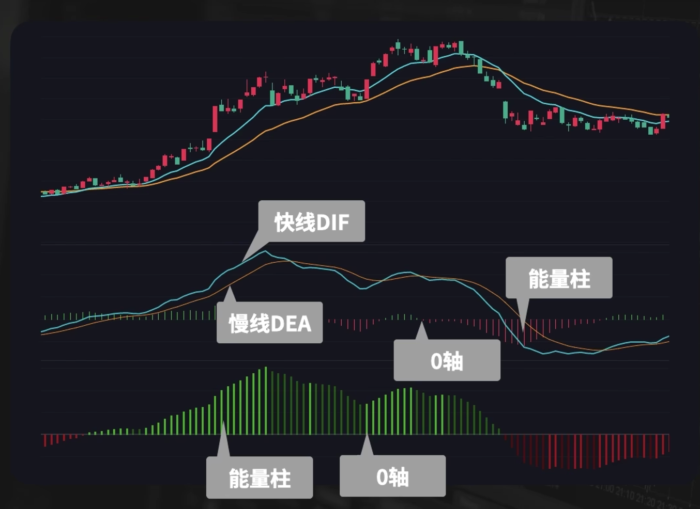

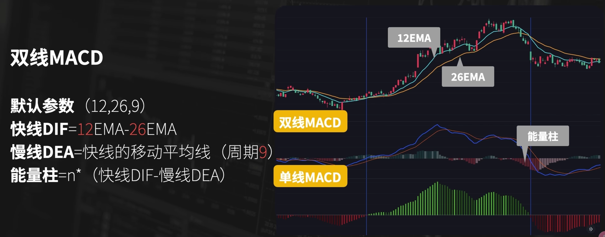

> 快线（DIF）快速均线 - 慢速均线，代表趋势的主线
> 慢线（DEA）就是快线的指数移动平均线，对 DIF 的平滑处理，同时也是信号线
> 能量柱就是快线和慢线的差值的倍数，趋势强度

#### 应用

预测指标

用法：

1. 根据快线DIF位置判断趋势
   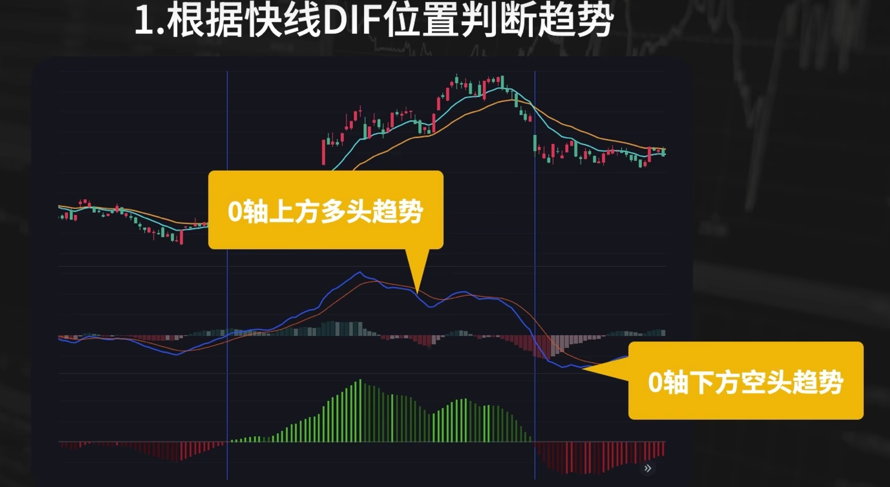

2. 金叉死叉作为多空信号

   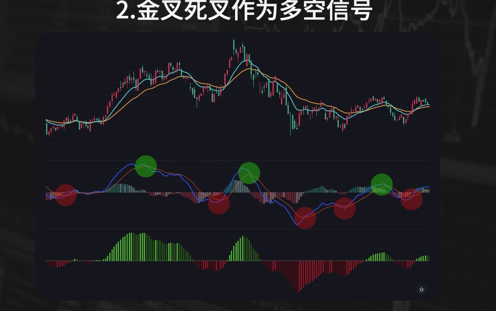

   > 快线上穿慢线（DIF > DEA）形成金叉作为多头信号，快线下穿慢线（DIF < DEA）形成死叉作为空头信号
   

3. 快线位置+交叉信号

   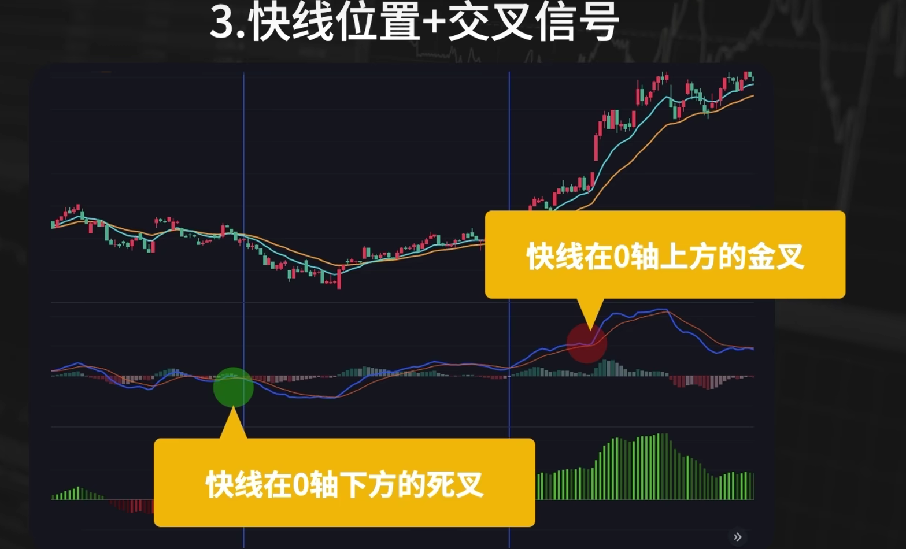

   > 金叉做多，死叉做空。

4. 指标背离判断行情反转

   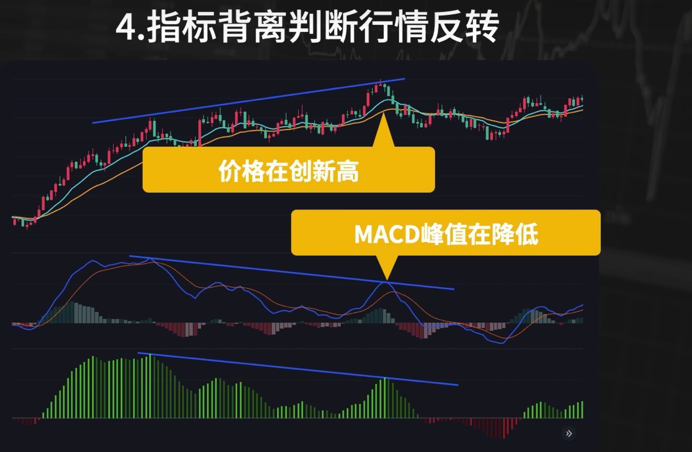

   > 图中的情况就是有可能反转

### KD

名称：随机震荡指标示 (Stochastic Indicator)
参数：(9,3,3)
组成：K线，D线，20轴，80轴

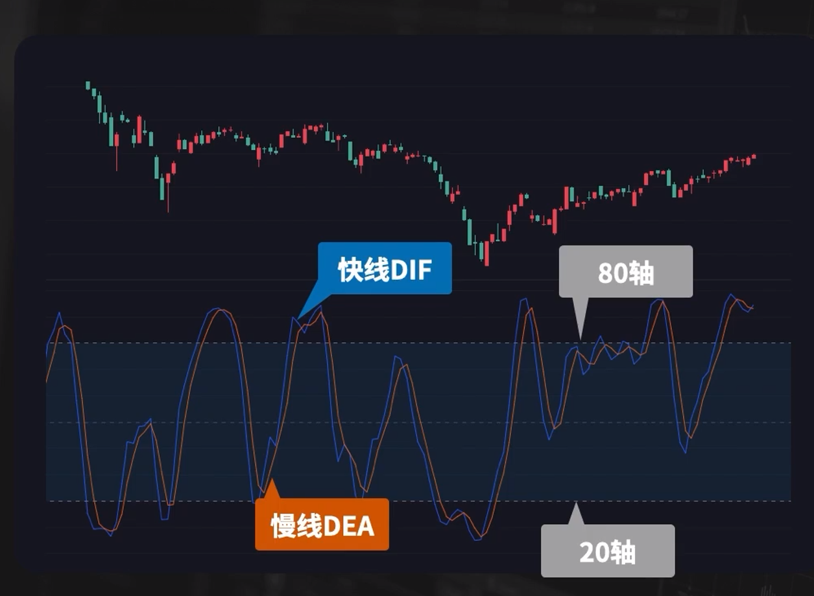

#### 公式

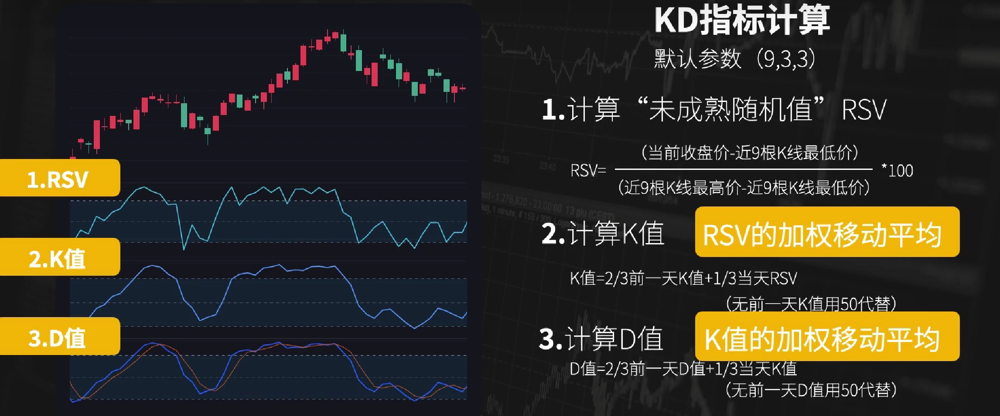

#### 应用

应用：作为入场的信号：指标到达80轴形成死叉下穿80轴做空头信号，20轴金叉上穿20轴多头信号。

一般是macd观察趋势，kd作为入场。

### ATR指标

名称：平均真实波动幅度
参数：(默认14)
组成：单线

#### 公式

1. 计算TRR (真实波动幅度)
   `TR=MAX (最高价-最低价，最高价-前收盘价，前收盘价-最低价)`

2. TR的简单移动平均
   `ATR=近期N根K线的数值求和再平均`

#### 应用

应用（海龟交易法）：

1. 计算开仓数量

   > 固定每一笔亏损的金额，然后去计算出现交易机会之后的开仓数量。

   1. 计算价值波动量DV
      `DV=ATR*合约每点点值`
   2. 计算单笔止损金额
      `单笔止损金额=账户总资金*1%`
   3. 开仓数量
      `开仓数量=单笔止损金额/波动量DV`

   

2. 指定止损/加仓规则

3. 止损规则
   `止损=开仓价格-2倍ATR`

   加仓规则
   `盈利方向突破1/2ATR时加仓`
   `每次加仓止损位置提高1/2倍的ATR`

### RSI指标

名称：相对强弱指标
参数: (默认14)
组成：RSI线，70轴，50轴，30轴
取值: (0-100)

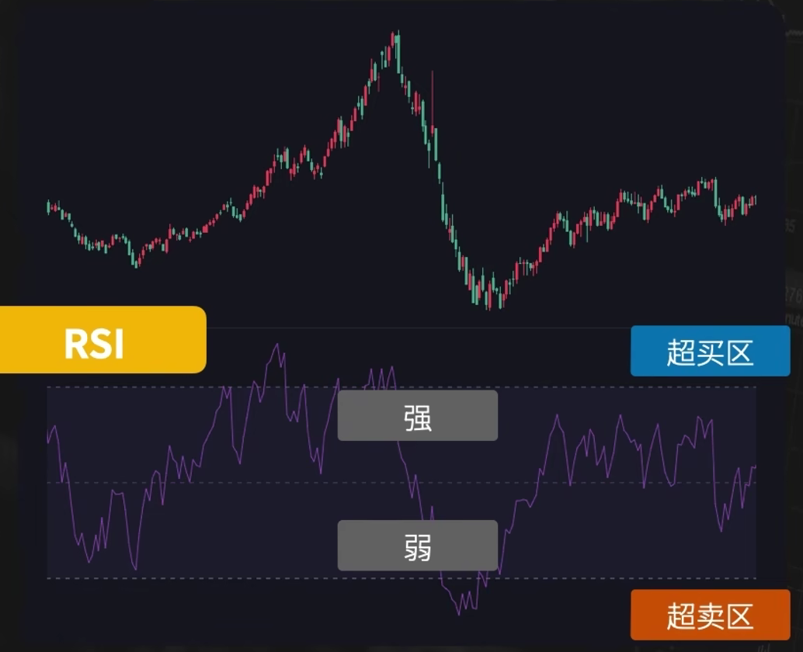

#### 公式

`A=近14根K线阳线涨幅之和（因为默认是14，这里用了14）`
`B=近14根K线阴线跌幅之和的绝对值`

1.`RSI=A/(A+B)*100`
2.`RS=A/N÷B/N`
`RSI=100-100÷(1+RS)`

#### 应用

出场指标

当大于70轴为超买，小于30轴为超卖

1. 在超卖区上传30轴作为入场做多的信号，在超买区下穿70轴作为入场做空的信号。这里注意，**适合出场，出场要反过来。**
   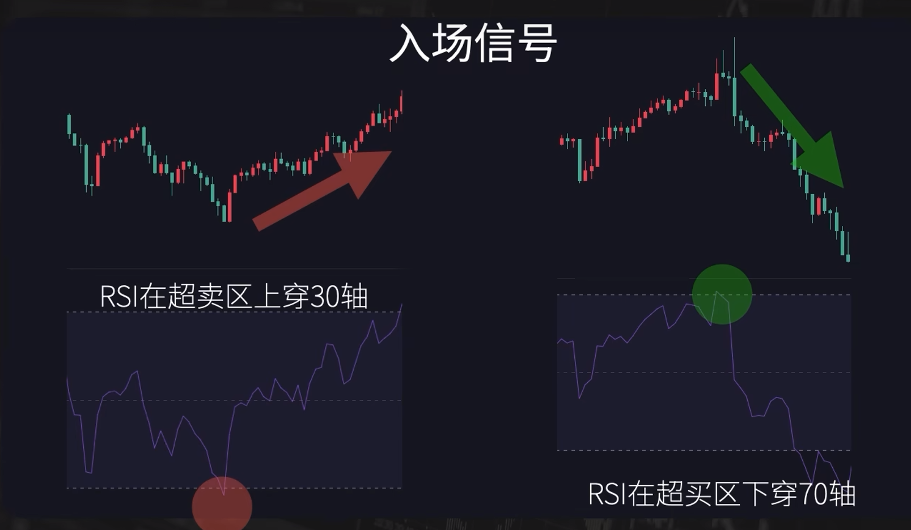

2. RSI指标背离

   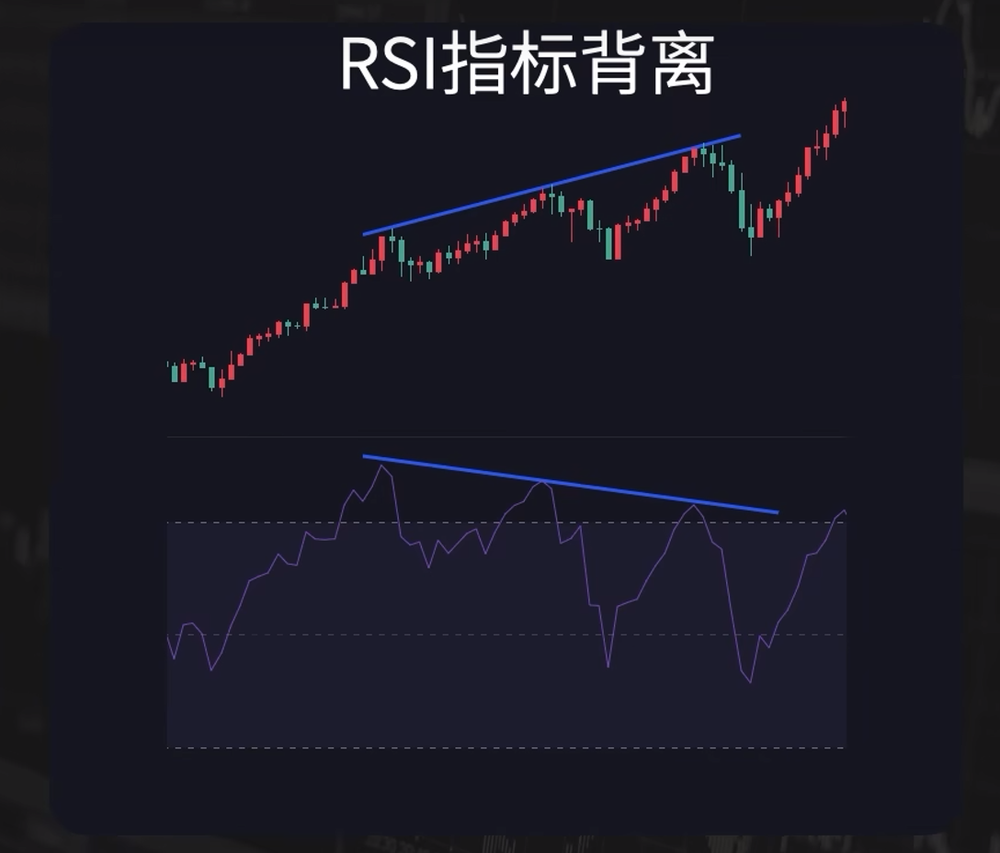

   > 当出现价格走势不断创新高，但是RSI指标的峰值在不断的降低。
   >
   > 这样的走势和RSI的状态就是指标的背离，通常可以判断行情可能进行反转，然后作为出场信号。

### BOLL指标

名称：布林线(Bollinger Bands)
参数：（(默认20)
组成：上轨，中轨，下轨

#### 公式

中轨线=N日移动平均线
上轨线=中轨线+2倍的标准差
下轨线=中轨线-2倍的标准差

默认为20

1. 计算MA
   `近期20根K线收盘价相加求和再÷20`
2. 计算标准差MD
   `方差=20根K线(收盘价-MA)²之和÷20`
   `标准差MD=平方根方差`
3. 计算上下轨
   `中轨=MA`
   `上轨=MA+2MD`
   `下轨=MA-2MD`

#### 应用

1. 支撑阻力
   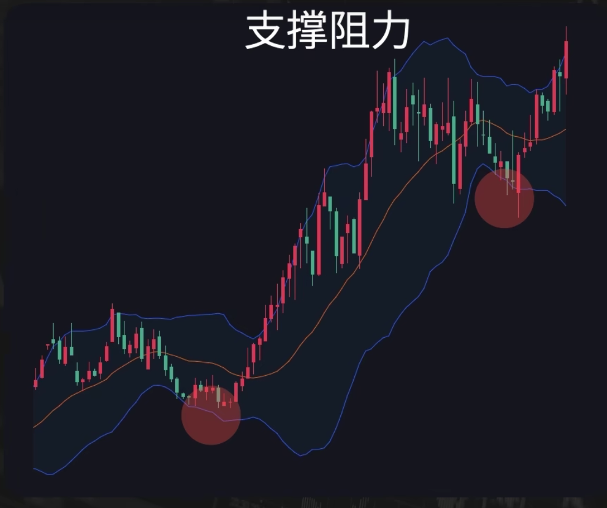

2. 超买超卖
   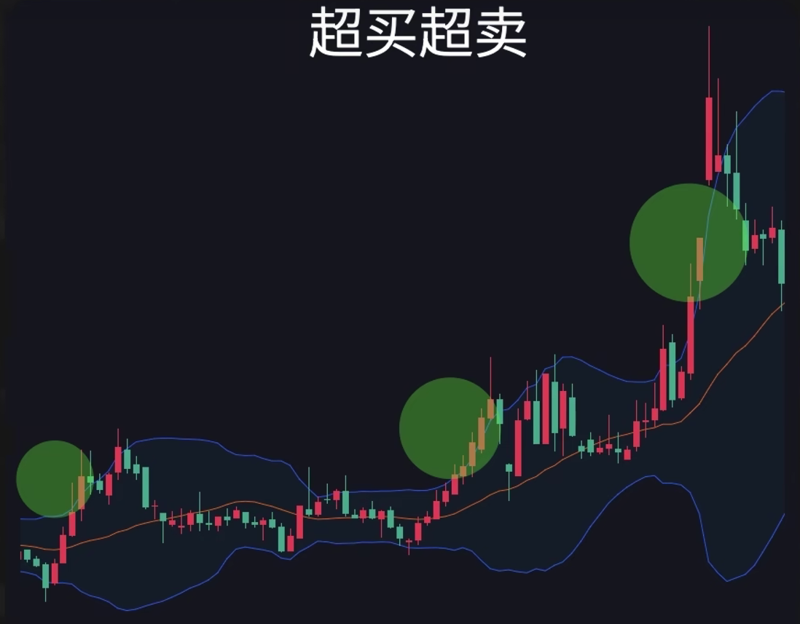

3. 判断趋势

   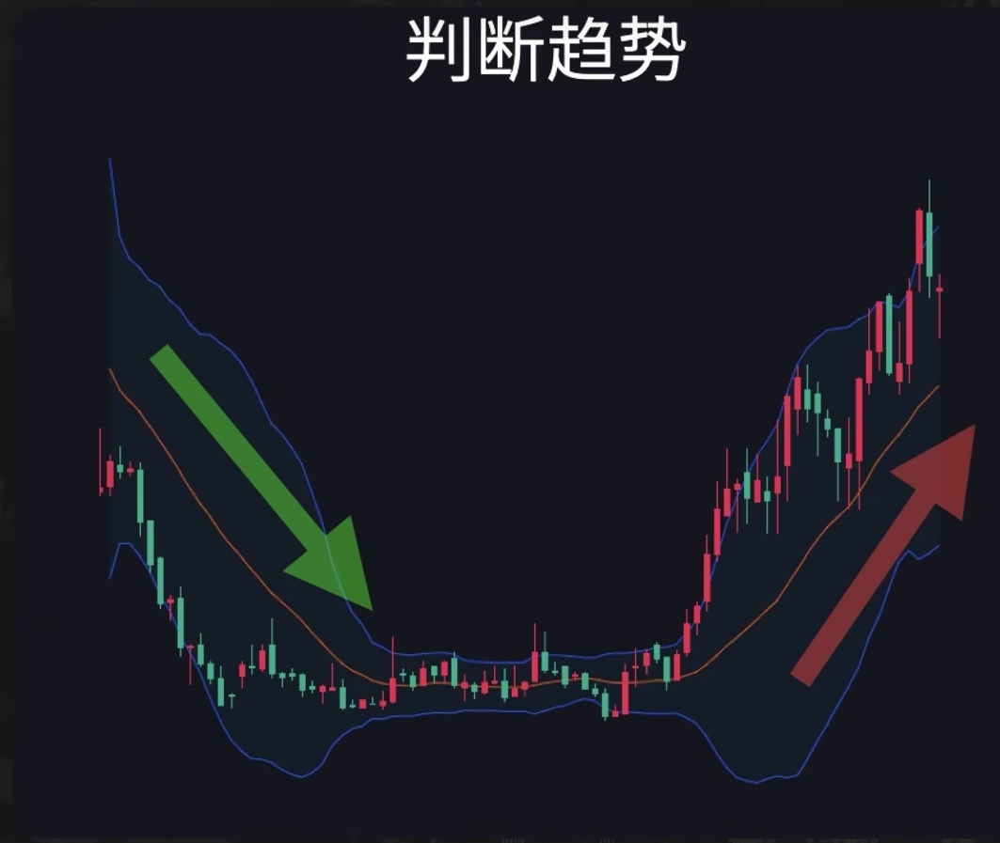

### DIM指标

#### 计算
- `[diPlus, diMinus, adx] = ta.dmi(len, lensig)`
	- 使用Pine Script中的 `ta.dmi()` 函数计算DMI。
	- **`diPlus`**：计算得到的正向指标（DI+），用于衡量上升趋势的强度。
	- **`diMinus`**：计算得到的负向指标（DI-），用于衡量下降趋势的强度。
	- **`adx`**：计算得到的平均趋向指数，用于衡量趋势的强度，不论是上涨还是下跌。

#### DMI的用途

- **趋势识别**：DMI指标用于识别市场的趋势方向及其强度。
- **交易信号**：
    - **买入信号**：当 `diPlus` 高于 `diMinus` 时，表示当前市场处于上升趋势。
    - **卖出信号**：当 `diMinus` 高于 `diPlus` 时，表示当前市场处于下降趋势。
- **ADX分析**：ADX值越高，表示趋势越强；当ADX低于20时，通常被视为无趋势市场。

## 多空信号

**多空信号（Long/Short Signals）** 是量化交易和传统交易中常用的概念，用来表示交易者是否应该买入（做多，Long）或卖出（做空，Short）某个资产。这些信号通常由交易策略或算法生成，基于对市场数据、技术指标、或其他分析工具的解读。

1. **多头信号（Long Signal）**

   多头信号是指交易策略认为某个资产的价格将会上涨，从而建议买入该资产。这通常意味着交易者认为当前价格低于未来预期价格，预期在持有一段时间后可以卖出获利。

   生成多头信号的常见方法：

   - **技术指标**：如移动平均线（MA），当短期均线上穿长期均线时，会生成买入信号。
   - **基本面分析**：例如，当一家公司的财报显示强劲增长时，基本面分析可能会生成多头信号。
   - **动量指标**：如相对强弱指数（RSI），当RSI低于某个阈值（例如30）时，表示资产可能被超卖，从而生成买入信号。

2. **空头信号（Short Signal）**

   空头信号是指交易策略认为某个资产的价格将会下跌，从而建议卖出或做空该资产。这意味着交易者认为当前价格高于未来预期价格，预期在持有一段时间后可以通过买回该资产来获利。

   生成空头信号的常见方法：

   - **技术指标**：如布林带（Bollinger Bands），当价格突破上轨时，可能生成卖出信号。
   - **基本面分析**：例如，当公司的盈利能力下降或市场前景黯淡时，基本面分析可能会生成空头信号。
   - **动量指标**：如MACD（指数平滑异同移动平均线），当MACD线下穿信号线时，可能会生成卖出信号。

3. **信号生成的综合考虑**

   多空信号通常不是单一指标的结果，而是多个指标或因子的综合分析。例如，一个交易策略可能同时考虑技术指标、基本面因素、市场情绪等多方面因素，综合得出一个多空信号。

4. **信号的应用**
   - **单向策略（Directional Strategy）**：仅生成多头信号或空头信号，适用于看涨或看跌市场。
   - **对冲策略（Hedging Strategy）**：同时生成多头和空头信号，通过做多强势资产、做空弱势资产来降低市场风险。
   - **市场中性策略（Market Neutral Strategy）**：生成等量的多头和空头信号，通过对冲掉整体市场风险，获取超额收益。

5. **信号的时间维度**

   **短期信号（Short-Term Signals）**：适用于高频交易或日内交易，通常基于分钟级或小时级的数据生成。

   **中长期信号（Medium to Long-Term Signals）**：适用于波段交易或投资，通常基于日线或周线数据生成。

6. **信号的验证与优化**
   多空信号的准确性和有效性至关重要，量化交易者通常会通过回测（Backtesting）和前瞻测试（Forward Testing）来验证和优化这些信号，确保它们在实际市场中能带来正向收益。

