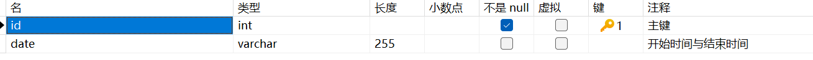

[TOC]

- > 除了有的一些短的，这里面的才是真正的代码，代码框里面的可以进行搜索快速定位


## 1.4 管理端人员账号管理删完数据之后，人员信息管理端不能删


# 1.3修改 9.25

## 1.3.1 给管理员加三次登录


## 1.3.2 给手机号，身份证号加个按钮可以显示，并加密

### 1.3.2.1 学生端：

- src\views\student\person\PersonInformation.vue

以下都在上面路径

- 导入图标以及设定的变量

```
import { View, Hide } from '@element-plus/icons-vue'
const dialogDisplayVisible = ref(false)
const displayArr = reactive({
  type:'',
  password:'',
  idNum:false,
  phoneNum:false
})
```

- 导入写入的函数

```
const showIdNum = () => {
  if (!displayArr.idNum) {
    displayArr.type = 'idNum'
    dialogDisplayVisible.value = true
  } else {
    if (state.form.idNum != null) {
      state.form.idNum = state.form.idNum.replace(/^(\w{2})(\w+)(\w{2})$/, '$1**************$3')
      displayArr.idNum = false
    }
  }
}

const showPhoneNum = () => {
  if (!displayArr.phoneNum) {
    displayArr.type = 'phoneNum'
    dialogDisplayVisible.value = true
  } else {
    if (state.form.phoneNum != null) {
      state.form.phoneNum = state.form.phoneNum.replace(/^(\w{3})\w{4}(\w{4})$/, '$1****$2')
      displayArr.phoneNum = false
    }
  }
}

const displayData = () => {
  if (displayArr.password === atob(userStore.user.password)) {
    if (displayArr.type === "phoneNum") {
      state.form.phoneNum = tempData.phoneNum
      dialogDisplayVisible.value = false
      displayArr.phoneNum = true
    }
    if (displayArr.type === "idNum") {
      state.form.idNum = tempData.idNum
      dialogDisplayVisible.value = false
      displayArr.idNum = true
    }
  } else {
    ElMessage.error("密码错误")
  }
}
```

- 导入表单身份证号

```
          <el-form-item label="身份证号:" prop="idNum">
            <el-input v-model="state.form.idNum" style="width: 220px">
              <template #suffix>
                  <el-icon @click="showIdNum" style="cursor: pointer;">
                    <template v-if="displayArr.idNum">
                      <View />
                    </template>
                    <template v-else>
                      <Hide />
                    </template>
                  </el-icon>
              </template>
            </el-input>
          </el-form-item>
          
          
          
          
          
           <el-form-item label="手机号:" prop="phoneNum">
            <el-input v-model="state.form.phoneNum" style="width: 220px">
              <template #suffix>
                <span @click="showPhoneNum" style="cursor: pointer;">
                  <el-icon>
                    <template v-if="displayArr.phoneNum">
                      <View />
                    </template>
                    <template v-else>
                      <Hide />
                    </template>
                  </el-icon>
                </span>
              </template>
            </el-input>
          </el-form-item>
```

- 导入dialog

```
    <el-dialog v-model="dialogDisplayVisible" title="您需要验证密码">
      <el-form-item label="请输入密码">
        <el-input type="password" show-password v-model="displayArr.password" />
      </el-form-item>
      <template #footer>
        <span class="dialog-footer">
          <el-button @click="dialogDisplayVisible = false">取消</el-button>
          <el-button type="primary" @click="displayData">
            验证
          </el-button>
        </span>
      </template>
    </el-dialog>
```


### 老师端：

- src\views\teacher\person\PersonInformation.vue

以下都在上面路径

- 导入图标以及设定的变量

```
import { View, Hide } from '@element-plus/icons-vue'
const dialogDisplayVisible = ref(false)
const displayArr = reactive({
  type:'',
  password:'',
  idNum:false,
  phoneNum:false
})
```

- 导入写入的函数

```
const showIdNum = () => {
  if (!displayArr.idNum) {
    displayArr.type = 'idNum'
    dialogDisplayVisible.value = true
  } else {
    if (state.form.idNum != null) {
      state.form.idNum = state.form.idNum.replace(/^(\w{2})(\w+)(\w{2})$/, '$1**************$3')
      displayArr.idNum = false
    }
  }
}

const showPhoneNum = () => {
  if (!displayArr.phoneNum) {
    displayArr.type = 'phoneNum'
    dialogDisplayVisible.value = true
  } else {
    if (state.form.phoneNum != null) {
      state.form.phoneNum = state.form.phoneNum.replace(/^(\w{3})\w{4}(\w{4})$/, '$1****$2')
      displayArr.phoneNum = false
    }
  }
}

const displayData = () => {
  if (displayArr.password === atob(userStore.user.password)) {
    if (displayArr.type === "phoneNum") {
      state.form.phoneNum = tempData.phoneNum
      dialogDisplayVisible.value = false
      displayArr.phoneNum = true
    }
    if (displayArr.type === "idNum") {
      state.form.idNum = tempData.idNum
      dialogDisplayVisible.value = false
      displayArr.idNum = true
    }
  } else {
    ElMessage.error("密码错误")
  }
}
```

- 导入表单身份证号

```
            <el-form-item label="身份证号" prop="idNum">
              <el-input
                v-model="activatorForm.idNum"
                style="width: 220px"
              >
              <template #suffix>
                  <el-icon @click="showIdNum" style="cursor: pointer;">
                    <template v-if="displayArr.idNum">
                      <View />
                    </template>
                    <template v-else>
                      <Hide />
                    </template>
                  </el-icon>
              </template>
            </el-input>
            </el-form-item>
          
          
          
          
            <el-form-item label="手机号" prop="phoneNum">
              <el-input
                v-model="activatorForm.phoneNum"
                style="width: 220px"
              >
              <template #suffix>
                <span @click="showPhoneNum" style="cursor: pointer;">
                  <el-icon>
                    <template v-if="displayArr.phoneNum">
                      <View />
                    </template>
                    <template v-else>
                      <Hide />
                    </template>
                  </el-icon>
                </span>
              </template>
            </el-input>
            </el-form-item>
```

- 导入dialog

```
    <el-dialog v-model="dialogDisplayVisible" title="您需要验证">
      <el-form-item label="请输入验证密码">
        <el-input type="password" show-password v-model="displayArr.password" />
      </el-form-item>
      <template #footer>
        <span class="dialog-footer">
          <el-button @click="dialogDisplayVisible = false">取消</el-button>
          <el-button type="primary" @click="displayData">
            验证
          </el-button>
        </span>
      </template>
    </el-dialog>
```


- 对于每次更新后就将新页面的隐藏按钮改为false

```
const onResetAccount = async (id) => {
  const oneForm = await personById(id)
  activatorForm.value = oneForm.data.data
  tempData.phoneNum = oneForm.data.data.phoneNum
  tempData.idNum = oneForm.data.data.idNum
  if (activatorForm.value.phoneNum !== null) {
    activatorForm.value.phoneNum = activatorForm.value.phoneNum.replace(/^(\w{3})\w{4}(\w{4})$/, '$1****$2')
  }
  if (activatorForm.value.idNum !== null) {
    activatorForm.value.idNum = activatorForm.value.idNum.replace(/^(\w{2})\w+(\w{2})$/, '$1**************$2')
  }
  if (activatorForm.value.pubTime !== null) {
    activatorForm.value.pubTime = activatorForm.value.pubTime.split(',')
  }
  if (activatorForm.value.hometown !== null) {
    activatorForm.value.hometown = activatorForm.value.hometown.split(',')
  }
  dialogVisible.value = true
  displayArr.idNum = false
  displayArr.phoneNum = false
}
```


### 给管理员加一个时间，10分钟后


# 1.2修改 9.23


## 身份证和手机号回显


### 对于学生端：

- src\views\student\person\PersonInformation.vue

  下面修改的代码都是PersonInformation.vue

- 在最上边添加一个属性

```
const tempData = ref()
```


- 主界面回显 + 属性赋值

```
const load = async () => {
  const res = await getStudentInformation(userStore.user.username)
  state.form = res.data.data
  tempData.phoneNum = res.data.data.phoneNum
  tempData.idNum = res.data.data.idNum
  if (state.form.idNum != null) {
    state.form.idNum = state.form.idNum.replace(/^(\d{2})(\d+)(\d{2})$/, '$1**************$3');
  }
  if (state.form.phoneNum != null) {
    state.form.phoneNum = state.form.phoneNum.replace(/^(\d{3})\d{4}(\d{4})$/, '$1****$2');
  }
  state.form.pubTime = state.form.pubTime.split(',')
  state.form.hometown = state.form.hometown.split(',')
}
```

> 修改load函数

- 修改提交函数

````
const onsubmit = async () => {
  formRef.value.validate(async (valid) => {
    if (valid) {
      // 表单校验通过，进行网络请求
      try {
        await ElMessageBox.confirm('确定提交数据吗?', '提示', {
          confirmButtonText: '确定',
          cancelButtonText: '取消',
          type: 'warning'
        })
        console.log('表单' + state.form.pubTime)
        console.log('表单' + state.form.hometown)
        console.log(state.form)
        if (tempData.phoneNum !== null && state.form.phoneNum.includes('*')) {
          state.form.phoneNum = tempData.phoneNum
        }
        if (tempData.idNum !== null && state.form.idNum.includes('*')) {
          state.form.idNum = tempData.idNum
        }
        state.form.hometown = state.form.hometown.toString()
        state.form.pubTime = state.form.pubTime.toString()
        await updateStuInformation(state.form)
        console.log(res)
        ElMessage.success('操作成功')
        load() // 更新表格
        dialogFormVisible.value = false
      } catch (error) {
        // 处理异常情况
        console.error(error)
      }
    } else {
      // 表单校验不通过，提示错误信息
      ElMessage.error('请填写正确的表单信息')
    }
  })
}

````


# 1.1修改 9.10


### 对于管理端:


- src\views\teacher\person\PersonInformation.vue

下面修改的代码都是PersonInformation.vue

- 这是修改主界面回显

```
const getInformationList = async () => {
  loading.value = true
  const res = await personGetInformationService(params.value)
  // console.log(params.value)
  informationList.value = res.data.data.rows
  informationList.value.map((n) => {
    if (n.hometown !== null) {
      n.hometown = n.hometown.replace(/,/g, '')
    }
    if (n.pubTime !== null) {
      n.pubTime = n.pubTime.replace(/-/g, '.').replace(',', '--')
    }
    if (n.phoneNum !== null) {
      n.phoneNum = n.phoneNum.replace(/^(\d{3})\d{4}(\d{4})$/, '$1****$2')
    }
    if (n.idNum !== null) {
      n.idNum = n.idNum.replace(/^(\d{2})(\d+)(\d{2})$/, '$1**************$3')
    }
  })
  total.value = res.data.data.total
  loading.value = false
}
```


- 这是修改对话框

```
const onResetAccount = async (id) => {
  const oneForm = await personById(id)
  activatorForm.value = oneForm.data.data
  tempData.phoneNum = oneForm.data.data.phoneNum
  tempData.idNum = oneForm.data.data.idNum
  if (activatorForm.value.phoneNum !== null) {
    activatorForm.value.phoneNum = activatorForm.value.phoneNum.replace(/^(\d{3})\d{4}(\d{4})$/, '$1****$2')
  }
  if (activatorForm.value.idNum !== null) {
    activatorForm.value.idNum = activatorForm.value.idNum.replace(/^(\d{2})(\d+)(\d{2})$/, '$1**************$3')
  }
  if (activatorForm.value.pubTime !== null) {
    activatorForm.value.pubTime = activatorForm.value.pubTime.split(',')
  }
  if (activatorForm.value.hometown !== null) {
    activatorForm.value.hometown = activatorForm.value.hometown.split(',')
  }
  dialogVisible.value = true
}
```


- 修改提交表单

```
const saveStuInfo = async () => {
  await activatorRef.value.validate()
  activatorForm.value.hometown = activatorForm.value.hometown.toString()
  activatorForm.value.pubTime = activatorForm.value.pubTime.toString()
  if (tempData.phoneNum !== null && activatorForm.value.phoneNum.includes('*')) {
    activatorForm.value.phoneNum = tempData.phoneNum
  }
  if (tempData.idNum !== null && activatorForm.value.idNum.includes('*')) {
    activatorForm.value.idNum = tempData.idNum
  }
  console.log(activatorForm.value)
  await updateStuInformation(activatorForm.value)
  ElMessage.success('操作成功')
  getInformationList() // 更新表格
  dialogVisible.value = false
}
```


---

**这是以前的**


## 修改时间中间的修改

### 前端：

无

### 后端：

- com.kcxgdw.controller.TecaherController

```
    @PutMapping("/user/password")
    public Result uploadpsw(@RequestParam String username,
                            @RequestParam String password){
        personaService.updateStuPsw(username,password);
        int[] status = statusTask.getStatus();
        if ((status[0] > 0) && (status[1] < 0)) {
            // 开放状态
            personaService.changeSatus(3, username);
        } else {
            personaService.changeSatus(0,username);
        }
        return Result.success();
    }
```


## 前端：

### 1 添加status状态显示

1.   ../person/PersonAccount.vue

```
      <el-table-column type="selection" width="55"></el-table-column>
      <el-table-column label="序号" prop="id" width="100"></el-table-column>
      <el-table-column label="学号" prop="username"></el-table-column>
      <el-table-column label="姓名" prop="name"></el-table-column>
      <el-table-column label="密码" prop="password"></el-table-column>
      <el-table-column label="登录状态" prop="status"></el-table-column>
      <el-table-column label="操作" width="200">
        <template #default="{ row }">
          <el-button type="primary" @click="onResetAccount(row)"
            >重置</el-button
          >
```

> ```
>       <el-table-column label="状态码" prop="status"></el-table-column>
> ```
>
> 加入状态码一栏，这个重置按钮的primary好像拼错了，本地未改之前是primarty


- 修改getAccountList函数status显示

```
const getAccountList = async () => {
  loading.value = true
  const res = await personGetAccountService(params.value)
  accountList.value = res.data.data.rows
  res.data.data.rows.forEach(element => {
    if (element.status) {
      element.status = '允许'
    } else {
      element.status = '禁止'
    }
  });
  total.value = res.data.data.total
  loading.value = false
}
```


### 2 添加年级和搜索框

1. 搜索框中加入两个属性

```
const inputid = ref('')
const inputgrade = ref('')
const inputmajor = ref('')
const inputname = ref('')
```

> ```
> const inputgrade = ref('')
> const inputmajor = ref('')
> ```
>
> 这两个

2. 函数onSearch里面加入相应的属性

```
  params.value.id = inputid.value
  params.value.grade = inputgrade
  params.value.major = inputmajor
```

> ```
>  params.value.grade = inputgrade
> 
>  params.value.major = inputmajor
> ```
>
> 这两个

3. 函数OutExcel中加入相应的属性

> ```
>  params.value.grade = inputgrade
> 
>  params.value.major = inputmajor
> ```
>
> 这两个

4. 函数onReset加入相应的属性

```
  params.value.grade = ''
  params.value.major = ''
  params.value.name = ''
  params.value.cul_people = ''
  params.value.qua = ''
  params.value.det_time = ''
  params.value.status = ''
  inputid.value = ''
  inputgrade.value = ''
  inputmajor.value = ''
```


> ```
>  params.value.grade = ''
> 
>  params.value.major = ''
> 
>  ......
> 
>  ......
> 
>  inputgrade.value = ''
> 
>  inputmajor.value = ''
> ```
>
> 中间要隔开

5. 搜索菜单中加入搜索框

```
            <el-form-item label="年级:">
              <el-input
                :prefix-icon="Search"
                v-model="inputgrade"
                placeholder="请输入年级"
              ></el-input>
            </el-form-item>
            <el-form-item label="专业:">
              <el-input
                :prefix-icon="Search"
                v-model="inputmajor"
                placeholder="请输入专业"
              ></el-input>
            </el-form-item>
```

### 3 添加时间管理

1.   ..\src\router\index.js的路由守卫中加入:

```
  if (useStore.user.status == 0) {
    ElMessage.warning('现在不允许学生登录，请联系管理员！')
    useStore.removeToken()
    useStore.clearUser()
    return '/student/login'
  }
```

2.   ..\src\views\student\login\LoginPage.vue

```
    if (userStore.user.status === 1) {
      ElMessage.success('登录成功')
    }
```

> 这里是把登录成功加个判断,如果是1就成功,不用担心,如果是0的话,1中我删了useStore.clearUser()与token,所以说并无影响

3.  ..\src\components\TimeWindow.vue

````
<script setup>
import { ref } from 'vue'
import { userUpdateStatus, updateTeacherTime, startCronTask, stopCronTask } from '../api/person'
const dialogVisible = ref(false)

const value1 = ref({})
let changeTime = {}
const defaultTime1 = new Date(2000, 1, 1, 12, 0, 0) // '12:00:00'
const open = () => {
  dialogVisible.value = true
}

defineExpose({
  open
})
const add = defineEmits(['success'])
const onReject = async () => {
  await userUpdateStatus(0, '')
  await stopCronTask()
  ElMessage.success('权限已关闭')
  dialogVisible.value = false
  add('success')
}

const onSubmit = async () => {
  changeTime.date = value1.value.date.toString()
  changeTime.id = 1
  await updateTeacherTime(changeTime)
  await startCronTask()
  ElMessage.success('修改成功')
  dialogVisible.value = false
  add('success')
}

const handleClose = (done) => {
  done()
}
</script>

<template>
  <el-dialog v-model="dialogVisible" title="选择可登录时间" width="30%"  :before-close="handleClose">
    <div class="block">
      <el-date-picker
        v-model="value1.date"
        type="datetimerange"
        start-placeholder="开始时间"
        end-placeholder="结束时间"
        :default-time="defaultTime1"
        value-format="YYYY-MM-DD HH:mm:ss"
      />
    </div>
    <div style="text-align: center; margin-top: 60px">
      <el-button @click="onSubmit"> 开启权限 </el-button>
      <el-button type="info" @click="onReject"> 关闭权限 </el-button>
    </div>
  </el-dialog>
</template>

<style scoped>
.block {
  text-align: center;
}
</style>
````

> 这个是按钮点击后的弹出框

4. ..\src\views\teacher\person\PersonAccount.vue调用弹出框

```
    <TimeWindow ref="dialog2" @success="onSuccess"></TimeWindow>
    <PopWindow ref="dialog" @success="onSuccess"></PopWindow>
```

>  ```
>      <TimeWindow ref="dialog2" @success="onSuccess"></TimeWindow>
>  ```
>
> 这个与pop挨着

添加ref

```
import TimeWindow from '../../../components/TimeWindow.vue'
const dialog2 = ref()

// 修改时间段
const onChangeTime = () => {
  dialog2.value.open()
}
```

5. src\api\person.js加入相应的网络请求api

```
//修改权限状态
export const userUpdateStatus = (t, username) =>
  request.put('/teacher/person/account/put/status?t=' + t + '&username=' + username)
  
...
...

//老师修改时间
export const updateTeacherTime = (data) => request.put('/time/put', data)

//老师修改时间后执行task任务
export const startCronTask = () => request.get('/quartz/task/startCron')

//老师如果是在时间段中关闭时间，那就关闭task任务
export const stopCronTask = () => request.get('/quartz/task/stopCron')
```


6. src\views\teacher\person\PersonAccount.vue

```
const getAccountList = async () => {
  loading.value = true
  const res = await personGetAccountService(params.value)
  accountList.value = res.data.data.rows
  res.data.data.rows.forEach(element => {
    element.password = element.password.charAt(0)
      +'*'.repeat(element.password.length - 2)
      +element.password.charAt(element.password.length - 1)
    if (element.status) {
      element.status = '允许'
    } else {
      element.status = '禁止'
    }
  })
  total.value = res.data.data.total
  loading.value = false
}
```

> 将status显示为允许和禁止， 并将密码只显示首尾，其他为*

### 4 入团日期改为年月

1. 学生端： src\views\student\person\PersonInformation.vue

````
          <el-form-item label="入团时间:" prop="joiningTime">
            <el-col :span="13">
              <el-date-picker
                type="month"
                placeholder="选择日期"
                v-model="state.form.joiningTime"
                value-format="YYYY-MM"
              />
            </el-col>
          </el-form-item>
````

> 把picker中的type属性改为month并且把value-format="YYYY-MM"就行了

2. 老师端src\views\teacher\person\PersonInformation.vue

```
            <el-form-item label="入团日期" prop="joiningTime">
              <el-date-picker
                v-model="activatorForm.joiningTime"
                type="month"
                placeholder="选择日期"
                value-format="YYYY-MM"
              ></el-date-picker>
            </el-form-item>
```

> 也是修改一下type="month"和value-format="YYYY-MM"即可

```
      <el-table-column label="操作" width="70" fixed="right">
        <template #default="{ row }">
          <el-button
            type="primary"
            :icon="Edit"
            @click="onResetAccount(row.id)"
          ></el-button>
        </template>
      </el-table-column>
```

> 这里面            type="primary"  看看是不是错了,本地未改之前是primarty


### 5 添加点击三次

1. 网络请求  src\api\user.js

```
//获得学生信息
export const getStudentAccount = (username) =>
  request.get('/student/accounts?username=' + username)
```

2. 修改login    src\views\student\login\LoginPage.vue

```
const login = async () => {
  await form1.value.validate()
  const res1 = await getStudentAccount(formModel.value.username)
  nowStatus.value = res1.data.data.status
  try {
    const res = await studentLoginService(formModel.value)
    userStore.setUser(res.data.data)
  } catch (error) {
    ElMessage.error('您还剩下' + (nowStatus.value--) + '次登录' )
    await userUpdateStatus(nowStatus.value, formModel.value.username)
  }
  if (formModel.value.password == '123456') {
    ElMessage.success('登录成功,请先修改初始密码')
    router.push('/student/password')
  } else {
    if (userStore.user.status === 1) {
      ElMessage.success('登录成功')
    }
    router.push('/student')
  }
}
```


## 后端：

### 1 添加status状态显示


1.    ../obj/Persona.java

```
    private Integer status;
```

> 添加一个属性

2.  ../PersonaMapper.xml     改成模糊搜索

```
<!--条件查询-->
    <select id="list" resultType="com.kcxgdw.obj.Persona">
        select *
        from persona
        <where>
            <if test="username!=null and username!=''">
                username like "%"#{username}"%"
            </if>
        </where>
        order by username asc
    </select>
```

> 
>
> ```
> <if test="username!=null and username!=''">
>           username like "%"#{username}"%"
>       </if>
> ```
>
> 修改了条件查询中的where进行模糊查询


3. ../controller/PersonaController

```
    @GetMapping
    public Result page(@RequestParam(defaultValue = "1")  Integer pagenum,
                       @RequestParam(defaultValue = "10") Integer pagesize,
                       @RequestParam(value = "username", defaultValue = "") String username){
       //log.info("分页查询，参数：{}，{},{}",pagenum,pagesize,username);
       PageBean pageBean=personaService.page(pagenum,pagesize,username);
       return Result.success(pageBean);
    }
```

>  修改了形参中username前面的 @RequestParam(value = "username", defaultValue = "") 


### 2 添加年级与专业搜索框

- ../controller/PersoniController

```
    @GetMapping
    public Result page(@RequestParam(defaultValue = "1") Integer pagenum,
                       @RequestParam(defaultValue = "10")Integer pagesize,
                       String id, String grade, String major, String name,String status,
                       @DateTimeFormat(pattern = "yyyy-MM-dd") LocalDate det_time,
                       String cul_people, String qua ,Boolean isAllInformation){
        //log.info("分页查询，参数：{},{}",det_time,cul_people);
        if (isAllInformation){
            List<Personi>personiList= personiService.list(pagenum,pagesize,id,grade,major,name,status,det_time,cul_people,qua);
            return Result.success(personiList);
        }
        PageBean pageBean=personiService.page(pagenum,pagesize,id,grade,major,name,status,det_time,cul_people,qua);
        return Result.success(pageBean);
    }
```


> ```
>         if (isAllInformation){
>             List<Personi>personiList= personiService.list(pagenum,pagesize,id,grade,major,name,status,det_time,cul_people,qua);
>             return Result.success(personiList);
>         }
>         PageBean pageBean=personiService.page(pagenum,pagesize,id,grade,major,name,status,det_time,cul_people,qua);
>         return Result.success(pageBean);
> ```
>
> 这个是添加年级和专业添加两个数据即可

- ../service/PersoniService

```
    PageBean page(Integer pagenum, Integer pagesize,
                  String id, String grade, String major, String name, String status,LocalDate det_time, String cul_people, String qua);

    List<Personi> list(Integer pagenum, Integer pagesize, String id, String grade, String major, String name, String status, LocalDate detTime, String culPeople, String qua);


```

> 这两个直接复制即可

- ../service/impl/PersoniServiceImpl

```
    @Override
    public PageBean page(Integer pagenum, Integer pagesize, String id, String grade, String major, String name, String status,LocalDate det_time, String cul_people, String qua) {
        PageHelper.startPage(pagenum,pagesize);
        List<Personi>personiList=personiMapper.list(id, grade, major, name,status, det_time, cul_people, qua);
        Page<Personi>p=(Page<Personi>)personiList;
        PageBean pageBean =new PageBean(p.getTotal(),p.getResult());
        return pageBean;
    }

    @Override
    public List<Personi> list(Integer pagenum, Integer pagesize, String id, String grade, String major, String name, String status, LocalDate det_time, String cul_people, String qua) {
        List<Personi>personiList=personiMapper.list(id, grade, major, name,status, det_time, cul_people, qua);
        return personiList;

    }
```

> 这是实现类

- PersonaMapper.xml

```
    <!--更新-->
    <update id="updata">
        update persona
        set
            password='123456', status=1
        where id in
        <foreach collection="ids" item="id" separator="," open="(" close=")">
            #{id}
        </foreach>
        order by username asc
    </update>

```


### 3 添加时间管理

1. 首先先增加一个表的，即
   `com.kcxgdw.controller.TimeController`

   ```
   package com.kcxgdw.controller;
   
   import com.kcxgdw.mapper.TimeMapper;
   import com.kcxgdw.obj.Result;
   import com.kcxgdw.obj.Time;
   import lombok.extern.slf4j.Slf4j;
   import org.springframework.beans.factory.annotation.Autowired;
   import org.springframework.web.bind.annotation.*;
   
   @Slf4j
   @RestController
   @RequestMapping("/time")
   public class TimeController {
   
       @Autowired
       private TimeMapper timeMapper;
       @GetMapping("/get")
       public Result getTime() {
           Time time1 = timeMapper.getOne();
           // log.info("time是: "+ time1);
           return Result.success(time1);
       }
   
       @PutMapping("/put")
       public Result updateTime(@RequestBody Time time1) {
           timeMapper.update(time1);
           return Result.success();
       }
   }
   
   ```
   
   `com.kcxgdw.mapper.TimeMapper`
   
   ```
   package com.kcxgdw.mapper;
   
   import com.kcxgdw.obj.Time;
   import org.apache.ibatis.annotations.Mapper;
   import org.apache.ibatis.annotations.Select;
   import org.apache.ibatis.annotations.Update;
   
   @Mapper
   public interface TimeMapper {
   
       @Select("select * from time")
       Time getOne();
       @Update("update time set date = #{date} where id = #{id}")
       void update(Time time1);
   }
   
   ```
   
   `com.kcxgdw.obj.Time`
   
   ```
   package com.kcxgdw.obj;
   
   import lombok.Data;
   
   @Data
   public class Time {
       private Integer id;
       private String date;
   }
   
   ```
   
   这个三个复制
   
   
   
2. 需要定义一个定时器-> 先设定一个包task->类名为statusTask

   即com.kcxgdw.task.statusTask

```
package com.kcxgdw.task;


import cn.hutool.log.Log;
import com.kcxgdw.mapper.TimeMapper;
import com.kcxgdw.obj.Result;
import com.kcxgdw.obj.Time;
import com.kcxgdw.service.PersonaService;
import lombok.extern.slf4j.Slf4j;
import org.springframework.beans.factory.annotation.Autowired;
import org.springframework.scheduling.TaskScheduler;
import org.springframework.scheduling.annotation.Scheduled;

import org.springframework.web.bind.annotation.GetMapping;
import org.springframework.web.bind.annotation.RequestMapping;
import org.springframework.web.bind.annotation.RestController;

import java.text.SimpleDateFormat;
import java.util.ArrayList;
import java.util.Date;
import java.util.concurrent.ScheduledFuture;

@Slf4j
@RestController
@RequestMapping("/quartz/task")
public class statusTask {
    @Autowired
    private TimeMapper timeMapper;
    @Autowired
    private PersonaService personaService;

    @Autowired
    private TaskScheduler taskScheduler;

    private static int[] temp;
    private ScheduledFuture<?> scheduledFuture;

    @GetMapping("/startCron")
    public Result startScheduledTask() {
        startTask();
        return Result.success();
    }

    @GetMapping("/stopCron")
    public Result stopScheduledTask() {
        int[] status = getStatus();
        if ((status[0] > 0) && (status[1] < 0)) {
            stopTask();
        }
        return Result.success();
    }


    public void startTask() {
        // 在第一次登录注册之后进行记录
        temp = getStatus();
        if (scheduledFuture == null || scheduledFuture.isCancelled()) {
            // 1000*60*60*2
            scheduledFuture = taskScheduler.scheduleWithFixedDelay(this::runTaskManually, 15000);
        }
        // 立即执行一次任务
        runTaskManually();
        if ((temp[0] > 0) && (temp[1] < 0)) {
            // 开放状态
            personaService.changeSatus(3, "");
        }
    }

    public void stopTask() {
        if (scheduledFuture != null) {
            scheduledFuture.cancel(false);
        }
    }

    public void runTaskManually(){
        int[] status = getStatus();
        // 通过判断符号来判断现在时间和所设定的时间段边缘是否碰撞了 碰撞了就进行判断修改
        if (!(((status[0] ^ temp[0]) >= 0) && ((status[1] ^ temp[1]) >= 0))) {
            if ((status[0] > 0) && (status[1] < 0)) {
                // 开放状态
                personaService.changeSatus(3, "");
            } else {
                personaService.changeSatus(0,"");
            }
        }
    }

    private int[] getStatus() {
        Time one = timeMapper.getOne();
        String[] dateTime = one.getDate().split(",");
        // endDate.compareTo(startDate) 结果>0 说明前者 晚于 后者 说明时间超过了
        String nowDate= new SimpleDateFormat("yyyy-MM-dd HH:mm:ss").format(new Date());
        int i1 = nowDate.compareTo(dateTime[0]);  // 这个是起始时间  如果开放， 需要i1 > 0 且i2 < 0
        int i2 = nowDate.compareTo(dateTime[1]);  // 这个是结束时间
        return new int[]{i1, i2};
    }

}

```


3. 添加一个status修改的后端请求

- com.kcxgdw.controller.PersonaController

```
     @PutMapping("/put/status")
    public Result Status(Integer t,@RequestParam(value = "username", required = false) String username) {
        personaService.changeSatus(t, username);
        return Result.success();
    }
```

- com.kcxgdw.service.PersonaService

```
    /**
     * 权限管理
     */
    void changeSatus(Integer t, String username);
```

- com.kcxgdw.service.impl.PersonaServiceImpl

```
    @Override
    public void changeSatus(Integer t, String username) {
        personaMapper.changeStatus(t, username);
    }
```

- com.kcxgdw.mapper.PersonaMapper

```
   void changeStatus(Integer t, String username);
```

- .xml

````
    <update id="changeStatus">
        update persona set status = #{t}
        <where>
            <if test="username!=null and username!=''">
                username = #{username}
            </if>
        </where>
    </update>
````


### 4 入团日期修改为年月

1. 实体类中com.kcxgdw.obj.Personi

```
    private YearMonth joiningTime;
```

> 数据类型修改为YearMonth即可


### 5 点击三次


修改com.kcxgdw.controller.StudentController中的获取信息

```
    @GetMapping("/accounts")
    public Result getStudentAccounts(@RequestParam String username){
        Persona a=personaService.getStudentPersona(username);
        if (a.getStatus() == 0)  {
            return Result.error("您的账户被锁定，请联系管理员解锁");
        }
        return Result.success(a);
    }
```

> 这个直接修改了信息


## 数据库：

### 1 对于persona数据库加入status字段


### 3 添加时间管理

1. 创建一个time表



- 这里需要先给一个数据


- date中随便一个数据都行,没写增加,只写了update


### 4 入团日期修改为年月

1. 将personi中joining_time数据类型修改为varchar, 25


2. 需要把数据库中的joining_time修改为年月格式, `UPDATE personi set joining_time = '2023-08'` 不然老师端查看会报错


